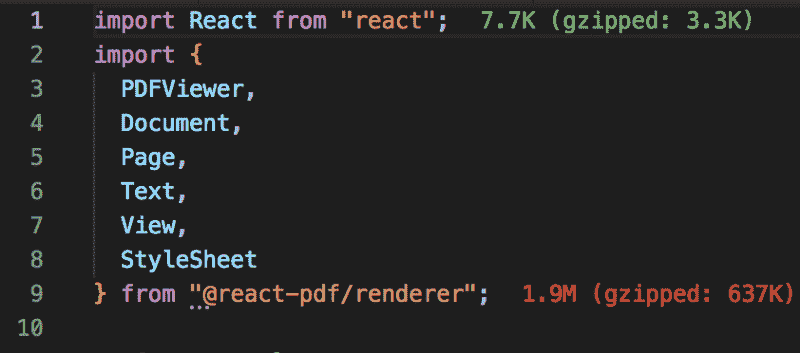
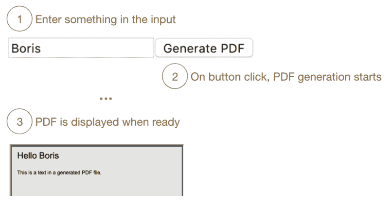
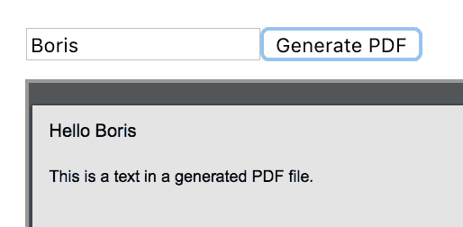
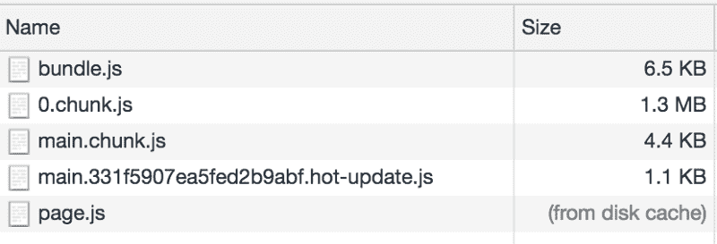
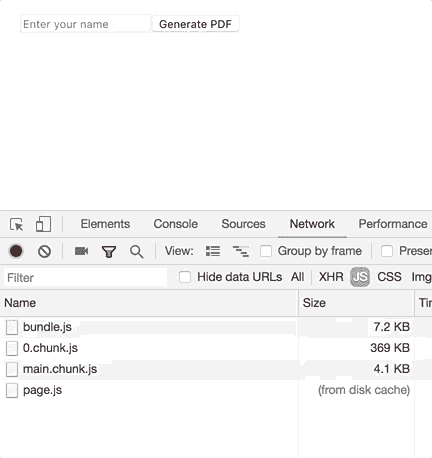

# 如何使用 React.lazy 和 Suspense 进行组件延迟加载

> 原文：<https://www.freecodecamp.org/news/how-to-use-react-lazy-and-suspense-for-components-lazy-loading-8d420ecac58/>

鲍里斯·塞弗

React 16.6 将代码分割带到了一个新的高度。现在，您可以在真正需要的时候加载组件，而无需安装额外的库。

### 什么是代码分割和延迟加载？

Webpack 将代码分割定义为:

> “将你的代码分割成不同的包的技术，这些包可以按需或并行加载”。[ [来源](https://webpack.js.org/guides/code-splitting/)

另一种说法:“按需加载或并行加载”是**延迟加载**。
与懒装相对的是**急装**。在这里，无论你是否使用它，所有的东西都会被加载。

### 为什么我们要使用代码分割和延迟加载？

有时我们不得不引入一大块代码来覆盖一些功能。这段代码可以是进口第三方的依赖或写在我们自己的。这段代码会影响主包的大小。

下载几个 MB 对于现在的网速来说是小菜一碟。我们仍然要考虑那些网速慢或者使用移动数据的用户。

### React 16.6 之前是怎么做的？

大概最流行的 React 组件延迟加载库是`[react-loadable](https://github.com/jamiebuilds/react-loadable).`

重要的是，如果你的应用在服务器上呈现，reactjs.org 仍然推荐`*react-loadable*`。来源

实际上与 React 的新方法非常相似。我将在下面的演示中展示这一点。

### 安装需要什么吗？

让我们看看 reactjs.org 对此有什么看法:

> “如果你正在使用 [Create React App](https://github.com/facebookincubator/create-react-app) 、 [Next.js](https://github.com/zeit/next.js/) 、 [Gatsby](https://www.gatsbyjs.org/) 或类似的工具，你将有一个现成的 Webpack 安装程序来捆绑你的应用。

> 如果不是，您需要自己设置捆绑。例如，参见 Webpack 文档上的[安装](https://webpack.js.org/guides/installation/)和[入门](https://webpack.js.org/guides/getting-started/)指南。【reactjs.org】——T4

好的，所以需要 *Webpack* ，它处理包的动态导入。

下面的演示是使用`Create React App.`生成的，在这种情况下， *Webpack* 已经配置好了，我们可以开始了。

### 演示

对于这个演示，我们将使用`[react-pdf](https://github.com/diegomura/react-pdf)`。`react-pdf`是一个很棒的库，用于在浏览器、手机和服务器上创建 PDF 文件。我们可以在服务器上生成一个 PDF，但是如果我们更愿意在客户端生成，它会带来一个代价:包的大小。

Importing cost

> 我正在使用 Visual Studio 代码的[导入成本](https://marketplace.visualstudio.com/items?itemName=wix.vscode-import-cost)扩展来查看所使用的库的大小。

假设我们的需求是当用户点击按钮时生成一个 PDF 文件。

现在，这是一个只有一个用例的简单表单。试着想象一个巨大的 web 应用程序，其中这只是可能性的一小部分。也许用户不经常使用这个功能。

让我们把自己放在那种情况下。PDF 生成不经常使用，为每个页面请求加载整个代码没有意义。

我将试着展示我们如何开发一个有延迟加载和没有延迟加载的解决方案。

### 渴望与懒惰加载展示

对于这两种情况，我们将使用一个组件从`react-pdf`导入依赖项并呈现一个简单的 PDF 文档。

这里没发生什么大事。我们从`react-pdf`进口`PDFViewer`、 `Document`、`Page`、`Text`、`View`。这些都用在`PDFPreview`组件的`render`方法中。

`PDFPreview`只接收一个叫做`title`的`prop`。顾名思义，它在新生成的 PDF 文件中用作标题。

*pdfStyles.js* 看起来是这样的:

### **急切加载**

让我们先看看没有延迟加载的父组件是什么样子的:

这将在浏览器中呈现以下视图:

让我们一起来看一下代码:

在第 2 行，我们导入了`PDFPreview`组件。

在第 6 行，我们用默认值初始化状态。`name`是在 PDF 文件中用作标题的字段，而字段`PDFPreview`是显示或隐藏`PDFPreview`的布尔值。

现在，让我们跳到`render`方法，检查将呈现什么。

在第 19 行和第 25 行，我们呈现了一个输入和一个按钮。当用户键入输入时，`name`中的状态被改变。

然后当用户点击“生成 PDF”时，`showPDFPreview`被设置为`true`。组件重新呈现并显示`PDFPreview`组件。

尽管我们只在用户点击时使用`PDFPreview`，但所有相关代码都包含在应用捆绑包中:

> *这是一个开发环境。在生产中，尺寸会小得多。尽管如此，我们并没有对代码进行优化分割。*

### **惰性加载**

我们只做了一些小改动，让我们来看一下。

第 2 行替换为:
`const LazyPDFDocument = React.lazy(() => import("./PDFPreview"`))；

让我们看看 React 医生对 React 有什么看法。

> `*React.lazy*` *取一个函数，必须调用一个动态`import()`。这必须返回一个`Promise`,它解析为一个带有包含 React 组件的`default`导出的模块。*
> *——reactjs.org*

在第 27 行我们使用了`Suspense`，它必须是一个惰性加载组件的父组件。当`showPDFPreview`设置为真时，`LazyPDFDocument`开始加载。

在子组件被解析之前，`Suspense`显示提供给`fallback` prop 的任何内容。

最终结果如下所示:

我们可以看到 *0.chunk.js* 的重量明显比以前轻，并且 *4.chunk.js* 和 *3.chunk.js* 在按钮按下时被加载。

### 结论

每当我们在项目中引入一个新的依赖项时，我们的责任就是评估它的成本，并检查它如何影响主包。

然后我们不得不问，这个功能会很少被使用吗？我们能在不牺牲用户体验的情况下按需加载它吗？

如果答案是肯定的，那么`React.Lazy`和`Suspense`真的可以帮助我们完成这项任务。

感谢您的阅读！请与任何可能发现它有用的人分享，并留下反馈。