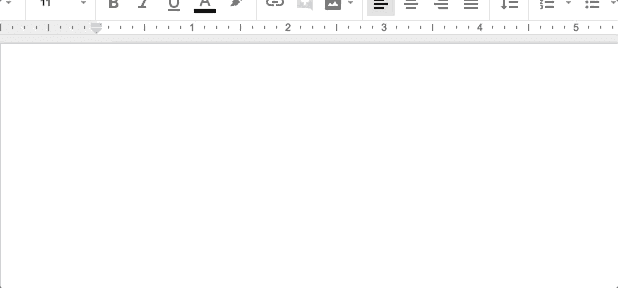
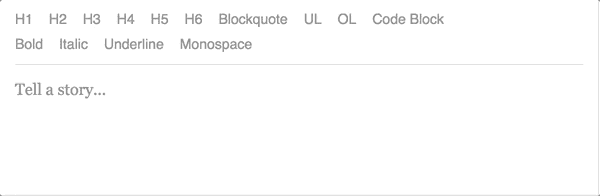
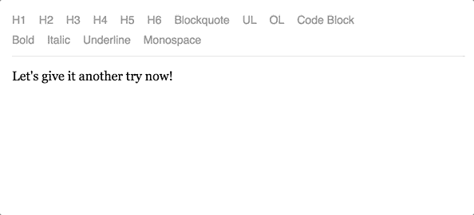

# 如何使用快捷方式在 Draft.js 中创建有序和无序列表

> 原文：<https://www.freecodecamp.org/news/how-to-create-ordered-and-unordered-lists-in-draft-js-with-a-shortcut-5de34a1a570f/>

安德烈·塞明

# 如何使用快捷方式在 Draft.js 中创建有序和无序列表

“six white sticky notes” by [Kelly Sikkema](https://unsplash.com/@kellysikkema?utm_source=medium&utm_medium=referral) on [Unsplash](https://unsplash.com?utm_source=medium&utm_medium=referral)

我们在 [Propeller](https://www.propellercrm.com/) 已经遇到了 Draft.js 和流行的文本编辑器之间的许多差异。我们还发现了一些问题，比如控制列表深度和列表中的多行项目。最大的区别是默认情况下不能使用快捷键来启动列表。令人惊讶的是，您需要自己实现这个逻辑。

和往常一样，有一个[插件](https://www.npmjs.com/package/draft-js-list-shortcut-plugin)可以添加对您使用的快捷键的支持。我还想参考一下[的 draft-js-autolist-plugin](https://github.com/icelab/draft-js-autolist-plugin) 作为灵感的来源。由于某种原因，这个插件在我们尝试的时候不工作。所以我们想出了自己的解决方案，现在在本帖中展示。

### 问题是

打开谷歌文档、Word365 或你使用的任何编辑器。尝试输入`*`，然后输入`space`。嘣！您已经创建了一个无序列表。很好的功能，对吧？

如果我们用默认的 Draft.js 配置尝试完全相同的技巧，我们将得到纯文本。

让我们改变它！

### 解决办法

为了实现这个特性，我们需要跟踪最后三个按下的按钮。为什么是三个？嗯，那是因为我们需要支持的最长字符组合是`1\. + space`，正好是三次按压。

首先，让我们实现存储这些压力的逻辑。这里我们将使用一个名为`history`的简单数组。这个数组将存储被按下的键的值。我们绝对不想处理任何带有`shift`、`alt`等修饰符的按键。我们可以使用 Draft.js 内置的`KeyBindingUtil.hasCommandModifier`函数来执行对任何修饰符的检查。

Draft.js 在`keyBindingFn` prop 函数中为我们公开了一个`keyDown`事件。我们将检查是否需要在这里开始列表。如果是这样，我们需要返回一个所谓的`DraftEditorCommand`，这是一个字符串。此外，为了从 OS 级命令中获益，我们需要添加一个`getDefaultKeyBinding`函数调用作为失败案例。

我们需要检查当前按下的键是否是一个`space`。如果是这样，我们将针对`history`数组运行我们的检查。我们检查是否有一组合适的先前按下的键——`*`用于无序列表，而`1.`用于有序列表。如果找到匹配，我们返回一个命令(字符串)供以后处理。

现在我们需要实现`handleKeyCommand` prop 函数，并将其传递给编辑器。逻辑非常简单。如果我们得到一个自定义命令，我们检查是否应该在当前块上开始一个列表。这里有一个`handleKeyCommand`函数的框架。

为了检查我们是否可以开始一个列表，我们检查当前选择的块是否满足以下所有三个规则:

*   块类型为`unstyled`
*   该块的`depth`为 0
*   该块将`*`或`1.`作为文本

让我们用代码来总结一下:

现在我们能够捕捉到 Draft.js 需要开始一个列表的确切情况了！现在是实现`startList`函数的时候了。

首先，我们需要将自定义命令映射到特定的列表样式。这意味着我们需要为`start-unoredered-list`命令启动一个无序列表。

我们为`start-ordered-list`命令创建一个有序列表。接下来，我们需要将块的样式更新为选定的类型。为此，我们将使用`RichUtils`模块的`toggleBlockType`函数，它是 Draft.js 的一部分

接下来，我们需要用一个空字符串替换我们输入的快捷方式文本。为此，我们需要调用`Modifier`模块的`replaceText`方法。这种方法需要一个选择范围来确定应该替换什么。我们需要从块中取出选择，并更新它，使`focusOffset`值等于块长度。这种组合意味着我们要替换我们输入的整个文本。

太好了！现在我们需要用从`startList`函数中获得的新状态来更新我们的本地编辑器状态。所以让我们一起来吧！

好吧！我们快完成了！但是还有一个时刻我们需要处理。在某些情况下，当我们的一个自定义命令触发时，我们不应该基于`shouldStartList`函数的输出来创建一个列表。我们需要手工处理空格的插入。

关于`getSelectedBlock`方法的实现细节，请查看[我之前关于这个 Draft.js 主题的帖子](https://medium.com/p/800fb3a6714c)！

为了做到这一点，我们可能想要使用一个叫做`Modifier`模块的`insertText`的方法。很明显，它用于构建一个新的内容状态，其中插入了所提供的文本。像往常一样，我们需要提供当前的内容状态、当前的选择状态和我们想要插入的文本(在我们的例子中是一个空格)。

我们需要将对这个函数的调用添加到我们的`handleKeyCommand`函数中。这是它的最终版本:

We’ve added support of lists shortcuts. Good work!

如果你已经通读了这篇文章，你可能也想看看[我之前关于 Draft.js 结界的文章](https://medium.com/p/800fb3a6714c)。您可能也想将它应用到您的项目中。