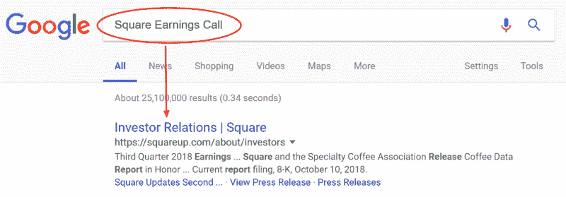
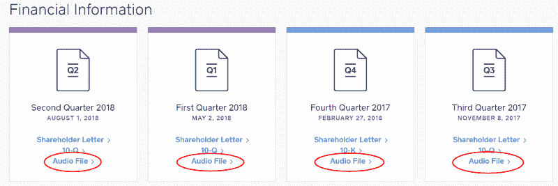
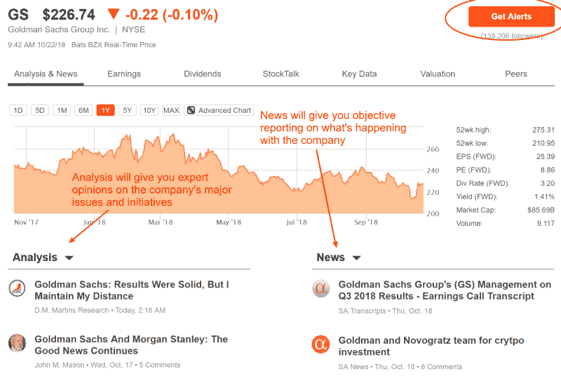
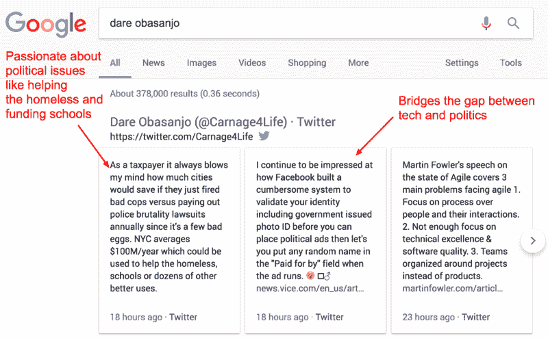
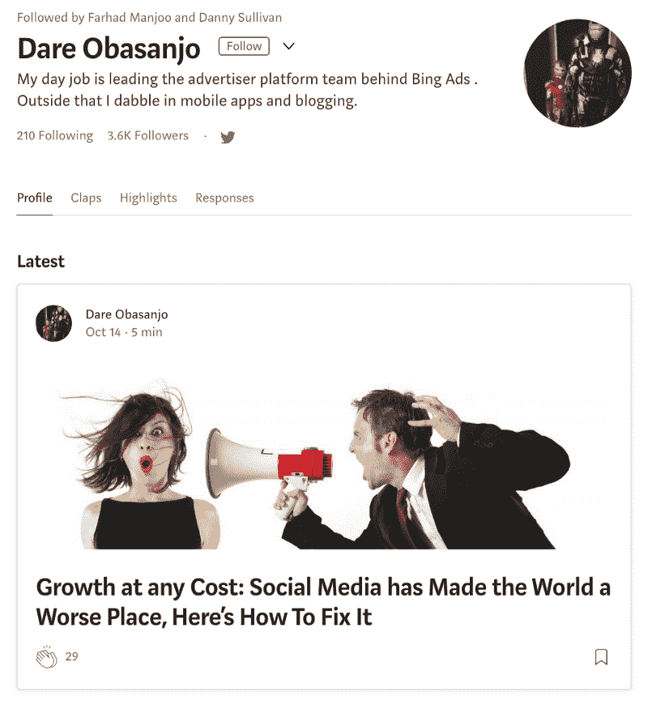
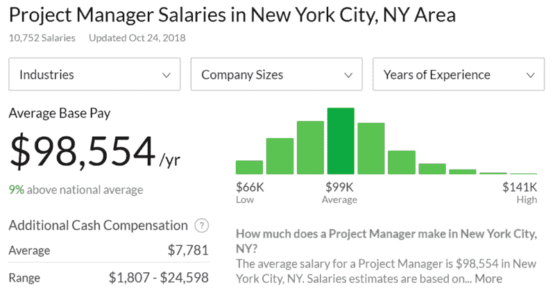
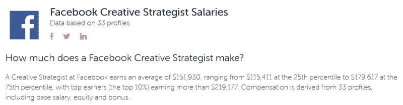
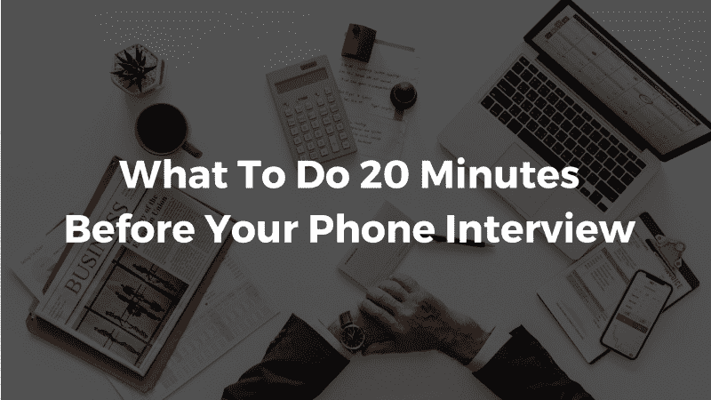
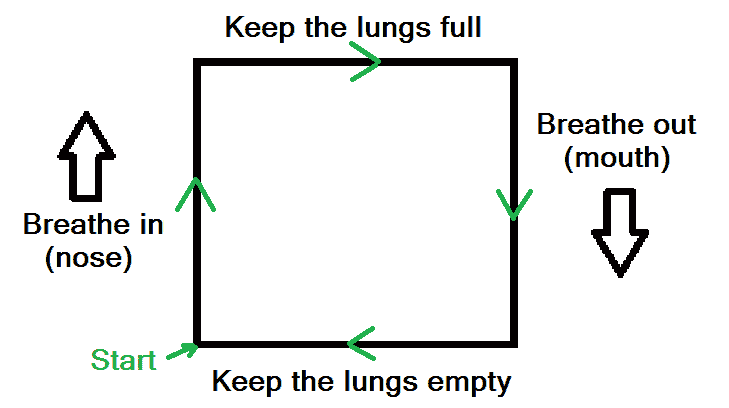
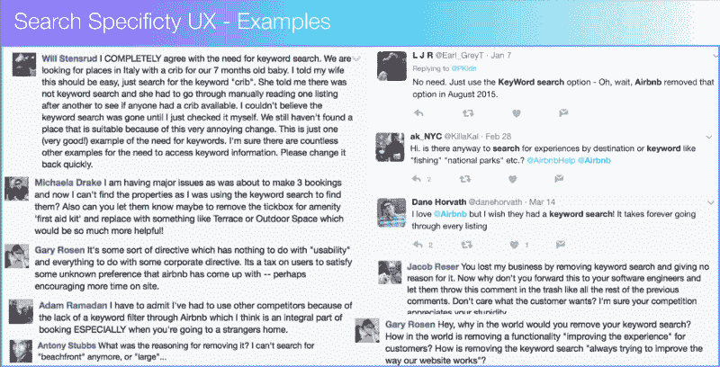

# 14 个以上的电话面试技巧将真正为你赢得工作机会

> 原文：<https://www.freecodecamp.org/news/14-phone-interview-tips-that-will-actually-win-you-the-job-offer-6a171e75ac94/>

#### 这些行之有效的技巧已经帮助像你这样的人把面试变成了谷歌、脸书、亚马逊等公司的邀请。

电话面试压力大！

你花了那么多时间在电脑后面修改你的简历，编辑你的求职信，以及构思完美的申请问题。你并没有期待太多，但是后来…

*丁*

一封招聘人员发来的新邮件进入了你的收件箱——他们想明天**和你打电话**，看看你是否适合这个职位和这个团队。

事情刚刚变得真实，这是你的机会！

现在你只需要找到一种方法来保持冷静，传达你的价值，并从其他几十个接到电话的人中脱颖而出。没有压力，对吧？这只是你梦想中的工作…

这就是这篇文章的由来。

在我找工作的过程中，我在谷歌、微软和 Twitter 等公司参加了 50 多次面试。我还在 Cultivated Culture 辅导过数千名求职者的面试过程。我利用这些机会测试不同的策略，目的只有一个:找到能显著提高你获得工作机会的策略。

这篇文章总结了我在这段时间里发现的 14 个最有效的电话面试技巧。为了让事情有条理，我把它们分成三个部分:

*   帮助你准备电话面试的 7 个技巧
*   **打电话前 20 分钟做什么(5 个小贴士)**
*   **达成交易的两个面试后技巧**

如果你在下一次电话面试前遵循了这篇文章中的框架，我保证你会在下一轮面试中获得一席之地:

### 帮助你准备电话面试的 7 个技巧

说到面试，80%的成功在于准备。大多数求职者都知道准备的重要性，但他们不知道如何准备。

在这一部分，我将向你介绍六个面试准备技巧，它们帮助我从电话面试中获得了三倍的工作机会(在谷歌、微软和推特上也是如此！).

#### 提示 1:准备并记住常见面试问题的答案

成为一名更好的面试官最简单有效的方法就是为显而易见的问题做准备。

如果你参加过多次面试，你可能会意识到许多问题听起来很熟悉。这是因为大多数面试就像一份塔可钟菜单:配料都是一样的，只是包装不同而已。？

一家公司可能会问你一次失败的经历，而另一家公司可能会问你在上一份工作中学到的最有价值的经验。这两个问题本质上是同一件事，这意味着我们可以用一个答案来处理它们。

在我求职期间经历的 50 多次面试中，我从文化修养社区的 12，000 多人那里听到的面试，以及像 Glassdoor 这样的地方的数据宝库，我已经能够揭示公司提出的问题背后的数据，以及它们出现的频率。

事实证明，大多数面试都会问一系列不同的问题，还会附带一两个通配符。如果我们将其归结为，95%的面试主要由这七个问题组成:

> ***7 核心电话面试问题***

> 你为什么想为我们工作？

> 告诉我你展现领导力的一次经历

> 告诉我一次你不得不作为一个团队工作的经历

> 告诉我一次你不得不与一个或多个难相处的人一起工作的经历

> 告诉我你失败的一次经历

> 告诉我你克服障碍的一次经历

> 告诉我你成功的一次经历

如果你能准备并记住这些问题的答案，你几乎可以参加任何面试，而且不需要任何准备就能成功！您可以通过以下方式做到这一点:

1.  打开谷歌文档，写下每个问题首先想到的东西
2.  喝杯啤酒或一杯葡萄酒，睡个好觉
3.  早上醒来，通读你的答案，并进行编辑
4.  那天至少再排练两次你的答案(总共 3 次)
5.  冲洗并连续七天重复步骤 2-5

关于如何精心制作好的面试答案的详细分类，以及如何以科学为基础帮助你不费吹灰之力记住它们的“窍门”，请看这篇文章。

#### 技巧 2:记录下你回答每个问题的过程

艾伯特·梅拉比安博士是加州大学洛杉矶分校的心理学教授，专门研究人们的交流方式。[根据他的研究](http://www.nonverbalgroup.com/2011/08/how-much-of-communication-is-really-nonverbal)，我们的信息有 7 %是通过言语传达的，38%是通过声音因素，55%是通过非语言因素(面部表情、手势、姿势等)。

很疯狂，对吧？

电话面试去掉了我们的面试官通常用来吸收信息的 55%的反馈。这意味着，如果我们想给人留下持久的积极印象，你就需要让剩下的 45%发挥作用。

记住答案后，录下自己的回答(你可以在 Mac 上使用 QuickTime，在 Windows 上使用 Voice Recorder 应用程序)。然后再听一遍你的回答，分析它们是如何出现的:

*   你听起来自信吗？
*   你是在信口开河还是在结结巴巴地说你的话？
*   是不是每三个词就冒出一个“嗯”或“啊”？
*   你是否对你想要表达的要点给予了足够的重视？

通过录下你的回答并听回来，你会准确地听到面试官将要听到的内容，这样你就可以确保你的回答清晰、精炼，并传达你的信息。

#### 技巧 3:研究公司，尤其是挑战和新举措

当你在电话面试阶段，效率是关键。你可能会同时收到几家公司的回复，都希望你在 24 - 48 小时后准备好电话面试。

当你的时间窗口如此之短时，你没有时间去阅读和吸收整个公司的历史。相反，你应该把注意力放在重要的信息上:当前的公司状况，他们面临的挑战，以及即将到来的计划。

这里有一个简单的两步框架，可以帮助你在不到一个小时的时间内快速吸收每个公司的所有信息:

**第一步:听他们最近的收益** **呼叫**

上市公司有责任让股东了解最新的收益、挑战和计划。

他们通过定期召开“收益电话会议”或“股东会议”来实现这一目标，通常是每季度一次。对我们来说，好消息是这些公司会记录这些会议，并在他们的投资者关系页面上公开分享，这样任何人都可以参与进来。在谷歌上快速搜索**[公司名称]投资者关系**或**[公司名称]盈利电话**，你应该会找到你想要的:

以 [Square 的投资者关系页面](https://squareup.com/about/investors)为例，你会发现他们季度收益电话会议的录音，以及一封给股东的总结他们业绩的信:

他们的平均通话时间约为 50 分钟，但如果你下载 MP3，将其插入 iTunes，并以 2 倍的速度运行，你就可以在 25 - 30 分钟内完成。这将让您大致了解该公司上一季度成功(或失败)的原因，以及他们如何应对主要挑战，并计划在不久的将来发布什么。

**第二步:阅读关于寻找 Alpha 的趋势文章**

Seeking Alpha 是一个金融博客和分析平台，来自不同公司和理念的专家在这里分享他们对上市公司的见解。

我喜欢这个网站，因为这些分析师为你做了所有的研究，然后将其浓缩成快速阅读，这样你就可以吸取所有的信息，而不用投资(双关语)大量的时间。你只需要搜索你的目标公司，他们的“简介”页面就会弹出，上面有他们当前的股价、主要新闻和分析:

阅读新闻和分析部分的前五篇文章会让你对公司目前的状况和短期前景有一个非常清晰的认识。如果你在面试前还有几天时间，你可以点击右上角的**获取提醒**按钮，每天早上将最佳文章的每日摘要发送到你的邮箱。不需要寻找信息，它会直接给你！

如果你花一个小时的时间听公司最近的收益电话会议，并阅读关于寻求阿尔法的顶级文章，你应该拥有在电话面试中留下深刻印象所需的所有信息！

#### 提示 4:调查你的面试官

既然你已经牢牢掌控了这家公司，那么是时候深入了解这个人了，这个人将决定你为他们工作的能力。

人们在建立关系时往往会有一个心理障碍。像“我不够格”、“我与人交谈时感到焦虑，我不能做我自己”、“我没有什么可以提供的”这样的无形脚本阻止我们实现自己的潜力。事实是，如果你有所准备，在面试中建立关系其实很容易。

坐在你对面桌子的人*希望*喜欢你。如果你是一个非常适合和酷的人，他们的工作就容易多了。我将在 5 分钟内与你的面试官分享建立积极关系的秘诀。

准备好了吗？

首先，挖掘尽可能多的信息。以下是我的 5 步清单，可以让你在 15 分钟内了解面试官的一切:

> ***15 分钟研究清单***

> +通读他们的 LinkedIn 个人资料，查看他们最近是否有任何帖子或分享。如果是这样，也读读那些。

> +查看他们的 Twitter 个人资料，浏览最近几周的推文。

> +点击他们的脸书个人资料/ Instagram，查看过去几周的照片。

> +谷歌一下他们的名字，看看会出现什么——他们在哪里被提到过吗？他们写过文章吗？他们有个人网站吗？

> +如果他们有个人网站，也浏览一下

这些步骤会让你了解他们是怎样的专业人士，他们的职业道路是什么样的，他们的个人兴趣是什么。

例如，如果你在微软面试一个项目经理的职位，你可能会面试我的同事 Dare。快速搜索一下谷歌，我们会发现他对政治充满热情，以及科技对我们的政府和社会的影响(这也表明 Twitter 可能是一个很好的联系方式，因为他在那里非常活跃):

向下滚动结果，我们还会看到 Dare 分享了许多关于他的中等个人资料的想法。阅读这些帖子是了解他的想法并理解他的想法的好方法:

这些都是很好的角度，你可以用来闲聊，消除“职业障碍”，和面试官建立融洽的关系。即使你不“擅长”或不习惯闲聊，你所需要做的就是将谈话引回主题，询问他们，并继续跟进问题！

#### 技巧 5:列出一系列要问面试官的问题

提问是面试中最重要也是最没有被充分利用的部分之一。

在问答环节之前，你的面试官一直在控制着谈话，他们可能会问每个应聘者同样的问题。这意味着他们在一定范围内得到了相似的答案。当然，有些人会有更好的经验，能够更好地传达他们的价值，但答案将是相同的。

提问的机会是你脱颖而出并获得竞争优势的机会。

在我找工作的过程中，我参加了几十家公司的 50 多次面试。我利用这些机会对不同的面试问题和问题集进行了拆分测试，看看哪些是最有效的。根据反馈和采访结果，我发现以下 5 个问题最有效:

> ***电话面试结束时要问的问题***

> 1.在 X 公司工作，你最喜欢的部分是什么？

> 2.你的团队现在面临的最大挑战是什么？

> 3.让我们快进一年——你会回顾这次招聘。他们做了什么超出所有预期？

> 4.你在 X 公司工作时学到的最意想不到的一课是什么？

> 5.告诉我更多关于你的事情，你在工作之外喜欢做什么？

这些问题之所以如此有效，是有具体的科学依据的。想了解更多关于它们背后的原理，以及一些你可以用来增加你在面试官那里获得积极印象的机会的心理学“窍门”，读一读这篇文章。

#### 提示 6:研究这个职位的薪水，想出“你的数字”

这个太棒了！

被一个关于“你失败的一次”或“你的职业道路”的问题绊倒是一回事——会有机会弥补的。打乱关于你期望薪水的谈话会扼杀你日后谈判的能力，这也是为什么面试官喜欢尽早问这个问题。

好消息是，只要做一点研究和准备，你就能解决这个问题，并在最后把它变成 20%的加薪。下面是如何做的——我在下面加入了使之发生的缩写版本。关于协商薪水的完整详细的演练，[查看这篇文章](https://cultivatedculture.com/salary-negotiation/):

#### 第一步:了解你的价值

互联网让衡量类似职位的其他人的薪酬变得相当容易。我最喜欢的三个网站是 Glassdoor、Paysa 和 Salary.com。

最好的情况是为你想要的确切职位和公司找到一个工资范围，但这是一个罕见的头奖。或者，你可以在你计划工作的城市查看该职位的范围——这是纽约项目经理的平均值(通过 Glassdoor):

或者看看你的目标公司的竞争对手为类似的职位提供了什么。假设你想在 Twitter 做一名创意策略师，但是没有人在 Glassdoor 上提交薪水。你可以使用 Paysa 在脸书查找相同职位的范围:

你不需要在科学上精确，目标是了解你的目标职位的合理薪酬。如果被逼无奈，你希望能够提供一个在你找到的范围的上限内的数字。以下是如何处理这种对话:

#### 第二步:宣扬健康重于金钱

谈判薪资的第一条规则是，第一个抛出数字的人最终会处于非常不利的地位。

当你的面试官说“你能再多告诉我一点关于你期望的薪水吗？”或*“你能告诉我你在之前的职位挣多少钱吗？”不要马上屈服，给他们想要的信息。相反，告诉他们你对薪水有弹性，但是找到合适的人是你的首要任务。*

> ***在电话面试中处理薪资问题***

> 面试官:你能告诉我你对这个职位的期望薪资吗？

> 你:我在薪水和报酬方面很灵活，我的首要任务是确保这对我们双方都合适。

这应该会让你暂时远离聚光灯，为你赢得一些时间。

**第三步:用上限的 75%-80%打击他们**

在某些时候，你需要吐出一个数字。

你的面试官可能会说*“除非我们有一个确定的数字，否则我们不会前进】，*或者你可能已经进入了最后一轮，或者他们给了你一个报价，但价格很低！

在这种情况下，最好的办法是，给他们一个位于上限 75 - 80%范围内的数字。使用上面截图中的项目经理角色，项目经理每年平均收入为 98k 美元，但上限为 141k 美元。141，000 美元的 75%是 105，000 美元，这就是你的数字！

给他们看看他们的反应。

#### 技巧 7:和朋友或家人一起练习

最后，你能做的最好的准备之一就是听取别人的意见。

我们都倾向于对自己的能力有偏见(不管是好是坏)，让你信任的人进行模拟面试可以帮助你在重要的日子到来之前找出任何额外的弱点。试着找一个和你的目标角色有相同行业经验的人。

给他们一些角色的背景，让他们挑选几个“核心”问题(随机)，让他们扔几个曲线球让你保持警觉。尽最大努力把这当成一次真正的面试——通过电话进行，避免任何不相关的闲聊，尽量重现你将在真正的电话面试中遇到的环境。

#### 准备完毕！

如果你遵循了上面列出的所有建议，你就应该做好充分的准备来粉碎你即将到来的电话面试。但是如果你在面试中没有充分利用这些，那么所有的准备都是没有意义的。

接下来的两个部分将带你了解一些技巧，帮助你建立合适的环境，克服紧张/焦虑，并帮助你留下印象，巩固你在下一轮的地位。

### 电话面试前 20 分钟做什么(5 个小贴士)

我承认，这些是相当“显而易见”的，但是每个人都谈论它们是有原因的——它们有效。确保在面试前至少 15 - 20 分钟清空你的日程，这样你就可以安顿下来，进入正确的心态。

#### 秘诀 8:找一个安静的地方

背景噪音绝对不会给人留下专业的印象，而且会扼杀你集中注意力的能力。你不希望面试官自我介绍的时候门砰的一声关上，或者你的同事大喊“你他妈的在开玩笑吧！”当你解释你最大的弱点时。

尽管我们尽了最大努力，研究证明人类根本无法同时处理多项任务。相反，你的注意力被分散了，所以如果你试图同时关注两件事，你最多只能投入 50%的注意力(如果你增加更多的关注点，你的注意力会更少)。

你可能会认为多任务处理是一种有意识的努力，在用扬声器和妈妈说话的同时给朋友发短信，但这也发生在潜意识层面。当你的大脑忙于屏蔽背景噪音时，很难在飞行中找到答案。省点事吧，找个安静的好地方进行电话面试。

#### 技巧 9:用耳机接电话

这个超级简单——插上耳机，用耳机接电话。这解放了你的双手，让你可以翻阅你准备好的笔记，并简单地用它们来说话(这实际上帮助你[更有效地表达你的想法](https://www.huffingtonpost.com/entry/talking-with-hands-gestures_us_56afcfaae4b0b8d7c230414e) -即使是在电话里)，让我们进入下一个提示:

#### 提示 10:在你的电脑上准备好重要的资源

虽然电话面试扼杀了我们在信息中使用肢体语言的能力，但它给了我们优势，让我们可以直接获得有用的资源。我的建议是关闭你电脑上的所有东西，除了一个在不同标签中打开下列项目的浏览器:

*   你的简历
*   职位描述
*   面试官的 LinkedIn 个人资料
*   你想问面试官的问题
*   谷歌

这些资源可以让你随时找到任何你可能需要的信息，如果你脑子有问题或者面试官发现你有什么不注意的地方，这些资源可以救你一命。

> ***专业提示:*** 这听起来很奇怪，但是看看面试官的照片(比如他们在 LinkedIn 上的个人资料图片)可以让你在电话里听起来更自然。当我们看图片而不是单词时，我们的大脑更容易假装我们在交谈。

#### 提示#11:检查你的连接

一旦你在一个安静的地方准备好了所有的资源，给你的朋友或家人打个电话。你应该保持简短，以便有时间学习下一个技巧，但是你要确保你可以在不中断或任何奇怪干扰的情况下继续谈话。这很少见，但你最好花两分钟确保安全，而不是后悔。

#### 秘诀 12:冥想

哇，像个和尚！？

完全像个和尚。

当谈到在电话面试中获得优势时，冥想是一个非常强大的工具。它的[有医学依据的益处](https://www.healthline.com/nutrition/12-benefits-of-meditation)——减轻压力、控制焦虑、提高思维清晰度、延长注意力持续时间等。-所有这些都与更好的面试结果直接相关。你可以在短短 2 - 5 分钟的冥想中获得所有这些好处。

也不难。如果你以前从未冥想过，你需要做的就是遵循这个呼吸练习几分钟:

确保在面试前给自己一两分钟时间，让你的呼吸和精神状态恢复到基线。现在你已经准备好拿起电话，通过电话面试，离你梦想的工作又近了一步！

### 面试后的两个行动将帮助你进入下一轮

咻！

你挂断电话，呼出所有紧张的能量——任务完成。现在你已经无能为力了，你已经尽力了，对吗？

没那么快。电话面试可能已经结束了，但你给人留下深刻印象并让自己从其他应聘者中脱颖而出的机会还没有结束。

这一部分非常重要。为什么？因为大多数候选人做了很多我们上面谈到的事情。他们可能没有做到我建议的深度，但他们至少覆盖了他们的基础。

根据我收集的数百名求职者的数据，以下建议被证明对你被录用的几率影响最大:

#### 提示#13:发送一封感谢信

感谢人是常识，也是常见的礼貌，对吧？

结果表明，只有 24%的候选人真的发了感谢信。最重要的是，[的数据显示](https://www.roberthalf.com/blog/job-interview-tips/a-little-thanks-goes-a-long-way?utm_campaign=Press_Release&utm_medium=Link&utm_source=Press_Release)接近 80%的招聘经理认为感谢信在决定候选人时很有帮助。22%的雇主不太可能雇用一个不**不**发送感谢的候选人，而 [91%的雇主实际上*喜欢*被感谢](http://rh-us.mediaroom.com/2012-06-14-Survey-Reveals-Email-Phone-Call-Are-Preferred-Methods-for-Post-Interview-Follow-Up)(想象一下！).

谈低挂水果！

不过，我们不只是想超越竞争对手。我们想从这个机会中挤出一切，这就是为什么你不应该写一个基本的“谢谢你的时间”。你要表现出你听进去了，吸收了，并能做出更多贡献。

我写了一整篇关于如何有效地做到这一点的文章，你可以免费阅读并[下载我的复制/粘贴感谢模板](https://cultivatedculture.com/interview-thank-you-email/)。

#### 提示#14:准备一个价值验证项目

最后，但同样重要的是，这是我能向任何求职者推荐的最有效的工具:价值验证项目(VVP) 。

vvp 本质上是可交付的，它强调了你对公司特定需求的价值。它可能是一个问题的解决方案，一个即将发布的产品的想法，来自客户的有价值的反馈，或者仅仅是一个展示你的技能的机会。

你可以用许多不同的方法为你的 VVP 找到一个角度。

回顾你对这家公司的研究是一个很好的开始，或者利用面试官给你的关于他们最大挑战的信息是另一个开始。当所有其他方法都失败时，你可以随时出去调查公司的客户(如果有人会给你非常诚实的反馈，那就是他们)。

然后你就可以建立一个交付物，突出你在这个角度的价值。这是一个 VVP 帮助文化界人士在 AirBnB 找到工作的好例子:

#### **Cam 识别客户痛点&提供解决方案**

Cam 是一名学生，想在 AirBnB 找到一份工作。

她在网上申请，给她在 AirBnB 能找到的任何人发邮件，但没有人上钩。她只有两个选择:放弃并继续前进，或者找到一种能带来他们无法忽视的价值的方式。

Cam 加倍下注，转向 AirBnB 的用户群。

她梳理了社交媒体记录的 AirBnB 用户公开分享的所有投诉，然后她分析了数据，找出了两个主要问题:

1.  缺少特定关键字搜索(例如，查找特别包含“热水浴缸”或“壁炉”的列表。
2.  和 AirBnB 客服团队的人联系有多难

Cam 制作了一个幻灯片，强调了这些问题以及她的两个数据支持解决方案:

然后她联系了之前给她发邮件的所有人。几天后，她坐在他们的办公室里接受采访。之后不久，她就被录用了！

像这样的 vvp 非常有效，因为它们允许您:

*   用切实的方式证明你的价值(而不是依赖简历中的子弹)
*   展示你对公司的热情，解决公司的问题
*   超越自我——没有其他候选人会做这样的事情

当你的电话面试结束，你的感谢信发出后，你就可以专注于利用你目前所获得的信息来建立一个 VVP。

一旦准备好了，你就可以把它发给面试官，并说:“再次感谢你上周抽出时间。我对[与你的 VVP 相关的话题]想了很多，所以我想出了一些主意。它们附在这里！如果您有时间看一看，我很想得到您的反馈。”

如果你的电话面试进展顺利，这将是锦上添花。如果面试官心中有疑问，这将帮助你克服它，并在下一轮中获得一席之地！

#### 想要一份没有关系，没有“经验”，没有网上申请的梦想工作的内部信息吗？

点击此处获取我的学生在谷歌、微软、亚马逊等公司求职时使用的 5 个免费策略，无需在线申请。