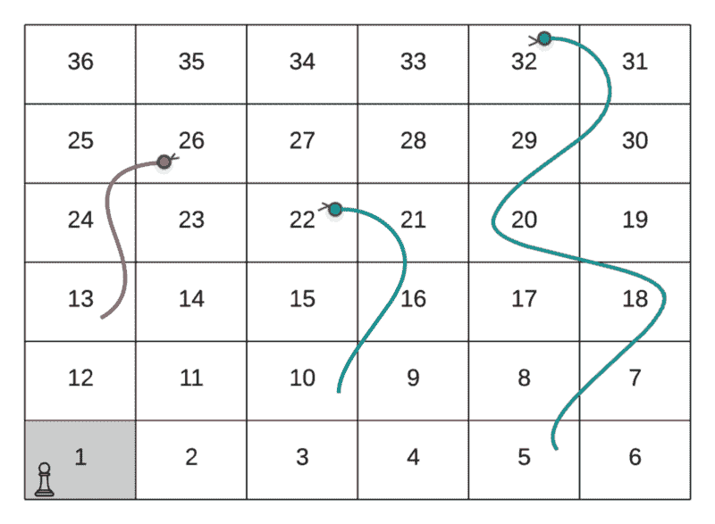
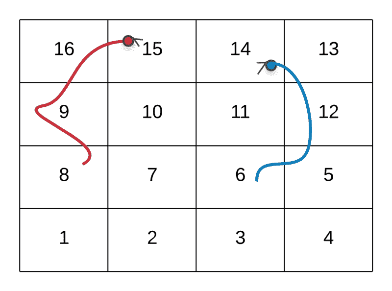
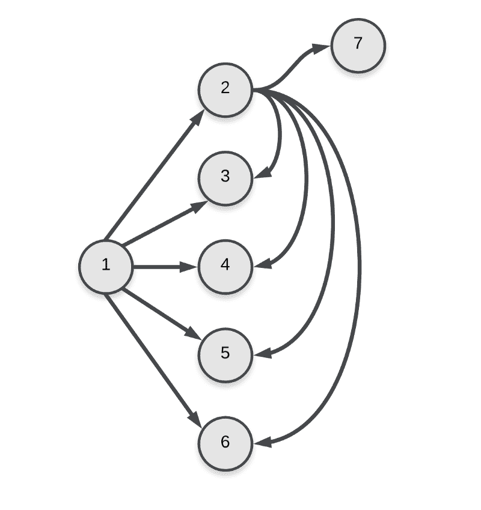
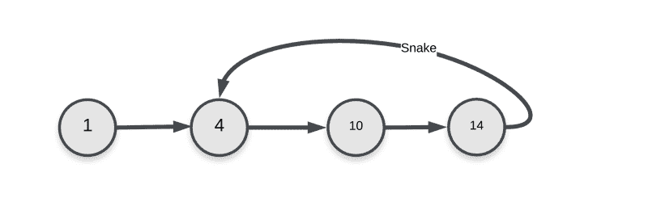
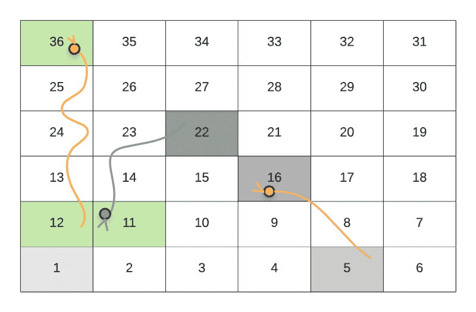
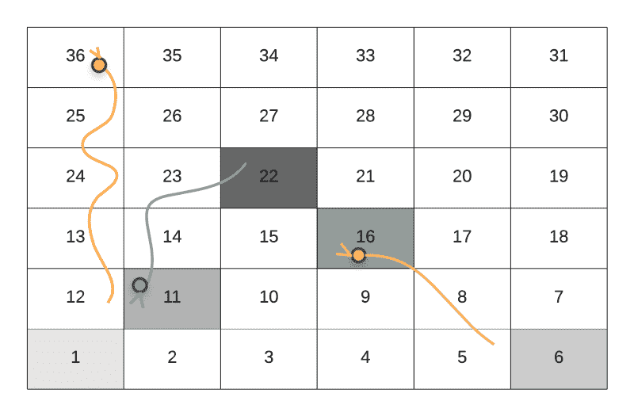
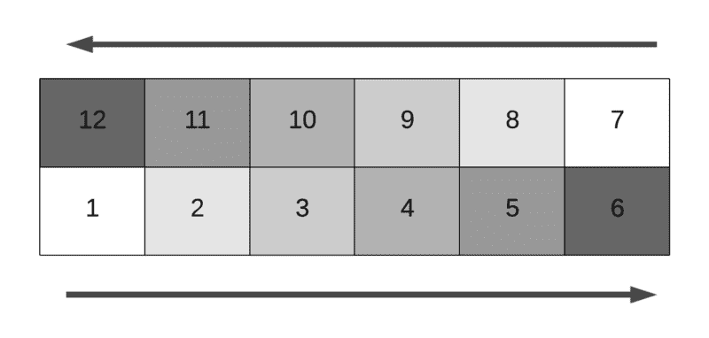
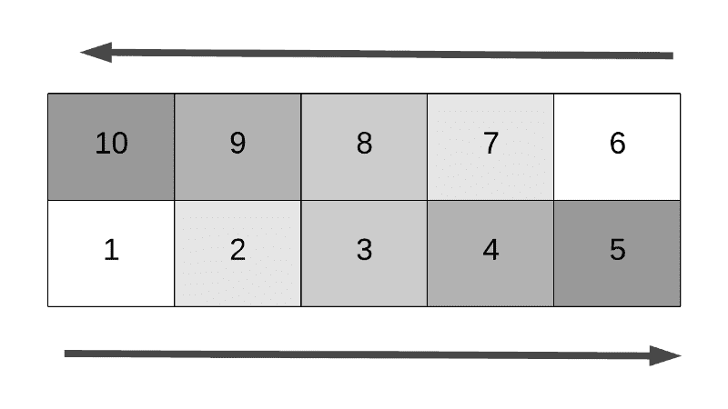
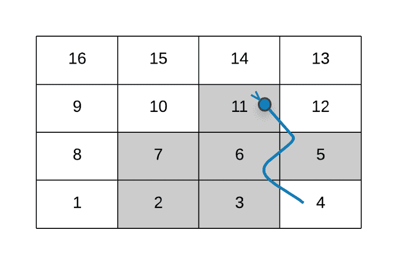

# 完美的编程面试问题

> 原文：<https://www.freecodecamp.org/news/the-perfect-programming-interview-problem-8431cdeab2a7/>

作者:Sachin Malhotra

# 完美的编程面试问题


编程面试很难！

电话筛选面试比传统的现场白板面试要简单一些。由于缺少代码编辑器来编写代码，白板面试会带来很多压力和焦虑。这些面试的共同点是他们测试的技能。

通常，编程面试会涉及一个编程挑战。候选人必须在整个面试过程中不断努力。分配的时间通常是 30-35 分钟。前 10 分钟是介绍和其他事情。

给定一个编程问题，面试官通常希望应聘者:

1.  **给出可行的解决方案**
    提出解决问题的可行方案。这可能是一个蛮力解决方案开始。标准是候选人应该能够在这么短的时间内为算法编写出语法正确的程序。
2.  **提出澄清问题**
    提出问题以澄清被有意遗漏的事情。
    →输入的大小是多少？
    →数组中可以有多少个数？
    →给定字符串的字母大小是多少？我们可以使用额外的内存吗？
    →我们可以修改给定的输入吗，或者它是只读的吗？
3.  语法正确的代码一旦面试官确信候选人描述的解决方案，他们就应该为这个问题写一个可行的解决方案。在白板访谈中，该解决方案将被写在白板上。白板明显没有任何语法修正！这才是真正困难的地方。
4.  如果你只是向面试官展示一个强力的解决方案来打破尴尬的沉默，他们通常会要求你提出一个更好的解决方案。除非今天是你的幸运日，面试官对你提出的解决方案深信不疑？。他们通常会问的跟进问题是:
    →你能提出更好的解决方案吗？O(logn) → O(n)
    →你能让你的解空间高效吗？O(1)空间。
5.  **边缘案例**
    即使你能够为问题提出一个最佳的工作解决方案，你也有可能错过一些边缘案例。您可能已经错过了一些不会改变算法的场景。它们可能会影响实施。候选人应该在写完代码后进行大量的测试。你应该尝试一些测试用例来发现他们可能遗留在代码中的任何问题。
6.  **复杂性分析**
    如果你的面试还有剩余时间，面试官似乎对你想出的代码很满意，他们可能会问你解决方案的时间和空间复杂性。因此，复杂性分析也是破解这些编程面试所需的关键技能。

是的，的确是势不可挡。

这篇文章并不是关于准备和尝试编程面试的技巧和诀窍。有很多关于这方面的好帖子。如果你来这里寻找一些一般的指导和提示，我想把你重定向到一些我最喜欢的帖子。

[**在编程面试中你需要知道的 5 件事**](https://medium.freecodecamp.org/the-most-important-things-you-need-to-know-for-a-programming-interview-3429ac2454b)
[*这篇文章是为那些试图开始他们的编程生涯，或者正准备面试…*medium.freecodecamp.org](https://medium.freecodecamp.org/the-most-important-things-you-need-to-know-for-a-programming-interview-3429ac2454b)[**30 分钟指南摇摆你的下一次编程面试**](https://medium.freecodecamp.org/coding-interviews-for-dummies-5e048933b82b)
[*我是如何在编程面试中有所提高并收到大型科技公司的邀请的。*medium.freecodecamp.org](https://medium.freecodecamp.org/coding-interviews-for-dummies-5e048933b82b)

我最近遇到了一个编程问题，我必须在 1 小时内解决它。这是在 Leetcode 上举行的编程竞赛的一部分。我发现这个问题是编程面试中被问到的一个很好的候选问题。我将在这里详细讨论这个问题，并讨论为什么这是一个好的面试问题。我会尽我最大的努力把它和前面提到的几点联系起来。

#### 目录

*   [？让我们玩蛇和梯子](https://medium.com/p/8431cdeab2a7#a667)
*   [看起来像一个典型的动态规划问题](https://medium.com/p/8431cdeab2a7#0028)
*   [图形模型](https://medium.com/p/8431cdeab2a7#838c)
*   [DP 公式中的缺陷](https://medium.com/p/8431cdeab2a7#b56d)
*   [更新的 DP 公式](https://medium.com/p/8431cdeab2a7#9ed1)
*   [广度优先搜救！⛑](https://medium.com/p/8431cdeab2a7#8720)
*   [单元格值到行和列的映射？](https://medium.com/p/8431cdeab2a7#9ab1)
*   [有问题的单元格值？](https://medium.com/p/8431cdeab2a7#5724)
*   每条蛇走一步？
*   我们能摆脱“方向”这个东西吗？？
*   [反过来映射](https://medium.com/p/8431cdeab2a7#6afa)
*   [为什么这又是最佳编程面试问题？](https://medium.com/p/8431cdeab2a7#ce03)

### ？让我们玩蛇和梯子

这个问题是最近在 [LeetCode](https://medium.com/@BlogLeetCode) 举行的每周编程竞赛的一部分。这是一个 1.5 小时的比赛，有 4 个不同难度的编程挑战。这被标记为中等难度的问题。在阅读完这篇文章后，你会意识到能够在规定的时间内解决它是一件大事。

仅供参考，我不能？

[**【蛇与梯子】- LeetCode**](https://leetcode.com/problems/snakes-and-ladders/description/)
[*提升你的编码技能，快速找到工作。这是扩展你的知识和做好准备的最好地方……*leetcode.com](https://leetcode.com/problems/snakes-and-ladders/description/)

这是一个很大的问题，我强烈建议您在继续阅读之前仔细阅读。

我希望你们关注的问题部分如下:

> 返回到达正方形 N*N 所需的最少移动次数。如果不可能，返回`-1`。

### 看起来像一个典型的动态规划问题

或者是？

如果您已经练习动态编程问题有一段时间了，那么与上面类似的问题语句通常采用动态编程范例应该是显而易见的。

我们这样说的原因是，对于一个可以使用动态编程解决的问题，它应该具有某些特征。

1.  这个问题应该可以分解成更小的子问题。子问题可以用来解决主问题。子问题的最优解应该帮助我们找到主问题的最优解。这意味着问题应该是可以递归解决的**。**
2.  **第二个最重要的特性是**重叠子问题**的特性。本质上，动态编程为我们做的是，它帮助我们重用子问题的最优解。如果我们有多个带有重叠子问题的递归路径，我们应该只为它们计算一次答案。然后继续使用它们。这是动态编程的缓存部分。**

**这个问题之所以符合动态编程的要求，是因为这个问题的以下组成部分:**

*   **我们有一个网格，每个单元格都有一个特定的数字。这个数字可以帮助我们定义动态编程解决方案的状态。**
*   **在网格中的每个单元格，我们有 6 个选项可用。这些代表了我们在玩蛇和梯子时可能得到的 6 个骰子值。自然地，这 6 个步骤帮助我们从一种状态过渡到另一种状态。这代表了动态编程需求的**“可分解成子问题”**部分。**
*   **因为我们可以将问题分解成更小的子问题，所以我们已经满足了一个需求。如果你仔细想想，通过不同的路线多次到达网格上的同一个单元是可能的。让我们看看从`1`开始达到单元值`22`的两种可能方式。**

**

Route Followed: 1 → 4 → 10 (Snake Up!) → 22** 

**上面 GIF 中玩家遵循的路径如下:**

```
`--> Start at the node marked 1--> Dice value 3, hence move to node marked 4--> Dice value 6, hence move to node marked 10--> Since there was a snake at node 10, move to its head and hence the node valued 22.`
```

**

Route Followed: 1 → 4 → 9 → 14 → 17 → 22** 

**上面 GIF 中玩家遵循的路径如下:**

```
`--> Start at the node marked 1--> Dice value 3, hence move to node marked 4--> Dice value 5, hence move to node marked 9--> Dice value 5, hence move to node marked 14--> Dice value 3, hence move to node marked 7--> Dice value 5, hence move to node marked 22`
```

**正如我们在上面的蛇和梯子网格示例中看到的两条路径一样，有两种方法可以到达值为`22`的节点。还有很多其他的方法。为了解决子问题重叠的问题，这里显示的两个就足够了。**

**现在我们知道单个单元定义了我们的动态规划解的状态，并且有多种方式到达同一个单元，这意味着我们对动态规划问题的第二个要求也得到满足，即重叠子问题。一旦计算出给定子问题的答案，就不应该再计算了。它应该被重新使用。**

**现在让我们看看这个问题的正式动态规划公式。**

```
`dp[i] = Minimum number of steps from cell(i) to reach the destination cell.`
```

```
`dp[i] = min(dp[i + 1], dp[i + 2], ... dp[1 + 6])We have to choose the move that gives the minimum number of steps.`
```

**上面的公式看起来非常简洁，我们可以继续使用它。**

**然而，在上面的公式中有一个主要的缺陷。？**

**我们在这里对问题建模的方式将持续到文章的结尾。因此，让我们首先定义我们问题的模型。然后继续描述动态编程方法中的缺陷。**

### **图形模型**

**我们可以把蛇和梯子网格中的每一个单元看作是图中的一个节点。一个玩家可以从一个给定的格子做出的六个可能的移动代表了边。这些边是**有向边。**将我们从牢房`i`带到牢房`j`的移动，不一定会将我们从牢房`j`带回牢房`i`。因此，对于问题的表述，我们有:**

*   **一个图 **G(V，E)****
*   **我们的蛇和梯子网格中的每个单元格代表图中的一个节点。自然，图中有 **N** 个节点。**
*   **从单元格`i`到单元格`j`的每一次移动都表示图中从节点`i`到节点`j`的有向边。**
*   **因为，对于网格中的每个单元，我们最多有 6 次移动，这意味着我们图中的边的总数将是 **6N** 。**

**为了更清楚起见，让我们考虑一个小网格及其对应的图形。**

****

**这个网格对应的图形是。**

**

Edges for nodes 1 and 2 in the graph. As you can imagine, the graph becomes complicated very quickly because of the number of edges. There should be 4 * 4 * 6 = 96 edges in total in the graph since we have 16 nodes and each of them will have 6 edges in total. But, the final nodes 11–16 will have fewer edges. e.g. 11 will have just 5 edges. Similarly, 16 will have 0 edges. Hence, total edges will be 96 — (1 + 2 + 3 + 4 + 5 + 6) = 75.** 

### **我们 DP 公式中的缺陷**

**既然我们已经为这个问题定义了图形模型，我们可以看看我们的动态编程公式中的缺陷。我们研究的公式如下:**

```
`dp[i] = Minimum number of steps from cell(i) to reach the destination cell.`
```

```
`dp[i] = min(dp[i + 1], dp[i + 2], ... dp[1 + 6])We have to choose the move which gives the minimum number of steps.`
```

**如果问题中没有蛇，那么上面的公式本身就是完整的。由蛇引起的问题是我们的图中的**循环。一条蛇可以把我们带回图表中已经访问过的状态。****

**

Loop introduced by snakes in the graph representation.** 

**这在我们的公式中产生的问题是，我们不能真正考虑网格中的单个单元来定义我们的动态编程公式的状态。**

**让我们通过一个例子来看看为什么会这样，然后我们将看到如何通过不同的公式来解决这个问题。**

**

The player moves from cell 1 to 22 and follows the path 1 → 5 → 16 (Snake Up!) → 22.** 

**这是从初始小区 1 开始到达小区 36 的可能路径之一。**

**假设我们想找出从单元格`22`到达目的单元格`36`的最短步数。在上面的例子中，玩家从`1 --> 5 --> 16 (Snake Up!)` - > 22。在上图中我们可以看到，玩家会因为蛇而下到`th` e 单元格 11。然后先行一步也就是 `t`12 号牢房 o。最后，把这条蛇带到 destinat`io`n 36 号牢房。这只是第一步。**

**跟随蛇从`22 -->` 11 和 fr`om 12 --&`gt；36 其实不算是搬家。实际移动是 `from 11` - > 12。因此，移动 T4 22 到 36 所需的最少步骤数是 1。**

**现在考虑当用户到达`22`时网格的以下状态。**

**

The player moves from cell 1 to 22 and follows the path 1 → 6→ 11 → 16 → 22.** 

**在递归过程中，上述场景也是可能的。在这种情况下，当玩家到达单元格`22`时，他们面前没有 6 个选项。原因是，细胞`22`是蛇的起点。如果一个细胞是一条蛇的起点，那么它必须被追踪到它的头部。玩家将最终登陆已经被访问过的`11`牢房。这是我们递归中的一个循环。由于我们不能从单元格`22`进行任何其他移动，因此无法从`22 to 36`中找出最小步数。**

**问题是:**

**一个单元格不能单独代表我们的动态编程公式的状态。我们还需要跟踪手边的一个之前访问过的单元。这两者的结合将在我们的 DP 公式中定义一个独特的状态。**

### **更新的 DP 公式**

**如前所述，更新的 DP 公式必须考虑所访问的小区和玩家所在的当前小区。**

**由于动态规划问题的状态通常被用作存储各种状态结果的高速缓存的关键字(**记忆化**)，简单地保存字典或一组被访问的单元节点是不可行的。这些数据结构是不可散列的。**

**可以采用的另一种方法是**位屏蔽。**我们可以利用位掩码来标记用户在访问特定单元之前已经访问过的网格单元。**

**让我们考虑一下这是否是一个可行的方法。因此，对于`20-by-20`的网格大小，将有`400`个单元，我们将需要一个`400`位的位掩码。这些位值中的每一个将表示在递归期间是否已经访问了该特定单元。由于每个位可以有两个不同的值:`0 and 1`，所以有**个 2⁴⁰⁰** 个可能的网格状态。将它乘以 400，因为我们还需要当前的单元格，我们得到一个巨大的(2⁴⁰⁰ * 400)。**

**如此大量的可能状态将不会工作，并且根本不容易处理。这就是为什么我们不得不从动态编程解决方案转向其他方案，因为问题公式中有大量的状态。**

### **广度优先搜索救援！⛑**

**让我们试着用稍微不同的方式来阐述这个问题。我们已经说过，网格中的单元代表图中的节点。这 6 种可能的移动表示到图中其他节点的有向边。**

**我们希望找到从网格上的初始点开始到达目的地的最少移动次数。这归结为在未加权的图中寻找最短路径。**

**你可以说这个图是未加权的，也可以说所有的边都是等权的。因此权重可以忽略。在未加权图中寻找最短路径是一个非常标准的问题。求解它最标准的算法是**广度优先搜索算法**。**

**对于广度优先搜索，我们不需要图中的任何特殊状态，就像我们在动态编程的情况下需要的那样。我们肯定可以有多种方法从起始位置到达一个特定的节点。**然而，在广度优先搜索算法中发现的第一条路线是最短的一条**。这是算法的基础。**

**这意味着我们在搜索期间第一次遇到节点/单元时，到那时为止执行的移动次数将是从起始位置到达该状态/单元/节点所需的最小移动次数。**

**之后，如果我们再次遇到相同的节点，我们可以简单地忽略它。到那时我们已经有了到那个节点的最短路径。这确保了我们不会在广度优先搜索中对图中的任何节点进行一次以上的处理。**

**广度优先搜索算法利用了**队列**数据结构。队列包含在任何时间点特定级别的图的节点。由于我们将只处理每个节点一次，队列的最大可能大小可以是 O(N)。这是队列大小的上限。这种解决问题的方法非常容易处理，事实上也是最好的方法。**

**让我们来看看针对这个问题刚刚提出的算法的伪代码。然后，我们将查看相同的实现。**

```
`1\. Initialize a queue for the BFS algorithm. Let's call it "Q".2\. Add the first cell to the Q. Note that we also need to keep track of the level of nodes in our graph. The level will tell us the minimum number of moves made to reach a specific node. The level for the initial node would be 0.3\. Process until the Q becomes empty.    a. Remove the front element of the Q. Let's call it "node".    b. For each of the 6 possible moves from "node", add the ones that have not been processed before, to the Q.4\. If we encounter the destination node during the processing, simply return the level value at that point.`
```

**在查看实现之前，我们应该解决许多有趣的问题。这些都是我自己尝试的问题。其中一些可能看起来太简单了，没有被提及。我想解释所有这些情况。它们对我们讨论的这个算法的代码编写方式很重要。**

### **单元格值到行和列的映射？**

**需要考虑的第一点是从单元格值到实际的行号和列号的映射。**

**请记住，我们得到了一个由一些值组成的网格，网格中的每个单元格都有一个编号。编号系统是从棋盘的左下方开始从下往上依次写[](https://en.wikipedia.org/wiki/Boustrophedon)**，并且每一行交替方向。****

****这里最初实现的方式是考虑实际的行数和列数，然后以某种方式使用它们在网格中前进。****

****根据这个问题，如果一个单元格包含一条蛇，那么这个单元格中的值就是玩家将要到达的目标单元格。我们需要将目标单元格值映射到相应的行号和列号。****

****划船运动总是很容易的。我们要么在同一行的不同列中移动，要么向上移动一行。这一排就这样了。****

****就柱子而言，有两个可能的运动方向。这个问题特别棘手。单元格的编号**从一行到另一行交替**。一行内的移动(对于各种移动)在交替的行中也将具有交替的方向，例如对于`6-by-6`网格，移动将在底部行向右，在倒数第二行向左。****

********

****对于一个`6-by-6`矩阵，行号`5`(考虑矩阵行和列的基于 0 的索引)将包含来自`1 .. 6`的单元，而行号`4`将包含来自`7 .. 12`的单元。****

****这意味着，对于偶数行，方向是向左的。对于奇数行，方向是向右的。然而，当`N`为奇数时，这种映射会反转。考虑一个`5-by-5`矩阵中的场景。****

********

****该矩阵中的最后一行是`4`，并且该行具有向右的方向。这意味着，在这些情况下，偶数行具有向右的方向。奇数行有一个向左的方向。****

****就实现而言，我们可以使用如下代码。****

```
**`even_direction = 1 if N % 2 != 0 else -1direction = even_direction * (1 if row % 2 == 0 else -1)`**
```

****在我们的实现中，我们认为值`1`代表向右的方向，值`-1`代表向左的方向。这样做的原因是它在模拟运动中引起的简单性。我们可以简单地这样做:****

```
**`for move in range(6):     new_cell = cell[r][c + direction]`**
```

****`c + direction`要么向右走，要么向左走。这是因为`direction`的值将是`1`或`-1`，这取决于`N`的值。****

****现在我们可以看看单元格值到相应的行和列索引的映射。****

****请注意，下面的代码仅在我们在其中一个单元格中发现一条蛇时执行。`board[row][col]`将包含一个`-1`来代表一个正常的细胞。当发现一条蛇时，执行下面的代码，例如`board[row][col] != -1`****

```
**`(1) value = board[row][col](2) snake_dest_row = N - (value / N) - 1(3) new_direction = even_direction * (1 if snake_dest_row % 2 == 0 else -1)(4) snake_dest_column = (value % N)                        (5) if new_direction < 0:(6)    snake_dest_column = N - 1 - snake_dest_column                        (7) next_cell = (snake_dest_row, snake_dest_column)`**
```

#### ****第一行****

****给出当前单元格中存储的值。当前单元格由`row`和`col`表示。****

#### ****第二行****

****使用存储在单元格中的值，我们找到该单元格所在的行。请记住，该值代表我们需要将玩家移动到的单元格，因为他们遇到了一条蛇。****

#### ******第 3 行******

****既然我们知道了新单元格(目标单元格)所在的行，我们也可以知道该特定行中单元格的方向。上面我们讨论了取决于 N 值的向右和向左的方向。****

#### ******4、5、6 号线******

****表示用于查找列值的偏移量。对于方向向右的行，偏移量本身将代表列索引。如果方向是向左的，那么偏移量将是向右的。我们使用`N — snake_dest_column — 1`找到列索引。****

### ****有问题的细胞价值观？****

****如前所述，单元格要么包含`-1`要么包含一条蛇。表示蛇的方式是用一个单元格值来表示玩家跟随蛇将到达的目标单元格。****

****因此，在处理 snake 案例时，我们需要能够获得相应单元格所在的行号和列号。****

****我们在上一节中看到了实现这一点的方法。然而，代码中有一个小错误。****

****考虑我们有一个`4-by-4`网格的场景。一个特定的单元格包含一条蛇，这条蛇把玩家带到(或者它的目的单元格是)`8`。让我们看看使用上面的代码得到的相应的行和列值。****

```
**`value = 8even_direction = -1snake_dest_row = 4 - (8 / 4) - 1 = 1new_direction = -1 * (-1) = 1snake_dest_column = 8 % 4 = 0`**
```

```
**`next_cell = (1, 0)`**
```

****显然，这不是正确的细胞。代表值`8`的正确单元格是`(2, 0) and not (1, 0)`。我们解决这个问题的方法是不考虑它的值，而是从它减去 1。那么这个问题就不出现了。****

```
**`value = board[row][col] - 1`**
```

### ****每条蛇走一步？****

****实现的最后一个重要组成部分是坚持问题陈述中提到的规则，即“每次移动最多只能拿一条蛇或一个梯子”。如果一条蛇或梯子的目的地是另一条蛇或梯子的起点，**你不能继续移动**。****

****BFS 的工作方式是，我们通过查看邻接表来处理当前从队列中弹出的节点。然后考虑所有尚未处理的节点，然后将它们添加到队列中。****

****因此，对于给定的单元，将有 6 个相邻节点。除了一些不可能有 6 步的情况。我们必须考虑所有这些问题，并将尚未处理的问题添加到队列中。****

****对于不包含蛇的单元格中的移动，不需要特殊处理。所以，在这种情况下我们所做的就是:****

```
**`if board[row][col + direction] == -1:    process it normally`**
```

****如果我们进行的移动使我们遇到了一条蛇，我们不考虑/处理移动后我们所在的节点，而是考虑蛇的目标单元，如果它以前没有被处理过，则将它添加到队列中。让我们考虑一个例子。****

****

The 6 moves when the player is at the cell 1**** 

****如上图所示，我们在处理单元格`1`对应的 6 步棋时，没有考虑节点 4。相反，我们考虑`4`的最终目的地，即`11`。****

****如果假设有一条蛇从`11`到另一个节点，那么我们不会处理它。我们已经处理了一个`4 to 11`的蛇步。这里不能继续蛇行。这是一件值得注意的重要事情。****

****让我们看看将所有这些想法结合在一起的实现。****

### ****我们能去掉“方向”这个东西吗？？****

****事实证明，使用上面的`even_direction`变量有一种更简单的方法。****

****本质上我们想知道，给定一个行号，其中的细胞方向是什么。它是向右还是向左？****

****我们需要这些信息的原因是，当我们遇到蛇时，这有助于我们决定最终的列号。****

****我们可以使用如下简单的检查，而不是依赖于`even_direction`变量:****

```
**`if N % 2 != row % 2:   direction = rightelse   direction = left`**
```

****这涵盖了我们所有的情况。记住，行的方向取决于`N`的值。****

*   ****`N`是偶数而`row`是偶数，那么`N % 2 == row % 2`和因此方向将朝向**左边**。****
*   ****`N`是偶数而`row`是奇数，那么`N % 2 != row % 2`和因此方向将朝向**右侧**。****
*   ****`N`是奇数，`row`是奇数，那么`N % 2 == row % 2`和因此方向将朝向**左边**。****
*   ****`N`是奇数而`row`是偶数，那么`N % 2 != row % 2`和因此方向将朝向**右侧**。****

****感谢 Divya Godayal 提出这个简单的检查。这无疑减少了代码长度，并涵盖了上述所有情况。干杯！****

### ****反过来映射****

****在上面的实现中，我们使用了行号和列号。然后根据需要将一个单元格值映射到一个行号和列号(在 snake 的情况下)。我们也可以反过来解决这个问题。****

****相反，使用单元格编号要简单得多。从`1`开始，对于每个单元，我们必须考虑接下来的`6`个单元。****

****我们所要做的就是将这些单元格值映射到相应的`row`和`column`数字上(同样，检查是否存在任何蛇)。我们已经在上面的实现中看到了如何做到这一点。****

****这缩短了代码。我上面解释的解决方案，就是我思考问题时想出来的。我想解释一下，让事情更清楚。这可能不是为算法描述器编写代码的最佳方式。它有助于描述所有的警告。****

### ****为什么这又是最佳编程面试问题？****

1.  ****你可能会被基于动态编程的解决方案所吸引(像我一样？).在这种情况下，你需要推理并摆脱那个漏洞。DP 在这里不管用。****
2.  ****想出一个基于 BFS 的方法是非常关键的。很好地掌握基于图的算法是必要的。重要的是将问题映射到*在未加权图中寻找最短路径。*****
3.  ****编写将单元格值映射到相应的行号和列号的代码可能会非常令人困惑，尤其是在时间有限的情况下。这不是一段很长的代码，但是你需要能够正确地思考它。****
4.  ****处理边缘情况，在这种情况下，如果我们按原样考虑单元值，就会得到不正确的映射。在将单元格值映射到相应的行和列之前，我们必须从单元格值中减去 1。不这样做将给出不正确的结果。****
5.  ****在有限的时间内编写正确、有效的代码也是一项艰巨的任务。你真的需要保持冷静。****

****总而言之，这个问题考验了很多不同方面的编程和一个程序员的思维能力。我觉得这是面试中最重要的一个方面。****

****并不是说这些面试是雇佣候选人的最佳方式。既然存在，这个问题就引出了很多面试官在应聘者身上寻找的不同品质。****

****如果你觉得这篇文章有用，请尽可能地分享它。****

********