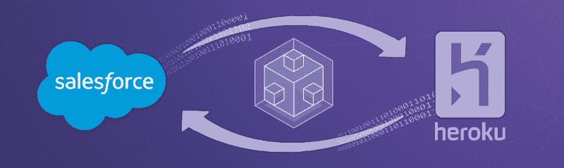
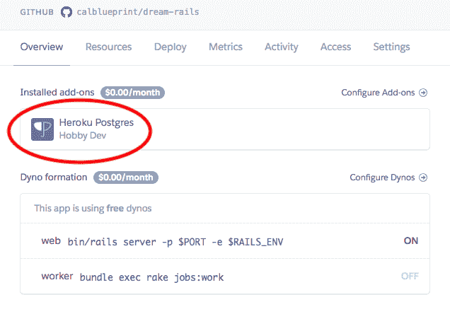
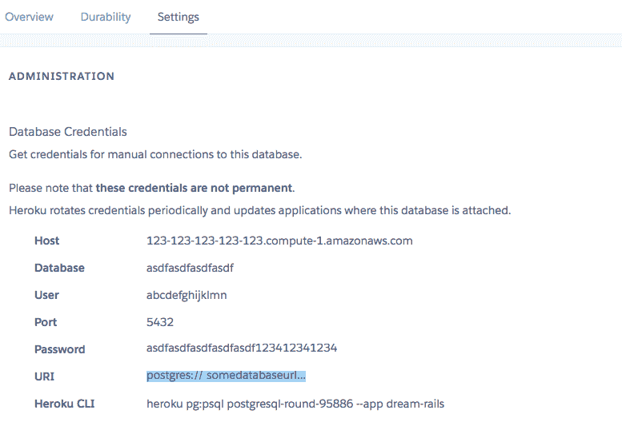
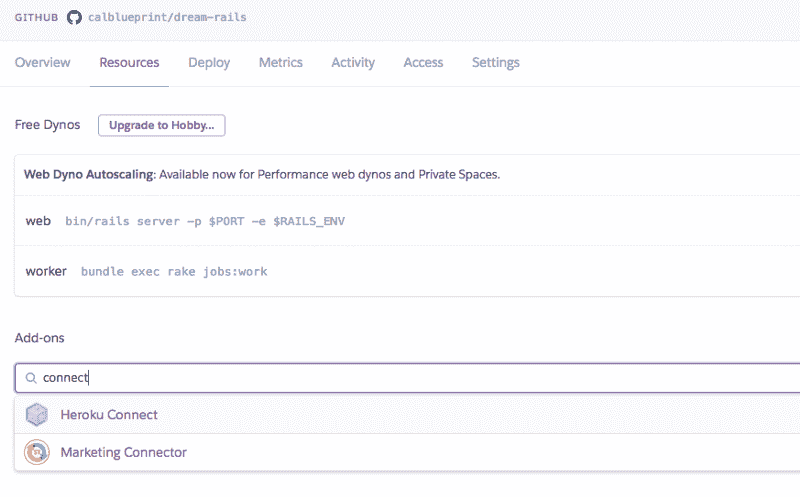
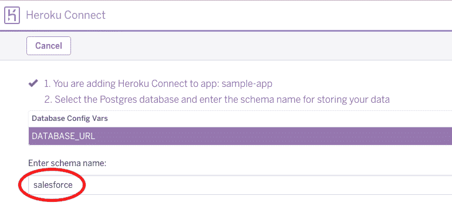
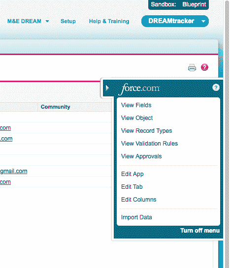
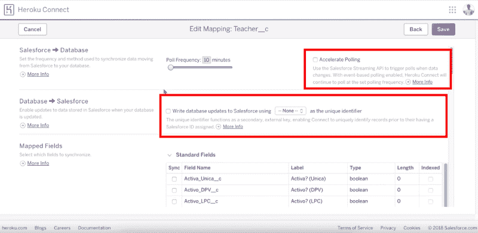
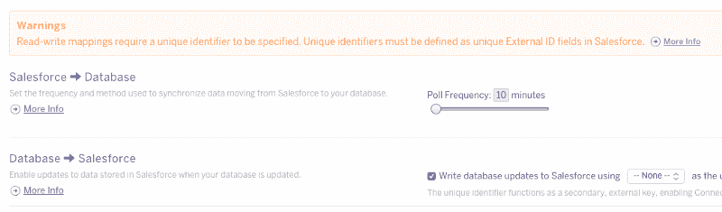
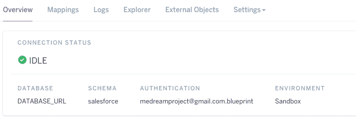

# Heroku Connect 的魅力:简化数据库同步

> 原文：<https://www.freecodecamp.org/news/the-beauty-of-heroku-connect-simplifying-database-synchronization-e57451d3b376/>

作者:威尔逊·王

# Heroku Connect 的魅力:简化数据库同步

我目前是加州大学伯克利分校的一个组织 [Blueprint](https://calblueprint.org/) 的开发人员。我们为非营利组织开发软件，为社会公益发展技术。在过去的一年里，我的团队致力于为[梦想项目构建一个解决方案。](http://www.dominicandream.org/)目标是为多米尼加共和国的儿童提供更好的教育。

我写这篇文章是希望分享我使用 Heroku Connect 为 Ruby on Rails/React 原生应用程序进行 Salesforce 集成的经验。

#### 什么是 [Heroku 连接](https://www.heroku.com/connect)？

> “Heroku Connect 使您能够轻松构建与您的 Salesforce 部署共享数据的 Heroku 应用程序。Heroku Connect 使用 Salesforce 和 Heroku Postgres 之间的双向同步，将您的 Postgres 数据库中的数据与 Salesforce 数据库中的联系人、客户和其他自定义对象统一起来。”

换句话说…

Heroku Connect 协助将您的应用程序的 Postgres 数据库替换为 Salesforce 数据库。当然，由于 Rails 应用程序本机连接到 Postgres，如果没有一些类似于 [Restforce gem](https://github.com/restforce/restforce) 的 API，您就不能立即调用和推送 Salesforce。

实际上，我们的 Rails 应用程序将与之交互的 Postgres 数据库是 Salesforce 的伪装。它是一个工作的中间人。所有数据在到达 Salesforce 之前必须经过它，反之亦然。Heroku Connect 是结合 Force.com 和 Heroku 能力的桥梁，不需要宝石。

您可能会问…为什么还要学习 Salesforce 集成呢？

嗯，Salesforce 集成简化了存储和检索数据的流程。尤其是企业的客户数据。

您可以为客户提供现代化的计算机系统，以改善用户体验和工作流程。你将加速应用程序的开发。它还创造了更好的工具，用于向管理层和销售人员通报业务绩效。

这有助于企业实现企业对消费者应用的高效运营。它通过即时和准确的更新做到这一点。

#### 灵感的样本项目

为了给教程中下面的代码片段提供一些背景，我将预先解释我正在做的项目。这个项目让我认识了 Heroku Connect。

以前，Dream 在 Salesforce 数据库中记录学生信息。这对于教师来说并不理想。为了让他们的生活更轻松，我们创建了一个用户友好的应用程序。该应用程序处理课程创建、学生注册和考勤。

由于梦想校园的网络连接很差，我们求助于 Heroku Connect 来持续同步更新。它在 Heroku Postgres 数据库端和 Salesforce 数据库端同步更新。

本演示中描述的所有代码都可以在我们的[项目报告](https://github.com/calblueprint/dream-rails)中获得。您还可以在这里查看应用程序的 React 端。

### 好了，让我们开始演示吧…

#### 概观

我将按照以下顺序来处理这个演示:

1.  技术描述
2.  设置(Heroku Postgres 和 Heroku Connect)
3.  Heroku 连接映射+注释
4.  对本地 Rails 应用程序的更改

#### 技术描述

*   Force.com([sales force 开发人员帐户](https://developer.salesforce.com/))
*   [Heroku 连接](https://www.heroku.com/connect)
*   Rails 应用程序(我的 Rails 版本是 5.1.4)

#### 设置:将应用程序部署到 Rails

设置好 Rails 应用程序后，您希望在 Heroku 上部署应用程序。以下是部署应用程序的快速流程:

1.  登录你的 Heroku 帐户，你将被重定向到右上角的仪表板。您将在右上角看到一个“新建”按钮，用于创建一个新项目。键入您的自定义应用程序名称并创建您的应用程序。
2.  您将被重定向至新应用的部署页面。向下滚动到底部的“使用 Heroku Git 部署”部分按照页面上的说明进行操作。(注意:添加 Heroku Git 遥控器后，您可以随时更新 Heroku 应用程序。您通过添加和提交您的更改并最终执行 git push **heroku** master 来进行更新。)

最有可能的是，如果这是您的第一次，您将面临一个错误:“Heroku 部署失败，因为 sqlite3 gem 错误。”这是因为 Heroku 使用 Postgres 而不是 sqlite3。要解决这个问题，请查看这个[堆栈溢出帖子](https://stackoverflow.com/questions/13083399/heroku-deployment-failed-because-of-sqlite3-gem-error.)。

#### Heroku Postgres

部署好你的应用程序后，你的概览页面应该有附加组件 Heroku Postgres。这是你部署 Heroku 应用程序的常用数据库。

Add-ons like Heroku Postgres or Heroku Connect appear in the Overview tab or Resources tab.

单击此附加组件以在设置选项卡中检查 URL 数据库信息。确保将 Postgres 数据库 URL 添加到 Rails 应用程序中。

要添加数据库 URL，您可以使用 [Figaro](https://github.com/laserlemon/figaro) gem 创建一个环境变量:

或者只在 database.yml 文件中包含一个 URL 变量:

#### Heroku 连接

接下来，单击配置附加组件或资源选项卡，并搜索 Heroku Connect。单击“设置”添加附加组件。

然后，您将被重定向到下面的屏幕。注意，目前模式名为“salesforce”(也可以随意更改)，您可以继续了。

单击设置连接。输入您的 Salesforce 用户信息以建立具有适当详细信息的连接。

您现在已经完成了设置！现在我们可以继续映射了。

#### 绘图

我录制了一个为教师对象创建映射的短视频:

该视频是建立映射的演练。我想进一步解释一些我个人感到困惑的事情。读完这些说明后，我建议重新观看视频，以便更好地理解。

#### 1.__c '

你可能会问为什么有这么多的“__c”被附加在我的教师对象和教师字段的末尾。嗯，Salesforce 实际上将它附加到每个自定义类/字段。

因此，回到我的 Rails 项目，表名现在是 *Teacher__c* 而不是 Teacher，列/字段的名称也从名字、姓氏更改为*名字 __c* 、*姓氏 __c* 。一些默认字段如 *sfid* 或 *createddate* 不是自定义的，所以它们不需要附加“__c”。

#### 2.自定义字段

那么，如何创建自定义字段呢？嗯，实际上在你屏幕的右边有一个小箭头供你编辑对象和字段。

Click on view object/fields to modify them respectively.

每次修改后，记得检查是否还需要修改 Heroku Connect 映射。

#### 3.双向同步

我想指出 Heroku Connect 双向同步的两个非常酷的特性。第一个是轮询频率，它规定您希望 Postgres 数据库以 Salesforce 更新的频率。选中加速轮询框使得大多数操作几乎是即时的。

第二部分是关于从 Postgres 数据库推送数据以与 Salesforce 数据库同步的部分。您必须选中该框才能使用该功能。但是，紧接着，您很可能会看到弹出的警告:

“Warning: Read-write mappings require a unique identifier to be specified.”

这是一层保护，确保您不会意外地创建重复的对象。如果你有一个唯一的标识符就太好了(在视频中，每个老师都有一个唯一的电子邮件，所以我把它作为我的标识符)。否则，您可以跳过它，仍然有一个功能性的 Heroku Connect 映射。但是，您可能希望对应用程序进行编程，以便在创建对象之前仔细检查现有记录。

#### 对本地 Rails 应用程序的更改

现在，您已经将 Heroku 连接好并设置好了，是时候在与您的 Salesforce 数据交互之前进行快速本地调整了。

总的来说，您将看到您的方案的名称，在本例中为“salesforce”。如果您在配置阶段选择了不同的名称，该名称将显示在这里。

因为我的 Rails 应用程序的表名仍然是 Teacher，所以我需要将其更改为 *Teacher__c* 以正确引用 Salesforce 数据。我必须将表名改为格式*模式名*。 *object_name* 或 *salesforce.teacher__c* 来反映这些变化。

另一个值得注意的变化是，如果你的模型有经过验证的语句，比如我的老师模型。在 validates 关键字之后，我们仍然有旧的字段名，如不带“__c”的 first_name 和不带“__c”的 last_name。我们需要通过将“__c”附加到旧的字段名或创建单独的方法来更改这些名称:

然后，在 Salesforce 中创建一些对象，并打开您的 Rails 控制台来检索这些信息。(在视频中，我调用 Teacher.all 在我的 Rails 控制台中显示所有 Salesforce 教师对象。)信息也应该反映在 Heroku Connect explorer 中。

### 反射

我花了大半个学期试图搞清楚 Salesforce 的整合。我做了大量的研究，尝试了不同的解决方案，并获得了大量的支持。最后，使用 Salesforce/Heroku/Rails 的酷功能是一次非常有启发性的经历。我也学到了作为一名开发人员我成长了多少，并反思了我的优点和缺点。

通常人们会实施他们找到的第一个解决方案。他们这样做，却不明白为什么是好是坏。在发现 Heroku Connect 之前，我研究并计划了三个独立的解决方案。通过这件事，我意识到在解决之前权衡不同解决方案的利弊是多么重要，即使更多的时间花在研究而不是实施上。

利用这些知识，我和我的团队开发了一个应用程序，帮助教师为多米尼加共和国学校的学生提供优质教育，这些学校的互联网连接很差。我们学会了在困难的时候坚持不懈，因为我们知道，尽管每一次漫长的工作会议，每一次错误修复，每一行代码，我们都有一个使命，而前进的每一步都是朝着改善世界迈出的又一步。

这一经历帮助我真正区分了目标和做好工作的重要性，而不是立即使用最快的方法。每个解决方案都值得研究其利弊。这完全取决于韧性和韧性。

所以对所有的开发者来说，无论你处于什么情况，都不要放弃。不要害怕尝试新的解决方案和失败。保持积极乐观的心态！

Wilson Wang 是加州大学伯克利分校计算机科学和数据科学专业的大三学生。他对开发改善商业客户关系的软件感兴趣。除了技术，威尔逊还热衷于武术、建筑设计和风景摄影。

#### 感谢阅读！要了解更多关于 Blueprint 的信息，请关注我们的[脸书](http://facebook.com/CalBlueprint)和 [Instagram](https://www.instagram.com/calblueprint/) ，并访问我们的[网站](https://calblueprint.org/)！