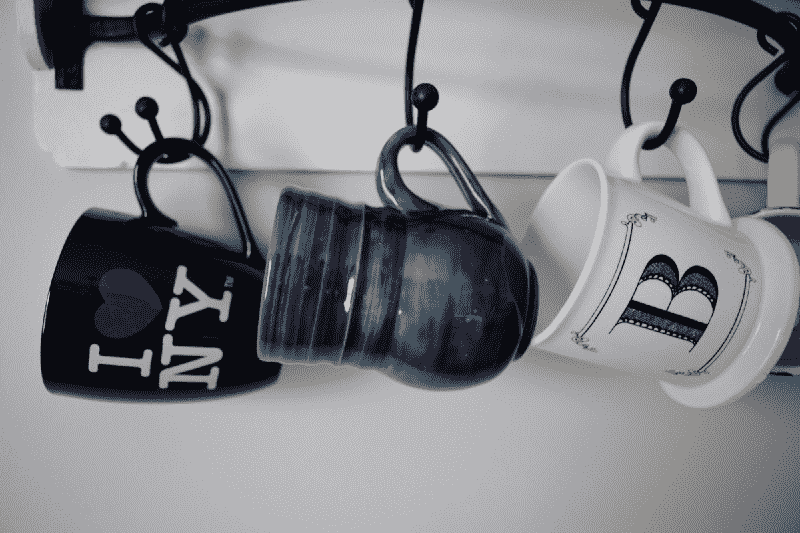
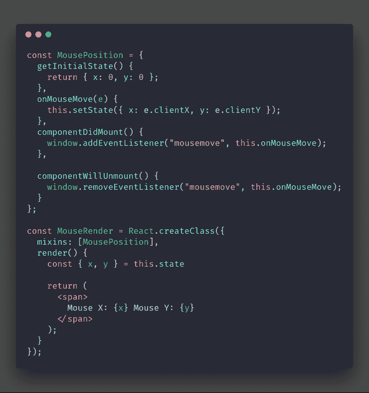
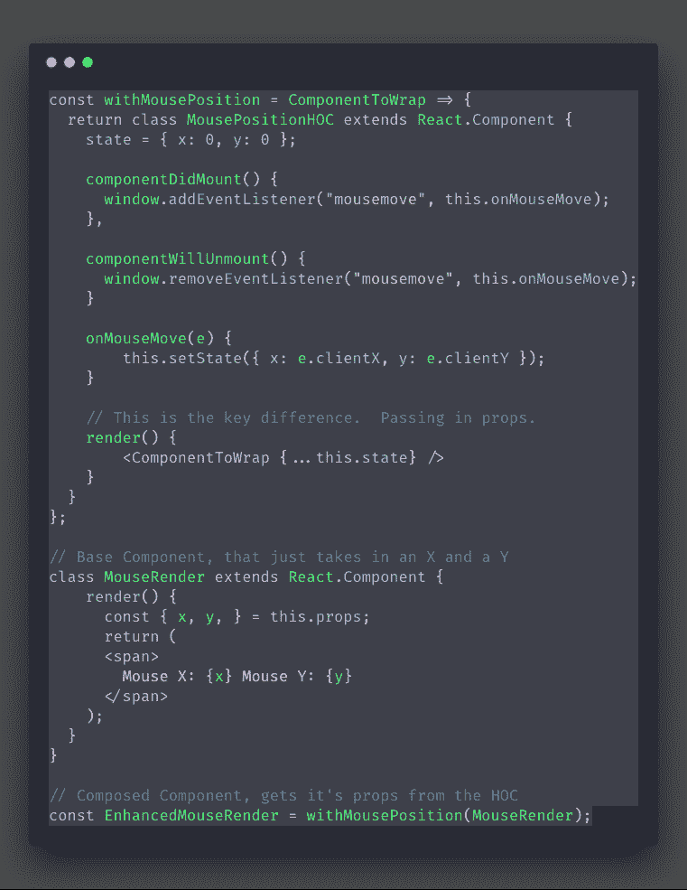
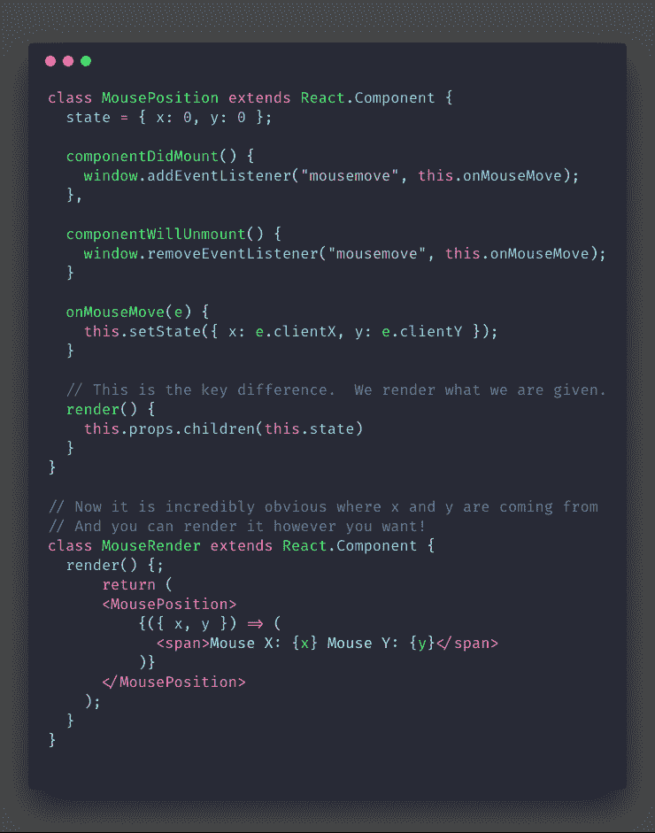
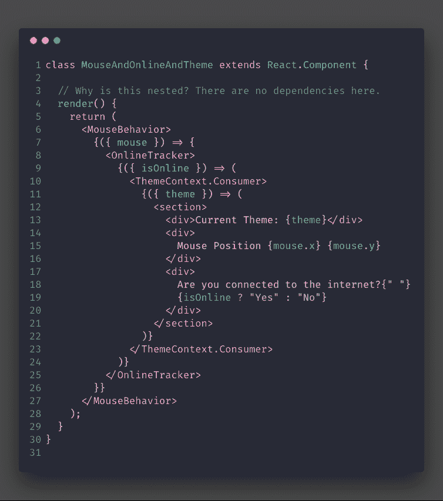
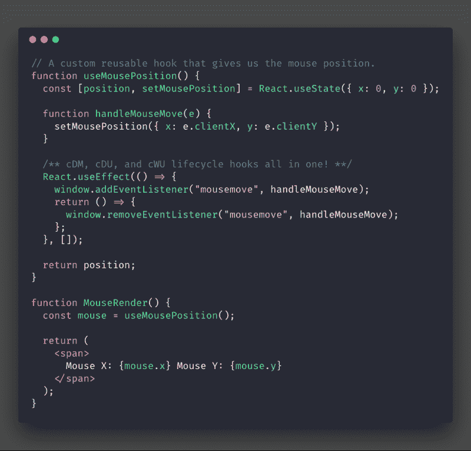

# 为什么反应钩子，我们是怎么到这里的？

> 原文：<https://www.freecodecamp.org/news/why-react-hooks-and-how-did-we-even-get-here-aa5ed5dc96af/>

瑞安·尤尔卡宁

# 为什么反应钩子，我们是怎么到这里的？

“three hanged assorted-color ceramic mugs” by [Chris Scott](https://unsplash.com/@chris_j_scott?utm_source=medium&utm_medium=referral) on [Unsplash](https://unsplash.com?utm_source=medium&utm_medium=referral)

**TL；DR:** Hooks 已经从混音、高阶组件和渲染道具的权衡中吸取了经验，为我们带来了新的方法来**创建** **包含的、可组合的行为**，这些行为可以以****平面和声明的方式使用。？****

**然而，钩子有自己的价格。它们不是解决问题的灵丹妙药。有时候你需要层次。所以让我们仔细看看。**

**[React 钩子](https://reactjs.org/docs/hooks-overview.html)在这里，我立刻喜欢上了它们。为了理解为什么钩子是伟大的，我想看看我们是如何解决 React 历史上的一个常见问题会有所帮助。**

**情况是这样的。你要显示用户的鼠标位置。？**

**

“Well that was easy!”** 

#### **⚠️然而，这也有可能反过来咬我们一口。**

*   **如果在另一个组件中需要鼠标移动行为，您必须重写相同的代码。**
*   **如果再加上更多这样的行为，乍一看会变得更难理解。这是因为行为的逻辑分布在`componentDidMount`和`componentWillUnmount`之间？**

**但是我们是工程师，我们有大量的工具来帮助我们打破这种模式。让我们回顾一下历史上的一些做法及其利弊。？**

### **混合蛋白**

**混血儿受到了很多指责。他们为将生命周期挂钩组合在一起描述一个效果做好了准备。**

****

**虽然封装逻辑的总体想法很棒，但我们最终还是从 mixins 中学到了一些重要的东西。**

**不清楚`this.state.x`从何而来。对于 mixin，mixin 也有可能盲目地依赖于组件中存在的属性。**

**随着人们开始包含和扩展大量的 mixins，这就成了一个大问题。你不能简单地在一个文件中搜索，然后假设你没有在其他地方破坏什么东西。**

**重构需要简单。**这些混进的行为需要更明显的不属于组件。**他们不应该使用组件的内部构件。？‍**

### **高阶组件**

**我们可以实现类似的效果，并通过创建一个传入道具的容器来使它不那么神奇！继承的主要缺点是它使重构变得更加困难，所以让我们试试复合吧！**

****

**虽然这是更多的代码，但我们正朝着正确的方向前进。我们拥有混合蛋白的所有好处。现在我们有了一个不再与订阅行为紧密耦合的`<MouseRender` / >组件。**

**但是如果我们想渲染一些不同的东西呢？我们总是需要制造一个新的组件吗？**

### **将道具和孩子渲染为一个函数**

**这是一直摆在我们面前的模式。我们想要的只是一个处理鼠标移动行为的组件，以及呈现我们想要的任何内容的能力。**

****

#### **这种微妙的差异有一些非常棒的好处**

*   **现在非常明显的是什么提供了`x`和`y`。您还可以轻松地重命名它们，以防止名称冲突。**
*   **我们可以灵活控制渲染的内容。我们不需要制作新的组件，如果我们决定这样做，这只是一个简单的复制粘贴。**
*   **您可以在组件呈现函数中直接看到所有这些。这是显而易见的，新开发人员很容易识别。在这里结帐。**

**这种模式的主要问题是你的组件在渲染时会嵌套很多这样的元素。一旦你开始嵌套多个渲染道具组件，就很难推理到底发生了什么。**

**此外，它还造成了一种虚假的等级感。仅仅因为一个行为“嵌套”在另一个行为之下，并不意味着它依赖于父行为。以这个片段为例。**

**

Reminds me of callback hell** 

**要是有一种简单明了的方式拥有所有这些能力就好了。？**

### **钩住**

**如果我们能去掉嵌套，把所有东西都泡到顶部会怎么样？这样，我们的渲染函数中唯一的 JSX 就是纯粹的渲染逻辑。**

**

It’s so beautiful…** 

**这就是我想要的一切。**

*   **行为不仅在它自己整洁的小包装中，`useEffect`阻止了它在三个不同的生命周期挂钩中传播**
*   **组件从哪里获取这些数据是非常清楚的，它整齐地位于渲染函数中。**
*   **无论我需要引入多少，我的代码都不会变得越来越嵌套。**

**Sunil Pai 在下面的推文中使用了一些巧妙的突出显示来说明钩子不仅可以减少代码总量，还可以将相关部分组合在一起。**

### **然而，还是有一些问题**

**当使用钩子时，你必须记住一些规则，这些规则乍一看可能很奇怪:**

#### **⚠️你应该在渲染函数的顶层调用钩子。**

**这意味着没有条件挂钩。我们与 React 的合同是，我们将每次以相同的顺序调用相同数量的钩子。**

**当你比较 Mixins 和 HOCs 的工作方式时，这个规则开始变得更有意义。您不能有条件地使用它们并在每次渲染时对它们重新排序。**

**如果你想要条件效果，你应该把你的钩子分割成其他组件，或者考虑不同的模式。**

#### **️️⚠️ **你只能在 React 函数组件和自定义钩子中使用钩子。****

**我不确定是否有任何技术上的原因不尝试在常规函数中调用它们。这确保了数据在组件文件中始终可见。**

#### **⚠️**component did catch 或 getSnapshotBeforeUpdate 没有钩子原语。****

**React 小组说他们已经在路上了！**

**对于 componentDidCatch 用例，您可以创建一个错误边界组件，getSnapshotBeforeUpdate 有点棘手，但幸运的是非常少见。**

### **一些最后的笔记**

**我毫不怀疑 hooks 将会改变我们看待事物的方式，并动摇一些最佳实践。兴奋和图书馆出来的数量是鼓舞人心的！**

**然而，我在过去已经看到了对所有这些设计模式的大肆宣传。虽然大多数最终成为我们工具箱中非常有价值的工具，但它们都是有价格的。**

**我仍然没有完全理解钩子的权衡，这让我害怕。我强烈建议和他们一起玩，通过例子来学习。不过，在对它们进行全面重写之前，您可能需要等待一段时间？**

**如果您有任何问题或正在寻找一对一的 React 指导，请随时给我发推特**@ yurkaniryan**！**

**如果你喜欢我的写作风格，这里有一些我写的其他文章。**

**祝你好运，编码快乐！！？**