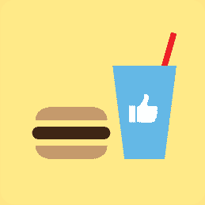
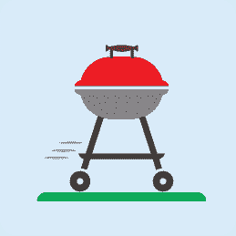

# 构建你的第一个网络应用的 6 个荒谬想法

> 原文：<https://www.freecodecamp.org/news/6-absurd-ideas-for-building-your-first-web-application-24afca35e519/>

凯文·科诺年科

# 构建你的第一个网络应用的 6 个荒谬想法

#### 需要一些构建简单 web 应用程序的想法吗？这 6 个例子将帮助你练习所有的关键技能，并从中获得乐趣！

好了，你已经学习了前端 web 开发，现在你正期待着在下一个大挑战中展示你的开发者肌肉:全栈 web 应用。你可能有许多雄心勃勃的项目想法在你的脑海里打转。但是，以您目前的技能，您如何确定哪些是合理的呢？

以下是你的第一个 web 应用程序的 6 个不同寻常的想法，这将帮助你获得全栈 web 开发的所有基本概念的经验。最后，你会有一个独特的项目，你可以把它放在你的文件夹里。这将帮助你在所有其他人正在建设的无聊项目中脱颖而出。

*注:如果你还在学习 HTML/CSS/JS，我整理了 [8 个思路](https://medium.com/@kevink/8-crazy-ideas-for-building-a-web-site-a25b3f69c517#.3fp6yvrcw)仅供练习前端。*

### 1.快餐大师

想法: [Yelp](http://www.yelp.com/) 是一个非常受欢迎的餐馆评论来源。然而，大多数人用它来了解他们以前从未听说过的餐馆。像麦当劳和汉堡王这样的大型快餐连锁店呢？很多人去这些网站，但不知何故，他们并不是受欢迎的复习候选人。

是的，你可能会告诉我，每份菜单都大同小异，食物的味道也总是一样。然而，如果你去过许多这样的连锁“餐馆”，你就会知道有些东西差别很大。

哪个有最豪华的浴室？哪家餐馆提高了菜单价格？哪些地方凌晨 1 点有搞笑的酒鬼？这将是那些被认为是一致的快餐连锁店的评论网站。

**站点类型:**评论

**按键功能:**

*   能够创建一个带有图片，用户名和位置的帐户
*   使用谷歌地图，用户可以通过在地图上搜索一个位置，或者通过输入一个名字并从列表中选择(提前输入)来选择一家特定的餐馆
*   允许用户撰写评论
*   允许用户按 1-5 分制对以下快餐特定主题进行评级:浴室质量、员工、清洁度、免下车时髦度、送货速度
*   向评论添加图片的能力
*   从响应式设计到移动设备

**关键特性决策:**

*   这是一个严肃的网站，还是真的是关于在快餐店发生的有趣的事情？
*   谁会使用这个网站？自驾游的人想要选择一个午餐地点？经常光顾快餐店的人希望分享他们的经历？
*   这应该是一个人们经常查看有趣的故事并参与其中的社区吗？还是更多的一次性，不经常使用？
*   什么样的社交媒体整合可能有助于传播故事/评论？

**你将学到什么:**用户系统和图片存储是两大挑战。这将是实现每一个基本版本的好机会。此外，如果你选择使这个网站成为一个幽默导向的网站，你的设计如何影响一个适当水平的不下流的幽默？如果你想获得一个追随者，这将是一个很好的测试，看看你可以在哪里找到当前的快餐评论，以播种你的数据库并创建即时内容。

### 2.格里尔伯

是的，你猜对了。烤架用优步。如果你住在城市，你可能没有地方放烤架，也没有安全的地方锁起来。例如，如果你住在一栋公寓楼的 20 层，你可以把你的烤架放在哪里？

烤架租赁送货服务 GrillBer 解决了问题。这将允许顾客在没有后勤的情况下进行野炊。事实上，您可能希望包括一卷草皮和椅子，这样您的客户就可以在停车位上创建一个[弹出式公园](http://inhabitat.com/parking-day-2014-the-most-amazing-pop-up-parks-from-san-francisco-and-beyond/)！

**站点类型:**交付/物流

**按键功能:**

*   表单允许用户以特定的小时费率预订特定小时数的烧烤，并将其存储在数据库中。用户必须输入他们的姓名，地址等。
*   显示烤架可用的不同时间的日历。查看 [Zipcar](http://www.zipcar.com/) 的例子。
*   产品详情页面，展示烤架，并告诉你更多不同的附加产品，如椅子和草皮。
*   社交媒体与 Instagram 的整合，显示了人们与 GrillBer 举行的所有令人敬畏的野餐。
*   一个结帐过程和支付系统与[条](https://stripe.com/)所以用户可以完成这个过程。

**关键特性决策:**

*   这不需要像优步那样有视觉刺激。但是它甚至需要一个很酷的交互日历吗？或者像电商网站这种基本形式能蒙混过关吗？
*   在烧烤过程中，你会主动提出解决多少难题？你希望用户清理烤架吗？这些是更便宜但更慢的木炭烤架，还是更贵的气体烤架？
*   野炊应该是一种低压力的体验。如果人们不得不匆忙烹饪食物，这将不是一个很好的体验。你如何使用复印和缩微复印来清楚地说明这不会是一个紧张的过程？
*   预订系统的后端需要什么样的逻辑？烤架交付前后需要留出半小时吗？

**您将学到:**如何协调预订系统的前端和后端。想想有多少网站这样做。餐馆预订网站。会议室预订网站。还有很多。这是一个很常见的模式，也是一个很大的成就，可以放在你的简历上供讨论。

### 3.网络 Tap

想法:社交媒体是一种越来越受欢迎的广告策略。公司使用 Twitter、脸书、LinkedIn 和 Pinterest 来联系正在浏览的客户。然而，还有一个未开发的空间:用户的实际帖子。

广告商喜欢口口相传的营销，让用户自己发布实际的广告将是一个在他们的新闻提要中迷惑他人的好方法！

这个网站将允许想赚点外快的用户自愿提供自己的信息，广告商也可以用广告来短暂地劫持帖子。用户通过每次观看或其他方式获得报酬。现在，广告可以用新的和创新的方式吸引眼球！

**站点类型:**市场

**按键功能:**

*   个人用户必须能够创建一个账户，包括位置、年龄、兴趣和家庭状况等信息，这样广告商就可以选择他们想发布产品的人
*   广告商必须能够创建一个帐户，并张贴他们的品牌身份，以及他们希望达到谁。
*   每个用户必须能够接触到广告客户，谈论他们对发帖的兴趣。
*   每个广告商必须能够通过年龄，性别等标准搜索所有用户。并向他们所选择的人群发送大量关于做广告的兴趣的信息。
*   用户和广告商必须就付费方式达成一致:按赞付费、按次付费、按点击付费或其他。

**关键特性决策:**

*   搜索功能对广告商来说将是一件大事。如何表示每个搜索结果？可能想使用像谷歌分析数据可视化。
*   你如何从用户那里获得最多的信息？与社交媒体账户整合？或许根据他们提供的信息多少付给他们更多？
*   广告主和用户之间有哪些权力动态？用户得到广告文本和图片的输入了吗？还是广告商决定了放映什么？
*   人们不会希望每周从中获得 10 美元。他们可能想要至少 100 美元。你如何平衡他们可能需要展示的广告数量呢？没有人想完全污染他们的新闻源。
*   你希望广告有多狡猾？应该是显而易见的，还是感觉更像一个真实的帖子？

你将学到的:市场是另一种非常受欢迎的网站。这个将让你创建两种类型的账户，这是一个常见的结构。网站内的消息传递将是一个很好的学习技巧。查看 [Fiverr](http://www.fiverrr.com) 的例子。

### **4。修理我的船**

**想法:**这是“修复我的关系”的简称。这是一个论坛，用户可以发布他们的关系问题，其他人可以就如何解决他们的问题提出建议。

如果你体验过 4chan、Reddit 或 Bodybuilding.com 等网站上的优秀社区，你就会知道有很多人愿意贡献几分钟时间来帮忙。

**网站类型:**论坛

**按键功能:**

*   类似于 Reddit 或 Quora 的帖子/评论系统。
*   帖子和评论的投票系统
*   一个机会，让用户张贴他们实际尝试与他们的另一半，以及什么结果随之而来
*   一个徽章或因果系统，以奖励经常向上投票的用户
*   一个用户帐户系统，为那些想评论或张贴，类似于 Reddit

**关键特性决策:**

*   这应该像 Reddit 一样更加匿名，还是为了可信度而绑定到 Quora 这样的社交媒体账户？
*   这个网站上会有很多巨魔。你是怎么处理的？
*   这应该与浪漫关系严格相关吗？还是友谊？
*   你如何使用徽章系统来激励特别好的评论者回来？

**你将学到什么:**如何建立一个论坛！此外，有很多人愿意贡献几分钟时间来帮助有需要的网络陌生人。说真的。你的主要挑战是确保这些有用的用户感到他们的努力得到了回报，因为这将激励他们回来。

### 5.猫战

想法:猫咪视频非常受欢迎。一种特别独特的猫视频形式是业余战斗，两只猫以最小的后果进行争斗，但有大量的喵喵叫和摔跤。

这个网站将允许用户上传他们的猫摔跤的视频，并允许观众提供有趣的评论。这个网站也不允许职业猫战，或有可怕结局的战斗。这是严格的休闲娱乐，而不是侵犯动物权利。

**站点类型:**视频内容

**按键功能:**

*   任何人都可以上传猫咪视频
*   用户可以创建一个匿名帐户并添加评论。
*   在战斗开始前，用户点击每只猫来猜测胜利者的截图
*   最佳视频和最佳评论的向上投票
*   能够报告恶意视频，或那些似乎是上演

**关键特性决策:**

*   为什么有人会在这里而不是 Reddit 或 YouTube 上发布他们的斗猫视频？你需要添加几个功能来区别于这些网站。
*   你如何让这个网站在爱猫人士社区中受欢迎？爱猫人士不喜欢暴力，但他们喜欢猫的幽默。
*   这个网站要不要复制[热不热](https://en.wikipedia.org/wiki/Hot_or_Not)的动态？你如何为观众创造超越 YouTube 的独特观看体验？或许是用户发帖记录下的比赛实况？

**你将学到什么:**在数据库中存储视频是一项很好的学习技能。此外，复制 YouTube 的动态将是其他人会清楚理解的良好做法。在网站上获得正确的幽默语气也是一个很好的挑战。

### 6.CouponBank

想法:有很多网站允许人们一对一地交换优惠券。但是优惠券的“T2”长尾“T3”呢？换句话说，罕见或模糊的优惠券可能不会在更主流的优惠券网站上流行。如果对方没有你想要的优惠券呢？反正优惠券基本就是钱。

你需要一家银行来处理市场中的这种错配。比方说，这家银行会要求 20 美元的初始存款。然后，你要的每一张优惠券都会从你的账户中扣除。你能够成功送出的任何优惠券都将被记入贷方。

**站点类型:**点对点借贷

**按键功能:**

*   用户必须能够创建一个账户，然后存入 20 美元的托管，可以随时取出。这是抵押品。您可以使用 Stripe 来处理此事务。
*   用户可以上传优惠券的照片。该网站必须自动确定产品，以及优惠券的金额。如果它不能解决问题，它必须提示用户。谷歌的[云视觉 API](https://cloud.google.com/vision/) 应该有助于这一点。
*   当用户请求优惠券时，原始海报必须邮寄给他们。优惠券的金额被记入原始发布者的账户，并从请求者的账户中被借记。
*   一旦某人的账户达到 0 美元，他们就不能再要求任何优惠券，直到他们自己交易一些或者增加更多的钱。
*   该网站通过从每笔交易中抽取一小部分来创收。

**关键特性决策:**

*   如何让上传大量优惠券变得尽可能简单？对于这一点，云视觉 API 将是一件大事。
*   你如何让人们发送优惠券变得尽可能简单？如果用户需要通过邮件发送许多优惠券，他/她将会精疲力尽。
*   如何让搜索过程尽可能简单？如果有人可以上传一张收据，而你可以查看清单上的商品是否有优惠券，那会怎么样？

**你将学到什么:**这一条包含了一些点对点借贷的关键概念，尽管风险要低得多。这是对你关注用户体验的极大考验。全美有数百万人有空闲时间，正在寻找一种简单的方法来赚点外快。你如何让你的网站成为一个绝佳的选择呢？

#### 发挥创造力

不要觉得有义务和其他人一样构建相同的项目。当你在模仿时，很难在市场上获得竞争优势。

即使这些建议中的一个对你没有帮助，你也应该考虑建立一些项目，这些项目可以创造一点个性，让你与众不同。

正如塞思·戈丁所说，“在拥挤的市场中，合群是一种失败。在一个繁忙的市场中，不引人注目就等同于被忽视。”

你喜欢这样吗？给它一个赞，让我在评论中知道！

此外，如果您正在寻找使 HTML、CSS 和 JavaScript 变得简单的可视化编码教程，请在此注册我的时事通讯: