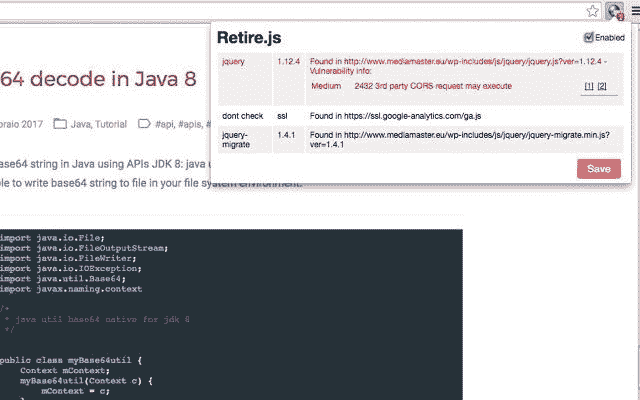
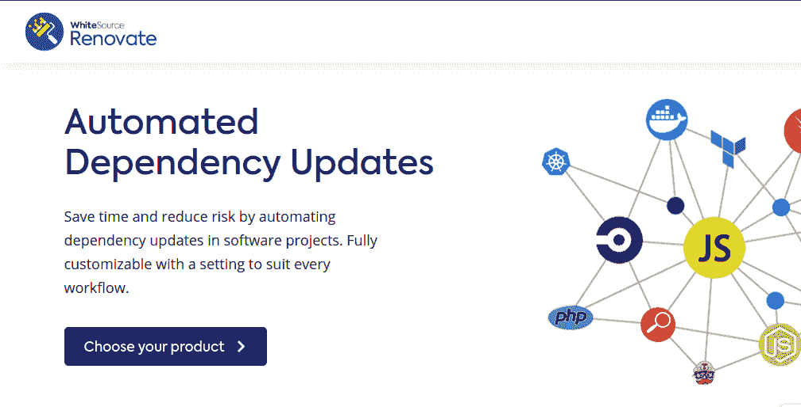
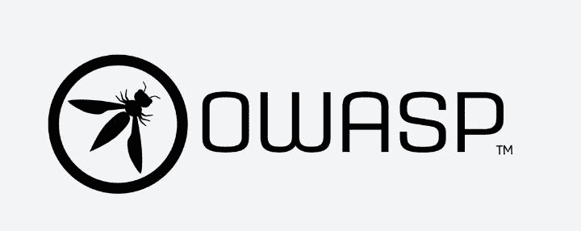
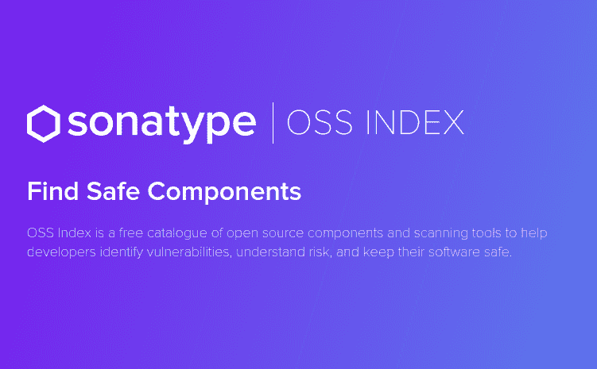
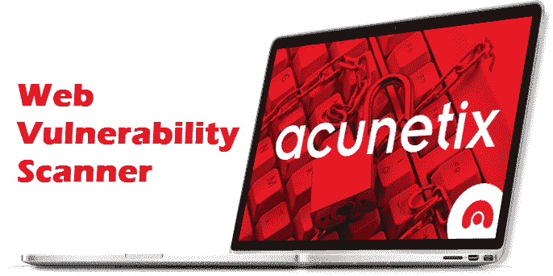
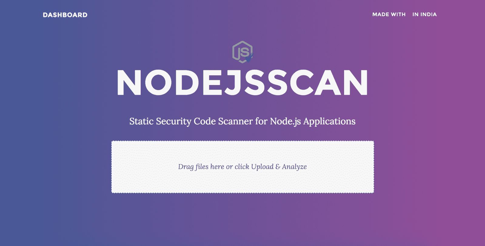

# 可以用来检查 Node.js 漏洞的 6 个工具

> 原文：<https://www.freecodecamp.org/news/6-tools-you-can-use-to-check-for-vulnerabilities-in-node-js/>

所有产品中都可能存在漏洞。您的软件越大，潜在的漏洞就越多。

漏洞为利用创造了机会，这可能会破坏用户体验和产品本身。

此外，在当今快节奏的世界中，随着公司要求快速开发(或更新)流程，漏洞率也在增加。剥削者无处不在，伺机利用他们。

这就是为什么尽早检查应用程序中的漏洞非常重要。这可以帮助您确保最终产品是安全的，并且从长远来看可以节省您大量的时间。

在本文中，我们将研究六种工具，它们将帮助您检查 Node.js 中的漏洞。

## Node.js 中的漏洞

安全漏洞在 [Node.js](https://nodejs.org/en/) 中非常常见。作为开发人员，我们继续使用[开源工具](https://opensource.com/tags/javascript)，因为我们不想重新发明轮子。这使得我们的开发更加容易和快速，但同时也给我们的应用程序带来了潜在的漏洞。

我们能为自己做的最好的事情就是不断地验证我们使用的包，因为我们使用的依赖越多，就有越多的空间存在更多的漏洞。

手动检查依赖关系可能会有压力，并且会增加开发时间。在安装软件包之前上网找出它的漏洞是非常耗时的，尤其是对于一个有许多依赖关系的应用程序来说。

这就是为什么我们需要自动化工具来帮助我们完成这个过程。

## Node.js 漏洞检查工具

### 1.Retire.js

[Retire.js](http://retirejs.github.io/retire.js) 帮助开发者检测 Node.js 应用中存在已知漏洞的库或模块版本。

它有四种用途:

*   用于扫描 Node.js 应用程序的命令行扫描器。
*   一个 Grunt 插件(`grunt-retire`)，用于扫描支持 Grunt 的应用程序。
*   浏览器扩展(Chrome 和 Firefox)。这些程序会扫描访问过的站点，查找对不安全库的引用，并在开发人员控制台中发出警告。
*   Burp 和 OWASP Zap 插件，用于渗透测试。

### 2.WhiteSource 翻新

WhiteSource Renovate 是 WhiteSource 开发的一款多平台、多语言的开源工具，可以在软件更新中执行自动化的依赖性更新。

当依赖项需要更新时，它提供了诸如自动拉请求的特性，支持多种平台，易于修改，等等。所有变更日志和提交历史记录都包含在应用程序的每次更新中。

它可以以多种方式使用，例如:

*   一个命令行工具，用于自动将依赖项更新为无懈可击的依赖项。
*   Github 应用程序，用于在 GitHub 存储库上执行自动化过程
*   GitLab 应用程序，用于在 GitLab 存储库上集成自动化流程

white source renew 还有一个内部解决方案，它扩展了 CLI 工具以添加更多功能，从而使您的应用程序更加高效。

### 3.OWASP 相关性检查

依赖检查是一个用于管理和保护开源软件的[软件组合分析(CPA)](https://en.everybodywiki.com/Software_Composition_Analysis) 工具。

开发人员可以使用它来识别 Node.js、Python 和 Ruby 中公开披露的漏洞。

该工具检查项目的依赖项，以收集关于每个依赖项的信息。它确定对于给定的依赖项是否有[公共平台枚举(CPE)](https://en.m.wikipedia.org/wiki/Common_Platform_Enumeration) 标识符，如果找到，它生成相关联的[公共漏洞和暴露(CVE)](https://cve.mitre.org/) 条目的列表。

依赖检查可以作为一个 CLI 工具，一个 [Maven](https://en.m.wikipedia.org/wiki/Apache_Maven) 插件，一个 [Ant 任务](https://ant.apache.org/manual/Tasks/ant.html)和一个 [Jenkins 插件](https://en.m.wikipedia.org/wiki/Jenkins_(software))。

### 4.OSS 指数

OSS 索引允许开发者搜索数百万个组件，以发现易受攻击和不受攻击的组件。这让开发人员确信他们计划使用的组件受到了很好的保护。

它们还为开发者提供各种工具和插件，用于像 JavaScript 这样的编程语言。

这使他们能够扫描项目的开源漏洞，并将安全性集成到项目的开发过程中。

### 5.阿丘廷克

Acunetix 是一个 web 应用程序安全扫描器，它允许开发人员识别 Node.js 应用程序中的漏洞，并使他们能够修复漏洞以防止黑客攻击。它带有一个 14 天的测试应用程序的试用期。

使用 Acunetix 扫描 web 应用程序的好处很多。其中一些是:

*   测试超过 3000 个漏洞
*   恶意软件和网络钓鱼 URL 的外部链接分析
*   扫描 HTML、JavaScript、单页应用程序和 web 服务

### 6.NODEJSSCAN

[NodeJsScan](https://github.com/ajinabraham/NodeJsScan) 是一个静态的安全代码扫描器。它用于发现 web 应用程序、web 服务和无服务器应用程序中的安全漏洞。

它可以用作一个 [CLI](https://en.wikipedia.org/wiki/Command-line_interface) 工具(允许 NodeJsScan 与 CI/CD 管道集成)，一个基于 web 的应用程序，也有一个 Python API。

## 结论

Node.js 应用程序的包、库和组件定期发布，它们是开源的这一事实为漏洞留下了空间。无论您使用 Node.js、Apache Struts 漏洞还是任何其他开源框架，都是如此。

开发者需要注意新发布的包中的漏洞，并且知道什么时候需要更新包。上面的工具可以简化创建高效可靠产品的过程。