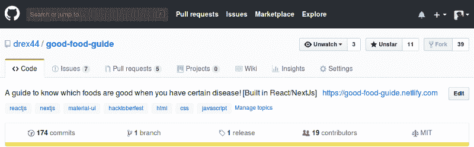
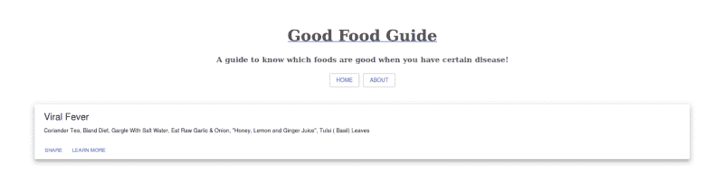
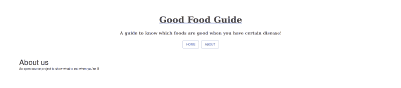
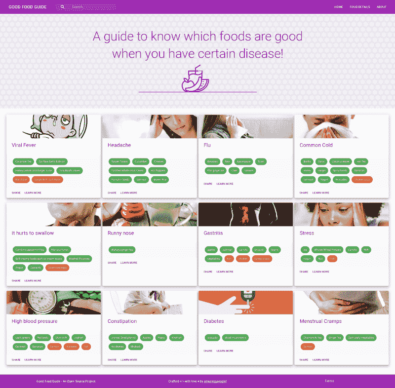
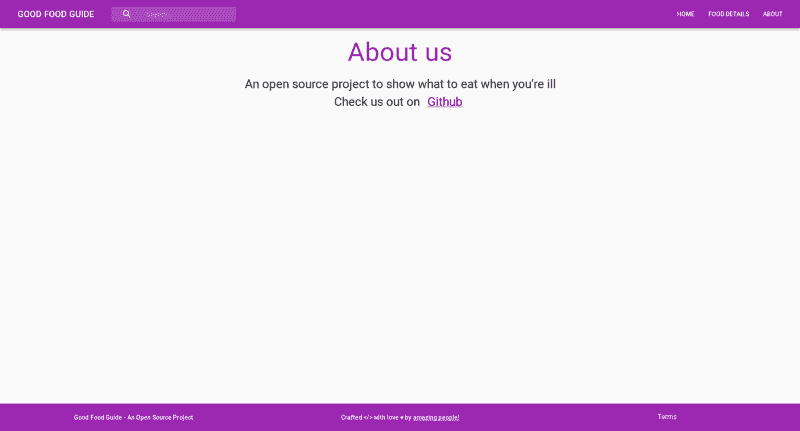
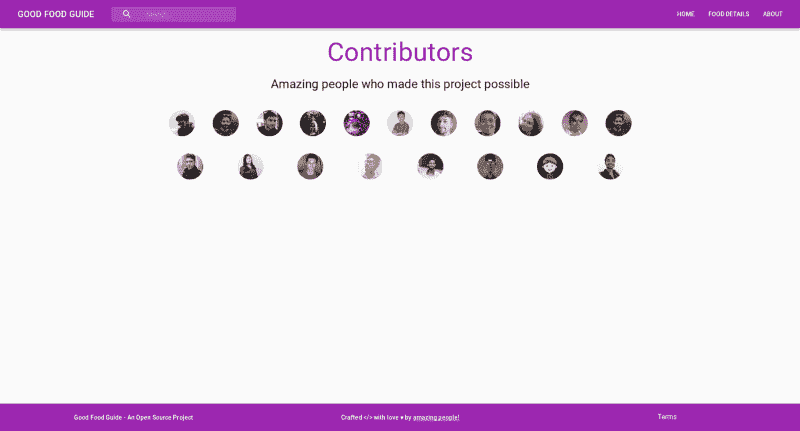
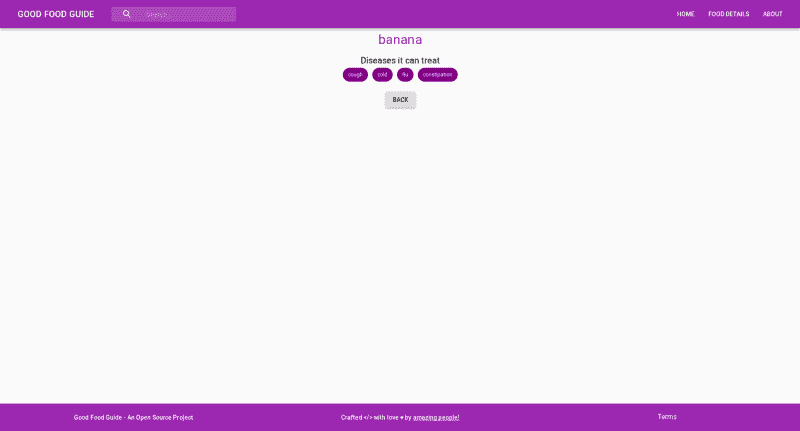
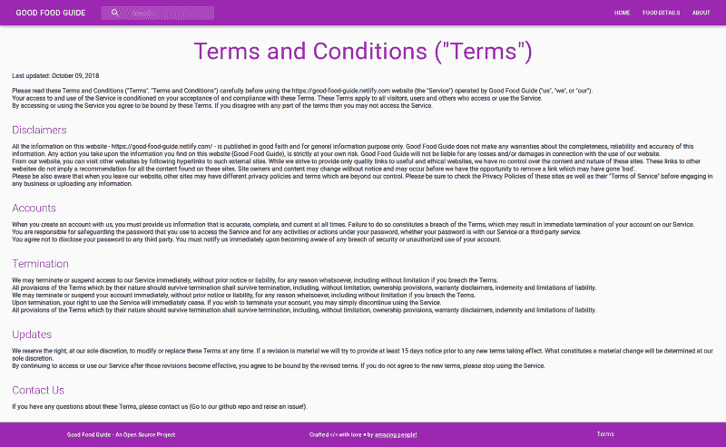

# 我是如何从一名贡献者变成开源项目维护者的

> 原文：<https://www.freecodecamp.org/news/how-i-went-from-being-a-contributor-to-an-open-source-project-maintainer-acd8a6b316f5/>

作者:丹拉杰·阿查里亚

# 我是如何从一名贡献者变成开源项目维护者的

我是一个孤独的软件开发者。我上大学时，参加了 KDE 会议。这是我第一次接触开源世界。在会议上，我认为主持人和举手的人都非常聪明。我知道有免费软件可用，由社区为社区创建。但是建造它的开发者对我来说是陌生的。

我认为很酷，很聪明的人开发了这个软件。我认为你必须非常聪明，有特权才能加入他们。

大学期间，我曾两次尝试参加谷歌代码之夏( [GSOC](https://summerofcode.withgoogle.com/) )，但都没有成功。毕业后，在我工作期间，我使用了许多开源项目。我甚至在做自由职业者的时候使用它们。我非常依赖社区开发的工具和技术。我真的被人们的故事迷住了，他们是如何开始为开源做贡献的，以及他们是如何得到他们惊人的远程工作的！

现在，在又拖了两个月也没能找到一份远程工作后，我决定一劳永逸，贡献自己。

我开始上传我的代码到 GitHub 上——每当我写新代码的时候。我创建了一个开源的 [NPM 模块](https://github.com/drex44/awesome-react-links)以及其他一些演示项目，并上传了它们。但是这不是开源的要点。实际上，我并没有参与其他回购，也没有和其他开发者一起开发软件。我仍在独自工作。

### 黑客啤酒节！

然后就来了:我偶然发现了 [Hacktoberfest](https://hacktoberfest.digitalocean.com) 。他们(DigitalOcean、GitHub 和 Twilio)会免费赠送一件**t 恤**，如果你在 10 月份在 GitHub 上提交 5 个开源项目的请求。即使你的简历没有被合并，它仍然会影响你的进步。这一次，他们有一吨的 t 恤，所以，很容易得到一个。这是我需要的最后一击——显然，一件免费的 t 恤会给你一个惊人的提升！。

因此，我开始了我在开源世界的旅程。

### 追踪问题

我在 GitHub 上搜索开源项目。我想要一些简单的任务来快速熟悉公关流程。所以我寻找那些不需要我跳到整个源代码中的问题。

有很多开发者为 Hacktoberfest 和新人启动项目。在这些回购中提交 PR 很容易，所以我提交了三份 PR。我把我的另外两个 pr 提交给了别人的个人项目。还有很多其他的回购，你只需要把你的名字添加到文件中，然后提交 PR。但是我认为这是没有成效的，也不是开源的精神。

然后我遇到了这个神奇的开发者。她在 Vue.js 中创建了一个静态博客，列出了许多问题。当我看到所有的问题时，我发现基本上，她正在创建一个个人博客，通过提出问题并给它们贴上适当的标签来让人们做出贡献。我当时就像**？。**

然后我意识到这个想法很棒，我就想，

Hahaha

我对她的才华印象深刻！她在构建自己的静态博客，同时也让其他开发者受益。第一次尝试的人正在学习如何在开源中工作，并得到一件免费的 t 恤。她通过集体努力获得了她的博客！

发现她的博客促使我创作了[美食指南](http://github.com/drex44/good-food-guide)。

### [美食指南的兴起](http://github.com/drex44/good-food-guide)

我已经决定在提交完我的 PRs 后要做什么。所以在两天的工作和提交 PRs 之后，是时候重新开始了。我受到了所有其他开发人员的启发，他们创建了一个 repo 来支持 Hacktoberfest。他们都在创造一个欢迎的环境，鼓励新来者提交富有成效的 PRs。我也想为这一运动做出自己的贡献，并决定创建自己的项目回购。

我也想成为一名企业家，我有一个包含多种想法的清单。但是我不想花太多时间来决定开始哪个项目。我浏览了所有的想法，挑了一个我认为容易理解和容易实现的。

我选择建立**美食指南。我姐姐和我曾经在谷歌上搜索吃什么食物可以治愈某种疾病。我想，如果已经有一个网站，你可以去搜索你的症状或疾病，它会告诉你该吃什么食物？它应该有所有语言版本，这样多人就可以很容易地使用它。**

所以我创建了一个基本的 UI 来传达网站的动机和用途。我想快速上传它，所以我决定只将所有数据保存在一个静态文件中。我想选择一种简单易学、应用广泛的技术。这将允许新开发人员学习或现有开发人员实践。所以我最后用了 React。

在此基础上，我决定使用 NextJs 来利用它的许多特性。如果你已经知道 React，它也很容易使用。我在 [GitHub](https://github.com/drex44/good-food-guide) 上传了整个项目，旅程开始了。但这不足以吸引开发商。

### 维持着的崛起

在提交了初始代码之后，我就产生了适当的文档。我用适当的标签制造了问题。我创建了这个问题，就像我们在敏捷冲刺中创建任务一样。而且，我把任务分成了子任务，列出了完整的细节。

当我寻找有助于解决的问题时，我寻找有详细问题和解决方案方向的问题。所以我试着把我最初寻找的信息包含在问题中。

这非常有效，这正是让第一批计时器贡献者上船所需要的。大多数受欢迎的项目都是有用的。问题中信息的缺乏会降低他们的积极性。由于这一点，他们中的大多数人在编译代码后并不处理实际问题。

#### 问题示例

example issue

我做的另一件事是用 Netlify 出版了 master branch。Netlify 有一个很好的与 GitHub 集成的应用程序。因此，如果任何公关被合并，那么贡献者可以看到几乎立即生效的变化。

结果呢？短短 2 个小时就拿到了 3 个 PRs 和 4 个上班请求(告诉过你，免费 t 恤的威力很强？).

我成功地从一个贡献者变成了一个项目维护者！

### 理解硬币的另一面

回购变得越来越受欢迎。人们提出问题以寻求建议，提交 PRs，并对问题进行评论。我的回购引起了关注，这真是太棒了。

我一整天都在收到通知。每小时我都会收到至少一条来自 GitHub 的通知！我在这里和那里玩杂耍。我在审查 pr，回答评论，合并 pr，提出更多问题，并做出贡献。

集成 Netlify 带来的一个令人惊奇的特性是，它会自动为您的项目设置 CI(持续集成)。它对提交的 PR 执行各种检查，并给出一个测试部署，您可以在其中检查集成。我建议在任何项目中尽可能使用这个特性！

结果，人们既学习又开心！还能得到一件免费的 t 恤。我学到了很多关于 GitHub 和 git 的知识。专业提示:如果你想快速学习 git，那就成为一名开源项目维护者。它给了我一个新的视角，开阔了我的视野。所以这对我们所有人来说都是一个双赢的局面。

> “任何可能出错的事情都会出错。”—墨菲定律

有一段时间，我会检查 PR 细节，浏览代码，查看部署的集成并合并 PR。有时，由于有许多未决的方案审查，在合并第一个方案审查后，会产生连锁反应，所有其他方案审查都会发生冲突。这起初看起来很糟糕，但却是塞翁失马焉知非福。因此，我学会了如何在 git 中解决冲突。我解决了许多冲突。Github 的合并 PRs 的在线编辑器被证明对于小的修改非常方便。

虽然 PRs 并不都有好的代码质量，但我还是合并了其中的大部分。因为他们是第一次投稿，我不想阻止他们提交更多的 pr。我知道当你提交一个 PR，然后一直等待维护者批准或评论它时的感觉。因此，为了保持贡献者的精神，我决定合并公关，然后自己做清理工作(我认为这给贡献者带来了积极的感觉)。

随着公关人数的增加，我没有太多时间来贡献自己。我分配的大部分时间将用于回复评论、电子邮件、合并和解决 pr。三天后，我坐下来清理代码。我只邀请了一个烂摊子。我意识到我应该通知投稿人至少要遵循一些准则。文件名、函数名和项目结构都是错误的。随着网站的发展，它的问题也随之而来。

我不得不重新构建整个代码库。这是一个突破性的变化，但它是非常必要的。如果这种情况持续下去，一段时间后代码将变得不可维护。这时候我才明白为什么很多公司都强调自己的编码标准。我的意思是，我已经知道了它的重要性，但是作为一个项目维护者直接体验它是另一回事！我明白了为什么许多流行的开源项目对它们的编码标准如此严格。

我还可以看到我的思维过程在过去的 10-11 天里是如何发展的。我是一个在他自己的存储库上工作的天真的贡献者，但是设法成为一个与所有其他开发人员一起工作的项目维护者。

#### GitHub 统计

以下是过去 11 天的星、叉、贡献者！

GitHub stats

### 结果！

10 分钟创建的无响应网站！

Home

About

#### 11 天后，

Home

About us

Contributors

foodDetails (Work in progress)

terms

您也可以在 https://good-food-guide . now . sh 查看网站的最新版本。

每天，网站都在或大或小地改进。

#### 结果

这 11 天的旅程对我来说太棒了。我学到了很多。现在，我可以看到硬币的两面。

我看到了一个团队的力量和它所能达到的成就。如果一小撮人决定致力于某个特定的问题，那么他们可以解决任何问题。人们需要一个友好的环境和一点奖励来保持动力。

对于新开发人员来说，开始做贡献可能很困难。他们寻找需要解决的问题，但这不是开始做出贡献的唯一方式。主要的想法是享受乐趣，共同构建一些东西，来改进一个软件。如果您已经使用过它，并且知道您可以改进的地方，那么您可以直接提出问题，与维护者讨论，并提交一份 PR。我认为这是最好的开始方式之一。

我很清楚项目经理如何利用每个人的优势来完成一项任务，如果由一个人来完成这项任务会很困难。开源项目中也是这种情况。维护人员的工作类似于项目经理。他们必须保持所有开发人员之间的和谐，并听取他们的想法。

我还意识到，以前，每当我想加入一个新的开源项目时，我都会害怕一个大的代码库。我会编译代码，运行它，然后忘记它。现在恐惧已经消失了，我想我可以为大项目做贡献了。我希望继续学习新的东西，成为开源社区的好资产。

感谢您的阅读！非常感谢来自 freeCodeCamp 的 **Jennifer 和 Abbey** 的评论。他们帮助我准备了这篇文章，使它值得你花时间。

如果你有任何问题或建议，请在下面的评论中留下。

附:如果你觉得这篇文章有帮助，鼓掌！？？？这感觉很有收获，给了我继续写作的动力。

[**drex 44/good-food-guide**](https://github.com/drex44/good-food-guide)
[*一个知道当你有某种疾病时哪些食物是好的指南！【内建 React/NextJs】-drex 44/Good-Food-Guide*github.com](https://github.com/drex44/good-food-guide)[**好食物指南**](https://good-food-guide.now.sh/)
[*当你患有某种疾病时，知道哪些食物是好的指南！* good-food-guide.now.sh](https://good-food-guide.now.sh/)

编辑:

将直播网站的网址更新为[https://good-food-guide . now . sh](https://good-food-guide.now.sh/)。