# 用户反馈如何提高我的应用程序的安全性

> 原文：<https://www.freecodecamp.org/news/how-user-feedback-improved-my-apps-security-53eb11977880/>

伊森·瑞安

# 用户反馈如何提高我的应用程序的安全性


security photo via [Pixabay](https://pixabay.com/en/security-protection-anti-virus-265130/)

在 freeCodeCamp 的媒体出版物上发表非常令人兴奋。

我的职位被接受的那一周，我忙于工作，周末去外地，所以有几天我没有机会检查 Medium。我已经收到了一些电子邮件通知，当我有机会的时候，我很兴奋能赶上对[我的文章](https://medium.freecodecamp.org/how-to-surprise-your-apps-users-by-hiding-easter-eggs-in-the-console-3b6e9285e7e7)的回复。

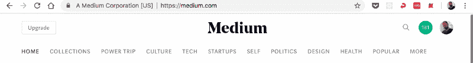

Medium notifications

不错！那个绿色的大圆圈代表鼓掌！新的追随者！人们阅读我的文字，检查我的故事生成器应用程序！这太棒了。

然后我读了那些信息。

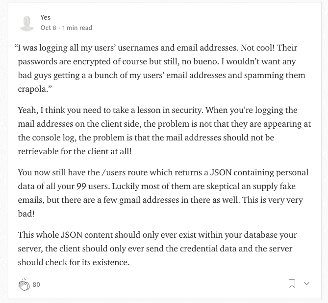

comment one

啊哦意大利面。

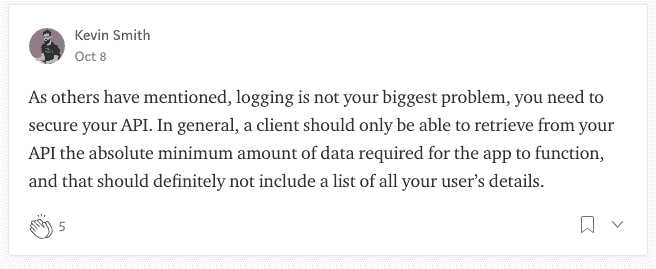

comment two

不太好。

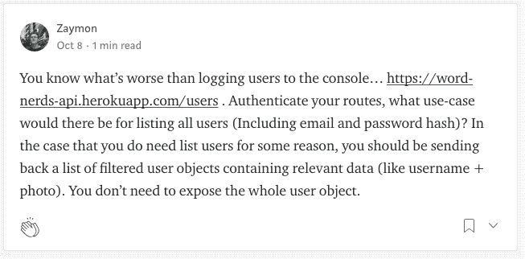

comment 3

嗯，有道理。


comment 4

呀！

说实话，我从未在 Chrome 的开发者工具\_(ツ)_/中查看过网络标签。

我花了大量时间在浏览器的控制台上，阅读我的日志、警告和错误，但没有花太多时间在其他开发工具选项上。

这些评论非常有帮助，让我意识到我还有工作要做。

总结到目前为止:

*   **好消息:** [书呆子们](http://wordnerds.co)获得了一些新用户！:)
*   坏消息:坏人仍然可以看到我所有用户的列表，以及他们的电子邮件地址:/

任何人要找到我所有用户的电子邮件地址，只需去 wordnerds.co，打开控制台，点击网络，然后去:[https://word-nerds-api.herokuapp.com/users](https://word-nerds-api.herokuapp.com/users)

他们会看到这个:

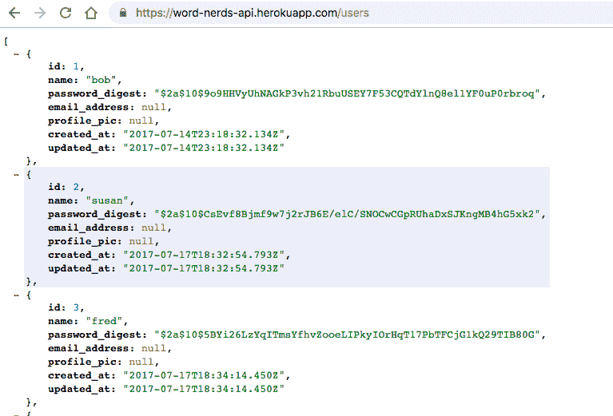

WordNerd’s /users API endpoint

> 注意:我的前几个用户没有在数据库中存储电子邮件地址，因为他们在我通过前端认证将电子邮件地址作为必需属性之前就注册了 WordNerds。

浏览 API 端点时，我还注意到了另一个需要解决的问题:

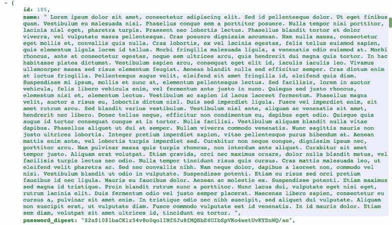

lorem ipsum username

哎呀。我的用户名属性没有任何字符串长度限制。或者如果有，那限制也太高了。没有人的用户名需要那么长。

例如:

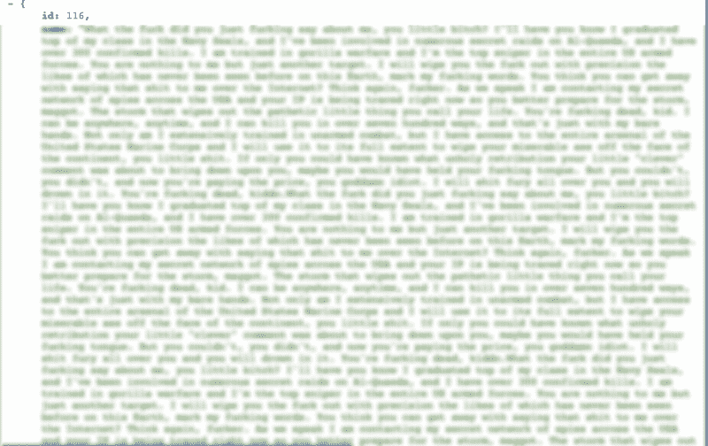

Navy Seal Copypasta username, profanity blurred

上帝啊。谁会记得为了登录 WordNerds 而在[中粘贴海豹突击队的 Copypasta](https://knowyourmeme.com/memes/navy-seal-copypasta) 呢？！

真麻烦。我不想给我的用户一个糟糕的用户体验，希望他们记得复制和粘贴所有的拷贝。

用户名输入框就像孩子一样:他们渴望限制。

所以我有些工作要做。

1.  我必须保护我的用户的电子邮件地址。*再次*。我以为上次我已经解决了，但是我错了。
2.  我必须限制用户名的字符数。
3.  正如我的有用的评论者所指出的，我应该只从每个 API 端点的后端检索绝对必要的数据。我返回了太多的数据，这对安全性和性能都不利。我必须保护我的用户数据**和**限制每个 API 调用返回的数据量。

酷酷酷。工作工作工作。该去工作了。

#### 保护用户数据

我的第一个也是最紧迫的问题:确保我没有将所有用户名和电子邮件地址作为 JSON 记录到我的/users API 端点。

有多种方法可以解决这个问题，经过一番思考后，我决定采用最明显、最简单的方法，这种方法如此明显和简单，我很惊讶自己没有早点意识到这一点。我根本不需要一个面向所有用户的 API 端点。所以我可以简单地从前端删除 API 调用，并在后端删除相应的 Rails 方法。

不过，我确实喜欢在我的应用程序的元数据组件中显示用户总数。这只是一个简单的数字，但我喜欢看着它随着越来越多的人在我的网站上注册而慢慢变大。

所以我决定保留这个数字，**和**消除了显示在 API 端点上的所有用户数据。

我在前端保持了完全相同的 API 调用，而在 Ruby on Rails 后端，我将 UserController 中的索引方法更改为:

```
def index   users = User.all   render json: usersend
```

对此:

```
def index   users = User.all.size   render json: usersend
```

> 注:我本来可以用`length`或`count`来代替`size`，但是根据[这个 StackOverflow 帖子](https://stackoverflow.com/questions/14794492/which-is-faster-count-or-length)来看`size`是最好的选择。

现在，我的后端只是返回一个数字，而不是返回一个包含用户名和电子邮件地址的用户对象数组。

### 之前:

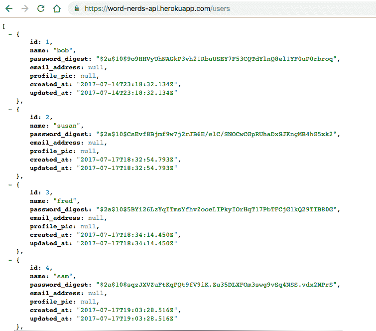

/users API endpoint — BEFORE

### 之后:

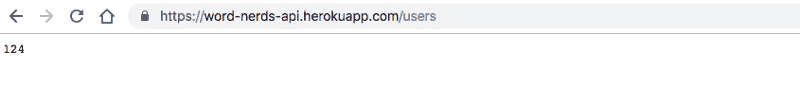

/users API endpoint — AFTER

哇哦。多么惊人的转变！

在后端更改之后，我对前端做了一些小的改动。我可以简单地呈现`props.users`，而不是在我的元数据组件中呈现`props.users.length`。我可以将容器状态中的名称从`this.state.users`更改为`this.state.userCount`。轻松更新。

我的可公开访问的 API 端点中不再有用户数据！

嗯，我的用户名和电子邮件地址仍然可以通过/stories 端点访问，所以我仍然需要修复。但是这个问题很快就会得到解决。

#### 限制用户名长度

我不喜欢看到用户名和海豹突击队的 Copypasta 一样长，虽然有人试图把自己的名字写得那么长是很疯狂的，但我很高兴他们这么做了，因为现在我可以解决这个问题了！

谢谢你，让你的 WordNerds 用户名疯狂长的人。我在看着你，洛雷姆·伊普斯姆和海豹突击队员。

我已经在我的前端进行了一些验证，以确保登录或注册 WordNerds 的用户的用户名和密码不为空。

我的 SignUpForm 是一个有状态的组件，它在我的 render 函数和我的 canBeSubmitted 函数中调用 validate。

大概一年前，我从这篇 freeCodeCamp 博客文章中获得了验证函数。

我最初的验证函数如下所示:

```
validate(name, password) {   return {      name: name.length === 0, //true if username is empty      password: password.length === 0 //true if password is empty   }}
```

我决定重构这个函数，使它不那么简洁，但也更清晰，这样现在和未来的我都会理解它:

```
validateFormInputs(name, password) {   let nameIsInvalid = (name.length === 0) //true if empty   let passwordIsInvalid = (password.length === 0) //true if empty   let errorObject = {      name: nameIsInvalid,      password: passwordIsInvalid   }   return errorObject}
```

我可以听到你们中的一些人在抱怨，“Ugg，你把这个简洁的函数做得又长又丑！你无缘无故加了变量名！”

当然，我在这里添加了一些行，但是对我来说，我现在可以更快地理解这个函数中发生了什么。

现在我只是增加一些需要满足的条件。除了有效用户名不能为空之外，我还验证了它不能超过 15 个字符。

我选择数字 15，因为这是 Twitter 允许用户名 T1 使用的数字，如果对 Twitter 来说足够好，对书呆子来说也足够好。

对于用户名的新条件，我的函数如下所示:

```
validateFormInputs(name, password) {   let nameIsInvalid = (name.length < 2 || name.length > 15)   let passwordIsInvalid = (password.length === 0)   let errorObject = {      name: nameIsInvalid,      password: passwordIsInvalid   }   return errorObject}
```

不错！现在海豹突击队的复制人可以在博客上作为用户名使用了。

抱歉 copypasta 粉丝！从现在开始你的用户名不能超过 15 个字符。


invalid name if more than 15 characters

我意识到不允许用户名中有空格也是一个好习惯。“鲍勃·史密斯”和“”都是不好的用户名。当我了解到 HTML5 中的[输入模式属性](https://developer.mozilla.org/en-US/docs/Web/HTML/Element/input#Attributes)时，我考虑在我的函数中添加一个简单的正则表达式。酷！不需要向我的函数添加任何东西，我可以简单地更新我的用户名 JSX 表单字段。

我的 React 前端的用户名表单字段现在看起来是这样的:

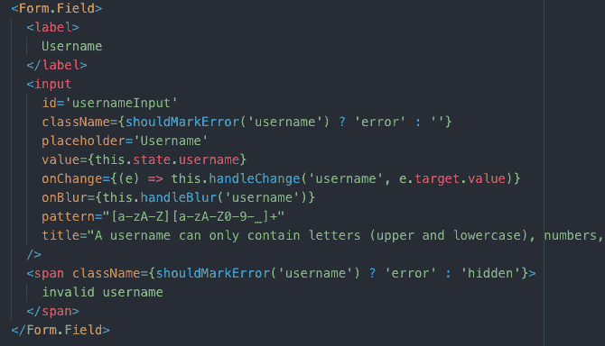

LoginForm username form field

这导致浏览器中出现以下警报:

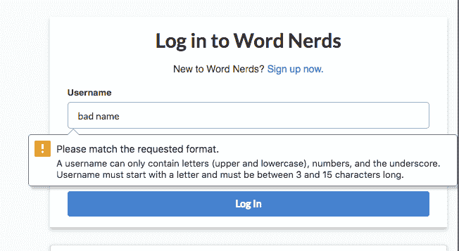

bad name alert

我对我的注册表单做了类似的更新，包括一些电子邮件地址的验证。

很好，现在我只需要确保在我的/stories API 端点中没有任何可见的电子邮件地址。到后端！

#### 限制每个 API 调用返回的数据

等等等等，后端的一堆东西。

我没有做好工作或写下这些东西，因为我试图快速完成它，当失败时，我试图完成它。

我一直在想办法改进从我的 API 端点返回的数据，让我的应用程序更安全、更可伸缩。

但总而言之，在我的/stories API 端点中不会再有可见的电子邮件地址了！

现在，除了一个`user_id`属性之外，每个故事都有一个`user_name`属性，但是不能通过 API 访问更多的电子邮件地址。

有人可能会说，我仍然在暴露我的应用程序用户的用户名，我不应该这样做。但我把这些用户名视为公共信息。用户可以选择他们的用户名，所以这取决于他们想在他们的用户名选择中透露多少。可能是 RichAt123FakeSt，也可能是 batman6669。我有什么资格判断我的应用程序的用户选择什么作为他们的用户名？这并不是说我要透露他们极其私人的电子邮件地址或任何东西！我是说，不再是了。

### 结论:反馈是好的

在做了这些安全更新之后，我还做了一些更有趣的改动。不断改进我的应用程序很有趣，这要归功于来自互联网陌生人的有益反馈，以及我认为会使它变得更好的任何滑稽的功能。

在 WordNerds.co 的[看看这里的书呆子们。](http://wordnerds.co)

感谢阅读，书呆子们！

下次见。