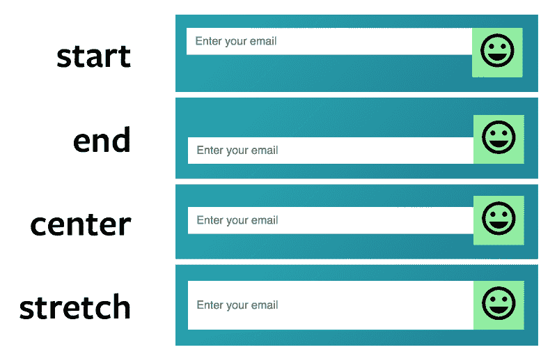

# 如何用 CSS 网格创建一个简单的表单

> 原文：<https://www.freecodecamp.org/news/creating-a-simple-form-with-css-grid-a99a2706bb0f/>

在上一篇文章中，您学习了用 Flexbox 创建一个简单的表单。今天，您将了解如何使用 CSS Grid 创建同样的东西。

这是我们正在建造的:


### 用 CSS 网格构建表单

从上图中，我们知道表单包含两个元素:

1.  电子邮件字段
2.  提交按钮

这是 HTML:

```
<form>   <input type="email" name="email">   <button type="submit">Send</button> </form>
```

要用 CSS Grid 构建表单，需要将父表单的`display`属性设置为`grid`。

```
form {   display: grid; }
```

以下是您得到的结果:


为什么我们有两排？

我们得到两行，因为我们没有指定网格的列数。浏览器将总是默认为一列。

对于这个表单，我们需要设置两列。

1.  第一列应该扩展以填满所有可用空间
2.  第二列应该根据其内容调整大小

对于第一列，我们可以使用`fr`单位。对于第二列，我们可以使用`auto`。

```
form {   display: grid;   grid-template-columns: 1fr auto; }
```

至此，您已经完成了表单的布局。这里有一个代码笔供您使用:

由 Zell Liew ( [@zellwk](https://codepen.io/zellwk) )在 [CodePen](https://codepen.io/) 上制作的带有 CSS 网格的简单表单。

### 当元素高度不相等时

我们将通过用 SVG 替换`button`的文本来模拟高度不等的元素。[这和我们在上一篇文章](https://zellwk.com/blog/simple-form-with-flexbox)中所做的一样。

```
<form action="#">   <input type="email" placeholder="Enter your email">   <button type="button"><svg> <!-- a smiley icon --> </svg></button> </form>
```


注意`input`的高度也增加了以适应大的 SVG 图标！同样，我们不必编写任何额外的代码。这是因为网格项被垂直拉伸以填满所有可用空间。

如果您想改变这种行为，您可以将`align-items`属性改为`start`、`end`或`center`。



这里有一个代码笔供您使用:

[带有 CSS 网格的简单表单(带有 SVG 按钮)](https://codepen.io/zellwk/pen/jvXEzm/)由 Zell Liew ( [@zellwk](https://codepen.io/zellwk) )在 [CodePen](https://codepen.io/) 上完成。

### 包扎

CSS 网格使创建布局变得容易。它不一定要用于宏布局。它还可以用于微型布局，如您在这里看到的表单示例。

享受 CSS 网格的乐趣！

感谢阅读。这篇文章对你有什么帮助吗？如果你有，[我希望你能考虑分享它](http://twitter.com/share?text=Creating%20a%20simple%20form%20with%20CSS%20Grid%20by%20@zellwk%20?%20&url=https://zellwk.com/blog/simple-form-with-css-grid/&hashtags=)。你可能会帮助别人。谢谢大家！

本文最初发布在 *[我的博客](https://zellwk.com/blog/simple-form-with-css-grid)上。*
如果你想要更多的文章来帮助你成为一个更好的前端开发者，请注册我的[简讯](https://zellwk.com/)。