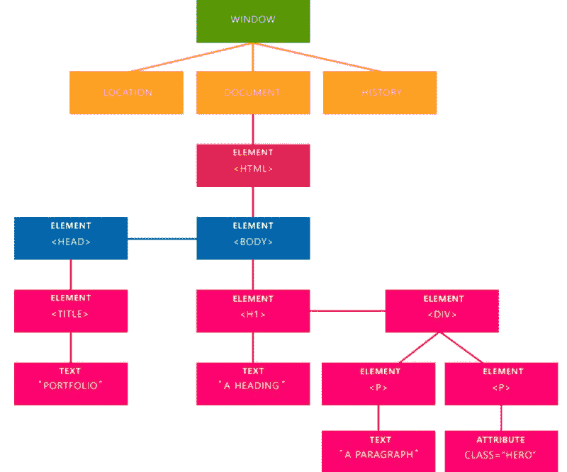
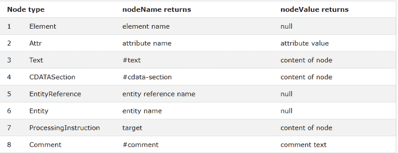

# 什么是文档对象模型，为什么你应该知道如何使用它。

> 原文：<https://www.freecodecamp.org/news/whats-the-document-object-model-and-why-you-should-know-how-to-use-it-1a2d0bc5429d/>

作者莱昂纳多·马尔多纳多

# 什么是文档对象模型，为什么你应该知道如何使用它。


The DOM explained by an easy way. Photo by [Remi Yuan](https://unsplash.com/@remiyuan) on [Unsplash](https://unsplash.com/photos/FEhYjpC1axQ)

所以，你已经学习了 HTML，你已经创建了你的第一个标签，了解了 CSS，制作了漂亮的表单，令人惊叹的按钮，有反应的页面，并且已经开始向每个人展示这一切是多么的神奇。

但是，当你决定要在学习中再前进一步时，你已经开始思考:“我怎样才能在我的页面上添加动画呢？我希望当我点击这个按钮时，它能在我的页面上制作一些动画！”

这就是 DOM 解决您的问题的地方。你可能听说过很多，但你可能还不知道它是什么，它能解决什么问题。所以让我们开始吧。

### 那么，什么是 DOM？

你知道你在周围看到的那些很酷的动画，让你对自己说，“哇，我希望我能做出那样的东西”？所有这些动画都是通过操纵 DOM 制作的。我现在将向你解释如何开始操作它，让你的网站看起来更酷。

DOM(文档对象模型)是一个界面，表示浏览器如何读取 HTML 和 XML 文档。它允许一种语言(JavaScript)来操作、构建和设计你的网站。浏览器读取 HTML 文档后，它会创建一个名为文档对象模型的表示树，并定义如何访问该树。

### 优势

通过操纵 DOM，你有无限的可能性。您可以创建无需刷新即可更新页面数据的应用程序。此外，您可以创建可由用户自定义的应用程序，然后无需刷新即可更改页面布局。您可以拖动、移动和删除元素。

正如我所说的，你有无限的可能性——你只需要发挥你的创造力。

### 由浏览器表示



The representational tree that the browser create after it read your document.

在上图中，我们可以看到表示树以及浏览器是如何创建它的。在本例中，我们有四个重要元素，您会经常看到:

1.  **文档**:处理所有的 *HTML* 文档。
2.  **元素**:你的 *HTML* 或者 *XML* 里面的所有标签都变成了一个 DOM 元素。
3.  **Text** :所有标签的内容。
4.  **属性**:来自一个特定 *HTML* 元素的所有属性。在图像中，属性 *class="hero"* 是来自 *<* p >元素的属性。

### 操纵 DOM

现在我们进入了最精彩的部分:开始操纵 DOM。首先，我们将创建一个 HTML 元素作为示例，以了解一些方法和事件是如何工作的。

```
<!DOCTYPE html>  <html lang="pt-br">  <head>      <meta charset="UTF-8">      <meta name="viewport" content="width=device-width, initial-scale=1.0">      <meta http-equiv="X-UA-Compatible" content="ie=edge">      <title>Entendendo o DOM (Document Object Model)</title>  </head>  <body>      <div class="container">          <h1><time>00:00:00</time></h1>          <button id="start">Start</button>          <button id="stop">Stop</button>          <button id="reset">Reset</button>      </div>  </body>  </html>
```

很简单吧？现在我们将学习更多关于 DOM 方法的知识:如何获取元素并开始操作。

### 方法

DOM 有很多方法。它们是我们的节点(元素)和事件之间的连接，我们将在后面了解更多。我将向你展示一些最重要的方法以及它们的用法。还有很多方法我不会在这里展示给你们，但是你们可以在这里看到所有的方法。

#### getElementById()

该方法返回包含传递的名称 *id* 的元素。正如我们所知， *id* 应该是唯一的，所以这是一个非常有用的方法，只获取你想要的元素。

```
var myStart = document.getElementsById('start');
```

**myStart** :与我们的 *id* 相似的变量名通过。

**开始** : *id* 通过。如果我们没有任何具有该特定名称的 *id* ，它将返回 *null* 。

#### getElementsByClassName()

该方法返回一个包含传递的特定名称*类*的所有元素的 *HTMLCollection* 。

```
var myContainer = document.getElementsByClassName('container');
```

**myContainer** :我们的变量名看起来像我们的*类*通过了。

**。集装箱**:我们的*级*通过。如果我们没有任何具有该特定名称的*类*，它将返回 *null* 。

#### getElementsByTagName()

这与上面那些方法的工作方式相同:它也返回一个 *HTMLCollection，*，但是这一次有一点不同:它返回所有那些传递了标签名的*元素*。

```
var buttons = document.getElementsByTagName('button');
```

**按钮**:我们的变量名看起来和我们的*标签名*相似，通过了。

**按钮**:我们想要得到的*标签名*。

#### 查询选择器()

它返回传递了特定的 *CSS 选择器*的第一个*元素*。只要记住*选择器*应该遵循 *CSS 语法*。如果您没有任何*选择器*，它将返回*空值*。

```
var resetButton = document.querySelector('#reset');
```

**resetButton** :与我们的*选择器*相似的变量名通过。

**#reset** : *选择器*通过，如果没有与之匹配的*选择器*则返回 *null* 。

#### querySelectorAll()

非常类似于 *querySelector()* 方法，但是有一点不同:它返回所有与传递的 *CSS 选择器*匹配的*元素*。*选择器*也应该遵循 *CSS 语法*。如果您没有任何*选择器*，它将返回*空值*。

```
var myButtons = document.querySelector('#buttons');
```

**myButtons** :我们的变量名看起来像我们的*选择器*通过了。

**#buttons** : *选择器*通过，如果没有与之匹配的*选择器*返回 *null* 。

这些是一些最常用的 DOM 方法。还有一些方法可以使用，比如 createElement()，它在 HTML 页面中创建一个新元素 setAttribute()，它允许您为 HTML 元素设置新属性。你可以自己探索它们。

同样，你可以在这里找到所有的方法[，在*方法*的左边。我真的建议你看看其他的一些，因为你可能很快就会需要它们中的一个。](https://developer.mozilla.org/en-US/docs/Web/API/Element)

现在，我们将学习**事件**——毕竟没有它们我们就无法在页面中制作动画。

### 事件

正如我们刚刚讨论的，DOM 元素有*方法*，但是它们也有*事件*。这些事件使得页面中的交互成为可能。但是有一件事你可能不知道:*事件*也是*方法*。

#### 点击

最常用的事件之一是 click 事件。当用户点击一个特定的元素时，它会实现一些动作。

```
myStart.addEventListener('click', function(event) {
```

```
// Do something here.
```

```
}, false);
```

addEventListener()参数是:

1.  您想要的事件类型(在本例中为“*点击*”)。
2.  回调函数
3.  默认情况下 *useCapture* 为假。它表示您是否想要“捕获”事件。

#### 挑选

该事件用于当选择了特定元素时，您希望*分派*一些东西。在这种情况下，我们将*发送*一个简单的*警报*。

```
myStart.addEventListener('select', function(event) {
```

```
alert('Element selected!');
```

```
}, false);
```

这些是一些最常用的事件。当然，我们有很多其他事件可以使用，比如拖放事件——当用户开始拖动某个元素时，你可以做一些动作，当用户放下该元素时，你可以做另一个动作。

现在，我们将看看如何遍历 DOM 并使用一些属性。

### 穿越大教堂

你可以遍历 DOM，使用一些我们将要看到的属性。使用这些属性，您可以返回元素、注释、文本等等。

#### childnodes

该属性返回给定元素的子节点*的*节点列表*。它返回文本、注释等等。所以，当你想用它的时候，你要小心。*

```
var container = document.querySelector('.container');
```

```
var getContainerChilds = container.childNodes;
```

#### 。第一个孩子

该属性返回给定元素的第一个子元素。

```
var container = document.querySelector('.container');
```

```
var getFirstChild = container.firstChild;
```

#### .nodeName

该属性返回给定元素的名称。在本例中，我们传递了一个 *div* ，所以它将返回“ *div* ”。

```
var container = document.querySelector('.container');
```

```
var getName = container.nodeName;
```

#### .nodeValue

该属性特定于**文本和注释**，因为它返回或设置当前*节点*的值。在本例中，由于我们传递了一个 div，它将返回 *null* 。

```
var container = document.querySelector('.container')
```

```
var getValue = container.nodeValue;
```

#### .nodeType

该属性返回给定元素的类型。在这种情况下，它返回“ *1* ”。

```
var container = document.querySelector('.container')
```

```
var getValue = container.nodeType;
```

但是，“ *1* 到底是什么意思呢？它基本上是给定元素的**节点类型**。在这种情况下，它是一个 *_ELEMENT_NODE_* 并返回 null。如果这是一个属性，它将作为“ *2* 返回给我们和属性值。



A table containing all types of nodeTypes and the nodeName and nodeValue returned of each of them.

你可以在这里阅读更多关于*节点类型* [的内容。](https://www.w3schools.com/jsref/prop_node_nodetype.asp)

### 元素

这些属性，而不是上面那些，只返回给我们**个元素**。它们更经常被使用和推荐，因为它们可以减少混乱，更容易理解。

#### 。parentNode

该属性返回给定节点的父节点。

```
var container = document.querySelector('.container')
```

```
var getParent = container.parentNode;
```

#### 。第一元素儿童

返回给定元素的第一个子元素。

```
var container = document.querySelector('.container')
```

```
var getValue = container.firstElementChild;
```

#### 。lastElementChild

返回给定元素的最后一个子元素。

```
var container = document.querySelector('.container')
```

```
var getValue = container.lastElementChild;
```

这些是 DOM 拥有的许多属性中的一部分。对你来说，了解 DOM 的基础知识，它是如何工作的，以及它的方法和属性是非常重要的，因为有一天你可能会用到它。

### 结论

DOM 为我们提供了几个重要的 API 来创建奇妙的创新应用程序。如果你了解它的基本原理，你就能创造出不可思议的东西。如果你想阅读更多关于 DOM 的内容，你可以点击[这里](https://developer.mozilla.org/en-US/docs/Glossary/DOM)阅读所有的 MDN 文档。

？在推特上关注我！
**⭐** F [**在 GitHub 上关注我！**](https://github.com/leonardomso)

我正在寻找一个遥远的机会，所以如果有我想听的，请联系我！