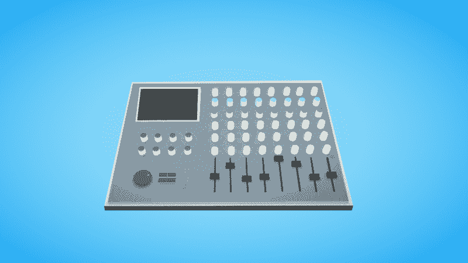
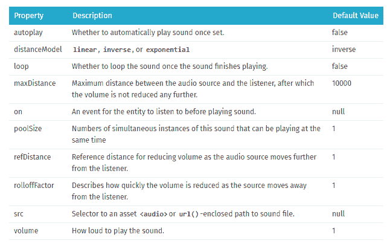
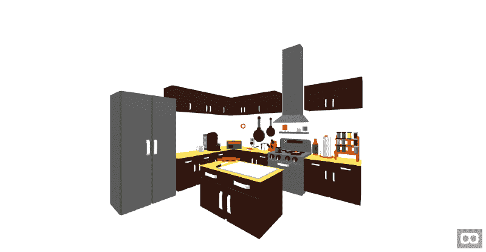
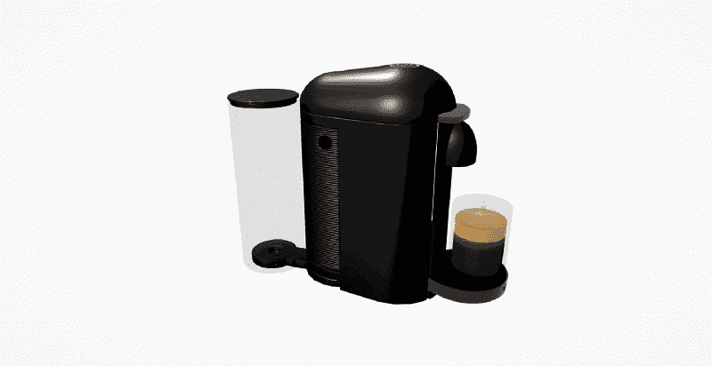
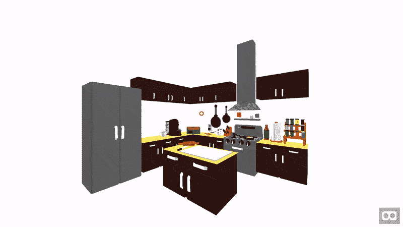
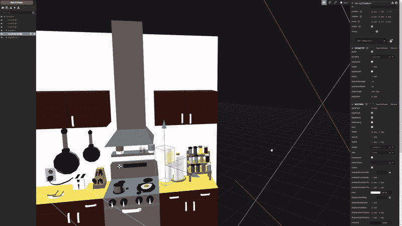
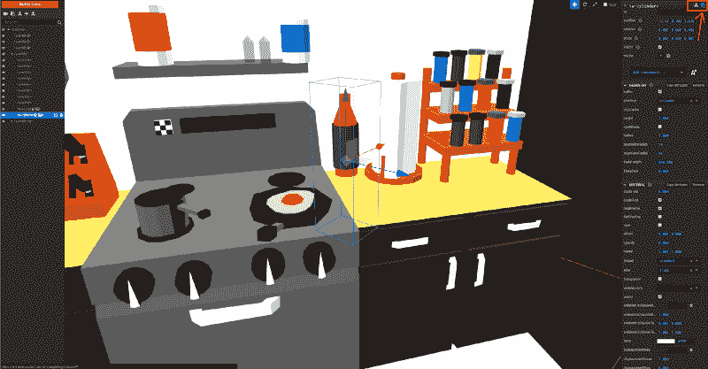

# 敲一个(虚拟的)罐子:A 帧音频入门

> 原文：<https://www.freecodecamp.org/news/a-primer-on-a-frame-audio-52dd56e54876/>

由贝拉克零

# 敲一个(虚拟的)罐子:A 帧音频入门

Mixing Desk Model from [Peter Simcoe](https://poly.google.com/view/4GCowIjU9CG)

A-Frame 是一个用于构建虚拟现实体验的网络框架。自 2015 年末推出以来，它迅速成为所有背景的艺术家和创作者的最爱，他们都想尝试 [WebXR](https://github.com/immersive-web/webxr/blob/master/explainer.md) 。

我是一个有音频背景的创意程序员。潜入这个新平台的声波可能性是一个非常令人兴奋和有益的旅程。我的大部分 A-Frame 体验局限于标准的桌面和智能手机环境，而不是 VR。我在分享我的发现。我想创建一个非正式的手册，关于如何实现，使用和创建音频。在第一部分中，我们将了解如何使用 A-Frame 的开箱即用音频功能。

**先决条件**

这篇文章假设您有一些使用 A-Frame 的经验。你不需要成为这方面的专家，但是知道基本原理会让你更容易理解本教程。如果你还没有机会去看看，可以从这里开始[。](https://aframe.io/docs/0.8.0/introduction/)

### a 帧声音分量

A-Frame 是基于 [Three.js.](https://threejs.org/) 的框架，它提供的声音组件是围绕 Three.js [位置音频组件](https://threejs.org/docs/#api/en/audio/PositionalAudio)的[包装器](https://github.com/aframevr/aframe/blob/v0.8.0/src/components/sound.js)(或者是非位置的，这取决于我们选择什么，但稍后会详细介绍)，它使用 [Web 音频 API](https://developer.mozilla.org/en-US/docs/Web/API/Web_Audio_API) 。

这意味着，只要我们使用 A 帧声音组件，我们就可以立即获得位置音频、音量控制和音频播放等功能。

A-Frame sound component properties, screenshot taken from [A-Frame Docs](https://aframe.io/docs/0.8.0/components/sound.html)

但是我们如何将这个组件添加到我们的场景中，并为用户交互提供音频反馈和/或创建一个[声景](https://en.wikipedia.org/wiki/Soundscape)？

为了演示这一点，我从头开始创建了一个 A-Frame 项目。它基于用户与台式计算机的交互。(即使用鼠标和键盘)。这些原则应该在很大程度上适用于其他类型的控制。

您可以选择从项目的新副本[[Glitch](https://glitch.com/~a-frame-audio-tutorial-starter)][[GitHub](https://github.com/berraknil/a-frame-audio-tutorial/tree/starter)]开始，不附带任何声音，然后自己实现提供的声音。或者你可以检查一下完成的版本[[Glitch](https://glitch.com/~a-frame-audio-tutorial-complete)][[GitHub](https://github.com/berraknil/a-frame-audio-tutorial/tree/master)]，然后继续阅读代码。

### 厨房

在我们开始音频实现过程之前，让我们来看看我们的场景。我们这里有几个 3D 模型(由[谷歌聚合](https://poly.google.com/)提供)。我们的[厨房](https://poly.google.com/view/38PMRiku8qj)本身就是一个完整的模型。像[浓缩咖啡机](https://poly.google.com/view/6kN4sv3u9RM)、[收音机](https://poly.google.com/view/9H9k1nAXSuH)、[煎锅](https://poly.google.com/view/bYF5rVRy_kp)和[上面的鸡蛋](https://poly.google.com/view/dccGDIUzA2y)这样的物品是单独的模型，它们被添加到厨房顶部的场景中。

现在让我们来看看可以用来给这个场景添加声音的方法。

### **用户交互声音**

用户交互声音通常是一次性声音。这意味着它们是短样本，被触发时播放一次。它们不像环境音频或音乐那样是连续的或循环的。这意味着我们需要找到一种方法，将一个音频文件放到我们的场景中，然后在用户与该对象交互时触发它。(例如，点击鼠标按钮、悬停在其上等。).

要在用户交互时触发声音，我们可以:

1.  给模型加上声音
2.  在一个[图元](https://aframe.io/docs/0.8.0/introduction/html-and-primitives.html)上放一个声音，就像一个长方体几何体
3.  在一个<a-sound>组件上放置一个原语</a-sound>

因此，让我们逐一检查我们的选项，并查看每个选项的用例。

#### 给模型加上声音

谁不想以一杯新鲜的浓缩咖啡开始新的一天呢？(如果那不是你，请随意从这里拿一个茶模型来代替它。)

我想说，咖啡因带来的一半满足感是我们心爱的咖啡机发出的声音。为了确保我们的场景提供听觉反馈，我们实现了一种可以响应用户交互的声音。

首先让我们来看看我们的咖啡机是如何工作的

我们首先用 A-Frame 装载机装载我们的模型。然后，我们使用指定的属性设置场景中模型的位置、旋转和缩放。

我们的模型由 id“# coffee maker”引用，而不是文件的相对路径。该项目的所有模型都预先在[资产管理系统](https://aframe.io/docs/0.8.0/core/asset-management-system.html)中注册。

向我们的咖啡机添加声音的最简单的方法是通过使用声音作为对象的 HTML 属性来添加声音组件。

我们通过再次使用资产管理系统来引用我们的声音，并将其音量设置为 1。这意味着它将 100%被听到。现在对于最重要的部分，我们将声音的“开”属性设置为“点击”值。这意味着当用户点击这个对象时，声音将被触发。

我们在这里不使用自动播放或循环属性，因为这是依赖于用户交互的一次性操作。默认情况下，我们将位置属性保留为“开”。否则，无论我们离物体有多远，我们都会听到相同音量的声音。声音没有任何平移，总是在我们所在的位置播放，而不是根据我们相对于物体的位置在我们的左边、右边或后面播放。

**注意:像这样的位置声音应该渲染成单声道，以使声音的空间认知更容易，而不是位置的背景音乐或音频环境最好渲染成立体声。**

#### 是时候打几个鸡蛋了

现在轮到你了，继续将提供的煎鸡蛋声音实现到放在煎锅顶部的鸡蛋模型上。对于一个挑战，你也可以尝试使用一些你选择的额外的[声音属性](https://aframe.io/docs/0.8.0/components/sound.html#properties)。在放置好 egg 声音之后，在场景中走一圈，测试你的实现，看看它听起来是否真实(或者不真实，如果这就是你想要的！)

你做了吗？

太好了！

您的 egg 模型代码现在应该大致如下所示(带有您想要的属性和值)

#### 在几何体上放置声音

因此，我们可以通过简单地将声音作为 HTML 属性添加到模型中。如果我们想给一个已经是一个更大的模型的一部分，而不是一个单独的实体的物体加上声音，该怎么办？

假设我们想给右边的红色瓶子添加一个声音，当我们点击它的时候，这个声音应该听起来像是我们在拿起它。

如果我们把声音放在厨房模型上，就像我们对较小的模型所做的那样，这将意味着无论我们在模型本身的什么地方点击，声音都会触发，而不是像我们希望的那样只在瓶子上触发。

我们可以通过使用一个我们可以点击的几何体来解决这个问题，将它与瓶子的位置对齐，并为它添加声音属性。

#### 人字架检查员来救援了

对于接下来的步骤，我强烈建议你使用 [A-Frame Inspector](https://aframe.io/docs/0.8.0/introduction/visual-inspector-and-dev-tools.html) 在浏览器中创建和定位场景中的对象。然后你可以复制并使用这段代码，而不是猜测你的对象应该放在哪里。

Open the A-Frame Inspector by using the `<ctrl> + <alt> +` i shortcut.

让我们首先在我们的场景中创建一个几何图元，根据瓶子的形状，一个圆柱体应该可以很好的工作。

现在使用 A-Frame 检查器缩放和定位这个圆柱体。它可以覆盖我们的瓶子，并在正确的位置响应用户的交互。

**注意:如果你在模型内部添加这个几何图形，它将使你能够移动或旋转父模型，并保持内部所有东西的正确位置。**

Scale and position the cylinder inside the scene by using the controls top right

您可以粘贴从检查器中复制的代码，只需移动<a-cylinder>中的比例、位置和旋转值。</a-cylinder>

Copy the entity and its properties by using the button on the top right

确保将材质的不透明度降低到 0，这样我们的瓶子可以在圆柱体几何体中保持可见。最后一步，将提供的瓶子声音添加到对象中，就像你之前对咖啡机和鸡蛋所做的那样。

现在你的柱面代码应该看起来像这样…

…并正确响应用户交互。

#### 使用<a-sound>组件</a-sound>

[< a-sou](https://aframe.io/docs/0.8.0/primitives/a-sound.html) nd >是一个围绕 A 帧声音组件的原始包装器，允许我们使用音频，而无需将其附加到场景中的任何其他东西。然而，如果我们想要在互动时触发这种声音，我们仍然需要一种几何形状，它将允许我们与这个物体互动。

我们可以把这个几何体放在场景的任何地方。(想象一个会触发非定位声音的用户界面菜单按钮)。或者我们可以直接把它放在<a-sound>上，然后把它放在我们想要听到声音反馈的物体上面。</a-sound>

这意味着要给我们的烤面包机添加一个声音，我们可以做与刚才相反的事情，创建一个<a-sound>组件，并给它附加一个可点击的几何体。</a-sound>

### 环境音频

我们看到了几种可以用来实现响应用户交互的声音的方法。但是对于不需要用户做任何事情就能播放的声音呢？这些声音贯穿整个场景，创造气氛、情绪和场所感？

如果我们看一看我们的厨房，我们可以看到左边有一个大冰箱，现在一片死寂。更不用说，无论我们是否有意识地意识到，几乎所有我们所处的环境(除非它们是一个[消声室](https://en.wikipedia.org/wiki/Anechoic_chamber))都有一种叫做[的存在或房间音调](https://en.wikipedia.org/wiki/Presence_(sound_recording))的东西。

电灯泡、机器、空调设备等等创造了房间的基调，不管我们是否在它上面添加了声学上的东西。因此，为了反映这一点，我们的选择应该是持续的。在这种情况下，循环的声音存在于我们的场景中。

**注意:. mp3 格式就其本质而言[不会无缝循环](https://sound.stackexchange.com/questions/25846/is-it-possible-to-loop-mp3-without-gaps)在大多数平台上，循环之间总是有很短的间隙，这打破了音频的一致性，因此对于循环来说，其他格式的声音也是如此。wav 还是。应该用 ogg。**

#### 添加房间色调

现在让我们将提供的房间色调添加到我们的场景中。根据我们正在进行的 A 型框架项目的类型，我们有几种选择。如果我们只有一个房间——就像这里的情况——我们可以将我们的房间色调直接放到我们的<a-scene>中。或者，如果我们的场景中有几个具有不同特征的房间，我们可以将房间色调放入一个可以充当地面的平面几何体中。或者放在房间中央的一个<a-sound>物体中。在所有情况下，我们必须确保我们的房间音调不是位置性的，与我们之前在这个项目中使用的所有其他声音相反。</a-sound></a-scene>

考虑到我们在这里只处理一个房间/环境，我们可以把我们的房间色调直接放入场景本身。我们将 positional 属性设置为 false，以确保整个房间都能听到相同的声音。

我们还将 autoplay 属性设置为 true，因为我们不需要用户交互来听到房间的声音。

注意:大多数浏览器中的音频自动播放已经要求或者将要要求用户交互才能开始。这意味着要自动播放像背景音乐或环境音频这样的声音，你需要使用菜单屏幕或静音/取消静音按钮或类似的东西来启用音频自动播放。

### 音乐

对于我们的音频拼图的最后一块，让我们添加一些音乐到我们的场景。我们可以选择将它添加为来自场景中收音机的音乐，或者添加为我们创建的虚拟世界中不存在的音乐，但专门为体验和控制虚拟世界的用户/观众/玩家提供。

要做到后者，我们需要把我们的音乐放到我们的摄像机(<a-camera>)或我们的第一人称角色(如果这是一个选项)上，并确保音频是无位置的。在这个场景中，我选择了前者，将音乐作为虚拟世界中的一个来源放到收音机模型中。</a-camera>

我们可以将提供的音乐曲目(由您真正创作的)添加到我们的收音机模型中，就像我们添加所有声音一样。

#### 回放控制

每当我们点击收音机时，我们的音乐就会播放，但如果我们想暂停它，然后再播放它，该怎么办呢？

为了拥有这个功能，我们需要[编写一个定制的 A-Frame 组件。然后将该组件作为 HTML 属性添加到我们想要添加该功能的任何对象中，就像我们之前将“声音”组件添加到我们的模型中一样。](https://aframe.io/docs/0.8.0/introduction/writing-a-component.html)

你可以内联编写你的 A-Frame 组件，或者在一个外部 JavaScript 文件中编写，然后从 html 链接到它，就像我在这个项目中做的那样。

现在我们有了一个音频切换组件，使我们能够播放和暂停我们听到的声音。它还允许我们通过“播放”属性来改变自动播放能力。

就是这样！我们有一个带有音乐、环境声音和互动音频的 A 帧场景。

在下一部分中，我们将看看如何将 [Tone.js](https://tonejs.github.io/) 集成到 A-Frame 项目中，并编写更多具有高级音频功能的自定义组件。

感谢阅读！