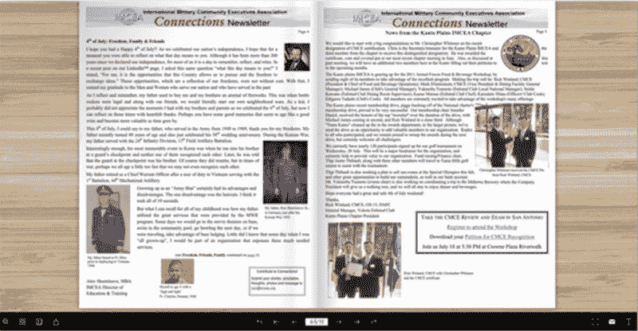
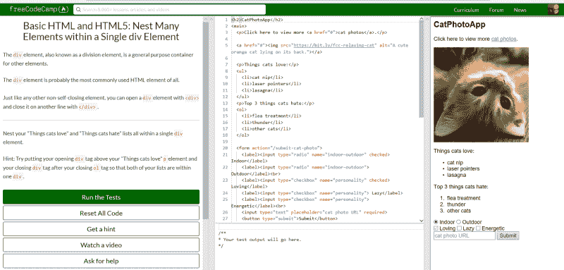
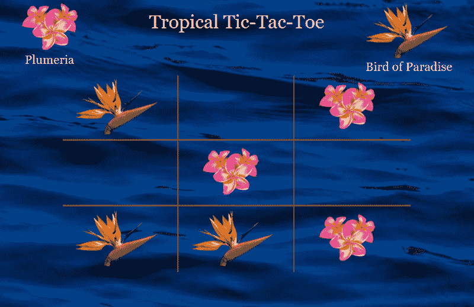
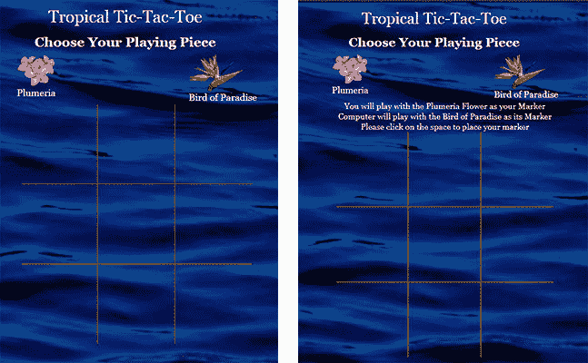
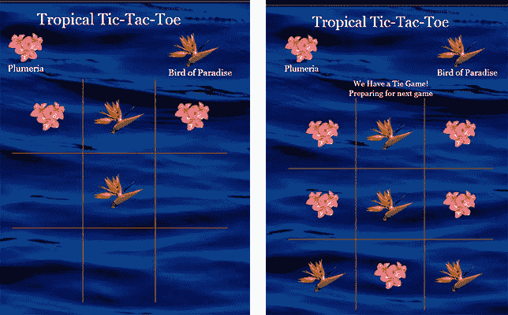

# 无论你是在开发一门课程还是学习编码，你都需要知道你是如何学习的

> 原文：<https://www.freecodecamp.org/news/developing-engaging-courses-as-well-as-learning-to-code-requires-an-understanding-of-learning-5be7e5380b96/>

亚历克斯·肖特斯维

# 无论你是在开发一门课程还是学习编码，你都需要知道你是如何学习的

无论是营利性还是非营利性的公司和机构都在扩张。与 20 年前相比，今天不仅有更多的跨国公司，他们的员工和雇员基础也在增长。苹果和现在的亚马逊成为了第一批万亿美元的公司。随着这种类型的扩张，需要培训和发展他们的劳动力。虽然他们的成长很大程度上是由于技术的发展，但是同样的技术创新也可以用来训练他们。现在，人们关心的是能否在各个国家和大洲培训成千上万的工人。

技术让你能够接触到他们，但产生所需的培训结果是一个不同的问题。拥有数千名员工也能像拥有数百名员工一样高效，但这可能需要异步进行。因此，你保持听众参与、兴趣和学习的能力变得更加重要。

然而，正如我们将会发现的那样，个人使用各种各样的学习方式进行学习。因此，以多种形式开发在线课程也很重要。

您还会发现，当您学习编码时，这种方法会工作得很好。

### **参与式课程的好处**

创建一个引人入胜的课程有时会很困难，因为内容可能很复杂，难以理解，或者很冗长。此外，在线课程的开发方式只能用“无聊”来形容像这样的课程是为什么许多人不会完成培训，尝试并快速通过它，或者被动地听，以便保持最小。

尽管许多培训课程仍然通过[讲师指导培训](https://en.wikipedia.org/wiki/Instructor-led_training)现场进行，但现在越来越多的课程已经转变为在线课程，或者是现场讲师指导和在线课程相结合的混合形式。

如果你有一个有魅力的教练，培训课程仍然可以吸引人，即使它缺乏一些基本的设计特点。让我们面对现实吧，不是每个人都有魅力，这就改变了对课程本身的关注。但是要接触到大量的观众，混合或在线成为一个要求。

现在想象一下，如果你以一种非常吸引人的方式开发在线课程。如果是这样，你可以期待几个好处开始显现出来。这些可以包括:更高的完成率、更好的保留结果、增强的员工士气和动力、对他们为什么要参加课程的清楚理解以及改进的绩效结果。

你如何设计你的培训课程，与拥有一位魅力四射的讲师相比，影响一样大，甚至更大。在你决定如何让你的课程引人入胜之前，你需要决定课程的形式。

如果是混合的，那么这将需要一些课程在线进行。如果你选择课程完全在线，那么你可以选择同步或异步，或者两者兼而有之。

### 起初

回想一下你一年级或二年级的时候。当你刚刚开始把两个和两个放在一起，形成单词和句子。当你在学习阅读和识别单词“苹果”时，老师会把它写在黑板上，然后发音并要求你重复。然后她很可能会在黑板上画一个苹果的图像。最后，为了传达信息，她会把一个真实的苹果传给所有的学生，这样他们就可以通过它的质地、重量和颜色来进一步识别它。

不幸的是，随着你从小学，最终到高中和大学，突出的教学形式是讲座形式——以及大量的阅读材料，如昂贵的教科书。换句话说，小时候的教学模式包括视觉、听觉(音频)、阅读和写作以及动觉——今天还没有这么多。

研究员、前学校教师和行政人员尼尔·弗莱明(Neil Fleming)开发了一种方法，称为 [VARK](http://vark-learn.com/the-vark-questionnaire/) (视觉、听觉、读/写、动觉)，来识别个人如何学习。此外，它还导致了对个人如何教学的理解。弗莱明发现，每当教师使用多模态(所有四种模态:视觉、听觉、读/写和动觉)方法进行教学时，学生比不使用多模态方法的教师得分更高，并能记住更多信息。因此，在课程的教学设计中使用 VARK 方法是有意义的。

使用 VARK 最初可能是一个简单的过程。首先，您必须了解每种形式如何与您的课程格式以及用于创建材料和后续用户体验的软件协同工作。今天的技术允许你用这些不同的方式来设计你的课程。请记住，每个用户学习的方式不同，因此以多模态的方式开发您的课程可以在用户保留和知识实施方面获得巨大的红利。让我们看一些例子来说明如何做到这一点。

有几种类型的教学设计软件可以用来开发你的课程和利用这些不同的形式。在我们研究这些之前，让我们先确认一下每一种形式可能包含的内容。

视觉可以包括以下任何内容:视频、图片、流程图和图表。

**听觉**指音频讲座、旁白、音效、双向讨论。

**读/写**可以包括教科书、手册、清单、术语和定义。

**动觉**将包括用户需要参与的互动或模拟演示等形式。它还可以包括原则的应用和现实生活中的例子的应用，例如在案例研究或个人经历的回顾中。

现在，我们对每种学习方式都有了更好的理解，我们现在可以看看如何设计我们的在线课程来包含它们。当然，有各种电子学习和其他多媒体工具可以用来创建您的材料。我个人喜欢用[清晰的故事情节](https://articulate.com/)、 [Adobe Captivate](https://www.adobe.com/products/captivate.html) 、 [Lectora Online](https://lectoraonline.com/app/BN00144/product.html) 、 [TechSmith Camtasia](https://www.techsmith.com/video-editor.html) 和 [TechSmith Snagit](https://www.techsmith.com/screen-capture.html) 。

### v 代表视觉

考虑一下，如果你的一些用户能看到你的材料的图表或图画，他们会有所反应并更好地参与其中。虽然关于 PowerPoint 已经说了很多，而且并不都是好的，但是它可以作为你许多学习课程的基础。

视觉形式中包括你的设计主题的选择。这是我做的一个关于食品安全的演示的例子，使用了一个抓住想象力的设计。

不仅仅是列出或描述调查结果，以更直观的形式描述调查结果可以引发对调查结果的更多讨论和评论。

### a 代表听觉

Button is only an image

有几种方法可以将音频整合到您的电子教学中。你可以加入播客录音或其他讨论和演示的链接，如 [TED Talks](https://www.ted.com/talks) ，让用户听到正在讨论的内容。

此外，还有各种各样的现场讨论演示，也可以使用诸如 [Adobe Connect](https://www.adobe.com/products/adobeconnect.html) 、 [WebEx](https://www.webex.com/) 和 [GoToMeeting](https://www.gotomeeting.com/) 等工具进行整合。这些类型的会议软件允许听众通过在聊天室中键入他们的评论或者使用他们自己的麦克风直接与演讲者交谈来参与。

### r 代表读/写

是的，这听起来像是旧的传统字体集文档，但是有了今天的技术，您可以在更加愉快的体验中创建用户友好的文本。此外，使用论坛可以让害羞的用户表达自己。

如果你记得看过哈利波特电影，在其中一个场景中，哈利正在看报纸，但报纸上的图像实际上是移动的。在上面的例子中，我使用了来自 [FlipBuilder](http://www.flipbuilder.com/) 的软件来增强我的时事通讯，并允许用户虚拟地改变页面。

您还可以添加视频链接，使您的文本生动起来。

### k 代表动觉

现在你可能想知道我们如何虚拟地做到这一点。这比你想象的要容易。幸运的是，通过前面提到的许多工具，您可以将用户参与融入到您的学习中。虽然您可以开发这样的示例，如用户将图像或文本拖动到屏幕上的特定位置的拖放，或者用户必须在图像上选择正确位置的热点，但它也可以包括论坛。

动觉方法还包括“个性化”这将包括在论坛上的讨论，要求用户写下反映问题的经历。更进一步的是使用虚拟现实和增强现实软件，用户沉浸在他们的世界中，允许他们与它的功能进行交互。这创造了一个模拟他们的环境。

在最近一篇名为[“为什么员工虚拟现实培训正在流行](https://www.shrm.org/resourcesandtools/hr-topics/technology/pages/why-virtual-reality-training-for-employees-is-catching-on.aspx)”的文章中，作者 Davor Gaspervic 写道，不同行业中有多少组织正在采用这种类型的动觉方法。

### 学习编码

为了更深入地了解这些不同的教学设计方法和软件系统是如何构建的，我们必须简单地看看用来创建它们的不同编程语言。

作为学习编码的学生，理解 VARK 的概念是非常有益的。编码时需要考虑的两个方面是用户界面(UI)和用户体验(UX)。这两者都要求编码者考虑用户如何导航和操作各种软件和网站。记住，VARK 代表视觉、听觉、读写和动觉。现在想想现有的各种计算机语言，以及每种语言如何增强用户界面和 UX。

这些知识如何帮助学生编码？VARK 也可以帮助学生学习许多新的语言。例如，如果您刚刚开始学习如何编写代码，您将很快发现 HTML5 和 CSS 可以反映 VARK 的视觉和读写部分，但 JavaScript 肯定包含听觉和动觉方法。JavaScript 允许您为游戏创建交互式内容，并帮助开发音频和视频演示。

至于学习如何用这些语言写作，学生需要考虑他们如何学习。然后找到使用学习材料的方法，这些材料解释了如何以他们喜欢的学习方式编码。换句话说，寻找视频、播客、印刷教程，以及让你将编码付诸实践的练习。

你们中的许多人可能已经知道，对于那些不知道的人， [freeCodeCamp](https://www.freecodecamp.org/) 为他们的编码学生提供了这些不同的学习方式。我自己也是学生，很快就发现了这个道理。更明显的是你如何学习的平台。

正如你在左边看到的，你有你的书面指示。但是如果您需要帮助，您只需点击“观看视频”,即可观看和收听更多内容。这涉及到 VARK 的视觉、听觉和读写部分。通过在中间输入代码解决方案，并在右边看到您的结果，动觉和视觉方法将得到演示。

更明显的是，作为认证过程的一部分，你被要求创建的项目将如何要求你利用和展示你在多模态方法中的设计能力。

例如，在一个名为“井字游戏”的项目中，你被要求开发一个游戏，其中用户需要将他们的图标排成三行才能赢得游戏。用户将不仅看到它的视觉方面，他们将听到一个旋律，当他们赢了，输了或平了游戏。他们参与这个游戏的事实涉及到动觉方法。

(Courtesy of @[konikodes](https://codepen.io/KoniKodes/full/KqyLML/))

所以，下一次你开始编写代码来创建某种类型的游戏，比如这个例子，或者开发你的第一个网站，记住 UI 和 UX。通过在你的演示中使用所有的学习方式，你的用户会喜欢你的网站或游戏。

此外，当你学习编码时，不要忘记发现你是如何学习的，然后寻找那些模态。VARK 本身允许学习者和教师以多种方式表达自己。点击链接了解你是如何学习的。请记住，下次你试图学习一门新的计算机语言时，要意识到这一点。

### 最后的想法

如果你正在考虑为你的员工、学生或顾客开发培训，使用任何可用的软件以一种引人入胜的方式开发培训是很重要的。在线课程不再需要一成不变、枯燥乏味。有了现在可用的不同技术，整合视觉、听觉、读/写和动觉这四种不同的学习方式应该不难。

发挥你的想象力，不仅要创造有趣的教程，还要有吸引力。在你制作出包含所有学习模式的引人入胜的材料之前，先把它应用到你自己的学习中——无论是编码、教学设计，还是你想发展的任何其他技能。