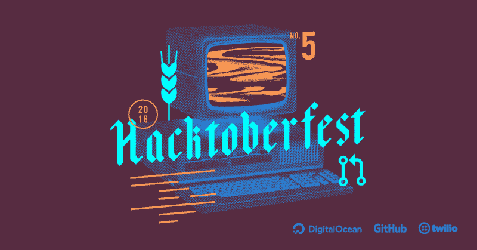
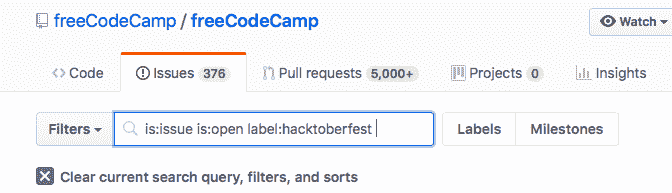

# 第一次参加 Hacktoberfest 我学到了什么

> 原文：<https://www.freecodecamp.org/news/the-results-of-dipping-my-toes-in-this-hacktoberfest-3def90987fcc/>

冒名顶替综合征是我们都在某种程度上与之斗争的问题。冒名顶替综合症是害怕暴露自己是个骗子。如果你和我一样，你会觉得你的作品不够好，不足以展示出来。或者你在作为一名开发人员的旅程中走得不够远，不能做出太多贡献。

去年了解了 Hacktoberfest 之后，我想做点贡献。但我感到不知所措，冒名顶替综合征开始占据上风。

我告诉自己，作为一名开发人员，我太缺乏经验了，我担心我的提交不值得。不幸的是，我让那些恐惧战胜了我，我甚至懒得报名。

今年，我强迫自己把恐惧放在一边，研究了 Hacktoberfest 上的这篇文章，然后一头扎了进去。我将分享一些我所做的工作以及参与其中的好处。这些好处远远不止是得到一件衬衫，而且一年中有 12 个月都可以享受到！

Image: [twillo](https://www.twilio.com/blog/hacktoberfest-and-new-twilioquest-mission-here)

#### 我的黑客啤酒节经历

我从 10 月 11 日开始。这个月已经过了三分之一的时间，我开始时处于轻微的劣势。

时间紧迫激励了我。我决定在这个月的剩余时间里，每周五提交一次拉取请求。制定时间表很重要。一周中有两三天我专注于拉取请求，其余时间尽量不要给自己增加压力。不管你的目标有多远大，一个月五个拉请求或者一周五个拉请求:有一个计划是很重要的。

我的第一个拉请求是在 freeCodeCamp 上。我正在解决一些 JavaScript 算法的挑战。我注意到一个链接指向一个意想不到的位置。这是一个简单的修复，但它提供了一些必要的信心。那里确实有我可以解决的事情！

拉取请求很简单，我没有派生或克隆 freeCodeCamp 库，我直接在 GitHub 页面上打开了它。

吊杆第一拉请求打开。

我不希望所有五个拉请求都来自一个存储库(尽管这并没有错)。在 freeCodeCamp 上的一些拉取请求之后，我开始冒险探索 GitHub。

我从看我熟悉的项目开始。具体来说，我浏览了我经常使用的工具和项目，比如 Rails、React、Bootstrap 和 design 等等。只要有可能，我就会搜索带有“黑客啤酒节”、“第一次投稿”或“简单”标签的问题。

GitHub makes it easy to search through issues

对于更大的项目，有更多的贡献者。简单的问题往往会很快得到解决。我把搜索范围缩小到更小的仓库。

几年前，我和一个朋友为教授们建立了一个名为“AvalueMeuProfessor”的评论网站。在这个项目中，我发现了一个名为 [jQuery Raty 的库。](https://github.com/wbotelhos/raty)这个库可以很容易地将投票星添加到您的项目中。虽然它在 GitHub 上有 2000 多颗星星，但只有 21 个贡献者。它有几个未解决的问题。

Raty doing it’s thing…

尽我所能地改进，我提交了一个 pull 请求，为项目增加了价值。这很重要。拉取请求的大小或范围并不重要，但它应该为项目提供价值。几个小时就合并到项目里了。

尽管我只修复了文档中的拼写错误，但我对这个库的工作方式有了新的理解。这也让我更加欣赏这个项目和它的维护者。

在使用 Rails 和 Raty 应用程序的过程中，我偶然发现了一颗废弃的红宝石。它将 jQuery Raty 服务于 Rails 资产管道:简单但有用。有一些未解决的问题，但是自述文件清楚地表明该项目已被放弃。

再说一次，这是一个理想的项目，因为它的范围很小，项目活动很少…没有。

我分叉了存储库，并开始更新 gem，使其与 Rails 5 兼容。在这个过程中，我了解了一点关于资产管道的知识，以及 Rails gems 是如何工作的。我读了几篇关于创造宝石的文章，否则我永远不会看到。在这个过程中，我接触到了最初的创造者。他对管理这个项目不再感兴趣，我接管了它。现在它被保存在[我的叉子](https://github.com/tfantina/jquery-raty-rails)上。

尽管我最初对捐款不太放心，但我还是冒险推动了自己。我本来想要一件衬衫，但结果多了一件。我能够:

*   在公共回购中提交我的第一个拉请求
*   了解很多关于红宝石的知识
*   接管宝石的维护工作
*   对我使用多年的一些工具和资源有了新的认识
*   提高我这个月的平均提交量(很多)
*   在 GitHub 上和通过 CLI 使用 Git 变得更加自如

Hacktoberfest gets it done! (From [https://hacktoberfest.digitalocean.com](https://hacktoberfest.digitalocean.com))

最重要的是，我参加 Hacktoberfest 使我成为一名更好的开发人员，并有更大的贡献愿望。我已经看到在这些项目中有新的贡献者的空间。

你可能想做出贡献，但担心自己不够好或不知道从哪里开始。但是为开源回购做贡献的不仅仅是有多年经验的资深开发者。为项目做贡献是提高技能、获得自信和练习编码的好方法。虽然找到合适的项目可能需要一点搜索，但这是非常值得的。