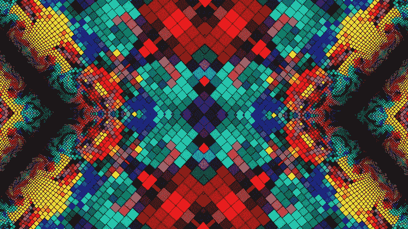
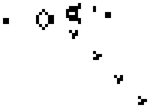
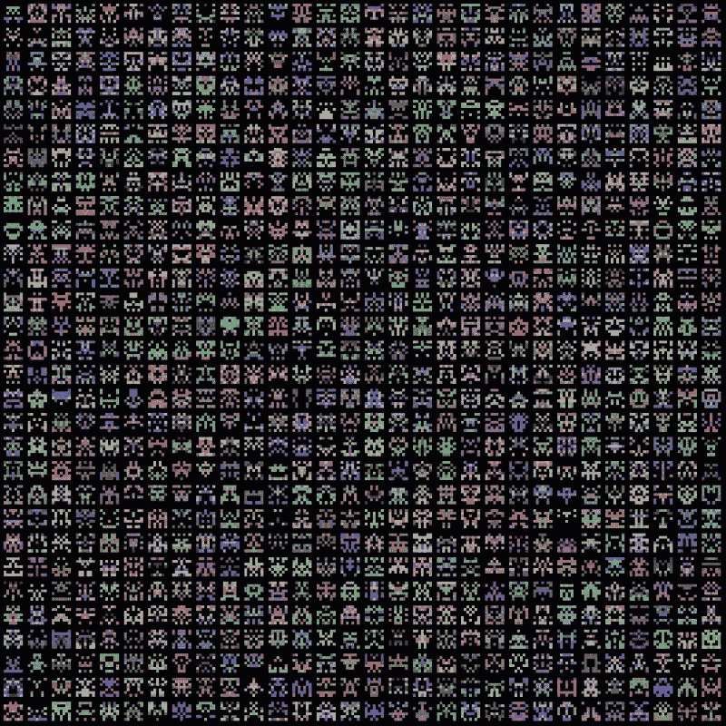
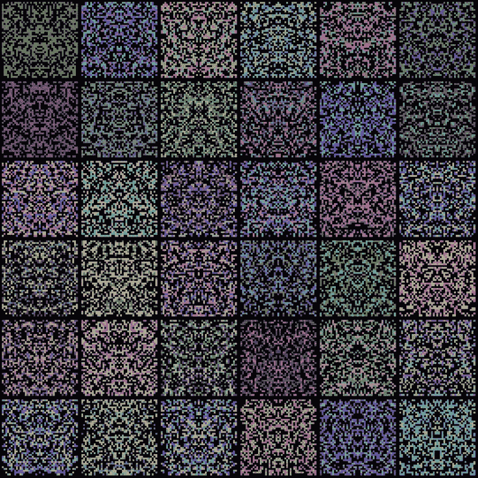
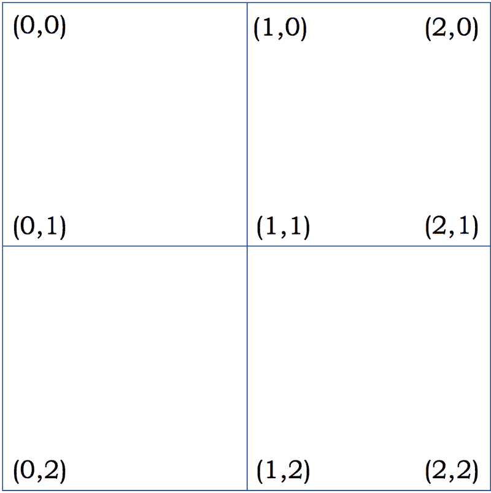
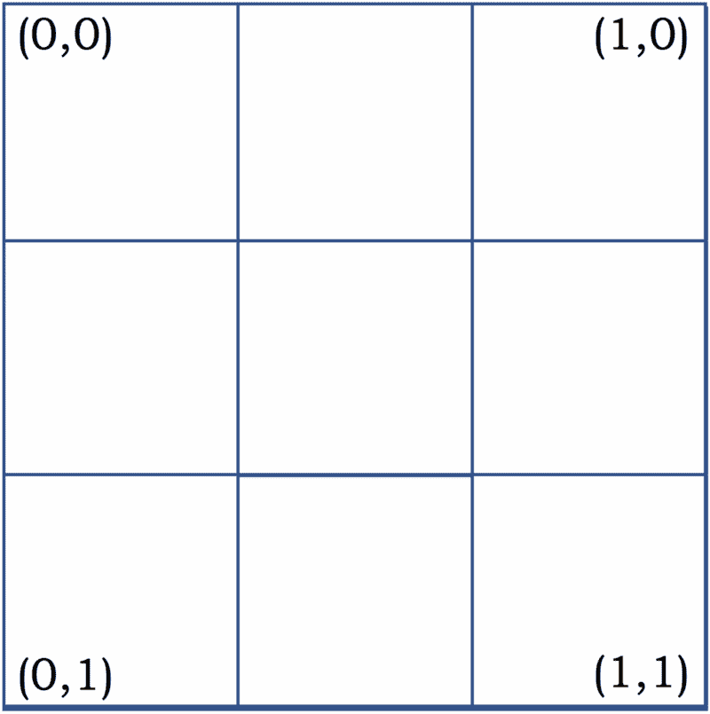
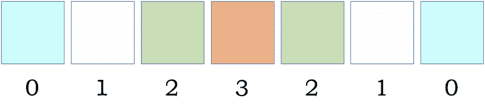
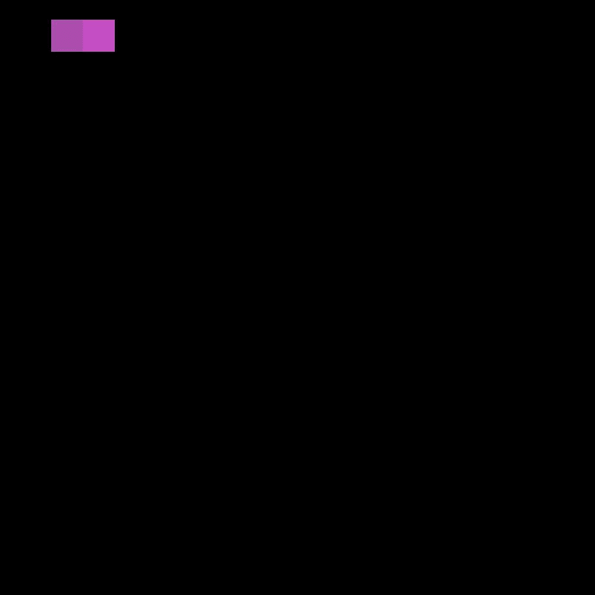

# 如何用不到 100 行代码创建生成性艺术

> 原文：<https://www.freecodecamp.org/news/how-to-create-generative-art-in-less-than-100-lines-of-code-d37f379859f/>

埃里克·戴维森

# 如何用不到 100 行代码创建生成性艺术

与任何编程主题一样，如果你从未尝试过，生成艺术可能会令人生畏。我一直对它很感兴趣，因为我喜欢寻找新的方法来创造性地利用编程。此外，我认为任何人都可以欣赏艺术作品的概念。



Labeled for reuse from Pexels

### 什么是生成艺术？

生成艺术是一个系统的输出，这个系统对作品做出自己的决定，而不是人类。这个系统可以像一个单独的 Python 程序一样简单，只要它有**规则**和某些方面的**随机性。**

对于编程来说，制定规则和约束非常简单。所有的条件语句都是如此。话虽如此，找到让这些规则创造出有趣的东西的方法可能会很棘手。



Conway’s Game of Life (Labeled for reuse)

生命的[游戏](https://en.wikipedia.org/wiki/Conway%27s_Game_of_Life)是一套著名的四个简单规则，决定了系统中每个细胞的“生”和“死”。每一条规则都在每一代人推进系统的过程中发挥了作用。虽然规则简单易懂，但复杂的模式很快就会出现，并最终形成迷人的结果。

规则可能是创造有趣事物的基础，但即使像康威的《生活游戏》这样令人兴奋的东西也是可以预测的。因为这四个规则是每一代的决定因素，所以产生不可预见结果的方法是在细胞的起始状态引入随机化。从随机矩阵开始将使每次执行都是独特的，而不需要改变规则。

生成性艺术的最好例子是那些找到可预测性和随机性的结合，以创造出一些有趣的东西，而这些东西在统计学上是不可复制的。

### 你为什么要尝试？

并非所有的副业都是平等的，你可能不愿意花时间在生殖艺术上。但是，如果您决定参与一个项目，那么您可以期待这些好处:

*   体验——艺术创造只是磨练新老技能的又一个机会。它可以作为实践算法、数据结构甚至新语言等概念的门户。
*   有形的结果——在编程世界里，我们很少能看到我们的努力带来任何有形的东西，至少我看不到。现在，我的客厅里有几张海报，展示我的生殖艺术作品，我喜欢编程对此负责。
*   有吸引力的项目——我们都有过向某人解释个人项目的经历，甚至可能是在面试中，却没有一种简单的方式来传达项目的努力和结果。生成艺术是不言自明的，大多数人都会被你的创作所打动，即使他们不能完全理解其中的方法。

### 你应该从哪里开始？

开始创作艺术和任何项目都是一样的过程，最关键的一步是提出一个想法或找到一个可以建立的想法。一旦你心中有了目标，你就可以开始研究实现目标所需的技术。

我的大部分生成艺术项目都是用 Python 完成的。这是一种相当容易习惯的语言，它有一些令人难以置信的软件包可以帮助图像处理，例如 [Pillow](https://pillow.readthedocs.io/en/5.3.x/) 。

幸运的是，您不需要搜索太多的起点，因为我在下面提供了一些代码供您使用。

### 子画面生成器

当我看到一个展示用 Javascript 编写的精灵生成器的帖子时，这个项目开始了。该程序创建了 5x5 像素的艺术精灵，带有一些随机的颜色选项，其输出类似于多色空间入侵者。

我知道我想用 Python 练习图像处理，所以我想我可以试着自己重新创造这个概念。此外，我认为我可以对它进行扩展，因为原始项目在精灵的大小上是如此有限。我希望不仅能够指定大小，还能够指定它们的数量，甚至图像的大小。

下面是我最终得到的解决方案的两个不同输出:



7x7–30–1900



43x43–6–1900

这两幅图像一点也不相似，但它们都是同一个系统的结果。更不用说，由于图像的复杂性和 sprite 生成的随机性，即使有相同的参数，这些图像也很有可能永远是独一无二的。我喜欢它。

### 环境

如果你想开始使用精灵生成器，首先要做一些基础工作。

用 Python 建立一个合适的环境可能很棘手。如果你以前没有使用过 Python，你可能需要下载 Python 2.7.10。我最初在设置环境时遇到了麻烦，所以如果你开始遇到问题，你可以像我一样查看[虚拟环境](https://packaging.python.org/guides/installing-using-pip-and-virtualenv/)。最后但同样重要的是，确保你也安装了[枕头](https://pillow.readthedocs.io/en/5.3.x/installation.html)。

一旦设置好环境，就可以将我的代码复制到扩展名为。py 并使用以下命令执行:

```
python spritething.py [SPRITE_DIMENSIONS] [NUMBER] [IMAGE_SIZE]
```

例如，从上面创建第一个子画面矩阵的命令是:

```
python spritething.py 7 30 1900
```

### 代码

```
import PIL, random, sysfrom PIL import Image, ImageDraw
```

```
origDimension = 1500
```

```
r = lambda: random.randint(50,215)rc = lambda: (r(), r(), r())
```

```
listSym = []
```

```
def create_square(border, draw, randColor, element, size):  if (element == int(size/2)):    draw.rectangle(border, randColor)  elif (len(listSym) == element+1):    draw.rectangle(border,listSym.pop())  else:    listSym.append(randColor)    draw.rectangle(border, randColor)
```

```
def create_invader(border, draw, size):  x0, y0, x1, y1 = border  squareSize = (x1-x0)/size  randColors = [rc(), rc(), rc(), (0,0,0), (0,0,0), (0,0,0)]  i = 1
```

```
 for y in range(0, size):    i *= -1    element = 0    for x in range(0, size):      topLeftX = x*squareSize + x0      topLeftY = y*squareSize + y0      botRightX = topLeftX + squareSize      botRightY = topLeftY + squareSize
```

```
 create_square((topLeftX, topLeftY, botRightX, botRightY), draw, random.choice(randColors), element, size)      if (element == int(size/2) or element == 0):        i *= -1;      element += i
```

```
def main(size, invaders, imgSize):  origDimension = imgSize  origImage = Image.new('RGB', (origDimension, origDimension))  draw = ImageDraw.Draw(origImage)
```

```
 invaderSize = origDimension/invaders  padding = invaderSize/size
```

```
 for x in range(0, invaders):    for y in range(0, invaders):      topLeftX = x*invaderSize + padding/2      topLeftY = y*invaderSize + padding/2      botRightX = topLeftX + invaderSize - padding      botRightY = topLeftY + invaderSize - padding
```

```
 create_invader((topLeftX, topLeftY, botRightX, botRightY), draw, size)
```

```
 origImage.save("Examples/Example-"+str(size)+"x"+str(size)+"-"+str(invaders)+"-"+str(imgSize)+".jpg")
```

```
if __name__ == "__main__":  main(int(sys.argv[1]), int(sys.argv[2]), int(sys.argv[3]))
```

这个解决方案离完美还有很长的路要走，但它表明创造艺术作品并不需要大量的代码。我会尽力解释关键的部分。

**main** 函数首先创建初始图像并确定精灵的大小。用于循环的两个*负责定义每个精灵的边界，基本上是将图像的尺寸除以所请求的精灵的数量。这些值用于确定每一个的坐标。*

让我们忽略填充，看看下图。假设四个正方形中的每一个都代表一个大小为 1 的精灵。传递给下一个函数的边界是指左上角和右下角的坐标。因此，左上角 sprite 的元组应该是(0，0，1，1)，而右上角的元组应该是(1，0，2，1)。这些将被用作每个精灵的正方形的尺寸和基本坐标。



Example of determining sprite borders

函数 **create_invader** 决定了 sprite 中每个方块的边界。确定边界的相同过程应用于此处，如下所示，只是我们使用预先确定的边界在内部工作，而不是完整的图像。每个方块的最终坐标将在下一个函数中使用，以实际绘制精灵。



Example of breaking down a 3x3 sprite

为了确定颜色，使用三个随机 RGB 元组和三个黑色的简单阵列来模拟 50%的被抽取机会。代码顶部附近的 lambda 函数负责生成 RGB 值。

这个函数的真正诀窍是创造对称性。每个方块都与一个元素值配对。在下图中，您可以看到元素值在到达中心时递增，然后递减。具有匹配元素值的正方形用相同的颜色绘制。



Element values and symmetrical colors for a row in a 7x7 sprite

当 **create_square** 从 **create_invader** 接收参数时，它使用队列和之前的元素值来确保对称性。第一次出现的值的颜色被推到队列中，镜像的方块弹出颜色。



The complete generation process

我意识到通读和理解其他人对问题的解决方案是多么困难，代码的粗糙肯定对其复杂性没有帮助，但希望您已经对它的工作原理有了相当好的了解。最终，如果你能够完全废弃我的代码，并找出一个完全不同的解决方案，那将是不可思议的。

### 结论

生成艺术需要时间来充分欣赏，但这是值得的。我喜欢能够将编程与更传统的视觉结合起来，我在我的每一个项目中都学到了很多东西。

总的来说，可能会有更多有用的项目可以追求，而生殖艺术可能不是你需要体验的东西，但它非常有趣，你永远不知道它会如何把你从人群中分离出来。

感谢您的阅读！