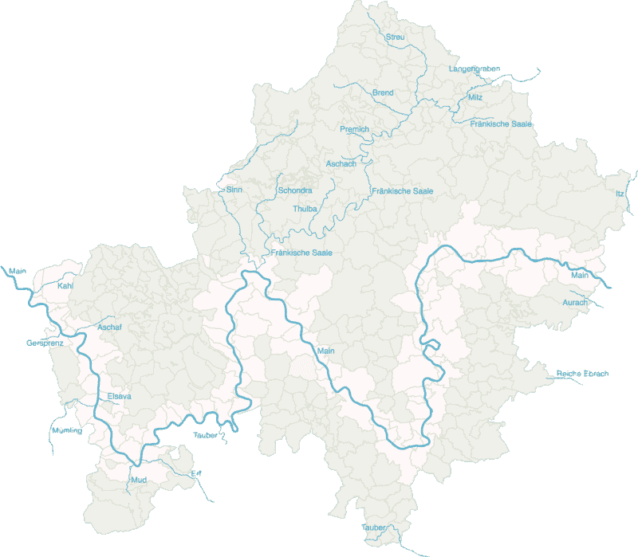
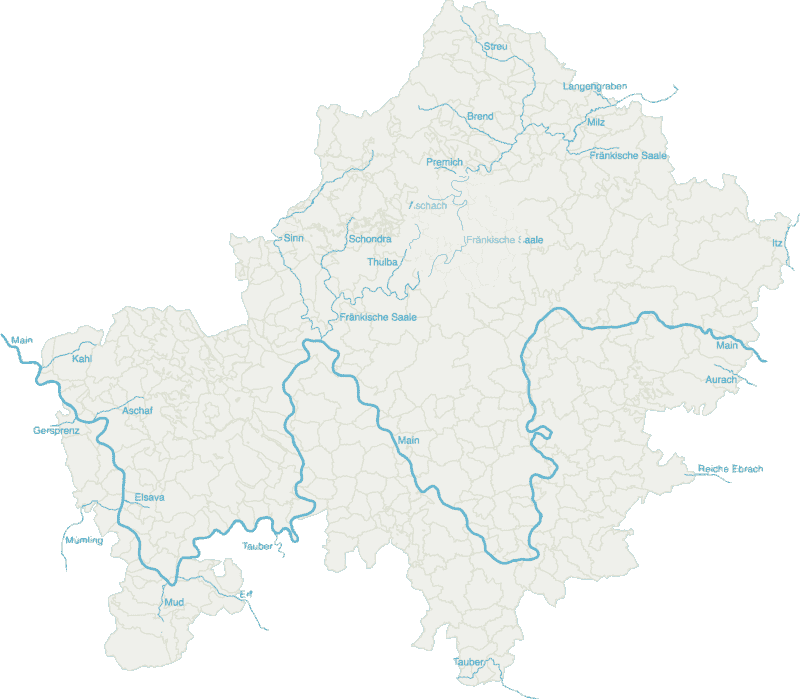
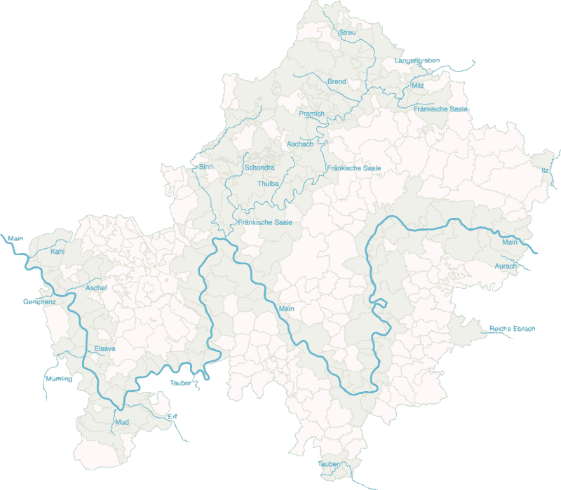

# 在 Unterfranken 搜索河流:如何使用 Elasticsearch 在地图上查找要素

> 原文：<https://www.freecodecamp.org/news/searching-for-rivers-in-unterfranken-how-to-use-elasticsearch-to-find-features-on-a-map-756017ff28c7/>

到 24 月 13 日工作组

# 在 Unterfranken 搜索河流:如何使用 Elasticsearch 在地图上查找要素


Photo by [Julien Lanoy](https://unsplash.com/photos/ROq3JeTKHyM?utm_source=unsplash&utm_medium=referral&utm_content=creditCopyText) on [Unsplash](https://unsplash.com/search/photos/river-bank?utm_source=unsplash&utm_medium=referral&utm_content=creditCopyText)

远程工作的好处之一是我可以在任何我想去的地方工作。因此，本月我把伦敦的城市办公桌换成了德国温泉小镇巴德基辛根的办公桌。

我也很喜欢用 [Elasticsearch](https://www.elastic.co/) 构建搜索引擎。在这篇文章中，我将探讨如何使用它来搜索地图上的要素。

### 搜索索引

坐在我的新书桌旁，我正在翻阅一本旧教科书。在后面，有一个索引。它告诉我某些关键词出现在哪些页面上。所以，如果我想读一些具体的东西，我可以很快找到相关的页码。如果没有索引，我将不得不浏览这本书的所有页面来找到我感兴趣的内容。

同样，当我们在互联网上搜索东西时——尽管我们可能没有意识到——我们很可能也在使用(更复杂的)索引来加快搜索速度。我们向索引提出问题，然后得到答案。更准确地说，关于 Elasticsearch，我们通过发送 RESTful API 请求来查询索引，以 [JSON](https://www.json.org/) 的形式。返回结果。

### JSON 家族

JSON 是一种常用的数据结构化格式。简而言之，它将数据表示为文本字符串中的名称/值对组。例如:

```
{  "city": "Erlangen",  "country": "Germany"},{  "city": "Würzburg",  "country": "Germany"}
```

简化后，我们的示例如下所示:

```
{"city":"Erlangen","country":"Germany"},{"city":"Würzburg","country":"Germany"}
```

我们通常关心数据字段的索引，比如产品记录，或者全文，比如博客文章。Elasticsearch 很好地处理了这些。它还可以索引空间数据:地图特征，如位置和边界。我们使用一种特殊的 JSON 来描述地图特征，称为 [GeoJSON](http://geojson.org/) 。看起来是这样的:

```
{  "type": "Feature",  "geometry": {    "type": "Point",    "coordinates": [49.792762, 9.939119]  },  "properties": {    "city": "Würzburg",    "country": "Germany"  }}
```

几何类型可以是:`Point`、`LineString`或`Polygon`。这些有多种类型:`MultiPoint`、`MultiLineString`、`MultiPolygon`。类似上述位置的几个特征可以包含在一个`FeatureCollection`中。

巴德基辛根是下弗兰肯地区的众多社区之一。像它的许多邻居一样，一条河流穿过它:frnkische Saale。社区的边界形成单一的形状；它映射到`Polygon`几何类型。组成这条河的水道可以想象成一系列连接在一起的线。它们映射到`MultiLineString`类型。

我在网上找到了一些下弗兰肯的地图。我可以将该地区的所有河流和社区处理成 [NDJSON](http://ndjson.org/) (换行符分隔——JSON 的另一种变体)。我创建了一个弹性搜索索引，并将数据加载到其中。现在我准备好搜索了。 *Gut，我们马晨一个人考试！*

### 寻找河流

一个简单的术语查询告诉我，在下弗兰科尼亚有 22 条河流和 360 个社区。在下载的数据中有更多的水道，但只有 22 条被定义为河流。是时候尝试一些更复杂的查询了。我将从该地区的主要河流梅因河开始，它在德语中听起来像是 *Mine* 。我想知道它流经多少个社区？我发送给索引的查询如下所示:

```
GET lower_franconia/default/_search{  "query": {    "bool": {      "filter": [        {          "term": {            "feature": "community"          }        },         {          "geo_shape": {            "geometry": {              "indexed_shape": {                "index": "lower_franconia",                "type": "default",                "id": "12",                "path": "geometry"              },              "relation": "intersects"            }          }        }      ]    }  }}
```

该查询正在`filter`上下文中运行。这意味着不计算相关性分数。我不关心事情匹配得如何，而是关心匹配是否存在。在这个上下文中，我指定了一个包含两个项目的数组。

在第一项中，我指定了一个带有社区特性作为约束的`term`键。这意味着只返回我的索引中在`feature`字段中值为`community`的文档。

在数组的第二项中，我有一个指定文档号为`12`(该文档描述了美因河)的`geo_shape`查询和一个作为约束的`intersects`关系。

简而言之，匹配与特定河流线相交的所有社区形状。

我得到了 91 次点击。所有社区的四分之一都在大草原上。结果被格式化为—是的，你猜对了— JSON。JSON 虽然可读性很强，但也不容易一看就懂。最好用 [d3.js](https://d3js.org/) 创建一个数据可视化，以便可以立即理解结果。



Hey Elasticsearch, which communities does the river Main flow through?

关于如何做到这一点的更多细节，请参阅我以前在网页制图学上发表的文章。

棕熊、黑熊和北极熊会相遇吗？
[*网页制图可以告诉我们*towardsdatascience.com](https://towardsdatascience.com/could-a-brown-bear-a-black-bear-and-a-polar-bear-meet-9b82f4a9948d)在哪里

接下来，附近有多少条河流？如果我今晚想在河边散步，但不想旅行，比如说十多公里，我有什么选择？



How many rivers are within ten kilometers of my desk?

有四个热门的回来了:阿斯恰赫河、弗兰基舍萨勒河，当然还有图尔巴河和普雷米赫河。这个查询与上一个略有不同。这次我只想要里弗斯回来。此外，我正在指定一个索引中不存在的新形状。一个以我当前位置为中心，半径为 10 公里的圆。

再来一杯。如果我想在河边散步，我不应该去哪里？对于这个查询，我使用一个`must_not`键来过滤掉与 22 条河流中任何一条河流相交的社区。我得到了 199 个点击——下弗兰科尼亚超过一半的社区没有河流。



Which communities do not have a river?

### 真实世界应用

我使用了下弗兰科尼亚的河流和社区作为一个简单的例子来说明如何使用 Elasticsearch 索引地图要素，以及如何使用 d3.js 可视化查询结果。

它能有实际应用吗？嗯，这个指数可以用来，例如，找出如果一条特定的河流发出了洪水警报，应该警告哪些社区。也许它可以用于干旱地区，预测干旱可能给农业带来的问题。

当然，我们并不局限于河道和社区边界。地图要素的任何组合都可以被映射和索引，因此有许多可能的应用。

*日期:[【开放街道地图】](https://www.geofabrik.de) + [拜仁州开放数据门户](https://opendata.bayern.de)*

*最初发表于 [24ma13wg.github.io](https://24ma13wg.github.io/searching-for-rivers-in-unterfranken/page.html) 。*