# 如何使用 Python 的 Flask 和 Google App Engine 构建 web 应用程序

> 原文：<https://www.freecodecamp.org/news/how-to-build-a-web-app-using-pythons-flask-and-google-app-engine-52b1bb82b221/>

特里斯坦·甘瑞

#### 这是一个为初学者学习 Flask、API 和 Google App Engine 的小教程项目。

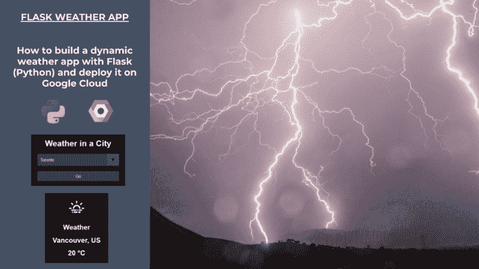

如果你想用 Python 在很短的时间内构建 web 应用，那么 [Flask](http://flask.pocoo.org/) 是一个极好的选择。

Flask 是一个小而强大的 web 框架(也称为“[微框架](https://en.wikipedia.org/wiki/Microframework)”)。它也非常易学，编码简单。根据我的个人经验，作为初学者开始很容易。

在这个项目之前，我对 Python 的了解大多局限于数据科学。然而，我能够在短短几个小时内构建这个应用程序并创建这个教程。

在本教程中，我将向您展示如何使用 API 构建一个包含一些动态内容的简单天气应用程序。本教程是初学者的一个很好的起点。您将学习从 API 构建动态内容，并将其部署在 Google Cloud 上。

最终产品可在处查看[。](http://weatherv2-220201.appspot.com/)

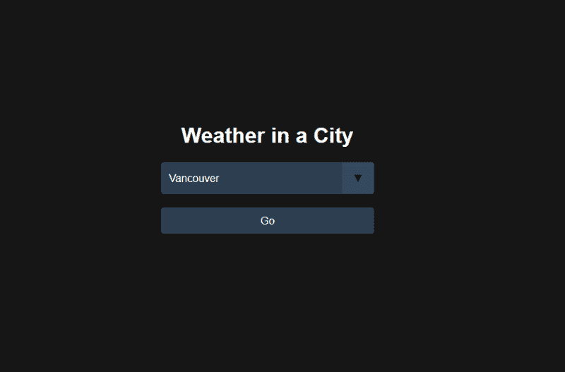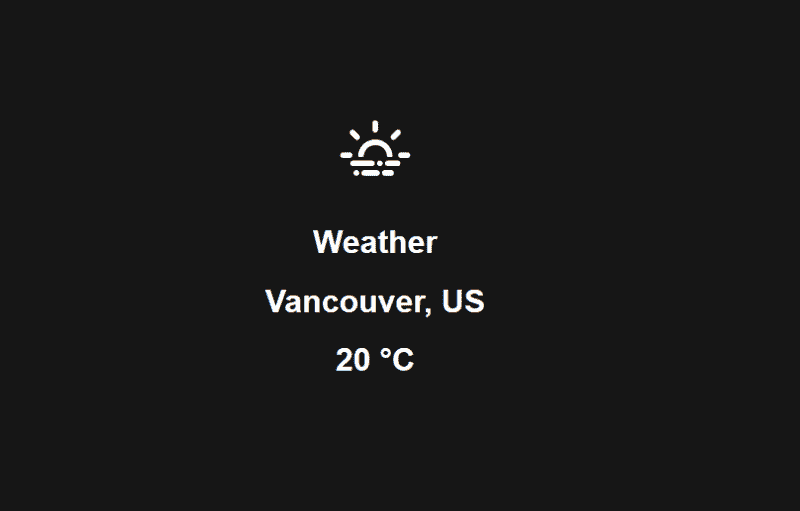

要创建一个天气应用程序，我们需要从[打开天气地图](https://openweathermap.org/api)请求一个 API 键。免费版每分钟最多可以打 60 个电话，对于这个应用来说绰绰有余。打开的天气图条件图标不是很漂亮。我们将用来自[埃里克·弗劳尔斯](https://erikflowers.github.io/weather-icons/)的 200 多个天气图标来代替它们。


本教程还将涵盖:(1)基本的 CSS 设计，(2)使用 Jinja 的基本 HTML，(3)在 Google Cloud 上部署 Flask 应用程序。

我们将采取的步骤如下:

*   **步骤 0:** 安装 Flask(本教程不包括 Python 和 PIP 安装)
*   **步骤 1:** 构建 App 结构
*   **步骤 2:** 使用 API 请求创建主应用程序代码
*   **第三步:**用 [Jinja](http://jinja.pocoo.org/) 、HTML 和 CSS 为应用程序创建两个页面(主页面和结果页面)
*   **步骤 4:** 在本地笔记本电脑上部署和测试
*   **第五步:**在 Google Cloud 上部署。

#### **步骤 0——安装 Flask 和我们将在虚拟环境中使用的库。**

我们将使用虚拟环境来构建这个项目。但是我们为什么需要一个呢？

使用虚拟环境，您可以为每个项目创建特定的本地环境。您可以选择想要使用的库，而不会影响您的笔记本电脑环境。随着您在笔记本电脑上编写更多的项目，每个项目将需要不同的库。由于每个项目有不同的虚拟环境，您的系统和项目之间或者项目之间不会有冲突。

*   以管理员权限运行命令提示符(cmd.exe)。不使用管理员权限将阻止您使用 pip。

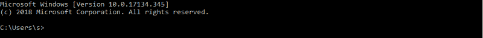

*   (可选)使用 PIP 安装 virtualenv 和 virtualenvwrapper-win。如果您已经有了这些系统库，请跳到下一步。

```
#Optionalpip install virtualenvwrapper-winpip install virtualenv
```


*   创建一个名为“WeatherApp”的文件夹，并创建一个名为“venv”的虚拟环境(这可能需要一些时间)

```
#Mandatorymkdir WeatherAppcd WeatherAppvirtualenv venv
```

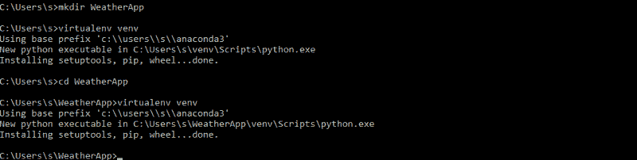

*   在 Windows 上使用“调用”激活您的虚拟环境(与 Linux 上的“源”相同)。这一步将您的环境从系统更改为项目本地环境。

```
call venv\Scripts\activate.bat
```


*   在 WeatherApp 文件夹中创建一个 requirements.txt 文件，其中包含 Flask 和我们需要的其他库，然后保存该文件。需求文件也是一个很好的工具，可以跟踪你在项目中使用的库。

```
Flask==0.12.3click==6.7gunicorn==19.7.1itsdangerous==0.24Jinja2==2.9.6MarkupSafe==1.0pytz==2017.2requests==2.13.0Werkzeug==0.12.1
```

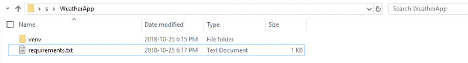

*   安装需求及其依赖项。现在，您已经准备好构建您的 WeatherApp 了。这是创建本地环境的最后一步。

```
pip install -r requirements.txt
```

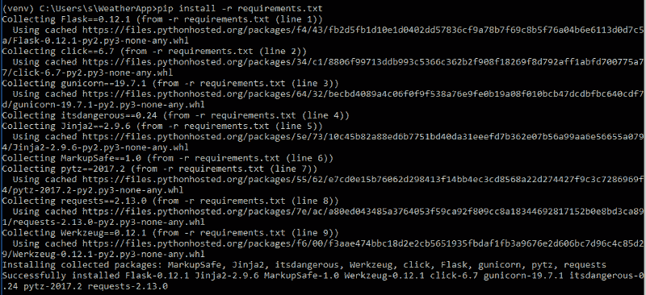

#### **步骤 1——构建应用程序结构**

你保护了当地的环境。您现在可以专注于开发您的应用程序。这一步是为了确保正确的文件夹和文件结构。下一步将处理后端代码。

*   创建两个 Python 文件(main.py，weather.py)和两个文件夹(static 带有一个子文件夹 img，templates)。


#### **第 2 步——使用 API 请求创建主应用程序代码(后端)**

建立好结构后，您就可以开始编写应用程序的后端代码了。Flask 的“Hello world”示例只使用了一个 Python 文件。本教程使用两个文件来帮助你熟悉如何将函数导入到你的主应用程序中。

main.py 是将用户路由到主页和结果页面的服务器。weather.py 文件创建一个带有 API 的函数，该函数根据所选城市检索天气数据。该函数填充结果页面。

*   使用以下代码编辑 main.py 并保存

```
#!/usr/bin/env pythonfrom pprint import pprint as ppfrom flask import Flask, flash, redirect, render_template, request, url_forfrom weather import query_api
```

```
app = Flask(__name__)
```

```
@app.route('/')def index():    return render_template(        'weather.html',        data=[{'name':'Toronto'}, {'name':'Montreal'}, {'name':'Calgary'},        {'name':'Ottawa'}, {'name':'Edmonton'}, {'name':'Mississauga'},        {'name':'Winnipeg'}, {'name':'Vancouver'}, {'name':'Brampton'},         {'name':'Quebec'}])
```

```
@app.route("/result" , methods=['GET', 'POST'])def result():    data = []    error = None    select = request.form.get('comp_select')    resp = query_api(select)    pp(resp)    if resp:       data.append(resp)    if len(data) != 2:        error = 'Bad Response from Weather API'    return render_template(        'result.html',        data=data,        error=error)
```

```
if __name__=='__main__':    app.run(debug=True)
```

*   在开放天气地图上申请免费 API 密钥

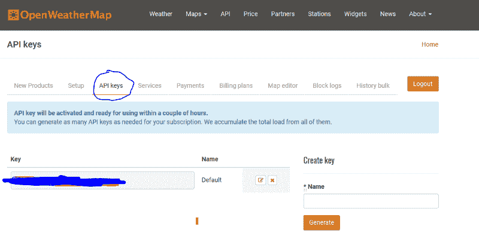

*   用以下代码编辑 weather.py(更新 API_KEY)并保存

```
from datetime import datetimeimport osimport pytzimport requestsimport mathAPI_KEY = 'XXXXXXXXXXXXXXXXXXXXXXXXXXX'API_URL = ('http://api.openweathermap.org/data/2.5/weather?q={}&mode=json&units=metric&appid={}')
```

```
def query_api(city):    try:        print(API_URL.format(city, API_KEY))        data = requests.get(API_URL.format(city, API_KEY)).json()    except Exception as exc:        print(exc)        data = None    return data
```

#### **步骤 3——用 [Jinja](http://jinja.pocoo.org/) 、HTML 和 CSS(前端)**创建页面

这一步是关于创建用户将看到的内容。

HTML 页面 weather 和 result 是后端 main.py 将路由到的页面，并给出可视化结构。CSS 文件将带来最后的润色。本教程没有 Javascript(前端是纯 HTML 和 CSS)。

这是我第一次使用 [Jinja2](http://jinja.pocoo.org/) 模板库来填充 HTML 文件。它让我惊讶的是，它是多么容易带来动态图像或使用功能(如四舍五入天气)。绝对是一个神奇的模板引擎。

*   在模板文件夹中创建第一个 HTML 文件(weather.html)

```
<!doctype html><link rel="stylesheet" type="text/css" href="{{ url_for('static', filename='style.css') }}">
```

```
<div class="center-on-page">  <h1>Weather in a City</h1>
```

```
<form class="form-inline" method="POST" action="{{ url_for('result') }}">   <div class="select">    <select name="comp_select" class="selectpicker form-control">         <option value="{{ o.name }}">{{ o.name }}</option>        </select>   </div>    <button type="submit" class="btn">Go</button></form>
```

*   在模板文件夹中创建第二个 HTML 文件(result.html)

```
<!doctype html>
```

```
<link rel="stylesheet" type="text/css" href="{{ url_for('static', filename='style.css') }}">
```

```
<div class="center-on-page">
```

```
     <h1>   </h1>  <h1>Weather</h1> <h1>{{ d['name'] }}, {{ d['sys']['country'] }}</h1>    <h1>{{ d['main']['temp']|round|int}} °C</h1>
```

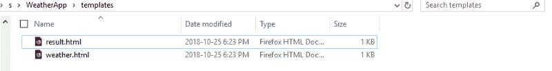

*   在静态文件夹(style.css)中添加一个 CSS 文件

```
body {  color: #161616;  font-family: 'Roboto', sans-serif;  text-align: center;  background-color: currentColor;}.center-on-page {  position: absolute;  top:50%;  left: 50%;  transform: translate(-50%,-50%);}h1 {  text-align: center;  color:#FFFFFF;}img {  vertical-align: middle; }/* Reset Select */select {  -webkit-appearance: none;  -moz-appearance: none;  -ms-appearance: none;  appearance: none;  outline: 0;  box-shadow: none;  border: 0 !important;  background: #2c3e50;  background-image: none;}/* Custom Select */.select {  position: relative;  display: block;  width: 20em;  height: 3em;  line-height: 3;  background: #2c3e50;  overflow: hidden;  border-radius: .25em;}select {  width: 100%;  height: 100%;  margin: 0;  padding: 0 0 0 .5em;  color: #fff;  cursor: pointer;}select::-ms-expand {  display: none;}/* Arrow */.select::after {  content: '\25BC';  position: absolute;  top: 0;  right: 0;  bottom: 0;  padding: 0 1em;  background: #34495e;  pointer-events: none;}/* Transition */.select:hover::after {  color: #f39c12;}.select::after {  -webkit-transition: .25s all ease;  -o-transition: .25s all ease;  transition: .25s all ease;}
```

```
button{  -webkit-appearance: none;  -moz-appearance: none;  -ms-appearance: none;  appearance: none;  outline: 0;  box-shadow: none;  border: 0 !important;  background: #2c3e50;  background-image: none;  width: 100%;  height: 40px;  margin: 0;  margin-top: 20px;  color: #fff;  cursor: pointer;  border-radius: .25em;}.button:hover{  color: #f39c12;}
```

*   静态下载 img 子文件夹中的图像

与 [Github](https://github.com/tristanga/WeatherApp_Image) 上的图片链接:

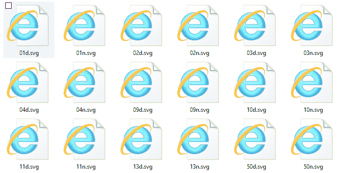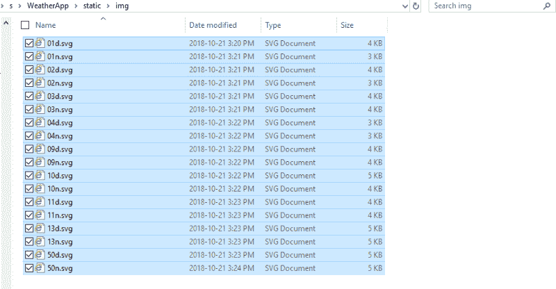

#### **步骤 4 —本地部署和测试**

在这个阶段，您已经设置了环境、结构、后端和前端。剩下的唯一事情就是启动你的应用程序，并在你的本地主机上享受它。

*   用 Python 启动 main.py 就行了

```
python main.py
```

*   用你的网络浏览器(Chrome，Mozilla 等)进入 cmd 上建议的本地主机链接。).您应该可以在本地笔记本电脑上看到您的新天气应用程序:)

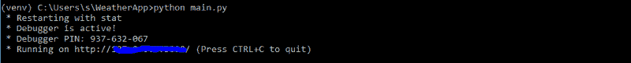

#### **步骤 5——在谷歌云上部署**

这最后一步是为了与全世界分享你的应用程序。值得注意的是，使用 Flask 构建的 web 应用程序有很多提供者。谷歌云只是其中之一。这篇文章不包括其他的一些，如 AWS，Azure，Heroku…

如果社区感兴趣，我可以在另一篇文章中提供其他云提供商的步骤和一些比较(定价、限制等)。).

要在 Google Cloud 上部署您的应用程序，您需要 1)安装 SDK，2)创建新项目，3)创建 3 个本地文件，4)在线部署和测试。

*   按照[谷歌的说明](https://cloud.google.com/sdk/install)安装 SDK
*   连接到你的谷歌云账户(如果你还没有的话，使用 300 美元的优惠券)
*   创建一个新项目并保存项目 id(等待一段时间，直到提供了新项目)

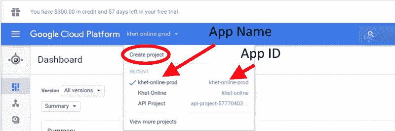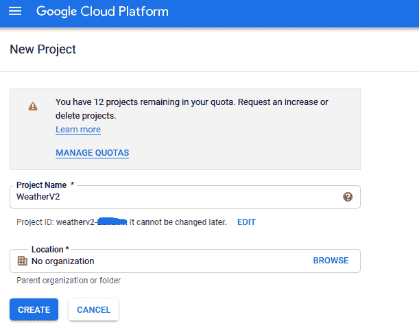

*   使用以下代码在主文件夹中创建一个 app.yaml 文件:

```
runtime: python27api_version: 1threadsafe: true
```

```
handlers:- url: /static  static_dir: static- url: /.*  script: main.app  libraries:  - name: ssl    version: latest
```

*   使用以下代码在主文件夹中创建一个 appengine_config.py 文件:

```
from google.appengine.ext import vendor
```

```
# Add any libraries installed in the "lib" folder.vendor.add('lib')
```

*   在 lib 文件夹中复制库的依赖项

```
pip install -t lib -r requirements.txt
```

*   使用您保存的项目 ID 在 Google Cloud 上部署(可能需要 10 分钟)。使用以下步骤:

```
gcloud auth application-default logingcloud config set project &lt;PROJECT_ID>gcloud initgcloud app deploy app.yaml
```

*   免费享受您的实时网络应用程序。我的是这里的。

完整代码可在 [Github](https://github.com/tristanga/WeatherApp_FullCode) 上获得。谢谢你看我的帖子。这是我第一个使用 Flask 的网络应用，也是第一个关于 [freeCodeCamp](https://medium.freecodecamp.org/) 的教程。如果你觉得这篇文章有帮助，给我一些掌声？。这比我想象的要容易得多，我有 Python 和 r 的数据科学背景。

如果你想做一个简单或更复杂的 Flask App，请随时联系我。