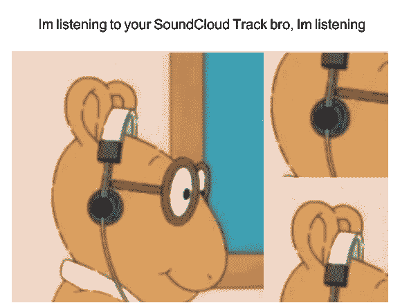
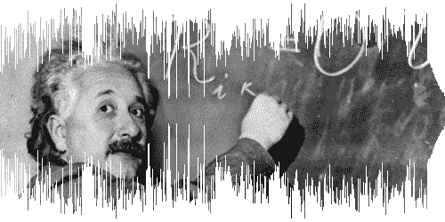

# 如何在 React Native 中制作实时声音云波形

> 原文：<https://www.freecodecamp.org/news/how-to-make-realtime-soundcloud-waveforms-in-react-native-4df0f4c6b3cc/>

英国瓦伊迪亚

# 如何在 React Native 中制作实时声音云波形


Image Credits — [Unsplash](https://images.unsplash.com/photo-1460667262436-cf19894f4774?ixlib=rb-0.3.5&ixid=eyJhcHBfaWQiOjEyMDd9&s=51601a1f46ada6c9799945f7135ac4d1&auto=format&fit=crop&w=800&q=60)

### **简介**

SoundCloud 是一个音乐和播客流媒体平台，用于收听数百万首真实曲目。他们有一个真正的互动界面来播放/收听歌曲。

他们界面中最重要的功能是根据其*频率波形显示轨迹的进程。*这有助于用户识别它的性质。

他们还有一篇博客文章，描述了如何使用基于图像的波形。在 *React 原生*应用中很难使用相同的技术生成波形。他们的[**waveform . js**](https://github.com/soundcloud/waveformjs)**SDK***将波形翻译成浮点以呈现在 HTML5 画布*上，目前*不再运行。*

在本文中，我们将讨论如何为我们的 React 本机应用程序使用相同的波形。

### 为什么我应该使用 SoundCloud 的波形？



Image Credits — [KnowYourMeme](https://knowyourmeme.com/photos/1269398-arthurs-headphones)

*   SoundCloud 的波形看起来比旧的显示*进度条的无聊方式更令人印象深刻。*
*   预加载的波形将使用户了解歌曲中出现的不同频率。
*   在波形上显示*缓冲音轨百分比*也比在空白进度条上显示容易得多。

### 让我们了解更多关于 SoundCloud 的波形



Image Credits — [Backstage Blog by SoundCloud Developers](http://img.svbtle.com/inline_leemartin_24131769094098_raw.png)

SoundCloud 在其 tracks API 中提供了一个`waveform_url`。

*   每首曲目都有自己独特的`waveform_url`。
*   `waveform_url`包含了一个指向悬挂在云层上的图像的链接。

**例─**[https://w1 . sndcdn . com/pp3eb 34 tonki _ m . png](https://w1.sndcdn.com/PP3Eb34ToNki_m.png)


Image Credits — [SoundCloud’s waveform for the track “Megadeth — Sweating Bullets” by mauriciohaensch](https://w1.sndcdn.com/PP3Eb34ToNki_m.png)

到目前为止，每个参数都是静态的，因此在当前状态下是不可用的。因此，我们需要使用 **React Native 的** *容器*基于它重新创建波形，以便访问*触摸事件、样式等。*

### 入门指南


Image Credits — [ImgFlip](https://imgflip.com/memegenerator/4081988/What-if-i-told-you)

这是你需要的物品清单:

*   [D3-刻度](https://github.com/d3/d3-scale)
*   [D3-数组](https://github.com/d3/d3-array)

首先，我们需要对波形进行采样。诀窍是将`waveform_url`的`.png`替换为`.json`。对它的一个`GET`调用会给我们一个包含

*   **宽度**(波形的宽度)
*   **高度**(波形的高度)
*   **样本**(数组)

想了解更多信息，你可以试试下面的链接[https://w1.sndcdn.com/PP3Eb34ToNki_m.json](https://w1.sndcdn.com/PP3Eb34ToNki_m.json)。

### 深入研究代码


Image Credits — [Unsplash](https://images.unsplash.com/photo-1466477234737-8a3b3faed8c3?ixlib=rb-0.3.5&s=919a7e046d85dc25ac72f4c3070228b6&auto=format&fit=crop&w=800&q=60)

#### 添加自定义 SoundCloudWave 组件

```
function percentPlayed (time, totalDuration) {
 return  Number(time) / (Number(totalDuration) / 1000)
}

<SoundCloudWave
  waveformUrl={waveform_url}
  height={50}
  width={width}
  percentPlayable={percentPlayed(bufferedTime, totalDuration)} 
  percentPlayed={percentPlayed(currentTime, totalDuration)}
  setTime={this.setTime}
/>
```

最好创建一个定制的 *SoundCloudWave* 组件，可以根据需要在多个地方使用。下面是必需的`props`:

*   **waveformUrl** —波形的 Url 对象(可通过 Tracks API 访问)
*   **高度** —波形的高度
*   **宽度** —波形分量的宽度
*   **percentPlayable** —以秒为单位缓冲的曲目持续时间
*   **播放百分比** —曲目播放的持续时间，以秒为单位
*   **setTime —** 改变当前跟踪时间的回调处理程序。

#### 获取样本

```
fetch(waveformUrl.replace('png', 'json'))
  .then(res => res.json())
  .then(json => {
    this.setState({
      waveform: json,
      waveformUrl
    })
  });
```

通过使用简单的`GET` API 调用获取样本，并将结果存储在`state`中。

#### 创建波形组件

```
import { mean } from 'd3-array';

const ACTIVE = '#FF1844',
  INACTIVE = '#424056',
  ACTIVE_PLAYABLE = '#1b1b26'

const ACTIVE_INVERSE = '#4F1224',
  ACTIVE_PLAYABLE_INVERSE = '#131116',
  INACTIVE_INVERSE = '#1C1A27'

function getColor(
    bars,
    bar,
    percentPlayed,
    percentPlayable,
    inverse
) {
  if(bar/bars.length < percentPlayed) {
    return inverse ? ACTIVE : ACTIVE_INVERSE
  } else if(bar/bars.length < percentPlayable) {
    return inverse ? ACTIVE_PLAYABLE : ACTIVE_PLAYABLE_INVERSE
  } else {
    return inverse ? INACTIVE : INACTIVE_INVERSE
  }
}

const Waveform =
  (
   {
     waveform,
     height,
     width,
     setTime,
     percentPlayed,
     percentPlayable,
     inverse
   }
  ) => 
  {
    const scaleLinearHeight = scaleLinear().domain([0, waveform.height]).range([0, height]);
    const chunks = _.chunk(waveform.samples, waveform.width/((width - 60)/3))
      return (
        <View style={[{
          height,
          width,
          justifyContent: 'center',
          flexDirection: 'row',
         },
         inverse && {
          transform: [
            { rotateX: '180deg' },
            { rotateY: '0deg'},
          ]
         }
        ]}>
         {chunks.map((chunk, i) => (
           <TouchableOpacity key={i} onPress={() => {
             setTime(i)
           }}>
            <View style={{
              backgroundColor: getColor
               (
                 chunks,
                 i,
                 percentPlayed,
                 percentPlayable,
                 inverse
               ),
              width: 2,
              marginRight: 1,
              height: scaleLinearHeight(mean(chunk))
             }}
            />
          </TouchableOpacity>
         ))}
        </View>
      )
  }
```

**波形分量**的工作原理如下:

*   Chunks 根据用户想要在屏幕上呈现的`width`分割`samples`对象。
*   然后这些块被映射到一个`Touchable`事件中。样式为`width:2`和`height: scaleLinearHeight(mean(chunk))`。这从`d3-array`产生了`mean`。
*   `backgroundColor`作为一个方法被传递，其参数不同于`getColor`方法。这将根据设置的条件确定返回的颜色。
*   `Touchable onPress`事件将调用传递给它的自定义处理程序，来设置新的*寻道时间*。

现在，这个无状态组件可以呈现给子组件，如下所示:

```
render() {
  const {height, width} = this.props
  const { waveform } = this.state
  if (!waveform) return null;
  return (
     <View style={{flex: 1, justifyContent: 'center'}}>
       <Waveform
         waveform={waveform}
         height={height}
         width={width}
         setTime={this.setTime}
         percentPlayed={this.props.percent}
         percentPlayable={this.props.percentPlayable}
         inverse
       />
       <Waveform
         waveform={waveform}
         height={height}
         width={width}
         setTime={this.setTime}
         percentPlayed={this.props.percent}
         percentPlayable={this.props.percentPlayable}
         inverse={false}
       />
     </View>
    )
}
```

这里，一个波形成分是原始的，一个是在 SoundCloud 播放器中反转的。

### 结论

这里是到*反应原生音云波形*的链接

*   [Github](https://github.com/pritishvaidya/react-native-soundcloud-waveform)
*   [npm](https://www.npmjs.com/package/react-native-soundcloud-waveform)

我还在 react-native 中为**金属乐迷**制作了一个应用程序— **MetalCloud** ，在那里你可以看到上面的组件在工作。

以下是链接:

*   [IOS](https://itunes.apple.com/us/app/metalcloud/id1319945253?mt=8)
*   [安卓](https://play.google.com/store/apps/details?id=com.metalcloud)

感谢阅读。如果你喜欢这篇文章，请鼓掌表示你的支持，并在媒体上与其他人分享。

在我的 [StackOverflow](https://stackoverflow.com/users/6606831/pritish-vaidya) 和 [GitHub](https://github.com/pritishvaidya) 个人资料中可以找到更多有趣的东西。

*在 [LinkedIn](https://www.linkedin.com/in/pritish-vaidya-506686128/) 、 [Medium](https://medium.com/@pritishvaidya94) 、 [Twitter](https://twitter.com/PritishVaidya) 上关注我，进一步更新新文章。*