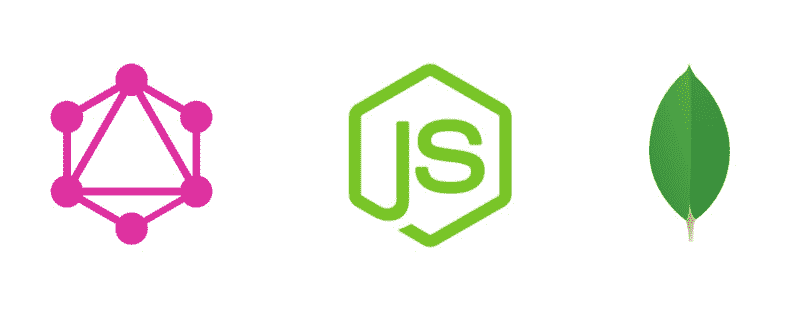
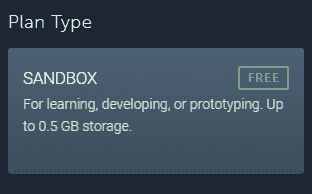
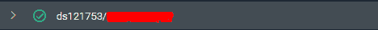
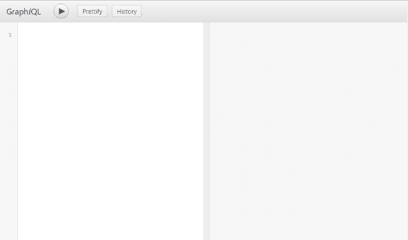
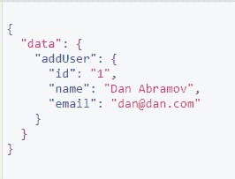
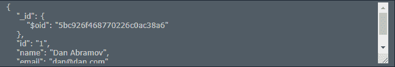
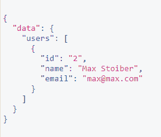
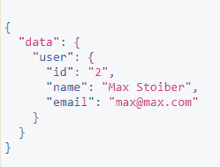

# 如何使用 Node.js、Express & MongoDB 设置 GraphQL 服务器

> 原文：<https://www.freecodecamp.org/news/how-to-set-up-a-graphql-server-using-node-js-express-mongodb-52421b73f474/>

作者莱昂纳多·马尔多纳多

# 如何使用 Node.js、Express & MongoDB 设置 GraphQL 服务器

#### 从 GraphQL & MongoDB 开始最直接的方法。



所以你打算从 GraphQL 和 MongoDB 开始。然后你意识到我怎样才能把这两种技术结合起来？这篇文章正是为你而写的。我将向您展示如何使用 MongoDB 设置 GraphQL 服务器。我将向您展示如何使用 MLab 作为我们的数据库来模块化您的 GraphQL 模式和所有这些。

本文中的所有代码都可以在这里找到。

所以现在，让我们开始吧。

### 为什么是 GraphQL？

GraphQL 是一种用于 API 的查询语言。它由脸书在 2015 年发布，并获得了很高的采用率。是对*休息的替代。*

使用 GraphQL，客户端可以请求他们需要的确切数据，并得到他们所请求的确切数据。GraphQL 也使用类似 JSON 的查询语法来发出这些请求。所有请求都指向同一个端点。

如果您正在阅读这篇文章，我假设您对 GraphQL 有所了解。如果你不知道，可以在这里了解更多关于 GraphQL [的内容。](https://graphql.org/)

### 入门指南

首先，创建一个文件夹，然后开始我们的项目。

```
npm init -y 
```

然后为我们的项目安装一些依赖项。

```
npm install @babel/cli @babel/core @babel/preset-env body-parser concurrently cors express express-graphql graphql graphql-tools merge-graphql-schemas mongoose nodemon
```

然后 *@babel/node* 作为开发依赖:

```
npm install --save-dev @babel/node 
```

#### 巴比伦式的城市

现在我们要为我们的项目设置巴别塔。创建一个名为*的文件。项目文件夹中的 babelrc* 。然后，把 *@babel/env* 放在那里，像这样:

然后转到 package.json 并添加一些脚本:

在我们的项目中，我们只有一个脚本。

*“服务器”* —它将主要运行我们的服务器。

#### 计算机网络服务器

现在，在我们的根文件夹中创建 *index.js* 文件。我们将在这里制作服务器。

首先，我们要导入我们将使用的所有模块。

然后，我们将使用 Mongoose 创建与 MongoDB 的连接:

那 *db 常量*呢？这是您要放置数据库 URL 以连接 MongoDB 的地方。然后你会对我说:“但是，我还没有数据库”，是的，我有。为此，我们使用 MLab。

MLab 是 MongoDB 的数据库即服务，你需要做的就是去他们的网站([点击这里](https://mlab.com/))注册。

注册之后，去创建一个新的数据库。要免费使用，请选择此选项:



MLab free option to use in our MongoDB Server.

选择 US East (Virginia)作为选项，然后给我们的数据库命名。之后，我们的数据库将显示在主页上。



Our database created with MLab.

点击我们的数据库，然后转到*用户*并创建一个新用户。在这个例子中，我将创建一个名为*利奥*的用户和密码*利奥利奥 1。*

在我们的用户被创建之后，在我们页面的顶部，我们发现了两个*URL。O* ne 使用 *Mongo Shell 连接。*另一个使用 *MongoDB URL 进行连接。*我们复制第二个*。*

之后，你需要做的就是把这个 URL 粘贴到我们在*的*db const*index . js*文件*中。*我们的 *db const* 应该是这样的:

#### 表达

现在我们终于要启动我们的服务器了。为此，我们在我们的 *index.js* 中添加了一些行，我们就完成了。

现在，运行命令 *npm run server* 并转到 *localhost:4000/graphql* ，您将会找到这样一个页面:



The GraphiQL playground.

### MongoDB 和模式

现在，在我们的根文件夹中，创建一个名为 *models* 的文件夹，并在其中创建一个名为 User.js 的文件(是的，大写 U)。

在 User.js 中，我们将使用 Mongoose 在 MongoDB 中创建第一个模式。

既然我们已经创建了用户模式，我们将从 GraphQL 开始。

### GraphQL

在我们的根文件夹中，我们将创建一个名为 *graphql 的文件夹。在这个文件夹中，我们将创建一个名为 *index.js* 的文件和另外两个文件夹:*解析器*和*类型*。*

#### 问题

GraphQL 中的查询是我们向服务器请求数据的方式。我们请求我们需要的数据，它会准确地返回这些数据。

我们所有的查询都在我们的 *types* 文件夹中。在该文件夹中，创建一个 *index.js* 文件和一个用户文件夹。

在用户文件夹中，我们将创建一个 *index.js* 文件，并编写我们的查询。

在我们的类型文件夹中，在我们的 *index.js* 文件中，我们将导入我们拥有的所有类型。目前，我们有用户类型。

如果您有不止一种类型，您可以将其导入到您的文件中，并包含在 *typeDefs* 数组中。

#### 突变

GraphQL 的变化是我们在服务器中修改数据的方式。

我们所有的突变都在我们的*解析器*文件夹中。在该文件夹中，创建一个 *index.js* 文件和一个用户文件夹。

在用户文件夹中，我们将创建一个 *index.js* 文件，并编写我们的变体。

现在我们所有的解析器和突变都准备好了，我们要模块化我们的模式。

#### 模块化我们的模式

在我们名为 graphql 的文件夹中，转到我们的 index.js 并创建我们的模式，如下所示:

现在我们的模式已经完成，转到我们的根文件夹，在我们的 *index.js* 中导入我们的模式。

在所有这些之后，我们的模式将会像这样结束:

### 玩弄我们的查询和变异

为了测试我们的查询和变化，我们将使用命令 *npm run server* 启动我们的服务器，并转到 *localhost:4000/graphql。*

#### 创造用户

首先，我们将创建第一个突变用户:

```
mutation {  addUser(id: "1", name: "Dan Abramov", email: "dan@dan.com") {    id    name    email  }}
```

之后，如果 GraphiQL playground 返回我们创建的数据对象，这意味着我们的服务器工作正常。



The data object that GraphiQL Playground returned for us.

为了确保这一点，请访问 MLab，在我们的*用户*集合中，检查是否有我们刚刚创建的数据。



In our first mutation, we created a user.

之后，创建另一个名为“马克斯·斯托伊伯”的用户。我们添加这个用户是为了确保我们的变异运行良好，并且我们在数据库中有多个用户。

#### 删除用户

要删除一个用户，我们的变化如下:

```
mutation {  deleteUser(id: "1", name: "Dan Abramov", email: "dan@dan.com") {    id    name    email  }}
```

像另一个一样，如果 GraphiQL playground 返回我们创建的数据对象，这意味着我们的服务器工作正常。

#### 获取所有用户

为了获取所有用户，我们将运行第一个查询，如下所示:

```
query {  users {    id    name    email  }}
```

因为我们只有一个用户，它应该返回确切的用户。



All our users will be returned.

#### 获取特定用户

要获得特定用户，查询如下:

```
query {  user(id: "2"){    id    name    email  }}
```

这应该会返回确切的用户。



The exact user that we asked.

### 我们完事了。

我们的服务器正在运行，我们的查询和转换工作正常，我们可以开始启动我们的客户端了。可以从*创建-反应-app 开始。在您的根文件夹中，只需发出命令 *create-react-app client* ，然后，如果您运行命令 ***npm run dev*** ，我们的*服务器*和*客户端*将同时运行！*

本文中的所有代码都可以在这里找到。

？在推特上关注我！
**⭐** F [**在 GitHub 上关注我！**](https://github.com/leonardomso)

我正在寻找一个遥远的机会，所以如果有我想听的，请联系我！