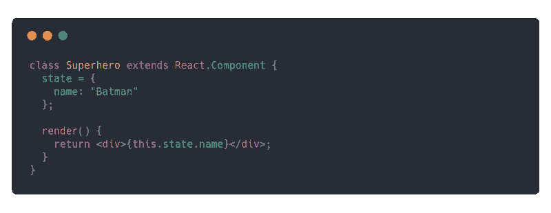
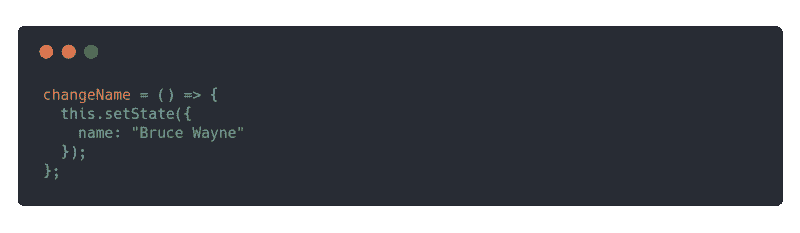
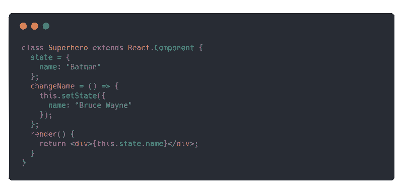
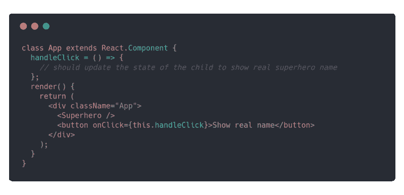
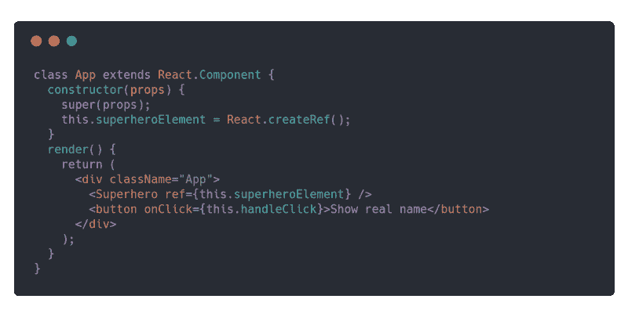

# 如何在 React 中从父组件改变子组件的状态

> 原文：<https://www.freecodecamp.org/news/react-changing-state-of-child-component-from-parent-8ab547436271/>

作者张诗钟·托马斯

# 如何在 React 中从父组件改变子组件的状态

Photo by Clément H ([@clemhlrdt](https://unsplash.com/@clemhlrdt)) on [Unsplash](https://unsplash.com/)

我们将建立一个简单的反应应用程序，显示一个按钮点击超级英雄的真实姓名。

让我们开始吧。

首先，我们将创建一个状态为`name`的`Superhero`组件。这个组件将首先呈现那个`name`。

现在让我们在`Superhero`组件中创建一个函数`changeName()`。这个函数将把州名改为超级英雄的真实姓名。

现在我们有了显示超级英雄姓名的`Superhero`组件和一个将姓名更新为其真实姓名的函数。

完整的超级英雄组件将如下所示:

现在让我们创建`App`组件，它将呈现这个`Superhero`组件和一个按钮。当我们点击按钮，它显示真正的超级英雄的名字。

我们添加了一个函数`handleClick()`，当用户点击按钮时，这个函数就会被调用。我们需要找出一种方法来更新子组件的状态，即`Superhero`组件。

我们已经在`Superhero`组件中创建了一个函数`changeName()`。这个功能会显示超级英雄的真实姓名。如果我们可以从`App`组件调用这个函数，我们的工作就完成了。所以我们会调用这个函数。

这就是裁判来拯救我们的地方。

让我们在`App`组件中创建一个`Superhero`组件的引用。下面是这样做的代码。

这里，我们使用`React.createRef()`方法创建了一个引用，并使用`ref`属性将该引用附加到`Superhero`组件。

现在我们将能够使用`this.superheroElement.current`引用`Superhero`节点。我们也将能够使用`this.superheroElement.current.changeName()`调用`Superhero`组件中的`changeName()`函数。

让我们更新我们的`App`组件中的`handleClick()`函数来调用`changeName()`函数。

我们的`handleClick()`函数将如下所示。

你可以在下面的沙盒中查看完整的代码。

[**code sandbox**](https://codesandbox.io/embed/4r16r1oxj4)
[*code sandbox 是一款为 web 应用量身定制的在线编辑器。* codesandbox.io](https://codesandbox.io/embed/4r16r1oxj4)

现在我们已经了解了如何从父组件更新子组件的状态？。我希望这有所帮助。