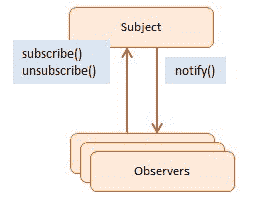

# 如何正确使用 Node.js 中的事件

> 原文：<https://www.freecodecamp.org/news/using-events-in-node-js-the-right-way-fc50c060f23b/>

usana ashraf

# 如何正确使用 Node.js 中的事件

在事件驱动编程流行之前，应用程序不同部分之间的标准通信方式非常简单:一个组件想要向另一个组件发送消息，就显式调用该组件上的方法。但是事件驱动的代码是写给*反应*而不是被*调用*的。

#### 事件的好处

这种方法使得我们的组件更加**解耦**。当我们继续编写应用程序时，我们会在编写过程中识别事件。我们在适当的时候触发它们，并为每个事件附加一个或多个*事件监听器*。**扩展功能变得更加容易。我们可以为特定的活动增加更多的听众。我们没有篡改现有的侦听器或应用程序中触发事件的部分。我们所说的是观察者模式。**

[https://www.dofactory.com/javascript/observer-design-pattern](https://www.dofactory.com/javascript/observer-design-pattern)

#### 设计事件驱动的架构

识别事件非常重要。我们不想最终不得不从系统中删除/替换现有事件。这可能会迫使我们删除/修改附加到事件的任意数量的侦听器。我使用的一般原则是*仅当一个业务逻辑单元完成执行时才考虑触发事件。*

假设你想在用户注册后发送一堆不同的邮件。现在，注册过程本身可能涉及许多复杂的步骤和查询。但从商业角度来看，是*一步到位。*每封要发出的电子邮件也是单独的步骤。因此，注册一结束就激发一个事件是有意义的。我们有多个监听器连接到它，每个监听器负责发送一种类型的电子邮件。

Node 的异步、事件驱动的架构有一些特定类型的对象，称为“发射器”它们发出命名的事件，这些事件导致被称为“监听器”的函数被调用。所有发出事件的对象都是 [EventEmitter](https://nodejs.org/api/events.html#events_class_eventemitter) 类的实例。使用它，我们可以创建自己的活动:

#### 一个例子

让我们使用内置的[事件](https://nodejs.org/api/events.html)模块(我鼓励您详细查看)来访问`EventEmitter`。

这是应用程序的一部分，在这里我们的服务器接收一个 HTTP 请求，保存一个新用户并发出一个事件:

和一个单独的模块，我们在其中附加了一个监听器:

将政策与实施分开是一个好的做法。在这种情况下，策略意味着哪些侦听器订阅了哪些事件。实现意味着听者自己。

这种分离也允许监听器变得可重用。它可以附加到发出相同消息的其他事件(用户对象)。还有一点很重要，那就是*当多个侦听器被附加到一个事件时，它们将被同步执行，并且按照它们被附加的顺序执行*。因此`someOtherListener`将在`sendEmailOnRegistration`完成执行后运行。

然而，如果您希望您的侦听器异步运行，您可以简单地用`setImmediate`包装它们的实现，如下所示:

#### 让你的听众保持干净

在编写侦听器时，坚持单一责任原则。一个听众应该只做一件事，并且把它做好。例如，避免在一个侦听器中编写太多的条件，这些条件根据事件传输的数据(消息)来决定要做什么。在这种情况下，使用不同的事件会更合适:

#### 必要时显式分离侦听器

在前面的例子中，我们的侦听器是完全独立的函数。但是在侦听器与一个对象(它是一个方法)相关联的情况下，必须手动将其从它订阅的事件中分离出来。否则，对象将永远不会被垃圾收集，因为对象的一部分(侦听器)将继续被外部对象(发射器)引用。因此，内存泄漏的可能性。

例如，如果我们正在构建一个聊天应用程序，并且我们希望当一个新消息到达一个用户已经连接到的聊天室时，显示通知的责任应该在该用户对象本身中，我们可以这样做:

当用户关闭他/她的标签页或暂时失去互联网连接时，我们自然会希望在服务器端发出一个回调，通知其他用户他们中的一个刚刚离线。当然，此时为离线用户调用`displayNewMessageNotification`没有任何意义。除非我们显式删除它，否则它将继续在新消息中被调用。如果我们不这样做，除了不必要的调用，用户对象也将无限期地留在内存中。所以一定要在服务器端回调中调用`disconnectFromChatroom`,只要用户离线，回调就会执行。

#### 当心

如果我们不小心，事件驱动架构中的松散耦合也会导致复杂性增加。在我们的系统中很难跟踪依赖关系。如果我们开始从侦听器中发出事件，我们的应用程序将变得特别容易出现这个问题。这可能会引发一连串的意外事件。