# 如何使用 SSH 创建和连接 Google Cloud 虚拟机

> 原文：<https://www.freecodecamp.org/news/how-to-create-and-connect-to-google-cloud-virtual-machine-with-ssh-81a68b8f74dd/>

奈扎·阿萨维尔

# 如何使用 SSH 创建和连接 Google Cloud 虚拟机

Image source: [https://www.redeszone.net/2017/08/01/descargar-maquinas-virtuales-vmware-virtualbox-windows/](https://www.redeszone.net/2017/08/01/descargar-maquinas-virtuales-vmware-virtualbox-windows/)

谷歌云提供了许多工具和服务。其中一项服务是创建高度可定制的虚拟机。如果您不熟悉什么是虚拟机，以下是微软的定义:

> 虚拟机是一种计算机文件，通常称为映像，其行为类似于实际的计算机。换句话说，就是在计算机中创造一台计算机。它在一个窗口中运行，就像任何其他程序一样，为最终用户提供了在虚拟机上与在主机操作系统上相同的体验。虚拟机与系统的其余部分隔离，这意味着虚拟机内部的软件无法逃脱或篡改计算机本身。

在许多情况下都需要虚拟机来针对其他操作系统测试应用程序、访问受病毒感染的数据或试验其他操作系统。您可以在计算机上安装虚拟机。您也可以在云中创建它们，并简单地连接到它们。

在本教程中，我将带您了解如何在 Google Cloud 中创建虚拟机。我们可以从你的电脑上用 SSH 连接到它。

1.  如果您还没有，请从[这里](https://cloud.google.com/)创建一个谷歌云帐户。

你将获得 300 美元的信用额度，可以玩一年！学习和使用 Google Cloud 提供的一切已经足够了。

2.创建新项目或使用现有项目。您可以创建一个名为 **project1** 的新项目，例如，如下图所示:

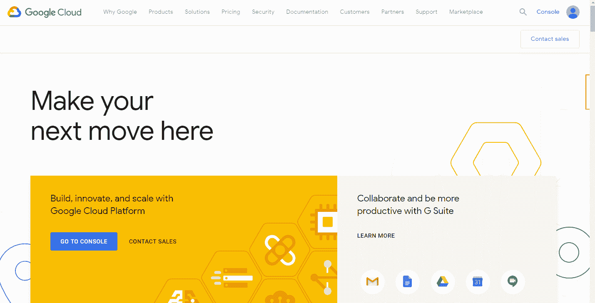

3.现在，您可以创建一个虚拟机了。转到你的 Google Cloud 主页左上角，点击三栏图标≡并选择**计算引擎->VM insta*n*ce 和 cli **ck Cre** ate。**

在**名称**字段中输入您想要的名称，如下所示:

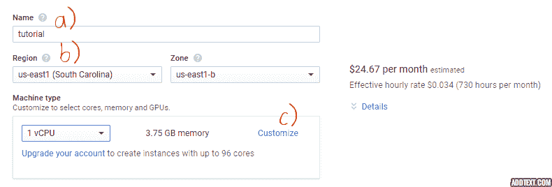

保留默认的地区和区域。任何地区/区域都适用于本教程。如果你对它们的含义感到好奇，你可以在这里阅读谷歌云关于它们的文档[。](https://cloud.google.com/compute/docs/regions-zones/)

您可以保留默认的机器类型，或者单击**自定义**到选择您希望虚拟机拥有的 CPU 内核、内存和 GPU 的数量。您将看到右侧的成本发生了变化！

对于谷歌云的第一次实验，你可以保守地用 300 美元来做一些实际的工作。在这种情况下，您可以选择以下配置:

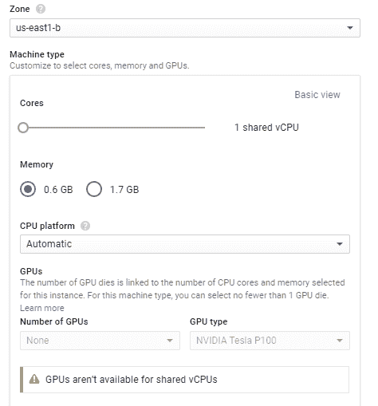

接下来选择启动盘。比如可以选择 **20 GB，SSD，Ubuntu 16.04 LTS** 如下图:

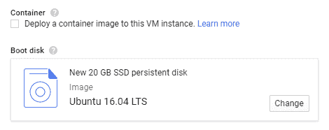

然后将**身份和 API 访问**下的**服务账号**设置为**无服务账号**，如下图所示:

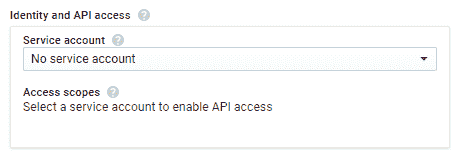

最后，进入**防火墙**下的**安全**选项卡。你会看到一个 **SSH 密钥**字段，如下所示:

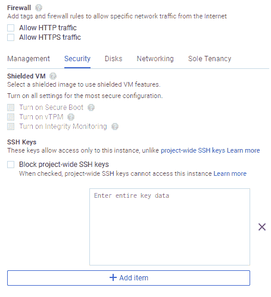

在这里，您将使用 SSH 密钥将您的计算机连接到虚拟机！

如果您不熟悉 SSH (Secure Shell)以及为什么您可能想要使用它，它是一种网络协议，在两台通过不安全网络(此处为互联网)连接的计算机(此处为您的计算机和 Google 的服务器)之间提供加密数据通信。

为了建立 SSH 连接，您*可能*需要一个应用程序来完成这项工作，这取决于您的操作系统。**根据你的操作系统(Windows 或 Mac/Linux)来看这篇文章的其余部分。**

#### **窗户**

我推荐**腻子**。这是一个开源且易于使用的 SSH 客户端。你可以从[这里](https://www.putty.org/)下载并安装 PuTTY。

安装完油灰后，打开**油灰键生成器**，点击**创建**。它会通过**你**在空白区域移动鼠标来生成一个随机密钥。完成后，您将得到类似这样的内容:

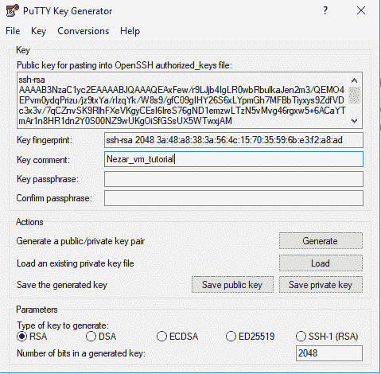

将**关键注释**字段更改为易于识别和输入的内容，因为这将成为以后的用户名！

然后点击上图中相应的图标保存公钥和私钥。

突出显示 PuTTY Key Generator 中的整个 **Key** 字段，并将其复制粘贴到 Google Cloud 中的 **key data** 字段中:

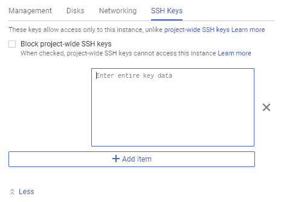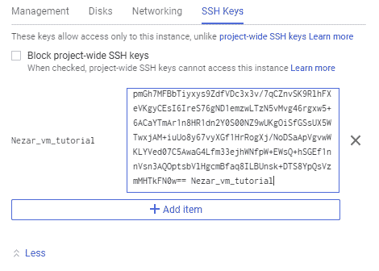

点击**创建**并等待虚拟机实例被创建。

同时，你可以去 PuTTY。转到 **SSH - > A** uth，浏览你保存的私钥文件。

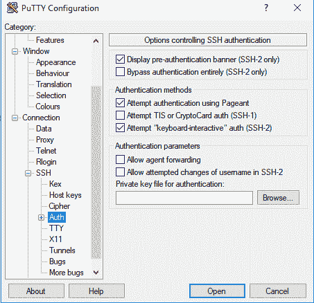

接下来，转到 Google Cloud，从您刚刚创建的虚拟机实例中复制外部 IP，如下所示:

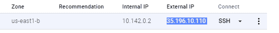

并粘贴到 PuTTY 中 **Sessions** 下的 Host 字段，点击**回车**:

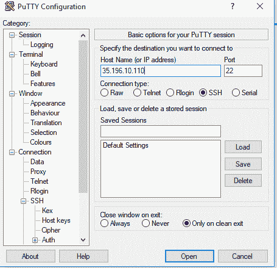

注意:您可能会得到一条错误消息。忽略它，点击**是**。(它只是说注册表中没有这个键。您确定要连接吗？)

然后输入生成密钥时创建的用户名(上面的**密钥注释**)。嘣！您位于刚刚创建的虚拟机中。

你可以在上面安装 python 和 Google APIs，比如开始变一些魔术！不要忘了在你使用完你的信用额度后在 Google Cloud 中关闭它:)

#### **Mac/Linux**

Mac 和 Linux 原生支持 SSH 连接。您只需要生成一个 SSH 密钥对(公钥/私钥)来安全地连接到虚拟机。

私钥相当于密码。因此，它是私有的，驻留在您的计算机上，不应与任何实体共享。公钥与您要建立连接的计算机或服务器共享。要生成 SSH 密钥对以安全地连接到虚拟机，请执行以下步骤:

在终端中输入以下命令:`ssh-keygen -t rsa`。它将启动密钥生成过程。系统将提示您选择存储 SSH 密钥对的位置。按 ENTER 键接受默认位置，如下所示:

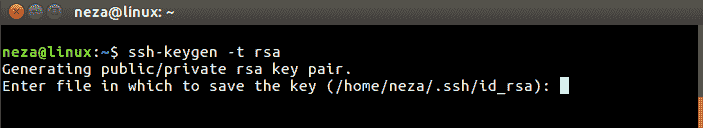

接下来，选择登录虚拟机的密码，如果不想使用密码，请按 ENTER 键。私钥(即身份)和公钥将按如下所示生成:

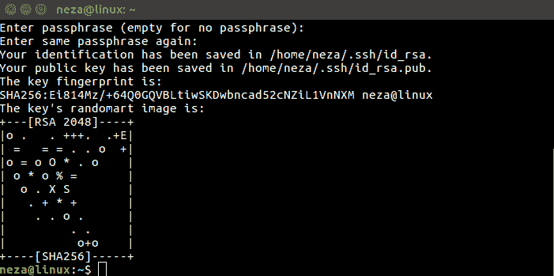

现在运行下面的命令:`cat ~/.ssh/id_rsa.pub`。它将在终端中显示公钥，如下所示。突出显示并复制该键:

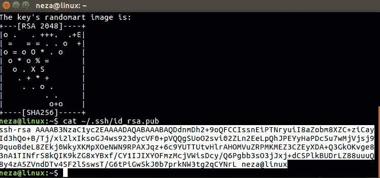

并将其粘贴到 Google Cloud 的 SSH 密钥字段中，然后点击 **Create** :

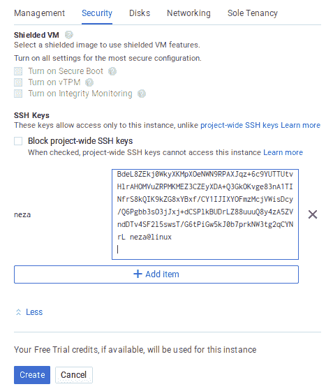

现在，您可以使用刚刚创建的虚拟机的**外部 IP** :

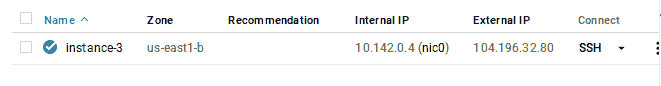

对 *ssh* 进行如下操作:

你会得到“主机的真实性…等。”警告如下图所示。这很正常。每当 SSH 连接到一个它以前没有见过的系统时，它都会生成这样的警告。回复**是**连接，宾果！你在虚拟机中，从主机名**可以看到实例-3。**要退出虚拟机，只需键入 **exit。**

在你完成保存那 300 美元信用额度之后，不要忘记关闭谷歌云中的虚拟机！

*最初发布于[assawiel.com/blog](http://www.assawiel.com/blog)2017 年 12 月 23 日。更新时间:2018 年 10 月 10 日*