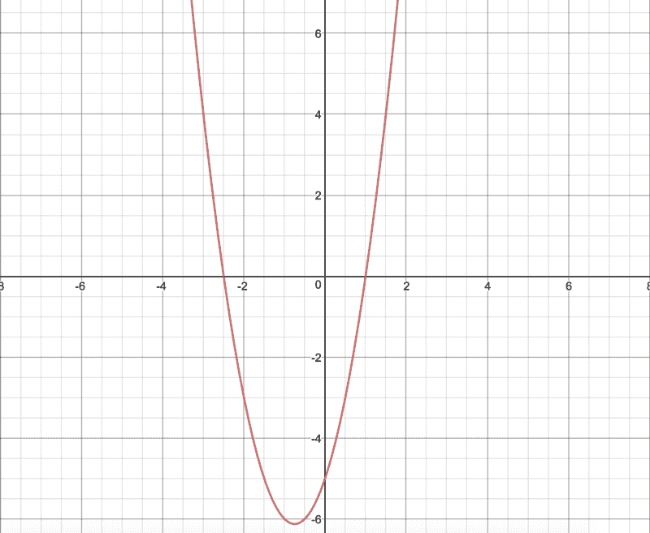
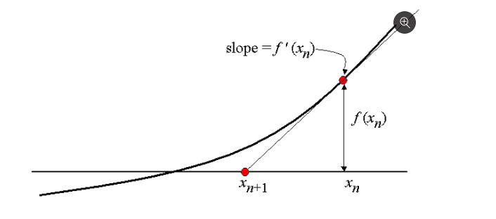
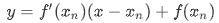
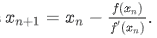
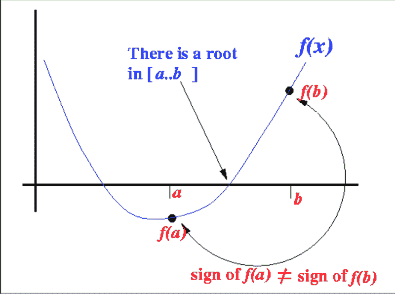
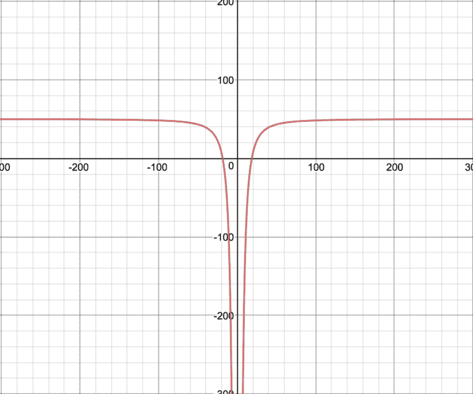
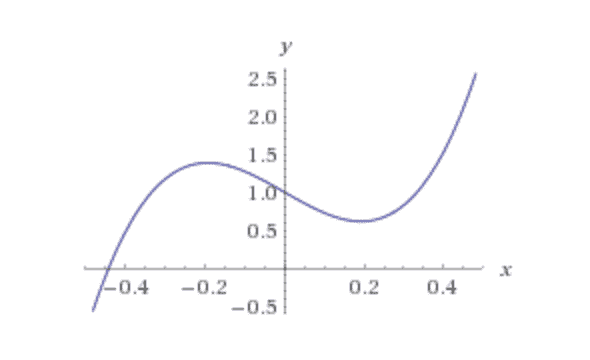
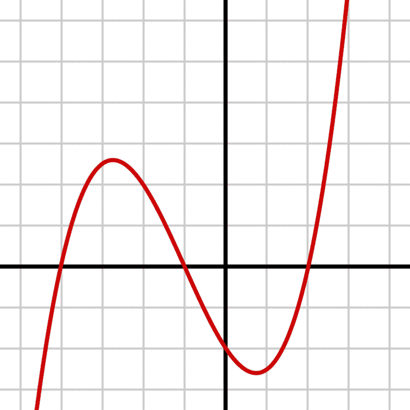

# 如何处理 JavaScript 中的根查找

> 原文：<https://www.freecodecamp.org/news/how-to-tackle-root-finding-in-javascript-40d2c34507b2/>

### 介绍

我想写这个话题已经有一段时间了。我最近有机会在一个 web 应用程序中模拟 Excel 的 GoalSeek 功能。我发现 GoalSeek 的整个目的以及它是如何工作的令人着迷。

Excel 中 GoalSeek 的全部目的是找到一个方程的输入，该方程将提供所需的解。为了理解这是如何工作的，我们将考虑一些非常简单的事情。

### 什么是 Goalseek？

让我们举一个例子，用简单的利息公式根据本金计算到期金额。

简单利息公式的等式很简单:

```
A = P(1+rt), eqn(1)
```

```
P -> principalr -> rate of interestt -> time in years
```

我们将设置以下值:

```
P -> 10000r -> 7.5t -> 15
```

这使我们得到的到期金额为:

```
A = 10000(1+7.5*15) = 1135000
```

现在，假设我们的解决方案的需求发生了变化。现在，不是*根据本金、利率和时间找到到期金额*，而是我们需要找到*利率，它将给出我们期望的到期金额*，但保持本金和时间不变。

现在让我们改变这个例子:

```
P -> 10000r -> ?t -> 15A -> 1120000
```

在这里，我们试图找到允许我们支付 1120000 而不是 1135000 的利率。我们可以通过改变变量来解决这个问题。

```
A = P(1+rt) => 1120000 = 10000(1+r*15)
```

```
1+15*r = 1120000 / 10000 => r = (112 - 1) / 15
```

```
r = 7.4%
```

太棒了。我们做到了！我们做了 Excel 的 Goalseek 做的事情。


Gif capture of Excel GoalSeek functionality

不过，有一个问题。这是一个非常简单的等式和问题。如果方程明显更复杂，并且涉及三角函数和多个可能的解，会发生什么？我会给你一个例子，一个你可以用 Goalseek 求解的方程:

```
f(x, y) = 1550 - (4*x/y * sinh(y/2 * 1500 / (2*x))), eqn(2)
```

是啊，那看起来绝对是一把。对我来说，看到这样的东西时，一个令人畏惧的因素是，事物被表达为具有因变量的函数。

这不是更容易看吗？当然，部分原因也是因为这个等式要小得多。

但是，如果我们把它改写成这样呢:

```
f(P, r, t) = P(1+rt)
```

看到了吗？还是一样的。

让我们回到等式(2)。如果我们有下面的问题陈述会怎么样:

```
0 = 1550 - (4*x/0.022 * sinh(0.022/2 * 1500 / (2*x))),solve for x
```

好吧，再说一次，你所做的只是求解一个变量，但是看看这个问题变得有多难。这主要是因为那个讨厌的`sinh`坐在等式里。

好吧，如果你是新手，我想事情会变得有点难以承受。让我们退一步，想想到目前为止我们已经弄明白了什么。

1.  我们发现，用如下两种符号编写函数并没有真正的区别:

```
f(P, r, t) = P(1+rt)A = P(1+rt)
```

2.我们发现我们可以求解一个变量来得到我们想要的结果。然而，方程越复杂，得到解就越复杂。

我们有两个非常对立的困难方程要解。我将引入第三个等式来帮助弥合这一差距

```
y = 2x^2+3x-5, eqn(3)
```

上面的方程是一个基本的抛物线函数。这是方程绘制时的样子。



Plot of 2x²+3x-5

好了，现在我们来考虑一下如何解这个方程。假设我们想要求解`x`，这样`y = 0`:

```
y = 2x^2+3x-5 => 2x^2+3x-5 = 0
```

```
x = [-3 + sqrt(3^2 - 4*2*(-5))] / (2*2),     [-3 - sqrt(3^2 - 4*2*(-5))] / (2*2)]
```

```
x = 1, -2.5
```

如果你想知道我从哪里得到解的方程，注意这只是一个二次方程的经典解。

```
y = ax^2+bx+c, where y = 0 => ax^2+bx+c = 0
```

```
x = -b+sqrt(b^2-4ac) / 2a, x = -b-sqrt(b^2-4ac) / 2a
```

*注:如果你想知道这个解决方案是如何得出的，请看这里的。*

这是解决这个问题的一种方法。您可以编写一个解析器，它可以接受任何方程，检查系数，准确地分离它们，然后尝试求解方程。您还可以在这里使用非常棒的 [algebra.js](https://algebra.js.org/#equations) 库，它可以完成我刚刚描述的功能。

然而，如果你看一下图表，你会发现你可以用图形来解决这个问题。目标是找到曲线上的点`y = 0`

好，仔细看，看看曲线在哪里穿过 X 轴。它在两点穿过它:`[1, -2.5]`这就是你的解决方案！

现在，你可能会想这都很好，但是我不能确切地教计算机看图表，找到它穿过 X 轴的点，并识别这些点。嗯，可能你可以，用某种形式的模型训练图像识别，但这是另一个职位。那么，我们如何找到解决这个问题的方法呢？

我们可以使用两种方法，这是我将在本文中深入探讨的方法。

它们被称为**牛顿-拉夫森法**和**二分法**。

我将简要介绍每种方法的工作原理。

**TL；灾难恢复版本**

牛顿-拉夫森方法的工作原理是选取一个随机点，并在该点绘制一条切线。然后它计算一个更接近根的新的`x`值。如果你一直这样重复，你会找到根源。

二分法的工作原理是找到根所在的区间。一旦确定了精确的区间，就可以使用类似于二分搜索法算法的算法来求解。

让我们更详细地了解每一项。

### 牛顿-拉夫森方法

好吧，让我们深入研究牛顿-拉夫森方法。牛顿-拉夫森方法是基于三个主要思想。

1.  曲线在特定点的切线是一条直线
2.  曲线在特定点的切线也是曲线在该点的导数
3.  直线的方程，即:`y = mx + c`



Tangent To A Curve At A Point. Source: [https://brilliant.org/wiki/newton-raphson-method/](https://brilliant.org/wiki/newton-raphson-method/)

上图是一条随机曲线，上面画了一条切线。

我们在 X 轴上随机选择了一个点`x_n`。

`f(x_n)`相当于曲线上的点。即 y 轴截距

`f’(x_n)`是曲线在 f 点(x_n)的切线。

`x_(n+1)`是切线与 X 轴相交的点。

记住，我们说过我们想要找到曲线穿过 X 轴的点，因为这将给出我们的解。注意，点`x_(n+1)`比`x_n`更接近解决方案，尽管我们随机选择了`x_n`。

好吧，如果我们重复同样的过程，除了这次用`x_(n+1)`作为我们的新点初始点？嗯，大概我们会以一个更接近解决方案的新`x`结束。

那么，给定方程，导数和原`x_n`，我们如何找到点`x_(n+1)`？

让我们回到一条直线的方程:`y = mx+c`

我们说过曲线在一点的切线是直线。

我们还说过 y 轴截距等于`f(x_n)`

我们从微积分中知道，导数等于斜率。

因此，我们得到以下结果:



Equation of a line

现在，我们需要找到这条切线的根，所以设置`y = 0` 和`x = x_(n+1)`，并求解`x_(n+1)`

这为我们提供了以下信息:



Source: [https://brilliant.org/wiki/newton-raphson-method/](https://brilliant.org/wiki/newton-raphson-method/)

现在，我们有了解决`x_(n+1)`所需的一切。

当我第一次看到所有的方程时，我的头脑一片混乱，所以让我们用一个例子来看看它是如何工作的。

我们将利用等式(2)来解决这个问题。让我们来挑选`x_n=3`

```
f(x) = 2x^2+3x-5f'(x) = 4x+3f(3) = 18+9-5 = 22f'(3) = 15x_1 = 3 - 22/15 = 1.53
```

```
f(1.53) = 4.2718f'(1.53) = 9.12x_2 = 1.53 - 4.2718/9.12 = 1.0616
```

如果你一直这样做，你应该得到一个解决方案，正如我们从前面的图中所知道的，这是我们的解决方案之一。

如果你注意到我们在上面所做的只是按照一定的顺序重复一系列的步骤，也就是算法的定义。下面是相同的代码。

代码片段大量使用了 [math.js 库](http://mathjs.org/)。我使用的主要函数是 math.derivative 和 math.eval 函数。它们分别计算表达式的导数，并基于键值对的对象对表达式求值。

我想让你们注意的代码片段是第 14-16 行。

```
if (Math.abs(result - guess) < Math.exp(-15)) {              return result        }
```

我们在这里做的是定义结束迭代的基本条件。我们说，如果`x_n`和`x_(n+1)`之间的差小于`10^(-15)`，则返回结果。

如果你从头到尾完成前面的练习，你会发现每个连续的`x`值几乎与前面的`x`值相同，这就是我们如何知道我们找到了解决方案。

我在 codepen 中用 d3.js 构建了一个不错的小模拟，向您展示这将如何迭代运行。

只需在输入框中输入一个值，然后点击 submit，就可以看到算法以图形方式运行。

*注意:请尝试一系列合理的输入，我在这里还没有建立一个可靠的系统。*

### 二分法

好了，我们知道了牛顿-拉夫森方法的工作原理。接下来让我们来研究二分法。

二分法比牛顿-拉夫逊法更容易理解。它基于一个非常简单的数学特性:

*如果一个函数 f(x)在区间[a，b]和 f(a)的符号上连续！== f(b)，那么在 f(c) = 0 的区间(a，b)中有一个值 c。换句话说，c 是方程的根。*

如果这对你来说没有意义，那就纯粹用数字来思考，然后纯粹用图形来思考。

假设你有如下区间:[-7，6]。现在，如果我让你只数从-7 到 6 的整数，你也会在这个区间的某个点数 0。上面的属性本质上就是这么说的。

让我们用图形来看看这意味着什么。



Image Source: [http://www.mathcs.emory.edu/~cheung/Courses/170/Syllabus/07/bisection.html](http://www.mathcs.emory.edu/~cheung/Courses/170/Syllabus/07/bisection.html)

上面的函数是一条连续的线，它从负到正，这意味着它必须在某个点穿过 0。因为它必须穿过 0，这意味着根在这个区间。

好的，这意味着使用二分法是一个两步的过程。

1.  找出根所在的区间，如果这样的区间存在的话
2.  在这个区间内找到实际的根

下面是如何找到间隔的代码:

同样，我在这里使用 mathjs，所以你可以查阅文档。

该算法有趣的部分在第 18–26 行，我在这里检查我的左区间或右区间的函数计算是否产生了`NaN`的结果。当我们探索如何解方程(2)时，我将解释为什么我包括这个代码块。

一旦我们有了解决方案所在的区间，我们就可以把注意力转向实际寻找解决方案本身。

如果你曾经试图在一个数组上写一个二分搜索法算法，上面的代码片段对你来说应该很熟悉。我们在这里采用了或多或少相同的方法。以下是相关的步骤。

1.  我从左右音程开始，找到一个中点
2.  检查解决方案是位于中点的左侧还是中点的右侧
3.  如果它位于左侧，则设置`right = mid`，否则设置`left = mid`

最终，中点将是根本身。

这里有一个小模拟贯穿了实际发生的事情。

注意:我为模拟看起来如此丑陋道歉，不幸的是造型不是我的专长。同样，合理的输入范围，因为否则模拟运行需要相当长的时间。

在上面的笔中，输入一个值，模拟将试图找到一个可能存在根的区间。一旦它找到了一个区间，它将开始尝试使用我们之前讨论过的算法来寻找根。

### **解复杂方程**

好了，我们已经探索了两种不同的求方程根的方法。现在，是时候探索我们拥有的更复杂的方程(2)了，看看这些方法中的哪一种可以求解该方程。

我会把等式写在下面，这样就清楚了

```
f(x, y) = 1550 - (4*x/y * sinh(y/2 * 1500 / (2*x))), eqn(2)
```

```
Solve for f(x, y) = 0, where y = 0.022
```

```
0 = 1550 - (4*x/0.022 * sinh(0.022/2 * 1500 / (2*x)))
```

首先，让我们想象一下这个方程是什么样子的。它会给我们一个更好的直觉，让我们知道为什么会出错。



f(x) = 1550 — (4x/0.022 * sinh(0.022/2 * 1500 / (2x)))

关于这个方程需要注意的是，当 x 趋向于 0 时，它趋向于无穷大。这将为牛顿-拉夫森方法带来一个问题，因为牛顿-拉夫森解倾向于遵循切线的路径，在这种情况下，它可能会很快作为一个解消失到无穷大，除非它碰巧找到了解。

试着用牛顿-拉夫森方法运行上面的方程，你就会明白我的意思了。您可能会得到 null 的结果。

另一方面，二分法将很好地解决这个问题。它工作得很好，因为我们采取非常小的增量步骤，步长大小是我们可以控制的。运行下面的 codepen，你应该会看到二分法对大多数方程是多么有效。

上面的代码与我们为二分法设置的前一个版本几乎相同，只有一些不同。我设置了一个单独的 codepen，这样我就可以省去输入方程的麻烦，这需要大量的检查和错误处理。此外，这个方程需要特殊的边界来定义它的数据，因为当 x 接近 0 时，它趋于无穷大。如果你感兴趣的话，你可以看看代码就明白我的意思了。

现在，在二分法代码中，我告诉过你们这段代码:

```
if (Number.isNaN(result_left)) {        left -= stepSize        scope_left[variable] = left        result_left = math.eval(eqn, scope_left)    } if (Number.isNaN(result_right)) {        right += stepSize        scope_right[variable] = right        result_right = math.eval(eqn, scope_right)}
```

所以我这样做的原因是为了处理像等式(2)中出现的情况。因为当 x 趋向于 0 时，方程(2)趋向于无穷大，所以可能存在方程的评估返回`NaN`或`Infinity`的情况。为了避免这种情况，我简单地重复移动方程的步长，直到我可以回到实数范围内的函数的定义域。

### **二等分>牛顿-拉夫斯**上？

这让我想到了一个重要的观点，为什么牛顿-拉夫森对这个方程失败了？我们知道，由于牛顿-拉夫逊遵循曲线在不同点的切线，如果方程在任何特定点趋于无穷大，它就可以分解到无穷大。这突出了牛顿-拉夫森方法的一个缺点。

1.  牛顿-拉夫森方法对一个 ***连续*** 函数很有效。如果方程(2)中的函数是不连续的，它通常会失败。
2.  牛顿-拉夫森无法解释一个函数中的多个最大值和最小值。

以下面的图表为例。



A function with multiple maxima and minima. Source: [https://brilliant.org/wiki/newton-raphson-method/](https://brilliant.org/wiki/newton-raphson-method/)

在-0.19 到+0.19 之间随机选取一个点，你应该会看到你会得到一个负斜率，这意味着曲线在该点的切线会在离根更远的一点与 X 轴相交，这违背了牛顿-拉夫森方法的原理。这意味着牛顿-拉夫森法对于三次和更高阶的方程通常会失败。

二分法不应该有同样的问题，因为它依赖于找到一个区间，在这个区间内解必须存在，并且像上面这样的曲线不会成为一个障碍，只要它在那个域内是连续的。

如果你用大(O)符号来比较这两种方法，很明显牛顿-拉夫森法比二分法运行的迭代次数要少，这仅仅是因为当你用图形来观察它时，它收敛得更快。具有讽刺意味的是，如果你用一个计时过程来运行这个方法，通常会发现，给定相同的起点，二分法比牛顿-拉夫森法运行得更快。

这是因为牛顿-拉夫森涉及到在每一步计算导数，这被证明是非常昂贵的计算。另一方面，增加和减少一个数的计算开销相对较小。

如果你想在你的机器上运行同样的程序并检查结果，请点击这里查看回购。您可以克隆这个 repo，在您的机器上运行`npm install`然后运行`npm run start`，您应该会看到在给定相同的初始猜测的情况下，对一个相同的方程运行牛顿-拉夫森法和二分法的结果。

### **结论**

好了，我们已经谈了很多了。但是说实话，这是一个非常大的话题，我几乎没有触及它的表面。方程的收敛性是一个广泛研究的课题。考虑一个我们还没有涉及的最基本的事情:寻找多重根。

当然，您可以修改本文中提供的算法来实现这一点。

以下面的等式为例。它有 3 个根(它与 X 轴相交的 3 个点，你需要找到所有这些根)。



Cubic equations have multiple roots

我会把我所有的资料贴在这里，你可以随意浏览。

*注意:如果你对这篇文章有任何问题或评论，请不要犹豫，通过对这篇文章或 [GitHub](https://github.com/redixhumayun) 或 [Twitter](https://twitter.com/zz_humayun) 的评论来联系我。*

1.  [https://brilliant.org/wiki/newton-raphson-method/](https://brilliant.org/wiki/newton-raphson-method/)
2.  [http://www . mathcs . emory . edu/~ cheung/Courses/170/Sylvia/07/bi section . html](http://www.mathcs.emory.edu/~cheung/Courses/170/Syllabus/07/bisection.html)
3.  [http://www.sosmath.com/calculus/diff/der07/der07.html](http://www.sosmath.com/calculus/diff/der07/der07.html)
4.  [https://www.youtube.com/channel/UCYO_jab_esuFRV4b17AJtAw](https://www.youtube.com/channel/UCYO_jab_esuFRV4b17AJtAw)