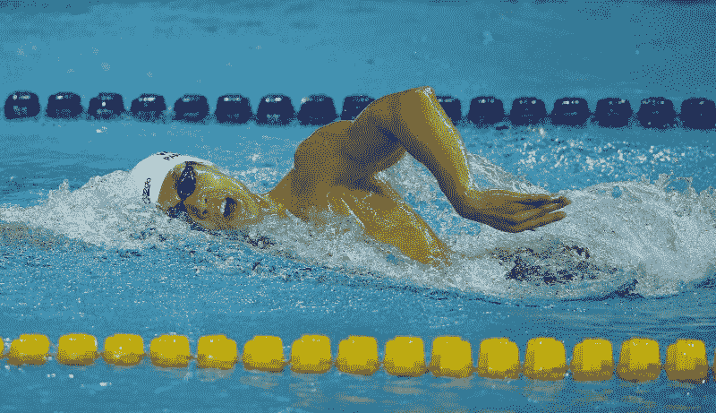
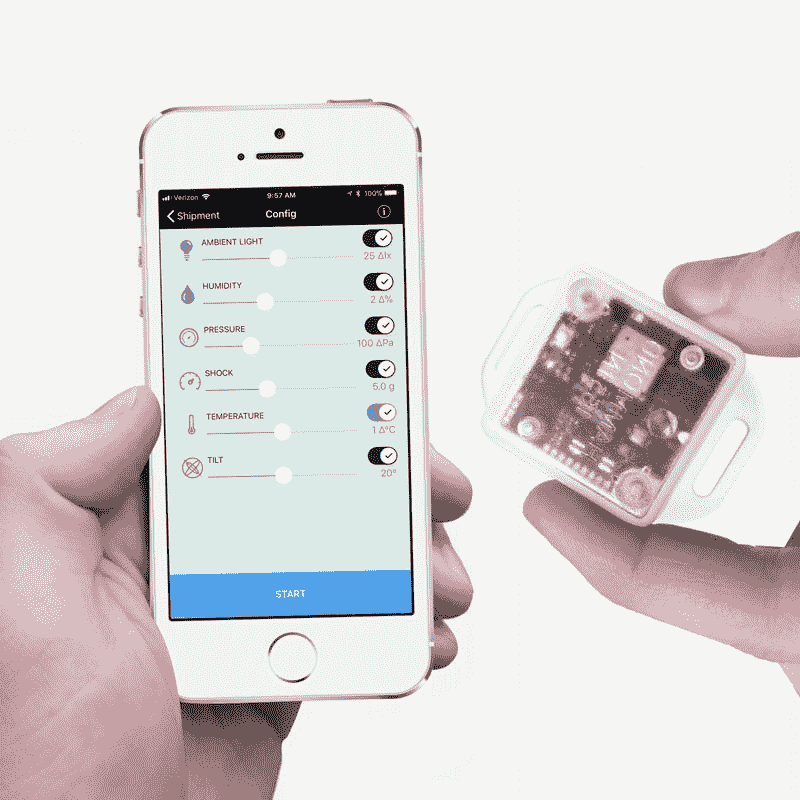
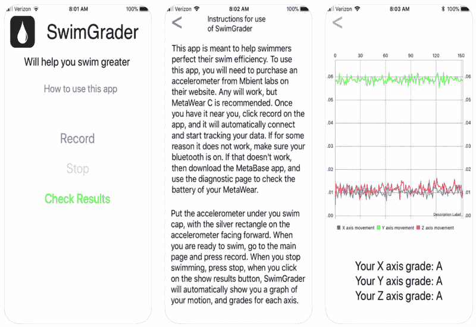

# 我是如何和一个青少年一起开发一个 iOS 应用程序的

> 原文：<https://www.freecodecamp.org/news/how-i-launched-an-ios-app-with-a-teenager-926b5a65a991/>

肖恩·崔

# 如何帮助青少年启动 iOS 应用程序

#### 如何从零开始到应用商店中的 iPhone 应用程序

作为我之前两篇文章([如何教青少年编程](https://medium.freecodecamp.org/how-to-teach-programming-to-teenagers-2ecd43846f0d)和[树莓派初学者指南](https://medium.freecodecamp.org/beginners-guide-to-raspberry-pi-6e55080fdaaf))的后续，我想分享一下我帮助青少年从零开始编写代码到构建和部署 iOS 应用程序的经历。

正如在我之前的一篇文章中提到的，我注意到青少年有强烈的欲望去做一些感觉更真实的事情。所以，在我的许多课上反复出现的自然问题是*“我们能开发一个 iPhone 应用吗？”。*我觉得现在是学生们开发应用程序的时候了，我让他们每人提出一个想法。

一周后，其中一个学生带着一个想法回来了，这个想法看起来真的很有趣，所以我们决定在正常上课时间之外花点时间一起构建它。我们最终开发出了一款名为[swim gradier](https://itunes.apple.com/us/app/swimgrader/id1364739414?mt=8)的酷应用。



Asian Games Swimming from [Wikipedia Commons](https://commons.wikimedia.org/wiki/File:Incheon_AsianGames_Swimming_19_(15178565298).jpg)

#### SwimGrader 是怎么来的？

我的学生是一个游泳爱好者，一直很好奇他的游泳有多好。评估自己的游泳能力并不是真正显而易见的，你经常需要一些专家来告诉你你有多好。

我们都知道缩短单圈时间是大多数运动员追求的目标，所以很多人都试图这样做。然而，很难详细了解你必须做些什么来缩短单圈时间。当然，你可以试着踢得更快，多练习以获得更多的游泳肌肉，但这通常不是提高你游泳水平的最好方法。

由此，我的学生认为人们需要一些东西来确定他们下一步应该努力的游泳领域。因此，他的绝妙想法是建立一个应用程序，它可以评估你游泳的各个方面，并告诉你应该在哪些方面努力改进。

从经验中我知道提高我的游泳水平有多难，他的想法给我留下了深刻的印象。这是我以前从未听说过的，它有一个特定的用例，可能会使很多人受益。然而，由于我的学生以前从未开发过 iPhone 应用程序，我们决定从头开始一起开发。

#### 入门指南

我自己不是一名竞技游泳运动员，也认为这将是一次很好的思维练习，我让我的学生提出应用程序的设计和我们可以用来在应用程序中给游泳运动员评分的指标。

这个过程最终成为一次非常好的学习经历。这个练习不仅帮助学生解决了项目的细节问题，也让我和我的学生的期望保持一致。正如我在关于教育青少年的文章中提到的，青少年对编程有很高的期望。因此，在详细讨论了要收集哪些数据、要创建哪些页面、每个页面如何转换以及要显示哪些指标之后，我们双方都要明确设定我们的目标和期望。

了解我们计划制造的确切最终产品有助于学生保持持续参与。

稍微偏离一下主题，我们经常会学到一些我们不知道什么时候会应用到生活中的东西。这可能会让我们觉得我们正在穿过一条漫长黑暗的隧道，尽头没有一丝光亮。

当你年轻时尤其如此，因为你很可能被告知要学习某些东西。我相信这导致许多学生对他们所学的东西不感兴趣。我认识到，通过展示学习过程的终点来设定正确的期望，确实有助于激励学生，并提高学习过程本身的效率。

所以，回到学生建议的应用程序的设计和指标:我的学生首先建议，一般来说，应用程序不应该为游泳者增加任何开销。他想开发一个能够收集数据而不影响游泳运动员表现的应用程序。

这个学生已经有了一个测量设备，我将在下一节分享。经过一些讨论，以提出一个最小可行的产品，我们决定，我们应该专注于收集两个具体的指标:**头 bops** 和**转速**。

由于头部 bop 主要是一种无关的运动，会降低游泳的效率，如果我们可以简单地计算某个时间间隔内头部 bop 的数量，我们认为我们可以建议减少无关的头部运动。

我们也同意快速转弯对于缩短单圈时间是必要的。因此，如果我们可以测量游泳者在泳道尽头转弯所用的时间，我们就可以根据时间给游泳者打分。

有了这种设计和想法，我们只需要用合适的传感器开始实施。

#### 那么，是什么硬件让 SwimGrader 成为可能呢？



mbientlab’s sensor research kit

虽然最新的 iphone 手机是防水的，但是游泳者可能不想冒险带着他们的超级昂贵的 iphone 手机进入游泳池。因此，我的学生建议我们使用来自 [mbientlab](https://mbientlab.com/product/mountable-sensor-research-kit/) 的[传感器](https://amzn.to/2CpAnUi)，并将其封装在防水盒中。

这个传感器可以让你从环境和运动中收集各种数据，因为它内置了加速度计、陀螺仪、气压计、温度计等。此外，他们有一些[示例代码](https://github.com/mbientlab/MetaWear-SDK-iOS-macOS-tvOS)，您可以使用它们来引导您的应用程序，这样您就可以立即收集感兴趣的数据。

所以，我们的想法是把传感器放在他的泳帽里。他认为这将对游泳者的游泳能力产生最小的影响，我同意这一点。我们立即购买了两个这样的传感器，并开始构建我们的应用程序。我将不再赘述使用 Swift 构建一个简单的多页 iOS 应用程序的细节，因为它们已经在数千篇其他文章中涉及过了(这里的[是一篇很好的中型文章，介绍了其中的许多内容)。](https://hackernoon.com/the-ultimate-list-of-resources-to-mastering-swift-and-ios-development-2018-edition-3bd2a87ff400)



SwimGrader App Window

#### 介绍游泳分级仪

因此，经过几个小时的编程和通过苹果公司让我们的应用程序获得应用程序商店的批准，我们终于能够推出[swimminger](https://appadvice.com/app/swimgrader/1364739414)。看到这一点真的很惊讶，因为我只帮助了项目的初始设置，包括设置单页面应用 Swift 项目，帮助添加按钮和文本字段，以及简单的硬件集成以从传感器检索数据。

为了让您了解硬件集成有多简单，这里有一段代码可以让传感器上的 LED 闪烁绿色。从下面的例子可以看出，检索数据非常简单。

```
import MetaWearimport MetaWearCpp
```

```
MetaWearScanner.shared.startScan(allowDuplicates: true) { (dev) in    // We found a MetaWear board, see if it is close by    if dev.rssi.intValue > -50 {        // We found a MetaWear board!        MetaWearScanner.shared.stopScan()        // Connect to the board we found        dev.connectAndSetup().continueWith { t in            if let error = t.error {                // Sorry we couldn't connect                print(error)            } else {                // We are connected! Flash its LED!                var pattern = MblMwLedPattern()                mbl_mw_led_load_preset_pattern(                    &pattern, MBL_MW_LED_PRESET_PULSE)                mbl_mw_led_stop_and_clear(device.board)                mbl_mw_led_write_pattern(                    device.board, &pattern, MBL_MW_LED_COLOR_GREEN)                mbl_mw_led_play(device.board)            }        }    }}
```

在有限的帮助下，我的学生构建了一个评分算法和图形界面，远远超出了我的预期。他从传感器中检索 X，Y，Z 数据，并给出头部在每个方向移动的程度。他在 iOS 上搜索了一个图形库，并展示了他的传感器报告的内容。而且，在完成他的应用程序后，他继续在游泳池中测试他的应用程序！

这是一个中学生的作品，所以看起来不会像《部落冲突》那样花哨。然而，我认为它确实令人印象深刻，来自一个从未建立过 iPhone 应用程序的年轻学生！做完这个，学生问我:

> 我们能为此建立一个 Apple Watch 应用吗？

我告诉他，他肯定可以在未来建立一个 Apple Watch 版本的应用程序，但他可能没有我的帮助:)。

#### 最后的想法

作为成年人，我认为很难让我们的想法保持新鲜、狂野和最新。所以，我认为听到这些年轻学生要说的话，并尽我们所能支持他们想做的事情，真的很有教育意义。

这些机会不仅打开了制造新的和令人兴奋的产品的大门，而且支持学生推销和建立他们自己的想法给了他们最好的教育体验。看到我的学生要求人们下载他的应用程序，我笑了。我希望有一天我能开发一个很酷的应用程序，并展示给我的朋友们。虽然，我的学生刚刚击败了我:)

另一方面，我了解到构建一个很酷的 iOS 应用程序比以往任何时候都容易。有很多文章可以帮助你构建各种用途的应用程序:游戏、单视图应用程序、社交网络应用程序等等。此外，有比以往更多的硬件，您可以轻松地连接到您的手机，并扩展您的手机的功能。

我希望我能很快分享构建自己的应用程序的经验。我只是担心我的学生会不会觉得我的应用程序很酷…

感谢您阅读本文！我希望我能说服你与你的学生或你的孩子一起工作，并开始建立一个简单的应用程序！我也乐于倾听你的酷应用想法。