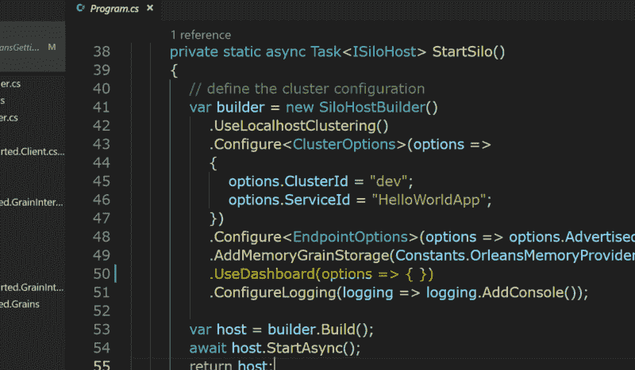
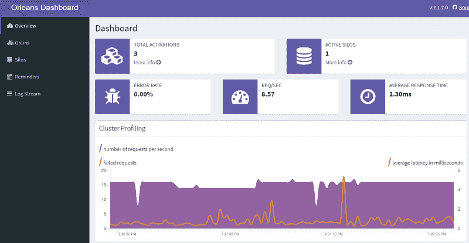

# 如何设置 Microsoft Orleans 的报告仪表板

> 原文：<https://www.freecodecamp.org/news/microsoft-orleans-reporting-dashboard-16465d255199/>

小拉塞尔·哈米特(克里特纳)

# 如何设置 Microsoft Orleans 的报告仪表板


Orleans Logo

Orleans 是一个易于使用的 actor 框架，但是如何监控您的部署呢？幸运的是，有一些简单易用的东西——[奥尔良仪表板](https://github.com/OrleansContrib/OrleansDashboard)！

回顾一下——Orleans 和其他 actor 模型框架一样，是一种将计算分布在一系列机器上的方法，这些机器充当一个集群。在 Orleans 的案例中，许多集群管理看似透明，对用户来说是抽象的。这太棒了，让我有点不舒服！令人欣慰的是，开发和/或使用该产品的优秀人员构建了一个附加仪表板来帮助缓解一些压力。

[Orleans Dashboard](https://github.com/OrleansContrib/OrleansDashboard) 是在 [Orleans Gitter](https://gitter.im/dotnet/orleans) 上向我建议的，当时我正在询问如何在运行集群时查看“我的系统运行情况”。仪表板很容易上手，所以让我们开始吧！

我使用[krit ner-Blogs/OrleansGettingStarted](https://github.com/Kritner-Blogs/OrleansGettingStarted)的 v0.30 版本作为我的起点。这将为我们提供一些不同的颗粒类型来观看新的仪表板。

来自 [OrleansDashboard](https://github.com/OrleansContrib/OrleansDashboard) 的 README.md 很好地涵盖了设置。既然这么短这么甜，下面是基本步骤:

*   将`OrleansDashboard`包添加到我们的`Kritner.OrleansGettingStarted.SiloHost`项目中。
*   向`ISiloHostBuilder`配置添加一个新选项。

就是这样！

#### 软件包安装

在`Kritner.OrleansGettingStarted.SiloHost`项目中，添加下面一行(突出显示)


New NuGet package `OrleansDashboard`

#### 配置 SiloHostBuilder

同样在 SiloHost 项目中，修改 ISiloHostBuilder，使下面一行位于`Build()`之前:

```
.UseDashboard(options => { })
```

应该看起来像:



Configure dashboard within builder

有几个我们可以利用的配置选项，但为了简单起见，让我们看看我们现在有什么。

#### 点燃它

我们现在唯一需要做的就是启动 SiloHost，并导航到默认的 URL`localhost:8080`。我们将正常启动 SiloHost，在命令提示符下导航到 SiloHost 文件夹，并运行`dotnet run`。接下来导航到 [http://localhost:8080。](http://localhost:8080.)我们现在应该会听到这样的问候:



OrleansDashboard

在这个页面上有相当多的信息，在 OrleansDashboard 的其他页面上也有提供。此外，前端代码是可定制的，所以理论上你可以在自己的指标。正如你从上面看到的，已经有一些颗粒发挥了它们的魔力——由仪表板本身引入的新颗粒。

目前，CPU/内存使用情况在中不可见。奥尔良的 net 核心实现。希望将来能有所补救？也许是 netstandard 中可用的 API 的限制？

#### 展示更多的颗粒激活

这个仪表板很棒，但我如何才能看到它的作用呢？更确切地说，不是默认的谷物行动？这很简单！我们只需要检测几粒。

我想运行潜在的大量颗粒，可能数量是由用户输入的。为此，我将扩展我们在"[更新新奥尔良项目中所做的基于多态性的工作，以便更好地为新奥尔良的例子做准备！](https://medium.com/@kritner/updating-orleans-project-to-be-more-ready-for-new-orleans-examples-2105b29a46fd)"，通过添加新的菜单选项。

> 请注意，我的客户端或服务器在获取或提供谷物实例时遇到了一些问题。我已经纠正了这一点，但可能会在 GitHub 问题和/或单独的帖子中尝试理解这一问题背后的原因。问题的要点是，出于某种原因，代码生成似乎没有在竖井构建上运行，即使它以前运行过。

总之，到了新的`IOrleansFunction`:

```
public class ShowoffDashboard : IOrleansFunction{ public string Description => "Starts new activations of several grains, as to show off the OrleansDashboard.";
```

```
 public async Task PerformFunction(IClusterClient clusterClient) {  Console.WriteLine("How many activations would you like to do per grain? (100-500 perhaps?)");  var times = Console.ReadLine();
```

```
 if (!int.TryParse(times, out var result))  {   Console.WriteLine("invalid input, returning to menu.");   ConsoleHelpers.ReturnToMenu();  }
```

```
 Console.WriteLine($"About to start {result} instances of a grain.  Hold onto your butts.");  Console.WriteLine("Press any key to get started.");  Console.ReadKey();
```

```
 for (int i = 0; i < result; i++)  {   var helloGrain = clusterClient.GetGrain<IHelloWorld>(    Guid.NewGuid()   );   await helloGrain.SayHello(i.ToString());
```

```
 var statefulGrain = clusterClient.GetGrain<IVisitTracker>(    i.ToString()   );   await statefulGrain.Visit();  }
```

```
 Console.WriteLine("All done!");  ConsoleHelpers.ReturnToMenu(); }}
```

在上面的例子中，我们只是提示用户输入一个数字。然后多次运行我们的两个已实现的粒度。我们应该能够使用这个新的`IOrleansFunction`很容易地演示仪表板拾取颗粒激活。

运行时应该是这样的:

可以在这里找到代码更改(尽管与上一篇文章相比变化很小):[https://github . com/krit ner-Blogs/OrleansGettingStarted/releases/tag/v 0.35](https://github.com/Kritner-Blogs/OrleansGettingStarted/releases/tag/v0.35)。

请注意，在 v0.3 和 v0.35 之间，还有一些其他的变化没有在这篇文章中涉及到，这些变化与颗粒生成不点火有关。我(可能)会在某个时候再发一篇关于这个的帖子。

相关:

*   [微软奥尔良入门](https://medium.com/@kritner/getting-started-with-microsoft-orleans-882cdac4307f?source=friends_link&sk=1fc3451d71a19dcb49f2c8bbeb6b079e)
*   [微软奥尔良——再利用谷物和谷物状态](https://medium.com/@kritner/microsoft-orleans-reusing-grains-and-grain-state-136977facd42?source=friends_link&sk=f19cfa3f17665c3d700bfe0df56e27a9)
*   [更新新奥尔良项目，为新奥尔良范例做好更多准备！](https://medium.com/@kritner/updating-orleans-project-to-be-more-ready-for-new-orleans-examples-2105b29a46fd)
*   [微软奥尔良—依赖注入](https://medium.com/@kritner/microsoft-orleans-dependency-injection-6379d52a7169?source=friends_link&sk=6c3883a5213d65eb251b56c717e0e4f2)
*   [微软奥尔良——在“开发”和“生产”配置之间轻松切换。](https://medium.com/@kritner/microsoft-orleans-easily-switching-between-development-and-production-configurations-20e109be6458?source=friends_link&sk=1e8fc6aa072a5b293d029c00012165b3)
*   [微软奥尔良—观察家](https://medium.com/@kritner/microsoft-orleans-observables-5e0040c949cd?source=friends_link&sk=bcb921fdf593bdc97b9c5909b2730f2d)
*   代码起点—[https://github . com/krit ner-Blogs/OrleansGettingStarted/releases/tag/v 0.30](https://github.com/Kritner-Blogs/OrleansGettingStarted/releases/tag/v0.30)
*   代码结束点—[https://github . com/krit ner-Blogs/OrleansGettingStarted/releases/tag/v 0.35](https://github.com/Kritner-Blogs/OrleansGettingStarted/releases/tag/v0.35)
*   github─[orlandsdashboard](https://github.com/OrleansContrib/OrleansDashboard)