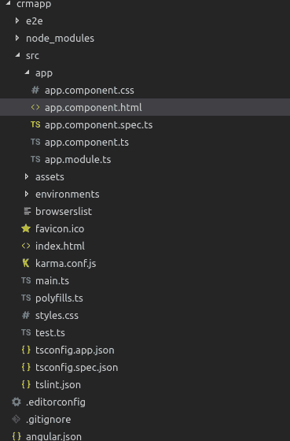
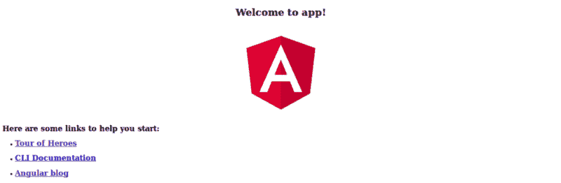
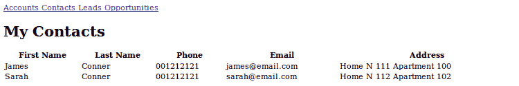

# 通过构建全栈应用来学习 Angular 6

> 原文：<https://www.freecodecamp.org/news/learn-angular-6-by-building-a-full-stack-application-186659f51a27/>

棱角 6 出来了！新特性包括更好的性能、新的强大 CLI 附加功能和注入服务的新方式。

本教程是针对初学者的。您将通过构建一个全栈 CRUD(创建、读取、更新和删除)web 应用程序的示例来学习 Angular。我们将使用最流行的框架和平台的最新版本来构建移动和桌面客户端应用程序。这些应用程序的名称是 SPAs 或单页应用程序。

在后端，我们将使用 Python 和 Django。Django 是最受欢迎的 pythonic web 框架，是为有最后期限的完美主义者设计的。

简而言之，您将学习生成 Angular 6 应用程序，生成组件和服务，并添加路由。您还将学习使用各种特性，比如用于发送 AJAX 请求和 HTTP 调用以及订阅 RxJS 6 observables 的 **HttpClient** 等等。

在本 Angular *6* 教程结束时，您将通过构建一个真实世界的示例应用程序来学习:

*   如何安装最新版本的 Angular CLI，
*   如何使用 Angular 6 CLI 生成新的 Angular *6* 项目，
*   如何使用 Angular 6 构建一个简单的 CRM 应用，
*   什么是组件和基于组件的架构
*   如何使用 RxJS 6 观察值和运算符(`map()`和`filter()`等)。)
*   如何创建角 6 组件，
*   如何添加组件路由和导航，
*   如何使用 **HttpClient** 使用 REST API 等。

### Django 示例 CRUD 后端

我们将利用一个用 Django 和 Django REST 框架构建的简单 CRUD API。因为这是一个有角度的教程，所以我们不会把重点放在构建 API 上。这将是一个单独教程的主题。你可以从这个[仓库](https://github.com/techiediaries/django-crm)中抓取后端 API 的源代码。

您可以使用以下命令启动开发服务器:

```
# Clone the project and navigate into it

$ git clone https://github.com/techiediaries/django-crm
$ cd django-crm

# Create a virtual environment and install packages

$ pipenv install

# Activate the virtual environment

$ pipenv shell 

# Create and migrate the database then run the local development server

$ python manage.py migrate
$ python manage.py runserver
```

您的服务器将从`[http://localhost:8000](http://localhost:8000.)` [开始运行。](http://localhost:8000.)

我们使用的是官方推荐的 Python 包管理工具 [pipenv](https://github.com/pypa/pipenv) 。你需要安装它。这个过程非常简单，取决于你的操作系统。

### 角 6 积垢示例

我们将要构建的示例 Angular 6 应用程序是 CRM RESTful API 的前端。它将允许您创建客户、潜在客户、机会和联系人。这是一个构建为 SPA(单页应用程序)的 CRUD(创建、读取、更新和删除)应用程序的完美例子。

示例应用程序正在开发中，因此我们将通过一系列教程来构建它。它将被更新，以包含高级功能，如 RxJS 6 和 JWT 认证。我们还将使用 Bootstrap 4 和 Angular 6 材质来构建和设计 UI 组件。你要么需要 Bootstrap 4，要么需要棱角分明的材质进行造型。根据您的选择，您可以遵循单独的教程:

*   [用 Angular 6 材质搭建 UI](https://www.techiediaries.com/angular-material-tutorial-example/)
*   [用 Bootstrap 4 构建 UI](https://www.techiediaries.com/angular-bootstrap-tutorial)

### 安装 Angular CLI(版本 6.0.0)

确保您已经安装了 Node.js，然后在您的终端中运行以下命令来安装 Angular CLI **v 6.0.0** 。

```
npm -g install @angular/cli
```

您可以通过运行以下命令来检查安装的版本:

现在，您已经准备好使用 Angular CLI v6 创建一个项目。只需在终端中运行以下命令:

CLI 将自动生成大多数 Angular 6 项目共有的一组文件。它还将安装项目所需的依赖项。

我们将主要在`src/app`文件夹中工作。这是项目的目录结构:



您可以通过运行以下命令在本地为您的应用程序提供服务:

```
# Navigate inside your project's folder

$ cd crmapp

# Serve your application

$ ng serve
```

您的应用程序将从`[http://localhost:4200](http://localhost:4200.)` [开始运行。](http://localhost:4200.)

这是应用程序主页的屏幕截图:



### 角形部件 6|5|4

现在，什么是组件？

组件是一个 TypeScript 类。它有一个 HTML 模板和一组可选的 CSS 样式来控制屏幕的一部分。

组件是 Angular 6 中最重要的概念。Angular 6 应用程序基本上是一个带有根组件的组件树(著名的 *AppComponent* )。根组件包含在主`NgModule`模块`app.module.ts`的引导阵列中。

组件的一个重要方面是可重用性。组件可以在整个应用程序中重用，甚至可以在其他应用程序中重用。执行某项任务的通用且可重复的代码可以封装到一个可重用的组件中。只要我们需要它提供的功能，就可以调用这个组件。

> 每个被引导的组件都是它自己的组件树的基础。插入一个引导组件通常会触发一系列组件创建来填充该树。[来源](https://angular.io/guide/bootstrapping#the-bootstrap-array)

### 基于组件的体系结构

角度应用由几个部分组成。这些组件形成了一个包含父组件和子组件的树形结构。

组件是一个大系统(web 应用程序)的独立块。它使用输入和输出与系统的其他构建模块(组件)进行通信。组件具有关联的视图、数据和行为。它可能有父组件和子组件。

组件允许最大程度的重用，易于测试，维护和关注点分离。

现在让我们实际地看看这个。前往您的 Angular 应用程序项目文件夹，打开`src/app`文件夹。您将找到以下文件:

*   `app.component.css`:组件的 CSS 文件
*   `app.component.html`:组件的 HTML 视图
*   `app.component.spec.ts`:组件的单元测试或规格文件
*   `app.component.ts`:组件代码(数据和行为)
*   `app.module.ts`:应用主模块

除了最后一个包含应用主(根)**模块**声明的文件外，所有这些文件都用于创建一个组件。这是 **AppComponent** :我们应用程序的根组件。我们接下来要创建的所有其他组件都将是根组件的直接或非直接子组件。

### 揭开 app Component(Angular 应用程序的根组件)的神秘面纱

继续打开`src/app/app.component.ts`文件，让我们了解应用程序主/根组件背后的代码。

首先，这是代码:

```
import { Component } from  '@angular/core';@Component({    selector:  'app-root',    templateUrl:  './app.component.html',    styleUrls: ['./app.component.css']})export  class  AppComponent {    title  =  'app';}
```

我们首先从`@angular/core`导入组件装饰器。然后我们用它来修饰 TypeScript 类 *AppComponent* 。组件装饰器接受一个带有许多参数的对象，例如:

*   *选择器*:指定可以用来在 HTML 模板中调用这个组件的标签，就像标准的 HTML 标签一样
*   *templateUrl* :表示将用于显示该组件的 HTML 模板的路径(也可以使用*模板*参数将模板作为字符串包含在内)
*   *styleUrls* :指定组件的 CSS 样式表的 URL 数组

*export* 关键字用于导出组件，以便它可以从应用程序中的其他组件和模块导入。

*title* 变量是保存字符串“app”的成员变量。这个变量没有什么特别的，它不是角分量的规范定义的一部分。

现在让我们来看看这个组件的相应模板。如果你打开`src/app/app.component.html`，你会发现:

```
<div  style="text-align:center"><h1>Welcome to !</h1>    </div>    <h2>Here are some links to help you start: </h2><ul>    <li&gt;    <h2><a  target="_blank"  rel="noopener"  href="https://angular.io/tutorial">Tour of Heroes</a></h2>    </li>    <li>    <h2><a  target="_blank"  rel="noopener"  href="https://github.com/angular/angular-cli/wiki">CLI Documentation&lt;/a></h2>    </li>    <li>    <h2><a  target="_blank"  rel="noopener"  href="https://blog.angular.io/">Angular blog</a></h2>    </li></ul>
```

模板是一个普通的 HTML 文件(几乎所有的 HTML 标签都可以在 Angular 模板中使用，除了一些标签如`<scri`pt`>,` h`tml>`；和<主体>，除了它可以包含模板变量*(在 t* 的情况下，标题变量`) or exp`表达式({ {...}})，它可用于在 DOM dynamicall **y 中插入值。这是针对数据绑定的。你可以从文档中找到更多关于模板的信息。**

你也可以像普通 HTML 一样直接在角度模板中使用其他组件(通过选择器属性)。

如果你熟悉 MVC(模型视图控制器)模式，组件类扮演控制器的角色。HTML 模板扮演视图的角色。

### 示例中的角度 6 分量

了解了角度组件背后的理论之后，现在让我们为简单的 CRM 应用程序创建组件。

我们用 Django 构建的 REST API 公开了这些端点:

*   `/api/accounts`:创建或读取账户的分页列表
*   `/api/accounts/<` id >:读取、更新或删除账户
*   `/api/contacts`:创建或阅读分页的联系人列表
*   `/api/contacts/<` id >:读取、更新或删除联系人
*   `/api/leads`:创建或读取一个分页的销售线索列表
*   `/api/leads/<` id >:读取、更新或删除销售线索
*   `/api/opportunities`:创建或阅读机会的分页列表
*   `/api/opportunities/<` id >:读取、更新或删除机会

在将路由添加到我们的应用程序之前，我们首先需要创建应用程序的组件。基于公开的 REST API 架构，我们可以将我们的应用程序分为以下几个部分:

*   `AccountListComponent`:该组件显示并控制一个列表式的账户列表
*   `AccountCreateComponent`:该组件显示和控制创建或更新账户的表单
*   `ContactListComponent`:显示联系人列表
*   `ContactCreateComponent`:显示创建或更新联系人的表格
*   `LeadListComponent`:显示导联表
*   `LeadCreateComponent`:显示创建或更新销售线索的表格
*   `OpportunityListComponent`:显示机会表
*   `OpportunityCreateComponent`:显示创建或更新机会的表格

让我们使用 Angular CLI 来创建组件

```
ng generate component AccountList
ng generate component AccountCreate
ng generate component ContactList
ng generate component ContactCreate
ng generate component LeadList
ng generate component LeadCreate
ng generate component OpportunityList
ng generate component OpportunityCreate
```

这是第一个命令的输出:

```
CREATE src/app/account-list/account-list.component.css (0 bytes) CREATE src/app/account-list/account-list.component.html (31 bytes) CREATE src/app/account-list/account-list.component.spec.ts (664 bytes) CREATE src/app/account-list/account-list.component.ts (292 bytes) UPDATE src/app/app.module.ts (418 bytes)
```

您可以看到，该命令生成了定义一个组件的所有文件，并且还更新了`src/app/app.module.ts`。

如果在运行完所有命令后打开`src/app/app.module.ts`，可以看到所有组件都自动添加到了 *AppModule* `declarations`数组中。：

```
import { BrowserModule } from  '@angular/platform-browser';import { NgModule } from  '@angular/core';import { AppComponent } from  './app.component';import { AccountListComponent } from  './account-list/account-list.component';import { AccountCreateComponent } from  './account-create/account-create.component';import { ContactListComponent } from  './contact-list/contact-list.component';import { ContactCreateComponent } from  './contact-create/contact-create.component';import { LeadListComponent } from  './lead-list/lead-list.component';import { LeadCreateComponent } from  './lead-create/lead-create.component';import { OpportunityListComponent } from  './opportunity-list/opportunity-list.component';import { OpportunityCreateComponent } from  './opportunity-create/opportunity-create.component';@NgModule({declarations: [    AppComponent,    AccountListComponent,    AccountCreateComponent,    ContactListComponent,    ContactCreateComponent,    LeadListComponent,    LeadCreateComponent,    OpportunityListComponent,    OpportunityCreateComponent],imports: [    BrowserModule],providers: [],bootstrap: [AppComponent]})export  class  AppModule { }
```

如果您手动创建组件，您需要确保手动包含它们，以便它们可以被识别为模块的一部分。

### 添加角度 6 布线

Angular CLI 提供了`--routing`开关(`ng new crmapp --routing`，使您能够自动添加路由。我们将手动添加路由。我想让你了解在你的 Angular 应用中添加元件布线所涉及的各个部分。

事实上，添加路由非常简单:

*   在文件`app-routing.module.ts`中添加一个单独的模块(可以称为`AppRoutingModule`),将该模块包含在主`AppModule`的`imports`中导入。
*   添加`<router-outlet></route`r-ou`tlet> in app.co`mponent.html(角度路由器将在此插入与当前路径匹配的组件)，
*   添加路线(每条路线都是一个对象，具有*路径*和*组件*等属性。).

这是`app-routing.module.ts`的初始内容:

```
import { NgModule } from '@angular/core';import { Routes, RouterModule } from '@angular/router';const routes: Routes = [];@NgModule({  imports: [RouterModule.forRoot(routes)],  exports: [RouterModule]})export class AppRoutingModule { }
```

*路线*将包含应用程序的所有路线。创建组件后，我们将了解如何向此阵列添加路由。

现在，我们想在访问主页 URL 时将访问者重定向到`/accounts`路径，所以我们要添加的第一个路径是:

```
{ path: '', redirectTo: 'accounts', pathMatch: 'full' },
```

*路径匹配*指定匹配策略。`full`意味着我们要完全匹配路径。

接下来，让我们添加其他路径:

```
{ path:  '', redirectTo:  'accounts', pathMatch:  'full' },{    path:  'accounts',    component:  AccountListComponent},{    path:  'create-account',    component:  AccountCreateComponent},{    path:  'contacts',    component:  ContactListComponent},{    path:  'create-contact',    component:  ContactCreateComponent},{    path:  'leads',    component:  LeadListComponent},{    path:  'create-lead',    component:  LeadCreateComponent},{    path:  'opportunities',    component:  OpportunityListComponent},{    path:  'create-opportunity',    component:  OpportunityCreateComponent}];
```

现在打开`src/app/app.module.ts`并导入路由模块，然后将其添加到*导入*数组中:

```
import {AppRoutingModule} from  './app-routing.module';[...]@NgModule({declarations: [AppComponent,[...]],imports: [    BrowserModule,    AppRoutingModule],[...]})export  class  AppModule { }
```

最后，打开`src/app/app.component.html`，然后添加导航链接和路由器出口:

```
<a [routerLink]="'/accounts'"> Accounts </a><a [routerLink]="'/create-account'"> Create Account </a><a [routerLink]="'/contacts'"> Contacts </a><a [routerLink]="'/create-contact'"> Create Contact </a><a [routerLink]="'/leads'"> Leads </a><a [routerLink]="'/create-lead'"> Create Lead </a><a [routerLink]="'/opportunities'"> Opportunities </a><a [routerLink]="'/create-opportunity'"> Create Opportunity </a><div>    <router-outlet></router-outlet></div>
```

### 使用 Angular 6 HttpClient 使用 REST API 的示例

现在，我们已经创建了不同的组件，并添加了路由和导航。让我们看一个如何使用 Angular 6 的 *HttpClient* 来消费 RESTful API 后端的例子。

首先，您需要将 *HttpClientModule* 模块添加到主应用程序模块的*导入*数组中:

```
[..]import { HttpClientModule } from  '@angular/common/http';@NgModule({declarations: [..],imports: [[..]HttpClientModule],providers: [],bootstrap: [AppComponent]})export  class  AppModule { }
```

### 创建 Angular 6 服务/提供商

服务是一个全局类，可以注入到任何组件中。它用于封装在一个地方的多个组件之间通用的代码，而不是在各个组件中重复它。

现在，让我们创建一个服务，它封装了与 REST API 交互所需的所有代码。使用 Angular CLI 运行以下命令:

将生成两个文件:`src/app/api.service.ts`和`src/app/api.service.spec.ts`。第一个包含服务的代码，第二个包含测试。

打开`src/app/api.service.ts`然后导入并注入 *HttpClient* 类。

```
import { Injectable } from  '@angular/core';import { HttpClient} from  '@angular/common/http';@Injectable({providedIn:  'root'})export  class  APIService {    constructor(private  httpClient:  HttpClient) {}}
```

Angular 6 提供了一种通过使用新的`providedIn`属性直接在`@Injectable()`装饰器中注册服务/提供者的方法。该属性接受您的应用程序的任何模块或主应用程序模块的`'root'`。现在，您不必将您的服务包含在模块的*提供者*数组中。

### 获取联系人/发送 HTTP GET 请求示例

让我们从 contacts API 端点开始。

*   首先，我们将在全局 API 服务中添加一个方法来使用这个端点，
*   接下来，我们将注入 API 服务并从相应的组件类(`ContactListComponent`)中调用方法
*   最后，我们将在组件模板中显示结果(联系人列表)。

打开`src/app/api.service.ts`并添加以下方法:

```
export  class  APIService {API_URL  =  'http://localhost:8000';constructor(private  httpClient:  HttpClient) {}getContacts(){    return  this.httpClient.get(`${this.API_URL}/contacts`);}
```

接下来，打开`src/app/contact-list/contact-list.component.ts`并注入 *APIService* ，然后调用 *getContacts()* 方法:

```
import { Component, OnInit } from  '@angular/core';import { APIService } from  '../api.service';@Component({    selector:  'app-contact-list',    templateUrl:  './contact-list.component.html',    styleUrls: ['./contact-list.component.css']})export  class  ContactListComponent  implements  OnInit {private  contacts:  Array<object> = [];constructor(private  apiService:  APIService) { }ngOnInit() {    this.getContacts();}public  getContacts(){    this.apiService.getContacts().subscribe((data:  Array<object>) => {        this.contacts  =  data;        console.log(data);    });}
```

现在让我们在模板中显示联系人。打开`src/app/contact-list/contact-list.component.html`并添加以下代码:

```
<h1>My Contacts</h1><div><table  style="width:100%"><tr>    <th>First Name</th>    <th>Last Name</th>    <th>Phone</th>    <th>Email</th>    <th>Address</th></tr><tr *ngFor="let contact of contacts">    <td> {{ contact.first_name }}</td>    <td> {{ contact.last_name }}  </td>    <td> {{ contact.phone }}</td>    <td> {{ contact.email }}  </td>    <td> {{ contact.address }}</td></tr></table></div>
```

这是组件的屏幕截图:



### 创建联系人/发送 HTTP POST 请求示例

现在让我们创建一个发送 HTTP Post 请求的方法来创建一个随机联系人。打开 API 服务文件并添加以下方法:

```
createContact(contact){    return  this.httpClient.post(`${this.API_URL}/contacts/`,contact);}
```

接下来，让我们从`ContactCreateComponent`调用这个方法来创建一个联系人。首先，打开`src/app/contact-create/contact-create.component.ts`并添加以下代码:

```
import { Component, OnInit } from  '@angular/core';import { APIService } from  '../api.service';@Component({selector:  'app-contact-create',templateUrl:  './contact-create.component.html',styleUrls: ['./contact-create.component.css']})export  class  ContactCreateComponent  implements  OnInit {constructor(private  apiService:  APIService) { }ngOnInit() {}createContact(){var  contact  = {    account:  1,    address:  "Home N 333 Apartment 300",    createdBy:  1,    description:  "This is the third contact",    email:  "abbess@email.com",    first_name:  "kaya",    isActive: true,    last_name: "Abbes",    phone: "00121212101"};this.apiService.createContact(contact).subscribe((response) => {    console.log(response);});};}}
```

目前，为了简单起见，我们只是对联系信息进行了硬编码。

接下来，打开`src/app/contact-create/contact-create.component.html`并添加一个按钮来调用创建联系人的方法:

```
<h1> Create Contact </h1> <button (click)="createContact()"> Create Contact </button>
```

### 结论

在这篇面向初学者的 **Angular 6** 教程中，我们通过构建一个简单的真实世界 CRUD 示例，看到了如何使用不同的 Angular 概念通过 Angular 和 Django 创建简单的全栈 CRUD 应用程序。您可以在这个[库](https://github.com/techiediaries/ng-crm)中找到源代码。