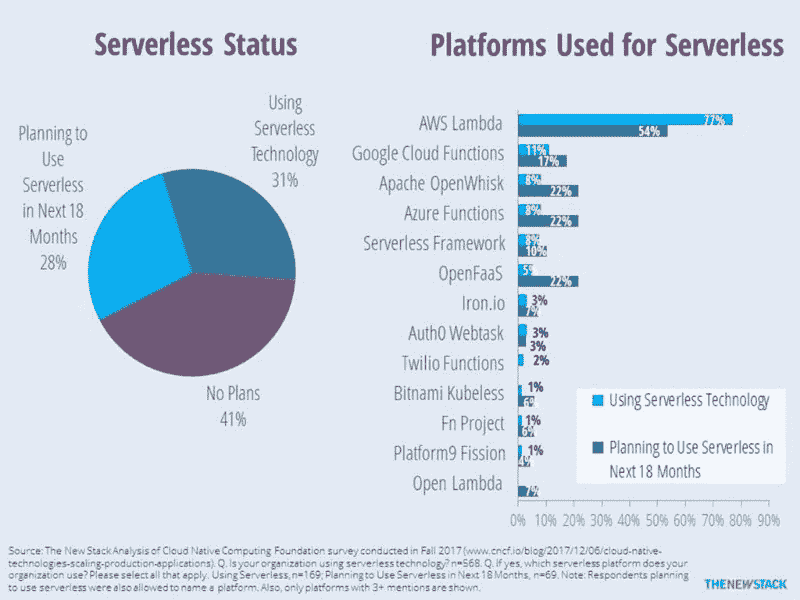
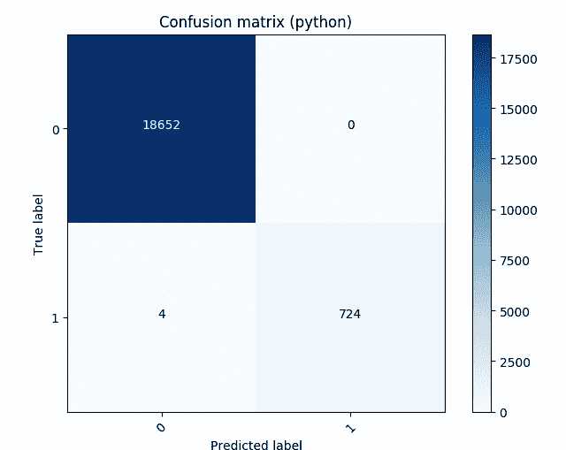
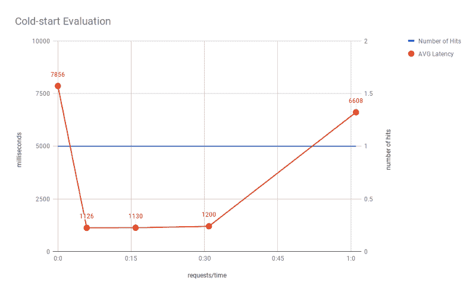
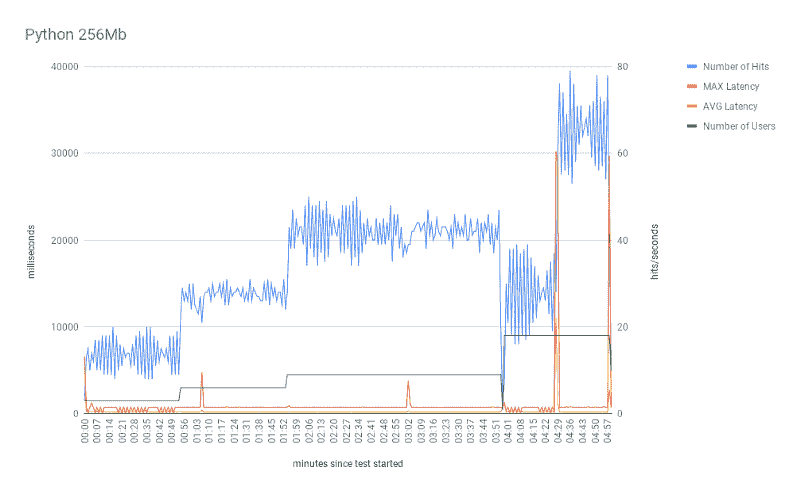
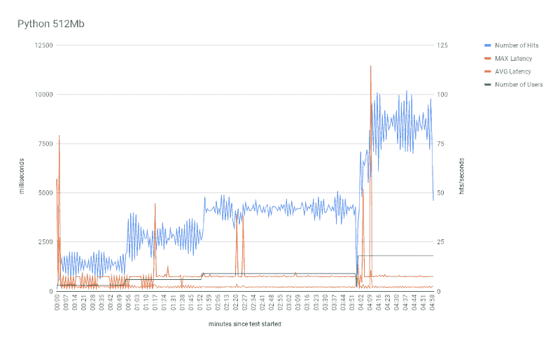
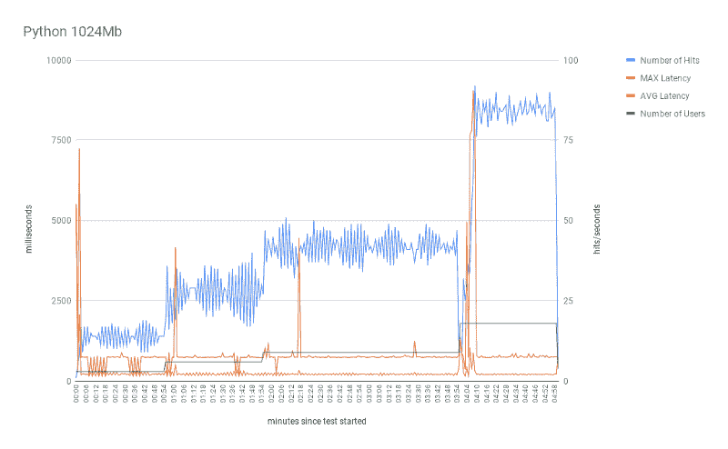
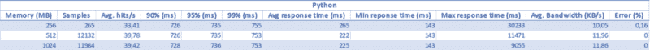
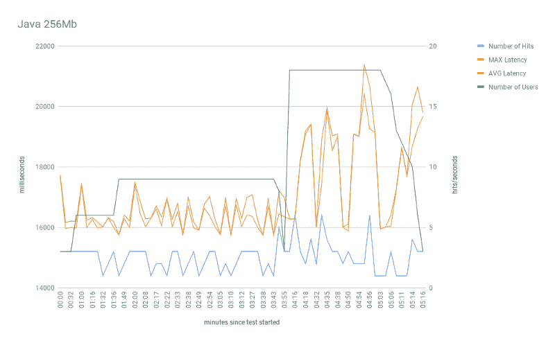
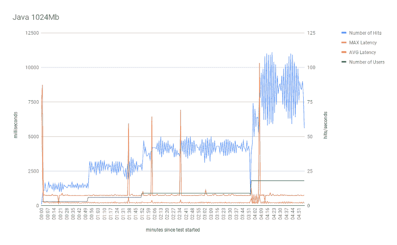
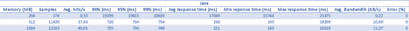

# 通过使用 AWS Lambda 为机器学习模型提供服务，我们学到了什么

> 原文：<https://www.freecodecamp.org/news/what-we-learned-by-serving-machine-learning-models-using-aws-lambda-c70b303404a1/>

作者:戴坦

将机器学习(ML)模型从训练转移到大规模生产是一个开放的问题。许多软件供应商和云提供商目前正在努力解决这个问题。

最大的挑战之一是为模型服务(即接受请求并返回预测)只是问题的一部分。有一个很长的相邻需求列表。例如，这些包括:

*   模型版本控制
*   再培训(自动或按需)
*   预测前预处理输入
*   按需扩展基础架构

为了在这方面更好地为我们的团队提供建议，我们在[岱坦集团](https://medium.com/@DaitanGroup)成立了一个小型但聪明且专注的研究小组。

首先，我们已经建立了一个路线图，用于学习将机器学习模型部署到多个 ML 管道和基础设施中的要求和注意事项。

本文的目的是概述我们的方法以及我们从基线实施中获得的结果。

### 创建基线

[亚马逊 SageMaker](https://aws.amazon.com/sagemaker/) 、[谷歌云 ML](https://cloud.google.com/ml-engine/) 、[塞尔顿核心](https://www.seldon.io/open-source/)和其他公司承诺从培训到大规模服务的平稳端到端管道。然而，在使用这种解决方案之前，我们想尝试用手动过程来创建基线参考。

目标是以最少的努力在云中训练、导出和服务一个 ML 模型。

首先，我们选择 [TensorFlow](https://www.tensorflow.org/) 作为我们的 ML 框架，选择 [AWS Lambda](https://aws.amazon.com/lambda/) 作为部署基础设施。我们使用 [Apache JMeter](http://jmeter.apache.org/) 和 [Taurus](https://gettaurus.org/) 来生成负载测试。

我们的基线基于以下组合的实验:

*   轻量级 ML 模型
*   在 AWS Lambda 的不同配置中
*   使用两种流行的编程语言——Python 和 Java

对于某些组合，我们达到了每秒 **~40 次预测**，平均响应时间**约为 200 毫秒**。这样的结果将解决许多生产用例。如果需要，我们可以毫不费力地扩大规模。

然而，有一些注意事项，我们将在下面详述测试结果时讨论。

此外，一个“更重”模型(图像分割模型)的第二个实验已经完成，这将在后续文章中详细介绍。

#### 为什么选择 TensorFlow 和 AWS Lambda？

TensorFlow 是 Google 创建的一个开源库，用于对一系列任务的数据流进行编程。我们从 TF 开始有几个原因:

*   它是目前 GitHub 上最受欢迎的机器学习框架，拥有大约 [110k 个明星和 1.6k 个贡献者](https://github.com/tensorflow/tensorflow)
*   它积累了大量的成功案例，可在多个平台上使用
*   它作为 ML 的广泛框架变得越来越好，不仅仅是深度学习

这些因素结合在一起，使 TF 成为我们的客户在建立预测模型时使用的自然选择。

AWS Lambda 是亚马逊对[功能即服务(FaaS)或无服务器架构](https://martinfowler.com/articles/serverless.html)的实现。我们已经注意到在过去的几年中使用的显著增加。

它的一些最狂热的用户包括网飞和可口可乐这样的公司。最近的研究(见下文)表明，这种优势可能会在未来几年持续下去。

最受欢迎的是 FaaS 部署应用程序的多功能性和灵活性。此外，它们降低了运营成本，并且易于使用，因为大多数复杂性对最终用户是隐藏的。

支持 AWS Lambda 的另一个要点是其按执行付费的定价。例如，在一个单一的设置中，我们下面描述的所有测试仅花费大约一美元。因此，它适用于各种经济高效、事件驱动的应用。

然而，当使用 AWS Lambda 为生产中的 ML 模型服务时，您需要关注整个流程中的所有步骤。这些步骤通常包括:

*   培养
*   测试
*   版本控制
*   部署
*   发布新的 ML 模型版本

如果没有适当的自动化，这些任务可能导致比计划更高的成本和更慢的流水线。

在接下来的一系列文章中，我们将探索与仅使用 AWS Lambda 相比，其他 ML 管道如何促进上述步骤。

### 训练我们的机器学习模型

总的来说，我们想要调查为大规模 ML 模型服务的各种平台的性能。

在这个方向上，我们的第一个实验侧重于部署一个简单的机器学习模型。这种选择提供了很大的好处，特别是消除了模型训练和性能的时间和顾虑。

为了训练我们的模型，我们选择了 [KDD99 数据集](http://kdd.ics.uci.edu/databases/kddcup99/kddcup99.html)。该数据集共有 567，498 条记录，其中 2211 条被视为异常。

在检查了丢失的值之后，我们继续将当前的语料库分成训练集和测试集。然后，我们使用平均标准化技术对训练数据进行标准化。

接下来，我们针对给定的问题训练了一个二元逻辑回归模型。最后，我们通过计算混淆矩阵来评估模型的准确性:

值得注意的是，我们的重点在于为 ML 模型服务的基础设施方面。因此，训练 ML 算法的最佳实践超出了我们的范围。

### 设置环境

为了更快地完成工作，我们使用了一些流行的 AWS 服务。它们包括 [API 网关](https://aws.amazon.com/api-gateway/)、Lambda 函数、 [S3](https://aws.amazon.com/s3/) 、 [Cloudwatch](https://aws.amazon.com/cloudwatch/) 和 [IAM](https://aws.amazon.com/iam/) 。

下面描述了每个角色的作用:

*   API 网关是向我们的模型发送请求的入口。它处理客户端的 HTTP 请求，并在请求到达时触发事件。
*   Lambda 函数由这样的请求触发。简而言之，Lambda 函数中的代码负责运行我们的 ML 推理函数。
*   我们使用 S3 来存储模型和库等文件。
*   Cloudwatch 负责获取 Lambda 函数生成的日志。
*   IAM 提供了在我们的应用程序中控制认证和授权的基础设施。

### 设计负载测试

我们设计测试是为了回答关于使用 AWS Lambda 服务时最佳成本效益的问题。在这种情况下，我们的测试集中在三个主要部分:

*   不同记忆(机器)容量的探索
*   不同编程语言的性能
*   将模型加载到 Lambda 函数的不同策略

我们用了 Java 和 Python。为了使测试更具可比性，我们将两个实现设计得尽可能相似。

总之，Lambda 内部的 Python 和 Java 代码执行相同的操作。首先，它解压包含模型元数据的文件。其次，它准备好输入参数。最后，它执行模型推理。

AWS Lambda 的一个很好的特性是，我们可以配置它，用不同的内存量来部署我们的模型。换句话说，我们可以选择允许 Lambda 函数使用多少内存。此外，当我们增加这个内存时，CPU 设置也会升级——这意味着我们会切换到更强大的机器。

我们在负载测试中选择了三种不同的内存配置。对于 Python 和 Java，我们使用 256、512 和 1024 Mb 的内存大小进行了测试。

我们使用以下参数运行每个场景:

#### 场景 1:每分钟的渐进式请求

在这个场景中，我们发送一个请求，然后等待 M 分钟发送下一个请求。在测试开始时(第 0 分钟)，负载测试框架向 Lambda 发送一个请求。接下来，它等待 6 分钟并发送新的请求。继续，它再等待 10 分钟来发出下一个请求，依此类推。总的来说，测试大约需要一个小时，在第 0、6、16、31 和 61 分钟执行请求。

目的是评估 Lambda 函数实例在关闭之前将保持活动状态多长时间。正如我们所知，每次 AWS 发布新的 Lambda，都需要时间来设置和安装依赖项(冷启动)。因此，我们希望评估这种情况在单个实例中发生的频率。

简而言之，冷启动可能发生在两种情况下。

*   当我们第一次调用 Lambda 函数时
*   当λ长时间不使用时

在第二种情况下，在空闲超时之后，Lambda 下降。因此，后续请求需要新的冷启动，这增加了设置延迟。

#### 场景 2:并行请求评估

在这个场景中，我们让不同的用户执行并发请求。首先，我们将并发参数设置为 C = 9。这意味着在 T 时间段内将有 9 个不同的用户发出请求。这个 T 周期是 R 周期(以分钟为单位的上升)和 H 周期(以分钟为单位的保持)的总和。

上升期意味着新用户将在一段 R/C 时间后开始发出请求。在这个上升期结束时，所有 9 个用户都加入了系统并开始发出请求。

等待期意味着 9 个用户(发出并行请求)将被等待 H 分钟。我们在第一阶段设置 R 等于 3，H 等于 1。

之后，C 被设置为 18，这意味着 9 个新用户将“加入系统”并开始发出请求，然后 R 被设置为 0，H 被设置为 1 分钟。

我们的目标是回答这个测试中的两个问题。当需要实例化新的 Lambda 实例(冷启动)时，我们希望看到新用户发出请求的响应时间及其影响。

### 结果和讨论

第一张图显示了第一个测试场景的结果。这里，给定一段时间，我们以不同的速率执行对 AWS Lambda 实例的请求。只有一个用户——在整个测试过程中发出一个并行请求。

正如所料，第一个用户/请求的响应时间要长得多。冷启动快 8 秒了。从第一个请求过去了 5 分钟，我们可以看到 AWS 使用了相同的 Lambda 实例，这导致了非常短的响应时间(只有 1 秒)。

有趣的是，即使请求之间的时间间隔更长，AWS 也设法使用同一个实例。具体来说，在前一个请求之后 10 分钟和 14 分钟之后的请求仍然使用相同的 Lambda。然而，对于 30 分钟的时间间隔，AWS 必须旋转一个新的 Lambda 由于冷启动，这导致了更长的响应时间(近 6 秒)。实际上，AWS 必须在 14 到 30 分钟的时间间隔内关闭 Lambda。

同样，我们的目标是评估 AWS 维持 Lambda 实例存活多长时间。实际上，AWS 并不保证这一点。事实上，AWS 算法可能会根据许多其他情况(如网络负载等)来决定这个时间。然而，这个测试帮助我们进一步理解 AWS Lambda 内部逻辑是如何工作的。

对于第二个测试场景，我们有以下设置。

对于所有实验，我们显示 4 种类型的信息。

1.  点击(请求)总数—蓝线。
2.  最大延迟——红线。
3.  平均延迟——黄线。
4.  给定时刻的用户数量——绿线。

下面的一组图表显示了 Java 和 Python 这两种编程语言之间的性能测试比较。

在 5 分钟的总测试时间内，我们将用户总数从 3 个增加到 18 个(x 轴)。用户增长率分别为 3、6、9 和 18。另外，请注意，每个用户都对服务器执行并行请求。因此，当用户数量为 18 时，最多可以发出 18 个并行请求。

为了进一步理解，左边的 y 轴以毫秒为单位显示结果。使用此轴评估最大和平均延迟。相比之下，右边的 y 轴显示了关于点击次数和并行用户的信息。

总的来说，使用 Python 的测试表现符合预期。请注意，并行请求(命中)的数量随着并行用户数量的增加而增加。非常有趣的一点是冷启动对用户数量的影响。

首先，红线(最大延迟)显示每个实验开始时的第一个峰值。实际上，在实验开始时，AWS 实例化了 3 个 Lambda 实例。每个用户请求一个。正如我们所讨论的，每个请求(来自新用户)都需要这种设置。这就是冷启动。

然而，在测试执行期间，我们可以看到一些其他的延迟峰值。这些峰值似乎与用户数量的增加(并行请求)有关。当我们增加用户数量时，AWS(再次)需要设置新的 Lambda 函数来处理新的请求。正如所料，来自同一个用户的后续请求由同一个 Lambda 实例执行。因此，它避免了每个新请求的新冷启动。

另一个有趣的地方是 Lambda 内存对测试可伸缩性的影响。在 256Mb 的情况下，测试达到峰值 77 次命中(18 个并行用户)，平均命中 33.4 次。这个标志在使用 512Mb 时显著增加，但在使用 1024Mb 时没有进一步增加。事实上，大多数统计数据(平均响应时间、平均点击数和最小响应时间)没有太大变化。也许，最显著的改进(从 512 Mb 到 1024 Mb)是最大响应时间，这表明冷启动更快。我们的测试表明，512Mb 是此特定型号的最佳性价比设置。

对于 Java，除了 256Mb 的设置之外，整体性能与 Python 非常相似。首先，256Mb 的测试在点击量上的平均得分仅为 0.55。每秒不到 1 个请求。

实际上，这个测试配置不能根据用户来扩展请求的数量。此外，它在所有测试时间都有很高的延迟。平均响应时间停留在 17，049 毫秒~17 秒！

这种低性能的一个可能原因是 JVM 内存占用，因为其他内存配置做得很好。

对于 512 和 1024 Mbs，结果证实了预期的行为。与 Python 中相应的结果相比，我们可以看到非常相似的结果。

从 Java 512 到 Python 512，一个值得注意的差异是最大响应时间的行为。对于 Java，响应时间要长得多，这意味着更长的冷启动时间。

最后，与 Python 的结果类似，将进程内存大小从 512 MB 增加到 1024Mb 并没有获得明显更好的结果。尽管点击率没有很大的提高，一些冷启动却有了很大的提高。如表中所示，Java 512Mb 的最大响应时间约为 18 秒，而 1024Mb 的最大响应时间约为 10 秒。

### 结论

总之，AWS Lambda 是提供需要伸缩的轻量级 ML 模型的好选择，只有一些警告。

在我们设想的用例中，它的主要**优势**包括:

1.  **便利:**

*   AWS Lambda 易于部署和自动伸缩
*   AWS 是云市场的领导者。因此，许多组织已经在部署他们的应用程序并存储数据

2.**成本:**根据工作负载，按执行付费可以降低基础架构成本。

在**警告**中，Lambda 函数的语言选择很重要。因此，它可能会对性能和成本产生重大影响。

此外，如果您的应用程序依赖于非常小的延迟，AWS Lambda 可能不是最佳选择。冷启动不利因素减少了可以从中受益的应用范围。一般来说，如果应用程序具有这些属性中的任何一个，就可以从 Lambdas 中提取最多的信息。

*   定义明确和/或可预测的流量
*   冷启动延迟对于达到产品要求来说不是问题

在某些情况下，可以通过 ping 等方法缩短冷启动时间，以保持 Lambda 功能正常运行。

另一个考虑是，TF 模型(即使是像本测试中使用的简单模型)在某些情况下可能不是最小的选择。

最后但同样重要的是，ML 工作流中的任何其他步骤，比如版本控制和再培训，都需要我们自己来完成。这是意料之中的，因为 AWS Lambda 只是一个通用计算环境。

### 后续步骤

现在，我们将尝试更先进的端到端 ML 管道，并比较体验。问题是，他们会为我们提供从培训到服务的简化流程，以及我们所寻求的灵活性和可扩展性吗？

敬请期待！

### 作者

布鲁诺·希奥纳托、迭戈·多明戈斯、费尔南多·莫赖斯、古斯塔沃·罗萨托、伊萨克·索萨、马西亚诺·纳尔迪、塔尔斯·席尔瓦— [戴坦集团](http://www.daitangroup.com/)