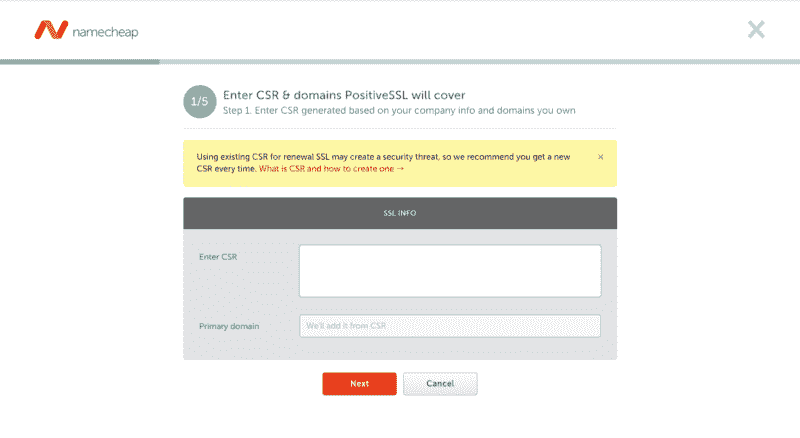
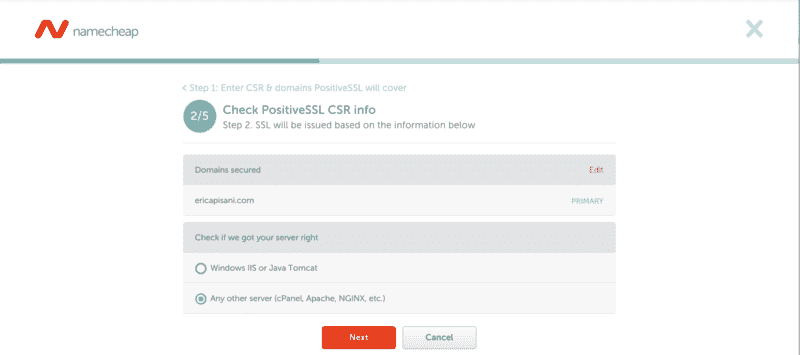
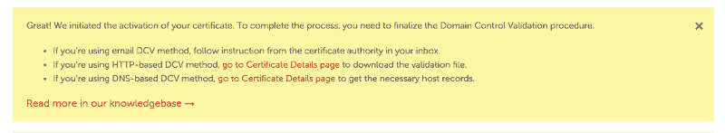
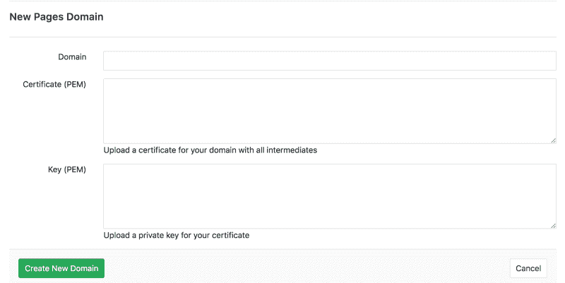

# 如何将 SSL 证书和自定义域名添加到 GitLab 页面站点

> 原文：<https://www.freecodecamp.org/news/how-to-add-an-ssl-certificate-and-custom-namecheap-domain-to-a-gitlab-pages-site-323f8f3ce642/>

艾丽卡·皮萨尼

# 如何将 SSL 证书和自定义域名添加到 GitLab 页面站点

Photo by Markus Spiske ([https://unsplash.com/@markusspiske](https://unsplash.com/@markusspiske))

向 GitLab Pages 站点添加 SSL 证书和自定义域名可能比看起来更具挑战性。

安装信息的关键部分存在于不同站点的密集文档中。考虑到您必须等待几个小时来确认您的更改已经传播，所以很难判断您是否已经正确地进行了设置。

即使你知道有些事情不对劲，你也不能总是分辨出是什么。这使得调试问题令人沮丧，并且很难解决。

本指南旨在使这一过程更加简单明了，不那么令人沮丧。它假设您已经:

*   已经在 GitLab 页面上设置了您的项目，并且能够通过在浏览器中输入`<your-username>.gitlab.io/<your-proj` ect-name >来访问它
*   通过 name price 购买了自定义域名和 SSL 证书

### **步骤 1:激活 SSL 证书**

在 Namecheap 中，转到“产品列表”>“SSL 证书”页面。您应该会看到已经购买但尚未激活的 SSL 证书列表。单击您希望为您的站点激活的 SSL 证书上的“激活”。

### **步骤 2:生成 SSL 证书请求**

您应该会看到如下所示的页面:

为了生成 CSR，您需要在终端中运行以下命令:`openssl req -new -newkey rsa:2048 -nodes -keyout <your-domain-name>.key -out <your-domain-n` ame > .csr。

该命令将生成一个私钥。不要丢失这把钥匙。以后在 GitLab 上安装证书时会用到它。如果您丢失了它，您将不得不提交另一份 CSR 请求。

如果你愿意，你可以在这里阅读关于生成 CSR 的基本细节。博士是:

*   强烈建议您填写所有必填字段。您的 CSR 可能会在您不需要激活期间被拒绝。如果您为个人或爱好网站填写此 CSR，您可以在“组织”和“组织单位”字段中输入`NA`。
*   如果证书是为特定的子域颁发的，您需要在“公用名”字段中指定子域。示例:`subdomain.ssl-certificate-host.com`
*   如果证书是通配符证书，域应该以星号开头。示例:`*.ssl-certificate-host.com`

出于本指南的目的，将假设您正在获得类似于`<example-domain&g`t；。com。

一旦您运行了这个命令，您的工作目录中应该有一个`.csr`和`.key`文件。打开`.csr`文件，复制里面的内容。它应该有标题`----- BEGIN CERTIFICATE REQUEST -----`。

将文件内容粘贴到`Enter CSR`域。该页面将根据 CSR 中的信息自动填写表单上的域字段。

单击“下一步”后，您应该会看到以下页面:

检查信息是否正确，然后再次单击“下一步”转到“确认您拥有该域”步骤。

### **第三步:确认你拥有该域名**

为了做到这一点，您可以使用几种不同的选项:

*   电子邮件
*   基于 HTTP 的
*   基于 DNS 的

我个人在通过电子邮件进行验证时遇到了问题，因此出于本指南的目的，请选择“基于 DNS”。这需要您在您的域的 DNS 设置中设置一个`CNAME`值，我们将在本指南的后面部分对此进行介绍。

现在，在选择“基于 DNS”之后，单击“下一步”，但是如果您以后改变了对这种形式的验证的想法，它是可能改变的。

### **步骤 4:指定谁将接收 SSL 文件**

确认字段中的电子邮件是正确的。这是证书激活后接收证书的电子邮件。

### **第五步:审核并提交**

确认显示的信息正确无误，然后点击“提交”。

### **步骤 6:设置`CNAME` 记录以验证域名**的所有权

提交表单后，您将被重定向到显示 SSL 证书详细信息的页面，该页面带有一个有用的通知窗口，如下所示:

单击基于 DNS 的 DCV 方法的链接。您将进入一个页面，显示您之前输入的信息，例如:

*   域名
*   将安装证书的 web 服务器的类型(应该是 Apache、Nginx、cPanel 或其他)
*   正在使用的 DCV 方法

访问“正在使用的 DCV 方法”右侧的“编辑方法”按钮的下拉选项，以访问并单击“获取记录”选项。

将出现一个弹出窗口，显示您需要设置的`CNAME`记录，以便确认域名的所有权。将这些值复制到一个空文本文件中，因为您需要转到您的域的“高级 DNS”页面。这可以通过“仪表板”或“域列表”>“管理”(列表中除了您的域之外)>“高级 DNS”来访问。

在“主机记录”部分:

*   点击“添加新记录”
*   选择“CNAME 记录”。
*   将您之前从“获取记录”弹出窗口中复制的值粘贴到相应的字段中。

不过，在保存这些值之前，有一点“麻烦”。

正如 Namecheap 在他们的[文档](https://www.namecheap.com/support/knowledgebase/article.aspx/9637/68/how-can-i-complete-the-domain-control-validation-dcv-for-my-SSL-certificate#dns)中指出的，他们“在记录创建期间自动将域名添加到提交的值中”。这意味着出现在“主机”值中的域名是一个重复值。拆卸`<your-custom-domain&g`t；。com 在“主机”值的末尾，您就可以开始了。

保存该记录后，需要一段时间才能颁发证书。在您的电子邮件中收到证书后，继续第 8 步。如果您还没有，那么让我们建立所需的附加记录，以便在 `they enter <your-cus`Tom-domain>com 时将人员发送到`<your-username>.gitlab.io/<your` -project >

### **步骤 7:在 Namecheap 中设置您的主机记录**

正如 GitLab 的[文档](https://docs.gitlab.com/ee/user/project/pages/getting_started_part_three.html#dns-txt-record)中所概述的，你还需要在 GitLab 方面证明你拥有你想要在其上提供 GitLab 页面站点的定制域。

如前所述，本指南假设您只是希望使用`example.com`(或`www.example.com`)，因此您将希望添加以下主机记录:

*   类型`A Record`，主机`@`，值`35.185.44.232`(这是写作时当前的 GitLab 页面 IP)
*   类型`CNAME Record`、主机`www`、值`example.com`(这确保进入‘www’子域(即:`www.example.com`)的人仍能到达你的站点)
*   *注意:在您通过第 8 步中概述的“新页面域”流程添加域之前，您将无法输入该域。*类型`TXT Record`，主机`@`，值`gitlab-pages-verification-code=11112222aaaabbbb`

### **步骤 8:在 GitLab 中安装证书**

前往你试图设置的 GitLab 项目的“页面”页面(在侧边栏的“设置”>“页面”下)。

要添加 GitLab 为您的页面站点提供服务的自定义域，请点击右上角的“新建域”按钮。您应该会看到如下所示的内容:

在域字段中输入您的自定义域(`example.com`)，然后下一部分就变得有趣了。

如果您尝试在字段中输入您的证书(`example_com.crt`)和您的私钥(最初发送证书请求时生成)，您可能会得到一个“证书缺少中间物”的错误。

这是因为 GitLab 在将请求路由到正确的站点之前，使用类似 NGINX 的东西在它的页面 IP 上接收请求。Namecheap 在他们的[文档](https://www.namecheap.com/support/knowledgebase/article.aspx/9474/69/how-do-i-create-a-pem-file-from-the-certificates-i-received-from-you)中称“需要将你的证书和 CA 证书合并在一个文件中”。

这意味着您需要在“证书字段”中组合在您的`example_com.crt`和`example_com.ca-bundle`文件中找到的文本。最后，您应该会看到这样的内容:

将私钥添加到最后一个字段，就完成了。传播更改需要时间。如果您几个小时后再来查看，您应该会在地址栏中看到您的地址旁边有一个指示，表明您与您的站点的连接现在是安全的。

### **资源/参考资料**

*   [https://about.gitlab.com/features/pages/](https://about.gitlab.com/features/pages/)
*   [https://docs . git lab . com/ee/user/project/pages/getting _ started _ part _ three . html # DNS-txt-record](https://docs.gitlab.com/ee/user/project/pages/getting_started_part_three.html#dns-txt-record)
*   [https://www . name cheap . com/support/knowledge base/article . aspx/9474/69/how-do-I-create-a-PEM-file-from-the-certificates-I-received-from-you](https://www.namecheap.com/support/knowledgebase/article.aspx/9474/69/how-do-i-create-a-pem-file-from-the-certificates-i-received-from-you)
*   [https://www . name cheap . com/support/knowledge base/article . aspx/9637/68/how-can-I-complete-the-domain-control-validation-dcv-for-my-SSL-certificate # DNS](https://www.namecheap.com/support/knowledgebase/article.aspx/9637/68/how-can-i-complete-the-domain-control-validation-dcv-for-my-SSL-certificate#dns)
*   [https://stackoverflow.com/a/49124195/2719852](https://stackoverflow.com/a/49124195/2719852)