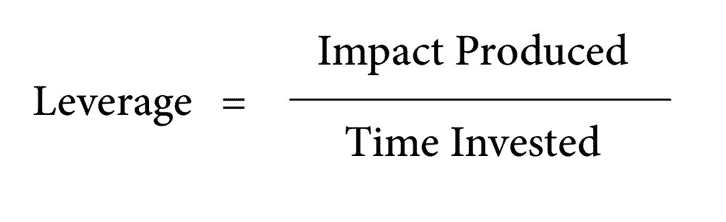

# 如何成为一名有效的软件工程师

> 原文：<https://www.freecodecamp.org/news/how-to-become-an-effective-software-engineer-b2d25b588bc8/>

路易斯·圣地亚哥

# 如何成为一名有效的软件工程师

当我第一次开始作为一名软件工程师的旅程时，我很快注意到在企业项目工作时涉及到大量的认知负荷。在计划的执行过程中，有许多不断变化的目标。

干净的代码、测试、安全性、配置文件、性能、部署和许多其他变量通常构成了成功完成项目所需的精神负荷的一部分。

我在思考一个我见过许多工程师面临的悖论:试图跟上这个不断变化的软件行业的最新趋势，同时为我工作的公司创造巨大价值。

我渴望在吉拉故事之外的时间，为我的成长贡献力量。

然后，我开始寻找可以帮助我为组织增加巨大价值、保持增长并变得有效的工具。

#### **意识到什么是重要的**

我的主要来源是技术行业人士的指导。尤其是像加里·维纳查克、卡尔·纽波特和埃德蒙·刘这样的作者对书籍形式的指导。

我在他们的建议中发现了一个模式。这就是意识——深刻理解什么是重要的，并朝着这个目标努力。明确的目标给了我们衡量它们的机会。自我意识让我们认识到自己最擅长的事情，也能看到自己的弱点。

> "接受你的缺点，努力变得更清楚你到底是谁."—加里·维纳查克

#### 杠杆作用

在《有效的工程师》一书中，埃德蒙·刘建议用杠杆作为衡量效率的标准。杠杆是投入努力的投资回报。我认为这是杠杆的一般定义。结合埃德蒙·刘的杠杆方程式，我对其定义有了全新的认识:

Edmund Lau’s definition of leverage.

看着上面的等式，我理解了影响杠杆结果的参数。

在我开始开发代码之前，我通常对产品实现将如何对业务产生影响有一个想法。即使在实现之后，我也可以通过跟踪日志、使用和采用率来衡量它的真正影响。这个分子，**产生的影响**，是间接给我们的。

分母是我们最容易跟踪的参数。投入的时间是我们在执行之前、期间和之后可以衡量的价值。努力将这个参数保持在最低水平会产生更高的杠杆作用。这意味着更高的投资回报率(ROI)。

对于软件工程师来说，ROI 可能意味着提高与业务伙伴的信任度，更高的采用率，或者减少执行某项任务所需的时间。

要做到这一点，我们必须善于高效地完成工作。

> “高效的工程师不是那些试图通过增加工作时间来完成更多工作的人。他们能高效地完成工作，并将有限的时间集中在能产生最大价值的任务上。”——刘爱德蒙

在《高产出管理》一书中，英特尔前首席执行官 Andrew Grove 分享了三种提高杠杆率的方法:

1.  减少完成某项任务所需的时间
2.  增加一项活动的产量
3.  转向高杠杆活动

埃德蒙·刘补充了三个问题:

1.  我如何在更短的时间内完成这项活动？
2.  我如何增加这项活动产生的价值？
3.  我还能花时间做些其他能产生更多价值的事情吗？

我有时会全神贯注于特定的编码任务。然而，我发现偶尔停下来问自己这三个问题是有益的。我将它们视为有效性的脉冲检查。

#### 心态

我们对自己的智力、性格和能力的看法深深影响着我们的生活方式。

采用增长思维是我遇到的最有影响力的概念之一。主要是因为它是培养我们自信的有效工具。有时候，我们会感觉到著名的[冒名顶替综合症](https://guide.freecodecamp.org/working-in-tech/imposter-syndrome/)悄然而至。我们可能会觉得我们的技能和“他们”想要的不一致。

但是当你采取成长的心态时，你就说出了你的故事。你告诉他们你是谁，你已经掌握了什么技能，你对下一步做什么感到兴奋，以及为什么。有意识地发现需要改进的地方，并积极执行自我完善计划。这意味着对你能改变的情况的每一个方面承担责任。

学习，就像投资的钱一样，也是复合的:

1.  知识给你一个获得更多知识的基础。
2.  你越早优化学习，你的学习就有越多的时间复合。
3.  从长远来看，即使你的学习速度有很小的变化，也会产生很大的影响。

#### 限制正在进行的工作量

清单可以改善结果。它们是用于减少许多领域中的误差的工具。保留一份清单有助于我将记忆下一步要做的事情的所有努力从脑海转移到另一个地方。这让我把脑力集中在解决问题和发展上。

> 避免上下文切换。一次只专注于一项任务。

任何形式的分心，包括同时处理多项任务，都会削弱我变得高效的能力。可能的话，我会运用深度工作，这是我从卡尔·纽波特的书《深度工作》中学到的技巧。我有意识地努力排除一切干扰，致力于发展掌控能力。

Cal Newport 将深度工作定义为:

> 在不受干扰的集中状态下进行的专业活动，将你的认知能力推向极限。这些努力创造了新的价值，提高了你的技能，而且很难复制。”—加州新港

#### 包扎

对新技能采取成长心态的实践使我们成为更好的学习者，更愿意超越我们的舒适区。

很多时候，我对一个新的项目想法感到兴奋。我想它的实现会增加多少价值。然后我也会考虑所有可能出错的事情。我思考失败。我感到恐惧。我停下来。

但是有了成长的心态，我明白我必须超越这种思维循环。我知道我一直在学习。就像一个测试版的产品，永远在进步。总是在不断的迭代中。然后，我继续沿着我的有效之旅前进。