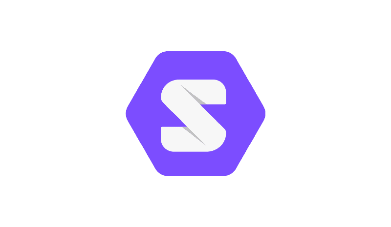

# 蒂姆·伯纳斯·李新的、再分散化的网站 SOLID 简介

> 原文：<https://www.freecodecamp.org/news/an-introduction-to-solid-tim-berners-lees-new-re-decentralized-web-25d6b78c523b/>

作者:阿尔纳·班萨尔

# 蒂姆·伯纳斯·李新的、再分散化的网站 SOLID 简介



最近，蒂姆·伯纳斯·李教授揭开了一个名为 Solid 的项目的面纱。我决定去看看。在这篇文章中，我描述了 Solid 的目标是什么，以及如何开始使用它。

### 什么是固体？

Solid 是一个重新分散网络的尝试。

*Re**-**放权？*

过去，网络的愿景是一个分散的、协作的读写空间。第一个浏览器(名为 WorldWideWeb)是一个编辑器。

然而，随着它的发展，由于各种原因，web 应用程序的设计开始集中化。用户数据成为互联网公司的权力和收入来源。

固体是解决这个问题的方法。

Solid 是 web 应用程序的新范例，它向后兼容现有的 web。

Solid 是一个技术栈，一组相关的协议、实现和一个不断增长的社区。很像网络。

### 应用和数据的分离

在互联网出现之前，你的个人电脑储存你的数据。

随着人们开始使用多台电脑，并将智能手机融入他们的生活，“你的数据留在你身边”的模式被“你的数据在世界各地的一个或多个大规模数据中心，由应用程序开发者管理”所取代。

因此，应用程序与其数据紧密结合。在网络上创建一个应用程序需要大规模地管理人们的数据。

应用程序和它们赚钱的能力是由它们的数据仓来衡量的。您的数据很难迁移，因为不同的应用程序存储您的数据非常不同。

结果呢？几乎每个 app 都有围墙花园的特点。这降低了开发者在应用层面创新的动力。由于数据锁定使用户很难移动，现有平台受到保护，不会被破坏。

### 数据保护法规

一些国家已经颁布了数据保护法。公司必须提供你的数据，你可以选择下载或删除。

这试图将数据控制权交还给用户。但这是法律规定，而不是技术现实。用户数据仍然掌握在应用程序开发人员手中，如果你不能迁移到其他地方，下载数据的能力就没什么用了。

### 豆荚:自带数据

Solid 在技术方面解决了这个问题。它允许应用程序以读写存储在你的 *pod* 上的数据的方式构建。

你有一个豆荚。你的朋友有一个豆荚。豆荚储存你的数据。您允许应用程序访问您的 pod。

也许你有多个豆荚。也许家庭和工作需要分开。您的 pod 可以位于您的电脑上，也可以分布在您的设备上。或者它可以为你托管。

而 pod 存储*链接的数据*。您的 pod 可以链接到我的 pod 或网络上的任何地方。

我们希望应用程序能够在我们的设备上运行。但是我们也希望我们的数据自治。我们希望不同的应用程序能够使用相同的数据并写入其中。

### 固体背后的想法

进入 Solid 让我想起了从 web 开发开始。我记得我同时学习 HTML、CSS、JavaScript 和当时的框架。

唯一不同的是:Solid 是新的，帮助更难找到。

以下是您开始开发 Solid 时需要了解的一些基本概念:

(注:如果你只是想跳进去，直接跳到“第一步”)

#### **关联数据**

实体和网络的力量来自于数据超链接的方式。

在 Solid 中，您可以将生成的数据存储在任何您想要的地方。你的个人数据可能在你的 pod 上。要引用这些数据，您可以使用 URL，就像在 web 上一样。

这也是一个很好的时间来介绍固体的完整形式:**SO**cial**LI**NK**D**ATA。

在实体的上下文中阅读[关联数据](https://solid.inrupt.com/docs/intro-to-linked-data)

#### **资源描述框架**

RDF 是一种用形式为`subject-predicate-object`的语句表示链接数据的方法。这些也被称为三元组。

RDF 是一个抽象模型。你甚至可以用英语句子来表示 RDF。这是待办事项列表中的一项任务:

```
T1 is a taskT1 is labelled "Write an article about Solid"T1 is due October 5rd 2018T1 is assigned to @itsarnavbT1 is incomplete
```

#### **乌龟**

Turtle 是一种表示 RDF 数据的简洁方式，使用 URL 来表示`subject`、`predicate`和`object`。

那是重复的，很难读，所以 turtle 有一个前缀和速记系统。这对于较长的文档尤其重要。

你可以阅读更多关于[海龟](https://solid.inrupt.com/docs/expressing-ld-with-turtle)的内容。或者你可以在这里查看完整的海龟文件。这是 Ruben Verborgh 教授的详细公开资料，他是 Solid 团队的一员。

#### 语义万维网

蒂姆·伯纳斯·李最好地解释了这一点:

> 我对网络有一个梦想，在这个梦想中，计算机能够分析网络上的所有数据，包括内容、链接以及人和计算机之间的交易。使这成为可能的“语义网”尚未出现，但当它出现时，贸易、官僚机构和我们日常生活的日常机制将由机器与机器对话来处理。人们吹捧了很久的智能代理人最终将会实现

### 第一步

按照任何适合你的顺序去做。

*   获得一个 pod :注册任何免费的 pod 提供商，或者运行你自己的服务器(如果那是你的事情)。
*   [用这个教程做一个扎实的 app](https://solid.inrupt.com/docs/app-on-your-lunch-break)
*   [阅读这些由固体制成的黑客](https://solid.gitbook.io/solid-hacks/)
*   [阅读固体文件](https://solid.inrupt.com/docs)

### 走固体

你可以通过以下方式帮助稳固的生态系统

*   有助于 Solid 本身和相关基础设施的发展。
*   使用 Solid 开发应用程序。


但是请注意，目前，学习和开发 Solid 需要大量的试验和错误，并且可能会问一些愚蠢的问题。没有堆栈溢出可参考。调试某些错误可能需要您深入研究源代码。

以下是您可以获得帮助的社区:

*   [r/solid](https://reddit.com/r/solid) (我是 mod 之一)
*   [gitter.im/solid](https://gitter.im/solid/home)

最后，我的 DMs 是开放的: [@itsarnavb](https://twitter.com/itsarnavb) 。我会试着回答我得到的每一个问题，或者找一个能回答的人。

我将通过学习 Solid 的最佳资源来更新这篇文章。

### 进一步阅读

*   [坚实的网站——solid.mit.edu](https://solid.mit.edu)
*   去中心化网络的范式转变——鲁本·韦尔伯格
*   网络的一小步——蒂姆·伯纳斯·李