# 如何确保 MySQL 数据库的安全

> 原文：<https://www.freecodecamp.org/news/cjn-is-your-mysql-secured-7793e5444cf5/>

#### 开始之前的一些基本信息:

来源:[互联网安全中心(CIS)的 Oracle MySQL 社区服务器 5.7](http://www.itsecure.hu/library/image/CIS_Oracle_MySQL_Community_Server_5.7_Benchmark_v1.0.0.pdf)

**操作系统:** Windows 10

**执行位置:**命令行

```
mysql -u USERNAME -p
```

**目标应用:** Oracle MySQL 社区服务器 5.7

### **信息系统的审计和记录**

当出现可疑的网络攻击时，日志对于安全性起着至关重要的作用。对安全人员来说，手动检查日志是一件非常辛苦的事情，他们必须使用日志检查工具来提取信息并进行分析。日志应该使用 WORM(一写多读)存储技术和加密，以避免损坏和丢失日志数据。此外，日志应该有一个标准化的格式，以便于维护、访问和比较。

#### **确保“日志错误”不为空**

**命令:**

```
SHOW variables LIKE ‘log_error’;
```

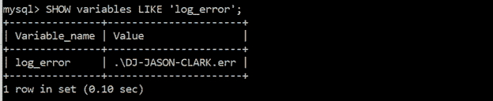

error logging

错误日志包含 mysqld 启动或停止时的事件数据。它还显示何时需要评估或修复一个表。它必须产生“价值”。启用错误日志的原因是它有助于提高检测针对 MySQL 和其他重要消息的恶意企图的能力。

#### **确保日志文件存储在非系统分区上**

**命令:**

```
SELECT @@global.log_bin_basename;
```

MySQL 的日志文件可以存储在文件系统中的任何地方，并使用 MySQL 配置进行设置。此外，最佳实践是确保文件系统中的日志不会与其他日志(如应用程序日志)混杂在一起。您必须确保返回的值不表明它位于根“('/')”、“/var”或“/usr”中。其原因是，如果操作系统的可用磁盘空间耗尽，分区将降低拒绝服务的可能性。


**Log files in non-system partition**

#### **确保“日志错误详细度”未设置为“1”**

**命令:**

```
SHOW GLOBAL VARIABLES LIKE ‘log_error_verbosity’;
```

该检查提供了 MySQL 日志在错误消息上已经或已经启用了哪些功能的附加信息。值 1 表示启用错误消息记录。值为 2 会启用错误和警告消息的记录。值 3 允许记录错误、警告和注释消息。这有助于通过记录通信错误和中止的连接来检测恶意行为。

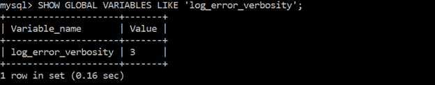

**Log error verbosity**

#### **确保审计日志记录已启用**

启用审核日志记录对于交互式用户会话和应用程序会话的生产环境至关重要。通过审计日志，它有助于识别谁在何时更改了什么。它还可以帮助识别攻击者做了什么，甚至可以在调查中用作证据。

命令:

```
SELECT NAME FROM performance_schema.setup_instruments WHERE NAME LIKE ‘%/alog/%’;
```

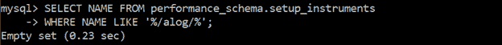

**Audit log 1**

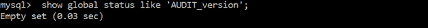

**Audit log 2**

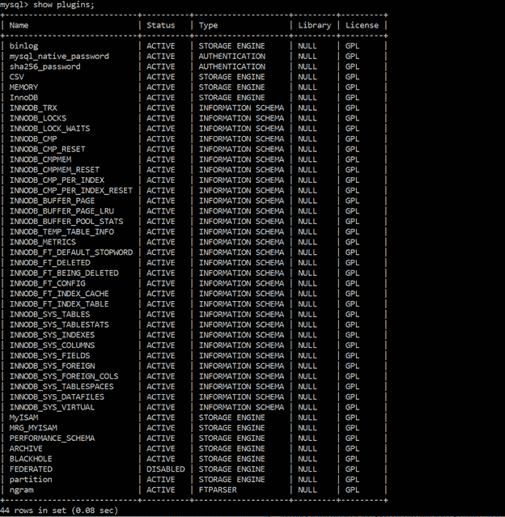

**No audit log plugins**

**命令:**

```
SET GLOBAL general_log = ‘ON’ ;
```


**General log query**

**命令:**创建用户' user1'@'localhost '由密码' not-so-secret '标识；

Windows 10 中的日志路径可以通过使用服务应用程序找到，查看 MySQL 是否正在运行，然后右键单击属性。

作者系统中的日志位于:C:\ program Data \ MySQL \ MySQL Server 5.7 \ Data \ DJ-JASON-Clark . log

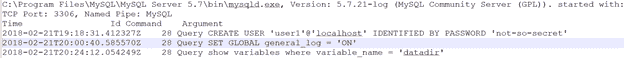

**General log in the system**

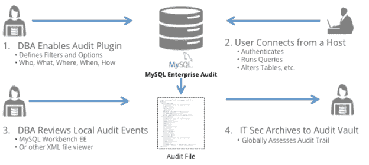

**MySQL Enterprise Audit process**

### **信息系统认证**

身份验证确保用户或机器提供的凭据与本地操作系统或身份验证服务器中授权用户的数据库相匹配。身份验证之后是授权，授权由管理员授予用户或机器。私有网络和公共网络中常用的身份验证是基于密码的身份验证。

#### **确保密码没有存储在全局配置中**

MySQL 配置文件的[client]部分允许创建用户和设置密码。该检查非常重要，因为允许在配置文件中包含用户和密码会对用户密码的保密性产生负面影响。

要进行审计，请打开 MySQL 配置文件并检查[client]部分—它不能存储任何密码。作者的系统中没有设置密码(见下图)。如果在配置文件中设置了密码，请使用 mysql_config_editor 将密码以加密形式存储在. mylogin.cnf 中。

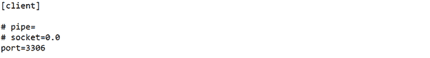

**[client] section of MySQL configuration file**

#### **确保‘SQL _ mode’包含‘NO _ AUTO _ CREATE _ USER’**

“no_auto_create_user”是一个选项，用于防止在未提供身份验证信息时自动创建用户。

**命令:**

```
SELECT @@global.sql_mode;
```

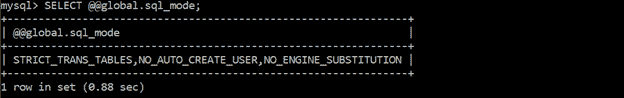

**No auto create user in global**

**命令:**

```
SELECT @@session.sql_mode;
```

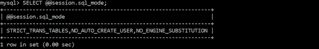

**No auto create user in session**

#### **确保为所有 MySQL 账户设置了密码**

用户可以创建空白密码。拥有空白密码是有风险的，因为任何人都可以冒用用户的身份，输入用户的登录 ID 并连接到服务器。这绕过了认证，这是不好的。

**命令:**

```
SELECT User,host FROM mysql.user WHERE authentication_string=’’;
```

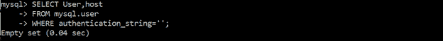

**Users with blank passwords**

#### **确保“默认密码生存期”小于或等于“90”**

将密码生存期更改为 90 天可以减少攻击者破解密码的时间，从而降低被攻击的可能性。

**命令:**

```
SHOW VARIABLES LIKE ‘default_password_lifetime’;
```

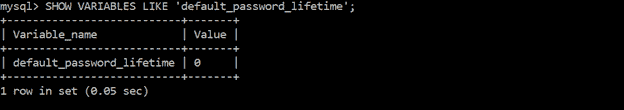

**Default password lifetime with 0 value**

**命令:**

```
SET GLOBAL default_password_lifetime=90;
```

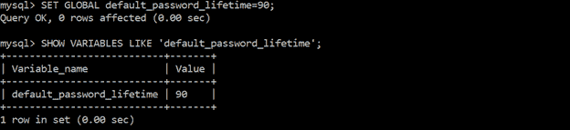

**Setting default password lifetime to 90**

#### **确保密码复杂性到位**

密码复杂性增加了身份验证的安全强度，包括添加或增加长度、大小写、数字和特殊字符。密码越复杂，攻击者就越难使用暴力获取密码。弱密码很容易在密码字典中获得。

**命令:**

```
SHOW VARIABLES LIKE ‘validate_password%’;
```


**Check for password complexity**

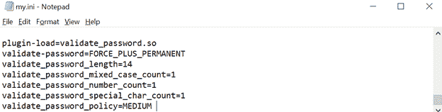

**Implement password complexity**

#### **确保没有用户使用通配符主机名**

具有通配符主机名(%)的用户被授予访问任何位置的权限。最好避免创建通配符主机名。相反，创建用户并给他们指定特定的位置，给定的用户可以从这些位置连接到数据库并与之交互。

**命令:**

```
SELECT user, host FROM mysql.user WHERE host = ‘%’;
```

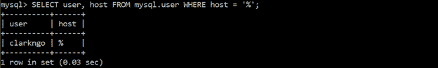

**Wildcard hostname**

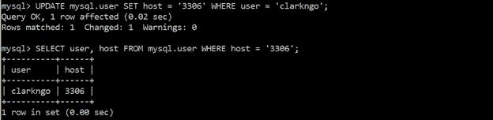

**Change wildcard hostname**

#### **确保不存在匿名账户**

用户可以有一个匿名(空的或空白的)用户名。这些匿名用户名没有密码，任何其他用户都可以使用该匿名用户名连接到 MySQL 服务器。删除这些匿名帐户可以确保只有已识别的可信用户才能访问 MySQL 服务器。

**命令:**

```
SELECT user,host FROM mysql.user WHERE user = ‘’;
```


**No anonymous accounts**

### **与 MySQL 服务器的网络连接**

网络连接对于用户和 MySQL 服务器之间的通信起着重要的作用。不安全的网络连接非常容易受到攻击。以下是对网络连接安全性的检查。

#### **确保‘have _ SSL’设置为‘YES’**

为了避免恶意攻击者窥视您的系统内部，在使用不受信任的网络时，最好对所有网络流量使用 SLL/TLS。

**命令:**

```
WHERE variable_name = ‘have_ssl’;
```

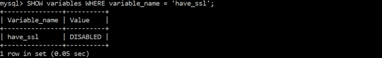

**No SSL**

#### **确保所有远程用户的“ssl_type”设置为“ANY”、“X509”或“SPECIFIED”**

应该为每个用户配置 SSL/TLS。这进一步防止了恶意攻击者的窃听。

**命令:**

```
SELECT user, host, ssl_type FROM mysql.user WHERE NOT HOST IN (‘::1’, ‘127.0.0.1’, ‘localhost’);
```

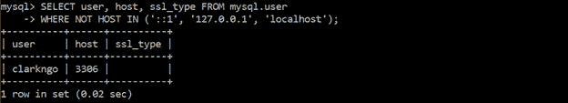

**No ssl_type**

### **复制**

通过检查复制状态，您可以监控性能和安全漏洞。Microsoft SQL Server Management Studio 具有以下工具来监视复制:

1.  查看快照代理状态，
2.  查看日志读取器代理状态，以及
3.  查看同步状态。

#### **确保复制流量安全**

服务器之间的复制流量必须受到保护。在复制传输过程中，密码可能会泄露。

要进行审计，请检查他们是否使用了:专用网络、VPN、SSL/TLS 或 SSH 隧道。希望作者的系统使用的是私有网络。否则请更正，并通过使用专用网络、VPN、SSL/TLS 或 SSH 隧道来确保安全。


**Private network**

#### **确保“主 _ SSL _ 验证 _ 服务器 _ 证书”设置为“是”或“1”**

' MASTER_SSL_VERIFY_SERVER_CERT '检查副本服务器是否应该验证主服务器的证书。在继续连接之前，副本服务器应该验证主服务器的证书，以对主服务器进行身份验证。

**命令:**

```
SELECT ssl_verify_server_cert FROM mysql.slave_master_info;
```


**No SSL for replica-primary check**

#### **确保“主信息存储库”设置为“表格”**

“master_info_repository”确定复制副本在何处记录主服务器的状态和连接信息。密码存储在主信息存储库中，是一个纯文本文件。将密码存储在 master_info 表中更安全。

**命令:**

```
SHOW GLOBAL VARIABLES LIKE ‘master_info_repository’;
```

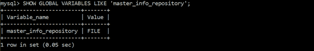

**Primary info repository value**

#### **确保复制用户的“super_priv”未设置为“Y”**

位于“mysql.user”表中的“超级”权限(‘SUPER _ priv’)具有类似于“更改”、“主到”、“杀死”、“mysqladmin 杀死”、“清除二进制日志”、“设置全局”、“mysqladmin 调试”和其他日志控制的功能。授予用户“超级”权限允许用户查看和终止当前正在执行的 SQL 语句，甚至是口令管理。如果攻击者利用并获得“超级”权限，他们就可以禁用、更改或破坏日志记录数据。

**命令:**

```
SELECT user, host FROM mysql.user WHERE user=’repl’ and Super_priv = ‘Y’;
```


**Replication check for users with SUPER privilege**

#### **确保没有复制用户使用通配符主机名**

MySQL 允许您向通配符主机名授予权限。应该避免使用通配符主机名，应该创建或修改用户，并为他们指定特定的位置，给定的用户可以从这些位置连接到数据库并与之交互。


**Replication check for wildcard hostnames**

### **结论**

以下检查是针对使用 MySQL 作为应用程序端和用户端的信息系统的单一工作环境进行的。

该评估对于检查 MySQL 的标准日志记录和启用附加日志记录功能是必不可少的(它还支持检查身份验证漏洞)。网络检查对于防止其他恶意用户窥视您的网络非常重要。总是实现 SSL/TLS 来加密。确保单向传输是必要的。保护复制流量增加了一个防御层。

评估的结果可以告诉您系统是否能够在信任级别上运行。

谢谢你阅读我的博客！现在，您已经开始了保护 MySQL 数据库的道路。=)