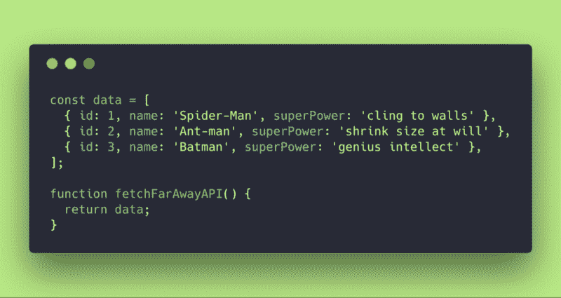
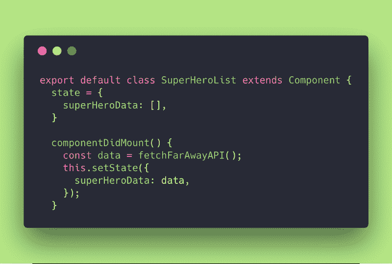
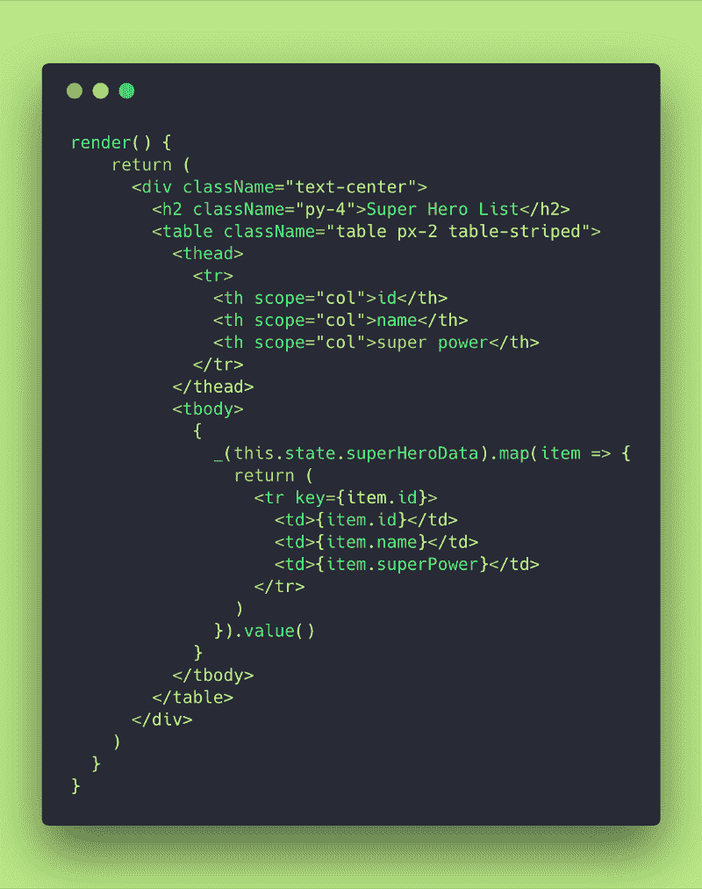
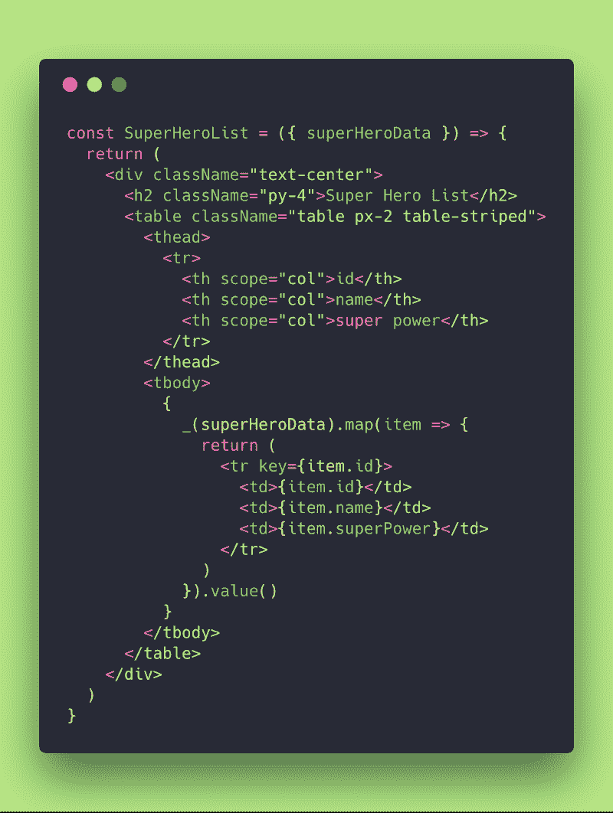
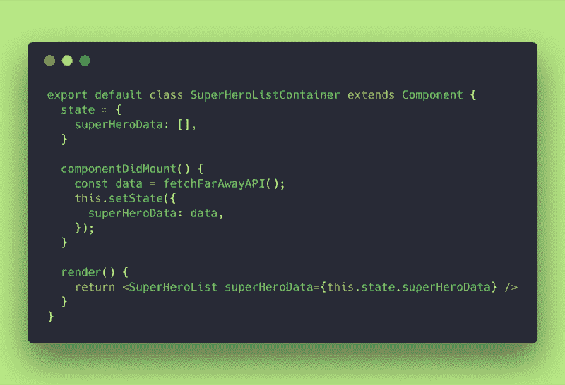
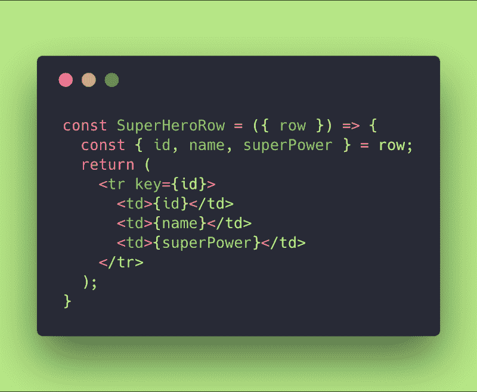
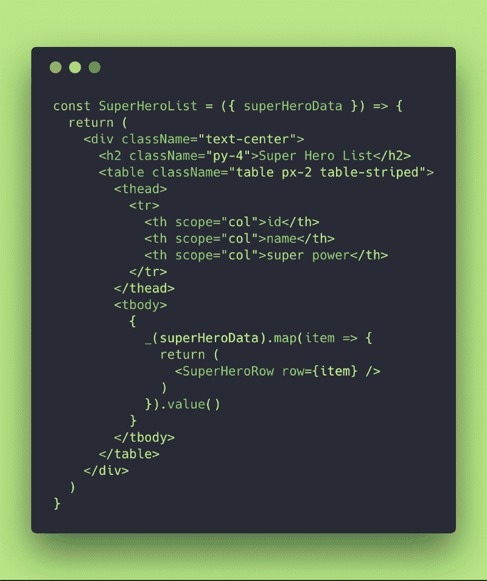
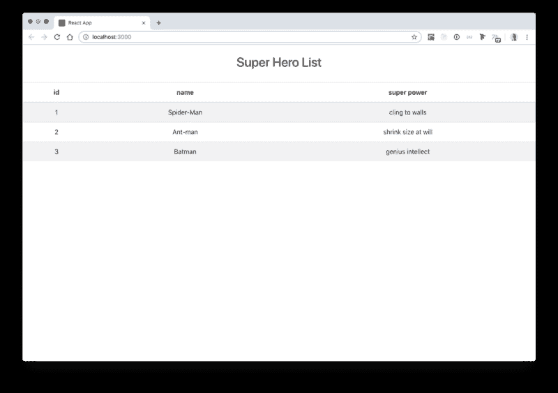
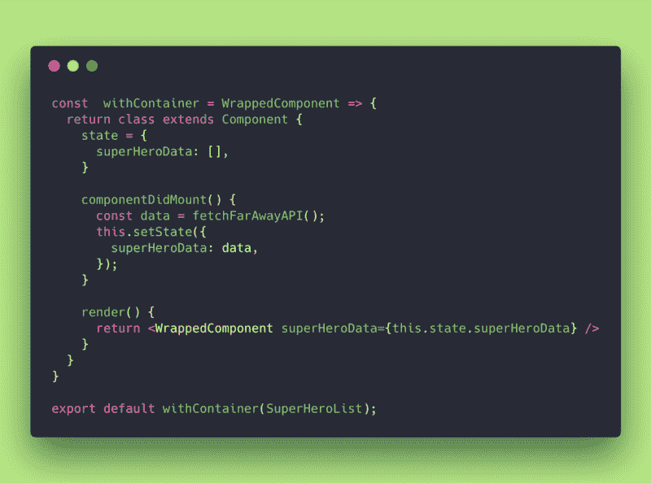

# 如何用容器模式发展你的反应能力

> 原文：<https://www.freecodecamp.org/news/react-superpowers-container-pattern-20d664bdae65/>

大家好！？

这次我要告诉你 React 中这个非常有用的模式，叫做**容器模式**或**容器组件模式**。

这是我学到的第一个模式。把问题分成小问题，一次解决一个，这对我帮助很大。

此外，这无疑有助于使我的代码更加可重用和独立。

这似乎是一个悖论！你如何让你的代码在可重用的同时又是独立的？

嗯，可重用是因为你学会了做一些你可以大量重用的小的虚拟(表示)组件。

自包含，因为容器、视图或任何用于保存所有逻辑的东西都可以很容易地从一个地方分离出来，并附加到任何其他地方，而无需在主应用程序中进行大的更改/重构。

#### 所以这是一个双赢的局面，也是你需要尽快获得的秘密超能力！

事实是，当你想做一个功能，你总是开始简单和干净。

日子一天天过去，你可以在这里增加一个小功能，在那里增加一个新功能。你在这里打补丁，那里打补丁，你的整个代码就变得杂乱无章，难以管理。

相信我，我也经历过。我现在还在那里！在某种程度上，我们都是，因为编程是一门手艺。但是我们可以通过实践和这种神奇的设计模式来尽量减少这种情况。

但是，什么是设计模式呢？

### 01.什么是软件设计模式？

一个[设计模式](https://en.wikipedia.org/wiki/Software_design_pattern)只不过是一个通用的、可重用的解决方案，用于解决软件设计中给定环境下经常出现的问题。它不是一个可以直接转化为源代码或机器码的成品设计。它是如何解决问题的描述或模板，可以在许多不同的情况下使用。

设计模式是形式化的最佳实践，程序员可以用它来解决设计应用程序或系统时的常见问题。

你知道 [MVC](https://en.wikipedia.org/wiki/Model%E2%80%93view%E2%80%93controller) 软件设计模式吗？

### 02.什么是 MVC 设计模式？

嗯，MVC 代表[模型-视图-控制器](https://en.wikipedia.org/wiki/Model%E2%80%93view%E2%80%93controller)。它是一种用于开发用户界面的架构模式。它将应用程序分为三个相互关联的部分。

传统上，它用于桌面 GUI(图形用户界面)。这种架构在设计 web 应用程序甚至移动应用程序时变得很流行。

想象你有一个三角形，有三个顶点:**视图**、**控制器、**和**模型**。

视图是用户在屏幕上看到的内容(客户端)。

看到视图的用户会发生变化，可以按一个按钮，完成一个表单，按播放来看视频，一起触发一整套东西。

控制器处理用户提出的更改和所有的逻辑。(它作为一个中继器工作，它请求并处理视图和模型之间的一切。)

模特就是经理。它包含了所谓的业务逻辑，数据。该模型从控制器接收信息，并进行所需的改变。它将更新返回给控制器和视图。

React 是“一个构建用户界面的 JavaScript 库”(根据定义？).大多数时候你混合处理 V 和 c 的一部分。

这就是我们想要从容器模式中分离出来的 V 和 C。

### 03.容器模式是什么？

容器模式是一种很好地将 V 和 c 分开的解决方案。不是只做一个 **<组件** / >的逻辑和视图，而是将它分成两个**:<ComponentCon**taine**r/>和&**lt；组件/ >。前者将完成所有需要的逻辑操作，并促进与业务的通信，而后者将是一个虚拟的表示组件，将呈现其父容器要求的任何内容。

表示组件关注的是**事物看起来如何*。*** 而容器组件关心的是**的事情如何运作**。

### 04.让我们把手弄脏吧

假设我们想做一个超级英雄列表组件，显示一些关于他们的数据。我们将从 API 中获取数据，并希望在屏幕上显示出来。

好的，为了模拟我们的模型(数据库),我创建了一个假的数据对象。这个对象包含了超级英雄的信息。它还有一个将返回该对象的 fetchFarAwayAPI()函数。

backend, database simulation

然后，我创建了一个有状态的组件来获取 API，将答案保存在组件的状态中，并将数据呈现在屏幕上的引导表中。

SuperHeroList component definition

SuperHeroList render method

好了，我们已经完全把控制器和视图分开了。这个？是您应该记住的关于容器模式的主要思想。

如果你仔细看看，我们已经做了一个组件，在那里我们获取数据，保存到状态，并在屏幕上呈现它。我们把 C 和 v 混在一起了。同意吗？

好吧，我们怎么解决这个问题？没错。**集装箱格局！**

跟我来。

第一步是创建一个表示组件，来呈现视图。该组件将接收道具并进行渲染。完全是虚设。看一看:

SuperHeroList Presentational Component

为了处理控制器(逻辑)的东西，我重构了我们的旧超级角色，将其重命名为超级角色容器。

SuperHeroListContainer Component

好了，我们已经把控制器和画面完全分开了，还有这个？是你应该记住的关于容器模式的主要思想。

但是…

我们可以更进一步，把行的复杂性从新的超级英雄组件中去掉。我们怎么做呢？让我们创建一个新的超级行组件:

SuperHeroRow Component

SuperHeroList Component

我们在这里做了什么？我们已经将行呈现的复杂性从超级角色组件中分离出来。我们让前者只呈现表，并调用超级错误行单独呈现每一行。

我们将行复杂性提取到另一个组件中。永远记住，容器模式就在那里(在 SuperHeroListContainer 里面)。我们刚刚使用 React 首选的工作方式:合成，将渲染扩展到两个完全虚拟和表示性的父/子组件中！

您可以自由地将职责/复杂性分解成更小的组件。这就是您应该如何使用 React！你需要把它调整到对应用程序、对团队、对你所处的环境最有利的程度。

Super Hero List Browser View

有时候我们可以把事情抽象一点！我想现在我们已经很好了，但是…让我们更进一步…

让我们创建第二个超级英雄这一次使用一个特设(高阶组件)。

高阶组件(HOC)是 React 中重用组件逻辑的一种高级技术。本质上，hoc 不是 React API 的一部分。它们是从 React 的组合性质中出现的一种模式。

具体来说，**高阶分量是取一个分量并返回一个新分量的函数。**

这里的事情是将我们的超级角色容器重构为一个普通的 JavaScript 函数。该函数接受一个组件(通常称为 WrappedComponent)并返回一个新组件。

看看下面我是怎么做到的:

withContainer HOC

我们将<superherolistcontainer>重构到这个名为 withContainer 的函数中。它接收你想通过它传递的任何组件，并返回一个包含所有逻辑的类组件！</superherolistcontainer>

在这种情况下，抽象允许我们导出多种类型的表，或者重用容器中的所有逻辑来调用多个/不同的表示/虚拟组件。

这就是我们如何将自包含性和可重用性结合在一起？

SuperHeroList 1 and 2 rendered on screen

### 最后但并不是最不重要的

如果在开始时，您难以确定如何应用容器模式，也不要担心。这是一个反复的过程。通过练习，你不用想太多就能达到目的。这将是直观的，乍一看，它似乎是你在 React 中做的几乎(90%)任何事情的最佳方法。

React 有一个强大的合成模型。[他们推荐](https://reactjs.org/docs/composition-vs-inheritance.html)使用组合而不是继承来重用组件之间的代码。

注意:在这篇文章中，我使用了 Create React App 2.0 和 Bootstrap。你可以随时把我的回购[拉到这里](https://github.com/evedes/container-pattern)，然后做一些实验。你会在文章中找到两个超级英雄和两个例子。

继续阅读我的文章，不要忘记:永远**要坚强，在**上编码！

### 文献学

1.  [React 文档](https://reactjs.org/docs/getting-started.html)
2.  [容器组件](https://medium.com/@learnreact/container-components-c0e67432e005)从*学会与强韧反应*；
3.  [软件设计模式](https://en.wikipedia.org/wiki/Software_design_pattern)，来自维基百科，免费的百科全书；
4.  [模型-视图-控制器](https://en.wikipedia.org/wiki/Model%E2%80%93view%E2%80%93controller)，来自维基百科，免费百科；
5.  丹·阿布拉莫夫(Dan abra mov)；

非常感谢！

evedes, Oct 2018