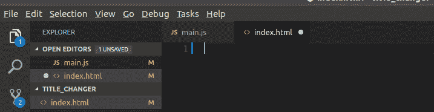
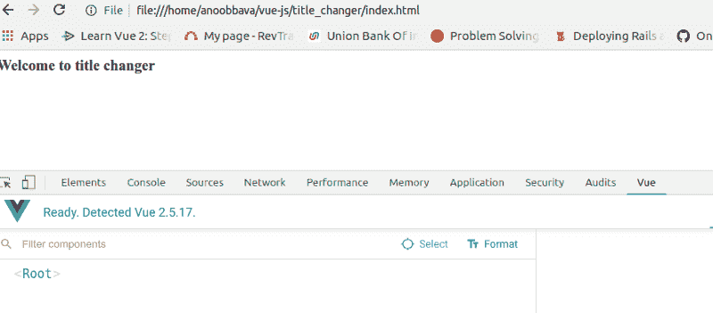
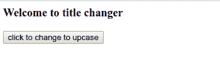
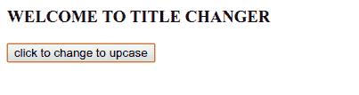

# 如何使用 Vue.js 实现一个简单的标题更改应用程序

> 原文：<https://www.freecodecamp.org/news/implement-a-simple-title-change-website-using-vue-js-7492e049af7/>

作者:阿诺·巴瓦

# 如何使用 Vue.js 实现一个简单的标题更改应用程序


copyright vuejs.org

Vue.js 是一个渐进式的 JavaScript 框架。它有很多特性，包括组件、渲染和路由。Vue 与 React 的争论本质上是竞争性的。他们在各自领域各有利弊。

我使用 CDN(内容交付网络)在 Vue 中创建了一个简单的 JavaScript 应用程序。该应用程序有一个标题，将转换成大写点击按钮。我知道这是一个简单的应用程序。但是我们可以通过它学到很多简单的东西，比如:

*   视图的 CDN
*   “对象”视图
*   将属性链接到 Vue 对象
*   定义数据属性
*   使用 Vue 定义方法
*   通过监听器调用 Vue 方法

好吧，让我们把手弄脏！

我非常喜欢将方法分成块，所以我们在这里将遵循相同的方法。

1.  创建一个 HTML 文件，通过 CDN 链接 Vue。
2.  创建一个 Vue 对象。
3.  将 HTML 模板链接到 Vue 对象。
4.  创建数据属性。
5.  在 Vue 对象中创建一个方法。
6.  单击按钮时更改数据。

#### 1.创建一个 HTML 文件并通过 CDN 链接 Vue

最初创建一个名为**index.html 的文件。**是我们的核心球员。index.html 文件包含 HTML 模板部分和 Vue 对象。

我在这里使用 Visual Studio 代码。



现在将 CDN 添加到 index.html。我们可以使用开发版或生产版。但是将开发版本用于警告和错误是很好的。CDN 开发版本的条目目前是:

```
<script src="https://cdn.jsdelivr.net/npm/vue/dist/vue.js"></script>
```

#### 2.创建一个 Vue 对象

现在我们需要在 index.html 文件中创建 Vue 对象。它在脚本标签下创建。

它可以通过以下方式创建:

```
new Vue();
```

完整的语法如下:

```
<script>new Vue({el: ,
```

```
data: {
```

```
},
```

```
methods: {
```

```
}
```

```
});</script>
```

`new Vue`是 Vue 的一个实例。我们可以通过 Vue 访问 el、数据、方法等属性。属性将在下面解释。

#### 3.将 HTML 模板链接到 Vue 对象

正如我们所知，Vue 有一个称为“el”的属性。该属性将 HTML 模板链接到 Vue 对象。为了做到这一点，所有的 HTML 模板都必须在一个带有 id 的 div 下。对于这个演示，我们可以使用一个 id`app`。我们已将以下内容添加到 index.html 文件中:

```
<div id='app'>
```

```
<h3> Welcome to title changer</h3>
```

```
</div>
```

现在，将应用 id 添加到 Vue 对象中。

```
new Vue({
```

```
el: '#app',
```

```
});
```

所以链接会成功。

#### 4.创建数据属性

现在，我们不希望标题“欢迎使用标题转换器”是静态文本。我们需要能够显示 Vue 数据属性的值。为此，Vue 有一个名为“数据”的内置属性我们需要在这里注册，并在 HTML 中使用如下名称:

```
new Vue({
```

```
el: '#app',
```

```
data: {
```

```
tile: 'Welcome to title changer'
```

```
},
```

```
});
```

现在在`<`中，h3 >标签可以像 Ruby 中的插值一样用双花括号更新。该值将为:

```
{{title}}
```



#### 5.在 Vue 对象中创建一个方法

Vue 有一个名为“方法”的内置属性。这个属性将支持在 Vue 对象中声明的方法。

我们也可以使用 ES6 语法。让我在这里解释一下。

```
methods: {
```

```
 changeTitle: function() {
```

```
 this.title = this.title.toUpperCase();
```

```
 return this.title;
```

```
 }
```

```
}
```

ES6 格式是:

```
methods: {
```

```
 changeTitle() {
```

```
 this.title = this.title.toUpperCase();
```

```
 return this.title;
```

```
 }
```

```
}
```

仅仅是一个将字符串转换成大写字母的 JavaScript 方法。这里需要注意的重要一点是，我们可以使用`this`关键字访问数据属性。因此可以在方法中使用`this`来访问数据属性中声明的值。

#### 6.单击按钮时更改数据

现在，我们所做的就是简单地通过点击按钮来调用这个方法。就这么简单。

为此，我们需要创建一个按钮标签。

```
<button>click to change to upcase</button>
```

要将按钮链接到方法，我们需要在单击按钮时使用事件处理程序。Vue 提供了一个名为`**v-on**` **的内置监听器。**

下面是语法:

```
v-on:click="call Action or Method"
```

我们可以结合:

```
<button v-on:click="changeTitle">click to change to upcase</button>
```

或者**我们可以使用如下的简写语法:**

```
<button @click="changeTitle">click to change to upcase</button>
```

就是这样。全部完成

单击按钮之前，HTML 标题如下:



点击后，转换为大写。



仅此而已。如果您有任何问题或疑问，请发表评论。我在下面附上了回购细节。

[github 链接](https://github.com/anoobbava/title_changer)。在接下来的课程中，我将更新 Vue 的一些高级特性。