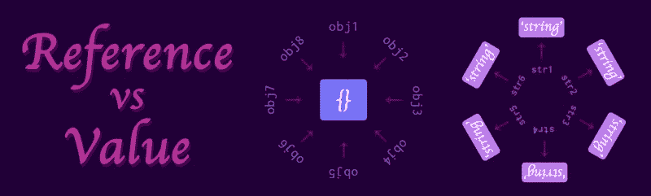
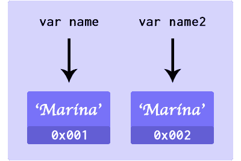
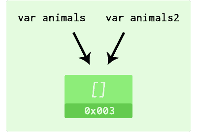

# 如何在 JavaScript 中掌握引用与值

> 原文：<https://www.freecodecamp.org/news/how-to-get-a-grip-on-reference-vs-value-in-javascript-cba3f86da223/>

作者玛丽娜·费雷拉

# 如何在 JavaScript 中掌握参考值和值



本文讨论了各种 JavaScript 数据类型在被赋给变量时的行为。根据数据类型的不同，内存的分配也会有所不同。它可能会保留一个新的空间来存储值的副本，或者它可能根本不创建副本，而只是指向现有的值(引用)。

以下是我在参加[韦斯·博斯](https://wesbos.com/)的 [Javascript30](https://javascript30.com) 课程时做的笔记。

#### 数字、字符串和布尔值

在 JavaScript 中，`undefined`、`null`、`string`、`number`、`boolean`、`symbol`等原语类型是通过值传递的。

```
let name = ‘Marina’;let name2 = name;
```

```
console.log({name, name2}); >> { name: ‘Marina’, name2: ‘Marina’ }
```

```
name = ‘Vinicius’;
```

```
console.log({name, name2});>> { name: ‘Vinicius’, name2: ‘Marina’ }
```



Passed by value.

当变量`name`被赋值时，地址为`0x001`的内存空间被保留用于存储该值。然后变量`name`指向那个地址。然后变量`name2`被设置为等于`name`。分配具有新地址`0x002`的存储器中的新空间，并存储`name`指向的地址中存储的值的副本。

因此，无论何时我们想要修改`name`的值，由`name2`存储的值都不会改变，因为它是一个副本，存储在不同的位置。

#### 对象和数组

JavaScript 中的对象是通过引用传递的。当设置多个变量来存储`object`、`array`或`function`时，这些变量将指向存储器中相同的分配空间。

```
const animals = ['Cat', 'Dog', 'Horse', 'Snake'];
```

```
let animals2 = animals;console.log({animals, animals2});>>{  animals: ['Cat', 'Dog', 'Horse', 'Snake'],  animals2: ['Cat', 'Dog', 'Horse', 'Snake']}
```

```
animals2[3] = 'Wale';console.log(animals, animals2);>>{  animals: ['Cat', 'Dog', 'Horse', 'Wale'],  animals2: ['Cat', 'Dog', 'Horse', 'Wale']}
```



Passed by reference.

当`animals`被设置为存储一个数组时，内存被分配，一个地址与该变量相关联。然后`animals2`被设置为等于`animals`。因为`animals`存储了一个数组，而不是在内存中创建该数组的副本和一个新地址，`animals2`只是简单地指向现有地址中的同一个对象。这样，对`animals2`的任何更改都会反映在`animals`上，因为它们指向同一个位置。

您将看到对象的相同行为:

```
const person = {  name: 'Marina',  age: 29};
```

```
let femme = person;femme.age = 18;
```

```
console.log({person, femme});>>{  person: { name: 'Marina', age: 18 },  femme: { name: 'Marina', age: 18 }}
```

### 复制对象和数组

由于简单的赋值不足以生成对象的副本，因此可以通过其他方法来实现:

#### 数组

**切片()**

```
let animals2 = animals.slice();animals2[3] = 'Shark';
```

**concat()**

```
let animals3 = [].concat(animals);animals3[3] = 'Tiger';
```

**传播(ES6)**

```
let animals4 = [...animals];animals4[3] = 'Lion';
```

更改将仅影响已修改的对象:

```
console.log({animals, animals2, animals3, animals4});>>{  animals: ['Cat', 'Dog', 'Horse', 'Snake'],  animals2: ['Cat', 'Dog', 'Horse', 'Shark'],  animals3: ['Cat', 'Dog', 'Horse', 'Tiger'],  animals4: ['Cat', 'Dog', 'Horse', 'Lion']}
```

#### 目标

**赋值()**

```
let human = Object.assign({}, person, { age: 20 });
```

```
console.log(person, human);>>{  person: { name: 'Marina', age: 29 },  human: { name: 'Marina', age: 20 }}
```

**深度克隆**

需要注意的是，这些方法只是一个层次的深度。对于深层克隆来说，有一个不被认可的方法。小心使用。

```
let femme3 = JSON.parse(JSON.stringify(person));femme3.name = 'Leslie';
```

```
console.log(person, femme3);>>{  person: { name: 'Marina', age: 29 },  femme3: { name: 'Leslie', age: 29 }}
```

### 参考

*   韦斯博斯- [Javascript 30](https://javascript30.com)
*   你不知道的 JS:范围和闭包

*最初发表于[marina-ferre IRA . github . io](https://marina-ferreira.github.io/tutorials/javascript30/reference-vs-copy/)。*