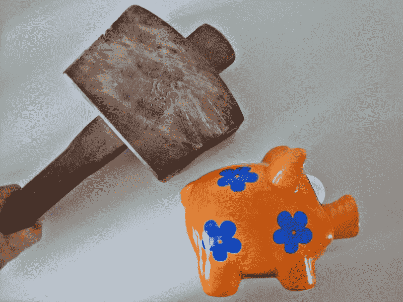

# 如何在预算有限的情况下推出并扩展你的科技产品

> 原文：<https://www.freecodecamp.org/news/how-to-launch-and-scale-your-tech-product-on-a-shoestring-budget-3ae0247551f1/>

肯尼斯·科隆

# 如何在预算有限的情况下推出并扩展你的科技产品

仅仅因为你没有 1000 万美元可以辞掉工作，雇佣一个全明星团队，推出一款拥有你想要的所有花哨功能的产品，并不意味着你的产品或创业想法注定会失败。事实上，你这样可能更好。如今，一些最大、最成功的创业公司都是从自举的副业项目开始的。

我目前担任[伊西保健](https://izzycare.org)的首席执行官/联合创始人，这是一个无限制的、个性化的初级保健、心理健康治疗和营养&健康指导的低成本会员。它已经在顶级医疗保健出版物中出现，如 [*【医疗城新闻】*](https://medcitynews.com/2018/08/izzy-care-holistic-approach/?rf=1)*[医疗保健周刊](https://healthcareweekly.com/virtual-healthcare-startup-izzy-care/)*和*贝克尔医院评论* *。*

在这篇文章中，我想根据我过去几年的学习，提供一些小技巧来帮助你找到自己的道路，用最少的预算推出成功的技术产品。所以让我们开始吧。

### 确保你正在解决一个真正的问题

我想这对于很多人来说似乎是显而易见的，比我聪明得多的人已经说过无数次了。但是，它被说了这么多次是有原因的。我再怎么强调它的重要性也不为过。你需要专注于问题，而不是潜在的解决方案。

但是你如何找到一个真正需要解决的问题呢？

我建议你从你的个人经历开始。你，或者你爱的人，都面临过什么问题？是什么驱使你？对我来说，这是我对心理健康的热情。我曾与抑郁症作斗争，不幸的是，我的许多亲人也是如此。当企业家不那么有趣时，这有助于推动我前进，并给我对问题的独特见解，否则我不会有。

专注于创造一个解决问题的方案。

你还需要*与你的客户交谈-* 朋友、家人、任何面临你试图解决的问题的人。找出他们面临的问题的复杂性(他们的“痛点”)，他们目前正在使用什么来解决这些问题，以及为什么这个问题仍然很糟糕。

### 获得必要的技能

我经常发现，许多想成为企业家的人不敢贸然开始自己的项目或创业，因为他们觉得自己缺乏成功所需的技能。好消息是，你不需要 CS 或 IxD 的大学学位，也不需要数据科学的硕士学位，就能成为一名科技企业家。

在今天这么多资源可用的情况下，如果你不知道如何做某事，你可以学习它。Udemy、Coursera、YouTube、freeCodeCamp——这些都是你可以学习设计、数据科学和开发的平台。

对于设计，我个人推荐加州大学圣地亚哥分校 Coursera 上的交互设计证书课程。对于数据科学(更确切的说是机器学习)，我在 Udemy 上推荐 SuperDataScience 和他们的课程/证书。

> 注意:特别是软件开发，你需要投入大量的时间和精力来学习和掌握你的技术。每隔一周的两个小时半心半意的练习是不够的。

再者，不一定要全部掌握。这就是寻找团队的切入点。你可以参加当地的聚会、黑客马拉松，或者在论坛和自由职业网站上与他人联系(我就是在自由职业网站上认识了我的联合创始人)。

与你在学校或工作中认识的人联系。理想情况下，你的团队成员应该是与你的技能互补的人，同时也是与你有共同爱好的人。对我和我的联合创始人来说，共同的激情是健康/医学。同样，理想情况下，这个人会是你有(或愿意发展)亲密信任关系的人。

### 从设计开始

Obligatory generic design stock photo, complete with markers and a Mac

设计是容易的，便宜的，快速的迭代——不需要编码，你可以用纸和笔马上开始自己设计。利用你对你试图解决的问题的了解，以及你从潜在客户那里收集到的信息。正如 Airbnb 的联合创始人布莱恩·切斯基(Brian Chesky)所说，你会想为你的客户专门设计一些东西——“手工制作”体验。

在笔记本上勾画出你的产品的一些想法。把它带给你的潜在客户，获得他们的意见和反馈。继续迭代完善。最终，当你更加认真地对待你的设计并进入原型制作时，弄清楚一个实际的网站或移动应用程序看起来和感觉起来会是什么样子。您可以升级到易于使用、易于学习的经典设计工具，如 Sketch(用于模拟您的应用程序)和 InVision(用于连接应用程序的不同屏幕以制作可点击的原型)。

#### 展示你的创造力

如果你要设计一个让你的客户真正满意的解决方案，你需要有创造性。使用七星级体验框架，正如布莱恩·切斯基在[雷德·霍夫曼的*规模硕士*播客](https://mastersofscale.com/brian-chesky-handcrafted/)中解释的那样。切斯基以他的公司 Airbnb 为例，问道“三星级的 Airbnb 体验会是什么样的？”。然后更进一步，“不可思议的五星级体验是什么样子的？”。那么，七星体验会是什么样的呢？或者十星级的体验？

你可以问自己这些问题，实际上是关于任何行业或生活方面的体验——一次七星级的医生就诊，一次七星级的零售体验，甚至是一次七星级的上下班通勤。使用此框架探索如何解决客户的棘手问题并真正取悦他们的可能性。你可能无法实现十星级体验的全部，但你可以从那里开始回溯，找到一些你可以实现的东西，让你的客户对你的产品赞不绝口。

你可以做很多其他锻炼来提高你的创造力。

我最喜欢的一个是为某个主题列出十个想法，比如你(假设)可以改善通勤的十种方式——提前准确知道你的通勤需要多长时间，为你准备好新鲜的早餐并准备好，等等。然后，一旦你有了十个，你强迫自己再想出五个，然后五个，再五个。你可能会发现这种方法让你产生了你从未想过的想法。你也可以试着消除限制——比如如果你的公司报销任何形式的上下班交通费用。这会如何改变你的想法？

有时候，仅仅改变你的环境就足以让想法在你脑海中打转。就我个人而言，我喜欢偶尔去大自然中的某个地方散步。回到我的旧公寓附近，有一条几乎没人使用的远足小径。这是一个完美的地方，让我可以独自思考，不受不断的通知和干扰的困扰。

#### 使用数据和用户反馈

在任何阶段迭代产品时要记住的一点是，你会想要使用*和*硬的、定量的数据(漏斗、跳出率、用户流失)和定性的用户反馈。每一个都会照亮另一个。只使用数据，或者只使用用户反馈，你只能看到部分情况。

### 为你的产品自筹资金

Sorry Señor Piggy

你自学的这些技能？你现在可以用它们来制造一些初始资本来支持你自己和你的项目。在专门的自由职业平台上销售你的服务，比如 Upwork、Freelancer、Guru 和无数其他平台……甚至像 LinkedIn 和 Craigslist 这样的网站。朋友，甚至完全陌生的人可能需要帮助来推出他们自己的产品，现在，你有知识来帮助他们。

另一种选择是交易——无论是其股票还是加密货币，摇摆交易还是期权交易。但是要意识到风险，确保你知道你在做什么，否则你可能会失去比你曾经赚的更多的东西。我个人不怎么做交易，我也没有用我做的一点点交易获得最大的成功。我宁愿长期持有我相信的项目/公司的价值，但我知道有几十个人相信交易，并有结果支持它。

### 开始销售，甚至在你的产品完成之前

想象一下与潜在天使投资人的对话:“我需要 10 万美元来完成产品开发和投放广告，看看是否有需求”与“我的产品有 1000 份预订单，需要 10 万美元的投资来完成这些订单，从这些早期客户那里学习，并开始扩大规模。”

你认为这些对话中哪一个会更好？

假设你正在开发一个移动应用程序和相应的订阅服务。即使你的应用还没有准备好，也可以使用像 [Carrd](https://carrd.co) 这样的服务建立一个简单的登陆页面。通过这种方式，你可以收集一份渴望你的产品上市的客户名单。你甚至可以向这些客户中的一些人提供早期测试，并保证他们以优惠的价格获得你全面推出的产品/服务。

#### 关于定价的一个注记

如果你预算有限，你需要确保你的定价从第一天起就能自我维持，或者至少，不会因为每个新用户而损失大量金钱。

在吸引新用户的低价和足以维持甚至盈利的高价之间，这是一种微妙的平衡。关注市场、竞争对手的定价，并与您的客户交流。这需要反复试验，所以不要害怕尝试。

通过实验，我的意思是自己运行这些数字，看看运行你的服务器需要多少成本，支付任何必要的第三方费用，等等。*而不是*以不同的价格向一群顾客销售你的产品(顾客 A 10 美元，顾客 B 100 美元)。那是一种肯定会惹恼*很多*人的方式。

### 缩放和单位经济学

Is the assumption here that someone drew this graph by hand, with just that single pen?

你的重点应该始终是通过口碑来扩大规模。如果你确定了你的客户体验，你的用户喜欢你的产品，你可以肯定他们会告诉他们的朋友和家人。这是迄今为止最有力的增长因素。想想脸书或者 Airbnb。你可能早在看到任何广告之前就从朋友那里听说过它们。

如果你还没有达到客户对你赞不绝口的地步，或者至少对你的产品足够满意，可以告诉他们的朋友和家人，那么就继续使用数据和用户访谈/反馈进行迭代。

如果你的单位经济是稳固的，也就是说，你在每次购买你的产品时都赚了足够的钱，在覆盖获得新用户的成本的同时仍然盈利，你可以考虑用下面的两个选项来加速你的口碑增长。

#### 付费营销渠道

第一种是付费营销渠道，像谷歌和脸书。每个平台都有不同的优势，可以更好地覆盖不同的人群。对我们来说，脸书很有意义，因为我们接触到了为家庭做出大部分支出决定的母亲们。

只有当你每次购买都赚得足够多，或者你有几百或几千美元可以投资时，才考虑这个选择。

数字营销是你可以在网上自学的东西。谷歌甚至为谷歌 AdWords 和 YouTube 广告提供免费的在线课程和证书。然后你可以通过自由职业来销售你的服务，并帮助其他人扩大他们产品的增长。

#### 激励推荐

第二种是付费口碑，或激励性推荐。当你的产品已经产生了一些自然的口碑推荐时，这种方法效果最好。这方面的例子可能包括为推荐朋友购买该产品的客户提供推荐折扣，或者为用户每次登录该平台提供固定金额(或者在区块链的情况下，提供代币奖励)。你的产品已经有人告诉他们的朋友了。用额外的经济刺激来火上浇油。

但是，请注意，如果处理不当(或者即使你处理得很好)，这很容易适得其反。如果当你决定停止向用户支付推荐/注册费用时，他们可能不太可能认可你的产品，现在把它视为“免费广告”，而不是告诉朋友一个很棒的产品。

### 关于社区建设的最后一点说明

So I searched “community” on Unsplash and got this lovely image. I’m going to assume that’s blood.

当你开始扩大你的用户群时，你会开始关注社区建设。这样做的目的是为你的产品培养一个忠实的粉丝群，让他们了解你的项目的最新进展，让他们成为第一个尝试你的下一个产品更新的粉丝。有几种方法可以做到这一点。

#### 内容营销

首先是 LinkedIn 和 Medium 等网站的内容营销。在许多情况下，这些网站都有强大的、支持性的社区，你可以把你的内容带给他们，并把他们带入你自己的产品社区。

这可以通过定期书面更新你和你的产品。讲述你自己的个人故事或者你的用户的故事(在他们的许可下)，或者你的现有或潜在用户可能会觉得有帮助或有趣的内容(比如说一篇关于如何用小本预算创办科技创业公司的中型文章)。你可以在 LinkedIn 和 Medium 上交叉发布你的内容，以及你自己的个人博客或其他渠道。

#### 电子邮件列表

你的产品和团队的更新，以及有用和有趣的内容，也可以通过传统的电子邮件列表发送出去，比如 MailChimp 这样的服务。只是要确保不要在你的邮件列表中发送垃圾邮件，或者在未经允许的情况下为你的邮件列表注册用户。

#### 聚会

与你的社区联系的一个好方法是通过 Meetup 群组。创建 Meetup 活动时，您可以在 Eventbrite 上交叉发布您的活动以扩大您的影响范围。这是了解你的用户，建立信任，甚至联系潜在合作者的一个简单方法。

#### 电报

我要提到的最后一个是 Telegram，因为它非常受欢迎，尤其是在区块链/加密货币社区中。Telegram 非常适合让团队了解最新消息，并促进团队和社区成员之间的对话。至少理论上是这样。

我个人发现 Telegram 充斥着试图向我推销他们的 ICO 营销服务的人(以可笑的价格向其他 Telegram 群组发送关于你的项目的垃圾邮件)，或者想成为“ICO 顾问”，不管这意味着什么，只要“每月 2BTC，以及你所有代币的 20%”。谢谢，但是不用了。？

### 包扎

正如我在开始时所说的，你不需要几百万美元的预算来让你的产品运行起来。你所需要的只是技能/经验，你可以获得这些技能/经验并将其货币化，以及在通往成功的道路上经历无数次失败的耐心。

> 但是我有耐心和经验。如果一个人拥有这些，他可以做任何事情。”—赫尔穆特·莫泽《美国队长:内战》

Granted, Zemo was ultimately defeated by the Avengers… but it’s still a cool quote nevertheless

专注于为你的客户设计一个特定的解决方案，廉价快速地进行原型设计和迭代，在你的产品完成之前进行销售，并通过口口相传扩大规模(一旦你有了火，就添加一些燃料)。

记住，任何你现在可能不知道的东西，你都可以学习！你也不必孤军奋战——去你的学校、工作单位、当地和网上社区寻找有共同爱好和互补技能的人。

除了这里提到的一些话题和资源，还有几本书我绝对推荐给你，希望对你的创业之旅有所帮助:

理查德·塞勒的**，乔纳·伯杰的 [*传染性*](https://www.amazon.com/Contagious-Things-Catch-Jonah-Berger/dp/1451686587/) 了解更多关于行为经济学、消费者采纳和病毒式传播的知识...当然，还有 Eric Ries 的《精益创业》*,也就是你通往成功之路上快速、频繁、廉价失败的圣经。***

***我希望这有所帮助，并祝你一切顺利！如果我能帮上什么忙，请不要犹豫，尽管开口。在 [LinkedIn](https://www.linkedin.com/in/kcolon23/) 上与我联系，或者给我发一封[电子邮件](mailto:k@izzycare.org)！***

***如果你对无限制的、个性化的初级保健、心理健康治疗和营养与健康指导感兴趣，你可以了解更多信息，并以低于*单次*治疗疗程*的价格[今天](https://izzycare.org)注册伊西护理。*查看我们的[产品搜索](https://www.producthunt.com/posts/izzy-care-1)，了解如何参与我们的[500 万美元代币空投](https://medium.com/izzy-health/were-airdropping-5m-worth-of-izzy-tokens-45d41f50898a)。***