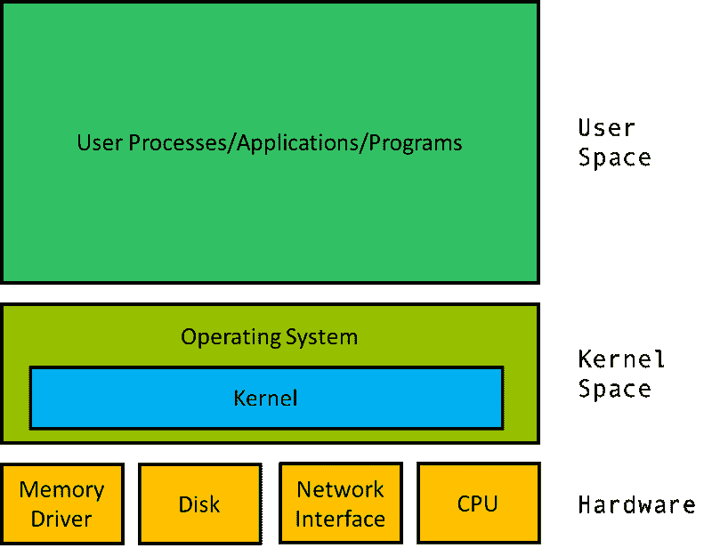
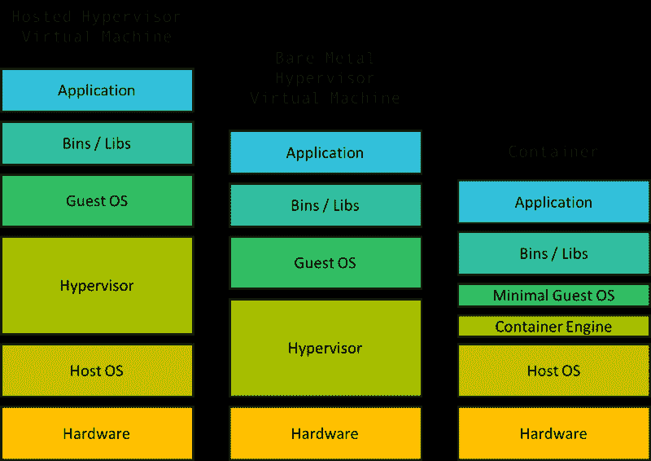
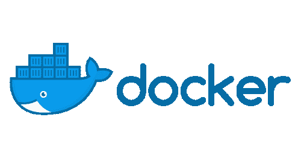
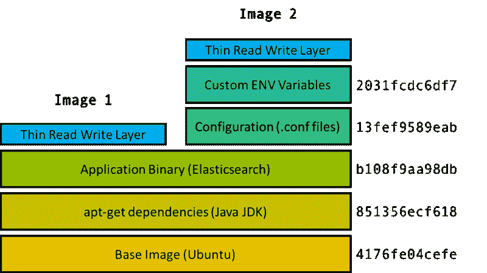
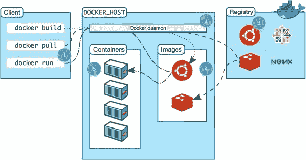

# 揭开容器 101 的神秘面纱:初学者深入了解容器技术

> 原文：<https://www.freecodecamp.org/news/demystifying-containers-101-a-deep-dive-into-container-technology-for-beginners-d7b60d8511c1/>

威尔·王

#### 介绍

不管你是在校学生、某公司的开发人员还是软件爱好者，你都有可能听说过*容器*。您可能也听说过容器是轻量级虚拟机，但是这到底意味着什么，容器到底是如何工作的，为什么它们如此重要？

这个故事让我们看到了容器、它们的关键技术思想和应用。除了对计算机科学的基本了解之外，我不会假定在这个领域有任何先验知识。

### 内核和操作系统

你的笔记本电脑和其他电脑一样，都是建立在一些硬件之上的，比如 CPU、永久存储器(硬盘，SSD)、内存、网卡等等。

为了与这个硬件交互，操作系统中一个叫做*内核*的软件充当硬件和系统其余部分之间的桥梁。内核负责调度*进程*(程序)运行，管理设备(读写磁盘和内存上的地址)，等等。

操作系统的其余部分用于引导和管理用户空间，用户进程在用户空间中运行，并将不断地与内核交互。

The kernel is part of the operating system and interfaces with the hardware. The operating system as a whole lives in the “kernel space” while user programs live in the “user space”. The kernel space is responsible for managing the user space.

### 虚拟机

所以你有一台运行 MacOS 的电脑和一个运行 Ubuntu 的应用程序。嗯……一个常见的解决方案是在运行 Ubuntu 的 MacOS 电脑上启动一个虚拟机，然后在那里运行你的程序。

一个*虚拟机*由某种级别的硬件和内核虚拟化组成，在其上运行一个客户操作系统。一个名为*虚拟机管理程序*的软件创建了虚拟化硬件，其中可能包括虚拟磁盘、虚拟网络接口、虚拟 CPU 等等。虚拟机还包括一个可以与虚拟硬件对话的客户内核。

虚拟机管理程序可以是托管的，这意味着它是运行在主机操作系统(MacOS)上的某个软件，如示例所示。它也可以是裸机，直接在机器硬件上运行(取代您的操作系统)。无论哪种方式，虚拟机管理程序方法都被认为是很重要的，因为它需要虚拟化多个部分，如果不是所有硬件和内核的话。

当需要在同一台机器上有多个独立的组时，为这些组中的每一个组运行一个 VM 是非常繁重和浪费资源的，这不是一个好方法。

Overhead not to scale.

虚拟机需要硬件虚拟化来实现机器级隔离，而容器在同一操作系统中独立运行。随着隔离空间数量的增加，开销差异变得非常明显。一台普通的笔记本电脑可以运行数十个容器，但却很难运行好哪怕一个虚拟机。

### cgroups

2006 年，谷歌的工程师发明了 Linux“控制组”，缩写为 *cgroups* 。这是 Linux 内核的一个特性，用于隔离和控制用户进程的资源使用。

这些进程可以放入*名称空间*，本质上是共享相同资源限制的进程集合。一台计算机可以有多个名称空间，每个名称空间都有内核强制实施的资源属性。

可以管理每个名称空间的资源分配，以便限制一组进程可以使用的 CPU、RAM 等的总量。例如，后台日志聚合应用程序可能需要限制其资源，以免意外地淹没它正在记录日志的实际服务器。

虽然不是最初的特性，但 Linux 中的 cgroups 最终被修改成包含了一个名为*名称空间隔离*的特性。名称空间隔离的概念本身并不新鲜，Linux 已经有了很多种名称空间隔离。一个常见的例子是进程隔离，它将每个单独的进程分开，并防止像共享内存这样的事情。

Cgroup 隔离是一种更高级别的隔离，它确保 cgroup 命名空间中的进程独立于其他命名空间中的进程。下面概述了一些重要的名称空间隔离特性，它们为我们期望的容器隔离奠定了基础。

*   PID(进程标识符)名称空间:这确保一个名称空间中的进程不知道其他名称空间中的进程。
*   网络名称空间:网络接口控制器、iptables、路由表和其他低级网络工具的隔离。
*   挂载名称空间:文件系统是挂载的，因此名称空间的文件系统范围仅限于挂载的目录。
*   用户名称空间:将一个名称空间内的用户限制在该名称空间内，并避免跨名称空间的用户 ID 冲突。

简单地说，每个名称空间对其中的进程来说都是自己的机器。

### Linux 容器

Linux cgroups 为一种名为 *linux 容器* (LXC)的技术铺平了道路。LXC 实际上是我们今天所知的容器的第一个主要实现，它利用 cgroups 和名称空间隔离来创建具有独立进程和网络空间的虚拟环境。

在某种意义上，这允许独立和隔离的用户空间。*集装箱*的想法直接来自 LXC。事实上，Docker 的早期版本是直接建立在 LXC 之上的。

#### 码头工人

Docker 是使用最广泛的容器技术，也是大多数人提到容器时真正的意思。虽然有其他开源容器技术(如 CoreOS 的 rkt)和大公司构建自己的容器引擎(如谷歌的 T2 LMC tfy T3)，Docker 已经成为容器化的行业标准。它仍然建立在 Linux 内核和最近的 Windows 提供的 cgroups 和命名空间之上。

Image source: Docker

Docker 容器由多层图像组成，二进制文件打包在一个包中。基础映像包含容器的操作系统，它可能与主机的操作系统不同。

容器的操作系统采用映像的形式。这不是主机上的完整操作系统，区别在于映像只是操作系统的文件系统和二进制文件，而完整操作系统包括文件系统、二进制文件和内核。

在基础图像之上是多个图像，每个图像构成容器的一部分。例如，在基础映像之上可能是包含`apt-get`依赖项的映像。在它上面可能是包含应用程序二进制文件的映像，等等。

最酷的部分是，如果有两个容器，分别有图像层`a, b, c`和`a, b, d`，那么你只需要在本地和存储库中存储每个图像层`a, b, c, d`的一个副本。这是 Docker 的*联合文件系统*。

由散列标识的每个图像只是组成容器的许多可能的图像层中的一层。然而，容器仅由其顶层图像来标识，该顶层图像具有对父图像的引用。此处显示的两个顶级图像(图像 1 和图像 2)共享前三层。图像 2 有两个附加的配置相关层，但与图像 1 共享相同的父图像。

引导容器时，从 repo 下载映像及其父映像，创建 cgroup 和名称空间，并使用映像创建虚拟环境。在容器中，映像中指定的文件和二进制文件似乎是整个机器中仅有的文件。然后启动容器的主进程，容器被认为是活动的。

Docker 还有一些其他非常非常酷的特性，比如写时复制、卷(容器之间的共享文件系统)、docker 守护进程(管理机器上的容器)、版本控制库(比如 Github for containers)等等。要了解更多关于它们的知识，并查看一些如何使用 Docker 的实例，这篇 Medium [文章](https://medium.freecodecamp.org/a-beginner-friendly-introduction-to-containers-vms-and-docker-79a9e3e119b)非常有用。

A command line client (1) tells a process on the machine called the docker daemon (2) what to do. The daemon pulls images from a registry/repository (3). These images are cached (4) on the local machine and can be booted up by the daemon to run containers (5). Image Source: Docker

### 为什么是集装箱

除了进程隔离，容器还有许多其他有益的属性。

容器作为一个自我隔离的单元，可以在任何支持它的地方运行。在每一种情况下，容器本身都是完全相同的。不管主机操作系统是 CentOS、Ubuntu、MacOS，还是 Windows 等非 UNIX 操作系统，在容器中，操作系统将是容器指定的任何操作系统。因此，您可以确保您在笔记本电脑上构建的容器也可以在公司的服务器上运行。

容器还充当标准化的工作或计算单元。一个常见的范例是每个容器运行一个 web 服务器、一个数据库碎片或一个 Spark worker 等。然后，要扩展应用程序，只需扩展容器的数量。

在这个范例中，每个容器都有一个固定的资源配置(CPU、RAM、线程数量等)，扩展应用程序只需要扩展容器的数量，而不是单个资源原语。当应用程序需要放大或缩小时，这为工程师提供了更简单的抽象。

容器也是实现*微服务架构*的一个很好的工具，其中每个微服务只是一组合作的容器。例如，Redis 微服务可以用单个主容器和多个副本容器来实现。

这种(微)面向服务的架构有一些非常重要的属性，使得工程团队可以轻松地创建和部署应用程序(更多细节请参见我之前的文章)。

### 管弦乐编曲

自从 linux 容器时代以来，用户一直试图在许多虚拟机上部署大规模的应用程序，其中每个进程都在自己的容器中运行。要做到这一点，需要能够高效地跨数百台虚拟机部署数万到数千个容器，并管理它们的网络、文件系统、资源等。今天的 Docker 使这变得稍微容易了一点，因为它公开了定义容器网络、文件系统卷、资源配置等的抽象。

然而，仍然需要工具来:

*   实际上采用一个规格，并将容器分配给机器(调度)
*   通过 Docker 在机器上实际引导指定的容器
*   处理系统的升级/回滚/不断变化的特性
*   应对容器崩溃等故障
*   并创建集群资源，如服务发现、虚拟机间联网、集群入口/出口等。

这组问题与建立在一组(可能是短暂的或不断变化的)容器之上的分布式系统的*编排*有关，人们已经建立了一些真正神奇的系统来解决这个问题。

在我的下一个故事中，我将深入讨论 Kubernetes(主要的开源 orchestrator)的实现，以及两个同样重要但不太为人所知的实现，Mesos 和 Borg。

这个故事是一个系列的一部分。我是加州大学伯克利分校的本科生。我的研究方向是分布式系统，我的顾问是斯科特·申克。

> 上一篇:[微服务如何拯救互联网](https://hackernoon.com/how-microservices-saved-the-internet-30cd4b9c6230)

> 下一个:配器(TBD)