# 我如何构建 SiriWaveJS 库:看看数学和代码

> 原文：<https://www.freecodecamp.org/news/how-i-built-siriwavejs-library-maths-and-code-behind-6971497ae5c1/>

弗拉维奥·德·斯特凡诺

# 我如何构建 SiriWaveJS 库:看看数学和代码

四年前，我有了用纯 Javascript 在浏览器中复制苹果 Siri 波形的想法。

在上个月，我使用 ES6 特性进行了大量重构，更新了这个库，并使用 **RollupJS 回顾了构建过程。**现在我决定分享我在这个过程中学到的东西以及这个库背后的数学知识。

要了解输出结果，请访问 [**现场示例**](http://kopiro.github.io/siriwave/)**；**整个代码库就是这里的[](https://github.com/kopiro/siriwave)**。**

**另外，你可以在 GCX (OSX Grapher 格式)下载本文绘制的所有图: [**default.gcx**](https://github.com/kopiro/siriwave/raw/master/default.gcx) 和 [**ios9.gcx**](https://github.com/kopiro/siriwave/raw/master/ios9.gcx) **。****

### ****经典波浪造型****

**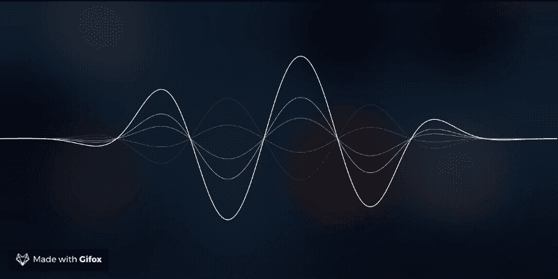

Classic style** 

**最初，这个库只有你们都记得在 iOS 7 和 iOS 8 中使用的经典波形风格。**

**复制这个简单的波形并不难，只需要一点数学知识和 Canvas API 的基本概念。**

**

Siri wave-form in iOS 7/8** 

**你可能认为波形是正弦数学方程的一种修改，你是对的…嗯，几乎是对的。**

**在开始编码之前，我们必须找到我们的线性方程，以便以后简单地应用。我最喜欢的情节编辑器是**Grapher；**你可以在*应用>工具> Graphe* r.app 下的任何 OSX 安装中找到它**

**我们先画出众所周知的:**

**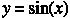****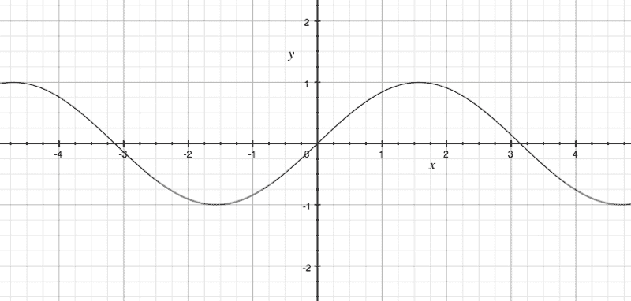

Plot for y = sin(x)** 

**完美无缺。现在，我们来补充一些后面会用到的参数(振幅**【A】**、时间坐标**【t】**和空间频率**【k】**)(这里阅读更多:[【https://en.wikipedia.org/wiki/Wave】](https://en.wikipedia.org/wiki/Wave))。**

**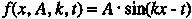**

**现在我们要在绘图边界上“衰减”这个函数，这样对于**| x |>**；2、t **何** y 值趋于 0。让我们在 g( x)上单独画一个具有这些特征的方程**。****

**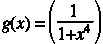****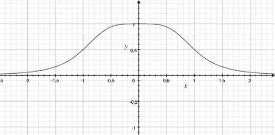**

**这似乎是一个很好的开始等式。为了我们的目的，让我们在这里添加一些参数来平滑曲线:**

**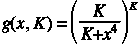**

**现在，通过将我们的 **f(x，…)** 和 **g(x，…) *、*** 相乘，并通过将精确的参数设置为其他静态值，我们得到类似这样的结果。**

*   ****A = 0.9** 将波的振幅设置为最大 Y = A**
*   ****k = 8** 设置空间频率，我们在范围[-2，2]内获得“更多峰值”**
*   ****t = -π/2** 设置相位平移，使 **f(0，…) = 1****
*   ****K = 4** 设置“衰减方程”的因子，当 **|x| ≥ 2** 时，最终方程为 y = 0**

****

**看起来不错！？**

**现在，如果你注意到原始波，我们有其他的子波，会给出一个更低的振幅值。我们来画出它们为 **A = {0.8，0.6，0.4，0.2，-0.2，-0.4，-0.6，-0.8}****

**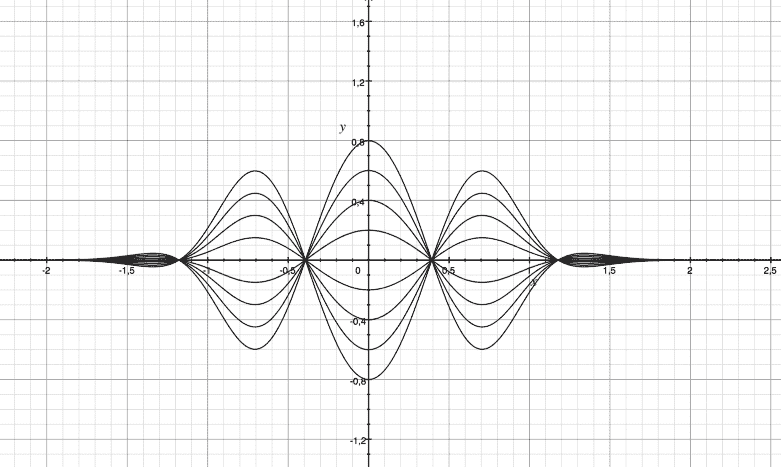**

**在最终的画布合成中，子波将被绘制成不透明度逐渐减小到 0。**

#### **基本代码概念**

**我们现在用这个等式做什么？**

**我们使用这个等式来获得一个**输入 X** 的 **Y 值**。**

**基本上，通过使用一个简单的**用于从 **-2 到 2 的循环**、**(本例中的*地块边界)*，我们必须使用[**begin path**](https://developer.mozilla.org/en-US/docs/Web/API/CanvasRenderingContext2D/beginPath)**和 **[lineTo](https://developer.mozilla.org/en-US/docs/Web/API/CanvasRenderingContext2D/lineTo)** API 在画布上逐点绘制**方程。******

```
**`const ctx = canvas.getContext('2d');`**
```

```
**`ctx.beginPath();ctx.strokeStyle = 'white';`**
```

```
**`for (let i = -2; i <= 2; i += 0.01) {   const x = _xpos(i);   const y = _ypos(i);   ctx.lineTo(x, y);}`**
```

```
**`ctx.stroke();`**
```

****大概这段伪代码就把这些思路理清了。我们仍然需要实现我们的 **_xpos** 和 **_ypos** 函数。****

****但是……嘿，什么是 **0.01⁉️** 那个值代表**在到达正确的绘图边界之前，你在每次迭代中向前移动了多少像素**……但是正确的值是什么呢？****

****如果使用一个很小的值(**<)0。你会得到一个非常精确的图形渲染，但是你的性能会下降，因为你会得到太多的迭代。******

****相反，如果你使用一个真正大的值(**>)0。** 1)您的图表将会失去精确性，您会立即注意到这一点。****

****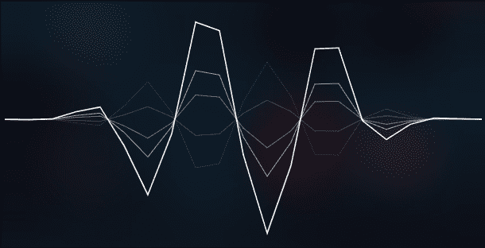

Plot drawn with precision = 0.2**** 

****可以看到最后的代码其实和伪代码差不多:[https://github . com/kopiro/Siri wave/blob/master/src/curve . js # L25](https://github.com/kopiro/siriwave/blob/master/src/curve.js#L25)****

#### ****实施 _xpos(一)****

****你可能会说，如果我们通过增加***【x】***来绘制图形，那么 ***_xpos*** 可能会简单地返回输入参数。****

****这几乎是正确的，但是我们的情节总是从 **-B** 画到 **B** *(B =边界= 2)。*****

****所以，要通过**像素坐标**在画布上进行绘制，我们必须将 **-B 平移到 0、**和 **B 平移到 1** (简单的[-B，B]到[0，1]的换位)；然后乘以[0，1]和**画布宽度(w)。******

> ****_xpos(i) = w * [ (i + B) / 2B ]****

****[https://github . com/kopiro/Siri wave/blob/master/src/curve . js # L19](https://github.com/kopiro/siriwave/blob/master/src/curve.js#L19)****

#### ******实施 _ypos******

****为了实现 **_ypos** ，我们应该简单地写出我们之前(接近)得到的方程。****

```
**`const K = 4;const FREQ = 6;`**
```

```
**`function _attFn(x) {   return Math.pow(K / (K + Math.pow(x, K)), K);}`**
```

```
**`function _ypos(i) {   return Math.sin(FREQ * i - phase) *       _attFn(i) *       canvasHeight *      globalAmplitude *       (1 / attenuation);}`**
```

****让我们澄清一些参数。****

*   ******canvasHeight** 是画布高度，单位为像素****
*   ******i** 是我们的输入值( **x******
*   ******相位**是最重要的参数，稍后再讨论****
*   ******globalAmplitude** 是一个静态参数，表示总波(由子波组成)的振幅****
*   ******衰减**是一个静态参数，随每条线的变化而变化，代表一个波的振幅****

****[https://github . com/kopiro/Siri wave/blob/master/src/curve . js # L24](https://github.com/kopiro/siriwave/blob/master/src/curve.js#L24)****

#### ******阶段******

****现在我们来讨论一下**相位变量:**它是随着时间变化的第一个**变量**，因为它模拟了波动。****

****这是什么意思？这意味着**对于每一个*、*、**动画帧，我们的基本控制器**都要递增**这个值。但是为了避免这个值引发缓冲区溢出，让我们用 2π取模(因为 **Math.sin** dominio 已经是 2π的模)。****

```
**`phase = (phase + (Math.PI / 2) * speed) % (2 * Math.PI);`**
```

****我们将速度和 T2 相乘。PI 所以在**速度= 1** 时我们有最大速度(为什么？因为 **sin(0) = 0，sin(π/2) = 1，sin(π) = 0，…？)******

#### ****最後的****

****现在我们已经有了绘制一条直线的所有代码，我们定义一个配置数组来绘制所有的子波，然后循环遍历它们。****

```
**`return [   { attenuation: -2, lineWidth: 1.0, opacity: 0.1 },   { attenuation: -6, lineWidth: 1.0, opacity: 0.2 },   { attenuation: 4, lineWidth: 1.0, opacity: 0.4 },   { attenuation: 2, lineWidth: 1.0, opacity: 0.6},`**
```

```
 **`// basic line   { attenuation: 1, lineWidth: 1.5, opacity: 1.0},];`**
```

****[https://github . com/kopiro/Siri wave/blob/master/src/Siri wave . js # L190](https://github.com/kopiro/siriwave/blob/master/src/siriwave.js#L190)****

### ****iOS 9+风格****

****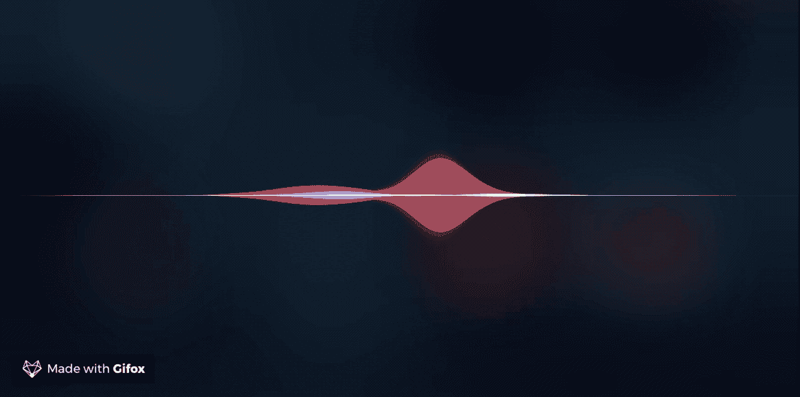

GIF of SiriwaveJS iOS9+**** 

****现在事情开始变得复杂了。iOS 9 引入的风格真的很复杂，模拟它的逆向工程**一点也不容易**！我对最终的结果并不完全满意，但我会继续改进，直到得到想要的结果。****

****如前所述，让我们开始获得波的线性方程。****

****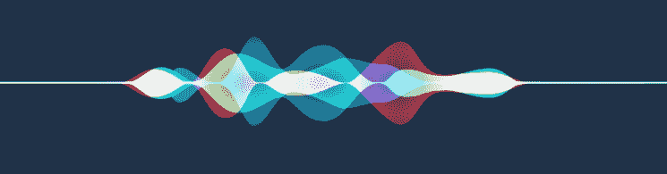

Original Siri iOS 9+ wave-form**** 

****正如你所注意到的:****

*   ****我们有三个不同颜色的**不同的镜面反射方程**(**绿色、蓝色、红色**)****
*   ****一个单独的波似乎是一个正弦方程的和，这些正弦方程具有不同的参数，参数分别是 T2 和 T3****
*   ****所有其他颜色都是由这三种基色组成的****
*   ****在地块边界有一条直线****

****通过再次选择我们之前的方程，让我们定义一个更复杂的方程，这个方程涉及到翻译。我们首先再次定义衰减方程:****

****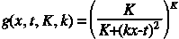****

****现在，定义 **h(x，A，k，t)** 函数，即**正弦函数**乘以**衰减函数，**的绝对值:****

****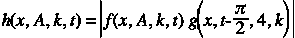********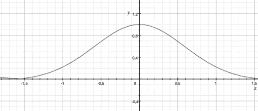****

****我们现在有了一个强大的工具。****

****有了 **h(x)** ，我们现在可以通过对不同的 **h(x)** 求和来创建最终的波形，其中不同的参数包括不同的振幅、频率和平移。例如，让我们通过输入随机值来定义**红色曲线**。****

****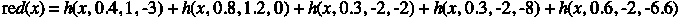********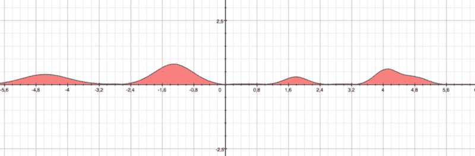****

****如果我们对绿色曲线**和蓝色曲线**和蓝色曲线**做同样的处理，结果如下:******

****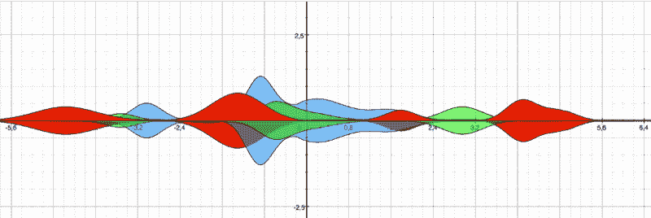****

****这不是很完美，但它可以工作。****

****要获得镜面版本，只需将所有内容乘以 **-1。******

****在编码方面，方法是相同的，我们只有一个更复杂的等式用于 **_ypos。******

```
**`const K = 4;const NO_OF_CURVES = 3;`**
```

```
**`// This parameters should be generated randomlyconst widths = [ 0.4, 0.6, 0.3 ];const offsets = [ 1, 4, -3 ];const amplitudes = [ 0.5, 0.7, 0.2 ];const phases = [ 0, 0, 0 ];`**
```

```
**`function _globalAttFn(x) {   return Math.pow(K / (K + Math.pow(x, 2)), K);}`**
```

```
**`function _ypos(i) {   let y = 0;   for (let ci = 0; ci < NO_OF_CURVES; ci++) {      const t = offsets[ci];      const k = 1 / widths[ci];      const x = (i * k) - t;            y += Math.abs(         amplitudes[ci] *          Math.sin(x - phases[ci]) *          _globalAttFn(x)      );   }`**
```

```
 **`y = y / NO_OF_CURVES;   return canvasHeightMax * globalAmplitude * y;}`**
```

****这里没什么复杂的。唯一改变的是，我们对所有伪随机参数循环**次曲线编号**，并且我们**对所有 **y 值求和**。******

**在乘以给出画布的绝对 PX 坐标的 **canvasHeightMax** 和 **globalAmplitude** 之前，我们将其除以 NO_OF_CURVES，使得 **y 始终≤ 1。****

**[https://github . com/kopiro/Siri wave/blob/master/src/IOs 9 curve . js # L103](https://github.com/kopiro/siriwave/blob/master/src/ios9curve.js#L103)**

#### ****复合操作****

**这里真正重要的一点是要在画布中设置的 **globalCompositeOperation** 模式。如果你注意到，在最初的控制器中，当有 2+种颜色重叠时，它们实际上是以标准方式混合的。**

**默认设置为 **source-over** ，但是结果很差，即使设置了不透明度。**

**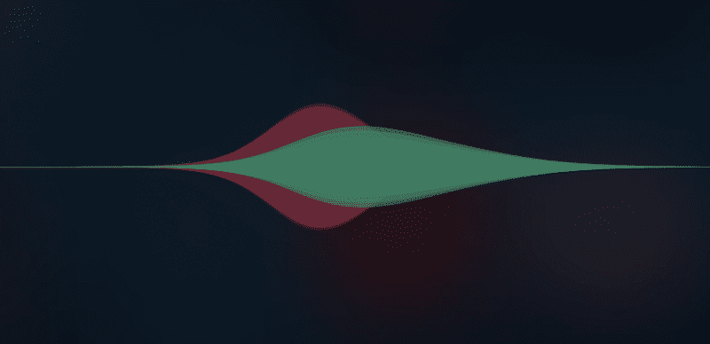

composite operation: source-over** 

**这里可以看到 vary**globalCompositeOperation**的所有例子:[https://developer . Mozilla . org/en-US/docs/Web/API/canvasrenderingcontext 2d/globalCompositeOperation](https://developer.mozilla.org/en-US/docs/Web/API/CanvasRenderingContext2D/globalCompositeOperation)**

**通过将 **globalCompositeOperation** 设置为**“光线”**，您会注意到颜色的交叉点最接近原始颜色。**

**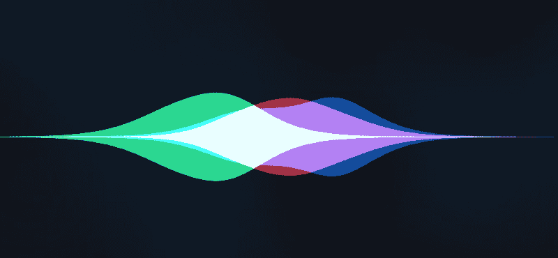

Composite operation: lighter** 

### **使用汇总构建**

**在重构一切之前，我对代码库一点也不满意:旧的类似原型的类，一个单一的 Javascript 文件，没有丑陋/缩小，根本没有构建。**

**使用 ES6 的新特性，如**原生类、扩展操作符**和**λ函数**，我能够清理一切、分割文件并减少不必要的代码行。**

**此外，我使用了 [RollupJS](https://rollupjs.org/) 来创建各种格式的 transpiled 和 minified build。**

**由于这是一个浏览器专用库，我决定创建两个版本:一个是 **UMD(通用模块定义)**版本，您可以通过导入脚本或使用 CDN 直接使用，另一个是作为 **ESM 模块。****

**UMD 模块采用以下配置构建:**

```
`{   input: 'src/siriwave.js',   output: {      file: pkg.unpkg,      name: pkg.amdName,      format: 'umd'    },    plugins: [       resolve(),       commonjs(),       babel({ exclude: 'node_modules/**' }),    ]}`
```

**一个额外的**小型 UMD 模块**以这种配置建造:**

```
`{   input: 'src/siriwave.js',   output: {      file: pkg.unpkg.replace('.js', '.min.js'),      name: pkg.amdName,      format: 'umd'    },    plugins: [       resolve(),       commonjs(),       babel({ exclude: 'node_modules/**' }),       uglify()]}`
```

**得益于 UnPKG 服务，你可以在这个 URL 上找到由 CDN 服务的最终版本:[https://unpkg.com/siriwave/dist/siriwave.min.js](https://unpkg.com/siriwave/dist/siriwave.min.js)**

**这是“旧式 Javascript 方式”——你可以导入你的脚本，然后通过使用 **SiriWave** 全局对象引用你的代码。**

**为了提供更优雅、更现代的方式，我还构建了一个 ESM 模块，配置如下:**

```
`{    input: ‘src/siriwave.js’,   output: {       file: pkg.module,       format: ‘esm’   },    plugins: [       babel({ exclude: ‘node_modules/**’ })   ]}`
```

**我们显然不希望**解析**或 **commonjs** RollupJS 插件，因为开发者移植程序将为我们解析依赖关系。**

**你可以在这里找到最终的 RollupJS 配置:[https://github . com/kopiro/Siri wave/blob/master/roll up . config . js](https://github.com/kopiro/siriwave/blob/master/rollup.config.js)**

#### ****手表和热码重新加载****

**使用 RollupJS，你还可以利用 **rollup-plugin-livereload** 和 **rollup-plugin-serve** 插件来提供一种更好的处理脚本的方式。**

**基本上，你只需在“开发者”模式下添加这些插件:**

```
`import livereload from 'rollup-plugin-livereload';import serve from 'rollup-plugin-serve';`
```

```
`if (process.env.NODE_ENV !== 'production') { additional_plugins.push(  serve({   open: true,   contentBase: '.'  }) ); additional_plugins.push(  livereload({   watch: 'dist'  }) );}`
```

**最后，我们将这些行添加到**包中****

```
`"module": "dist/siriwave.m.js","jsnext:main": "dist/siriwave.m.js","unpkg": "dist/siriwave.js","amdName": "SiriWave","scripts": {   "build": "NODE_ENV=production rollup -c",   "dev": "rollup -c -w"},`
```

**让我们澄清一些参数:**

*   ****module/jsnext:main:**dist ESM 模块的路径**
*   ****un pkg:**dist UMD 模块的路径**
*   ****amd name:**UMD 模块中全局对象的名称**

**非常感谢 **RollupJS！****

**希望你对这篇文章感兴趣，再见！？**