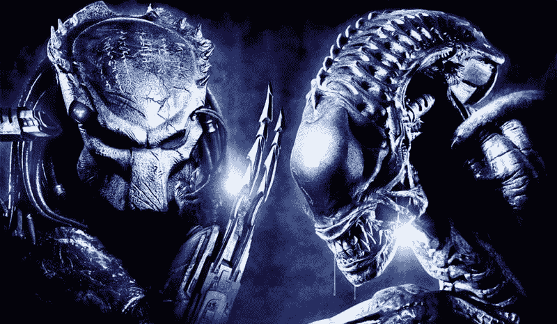
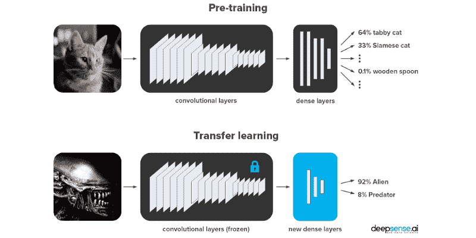
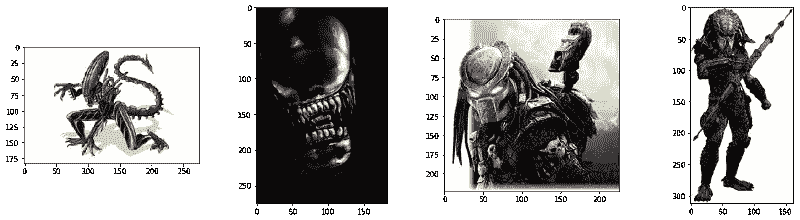
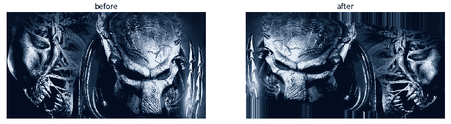
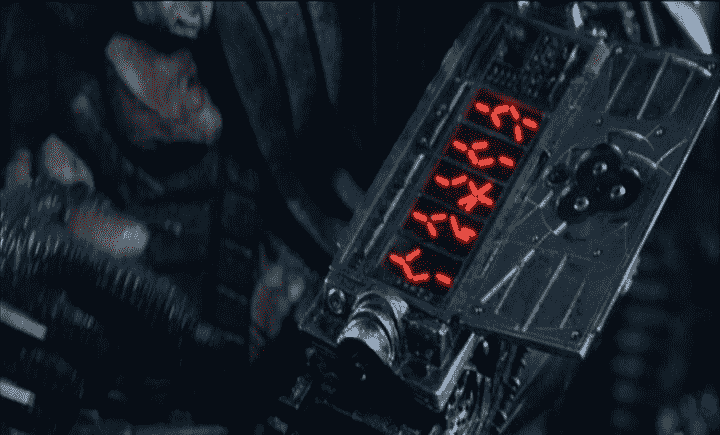
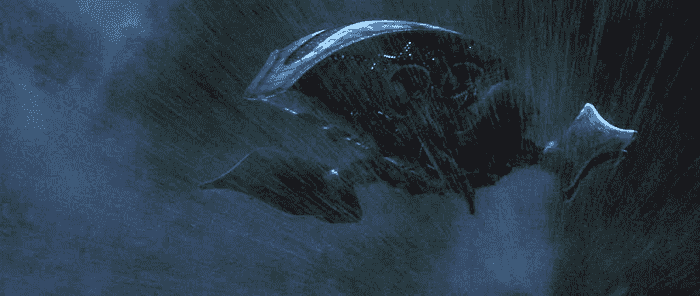
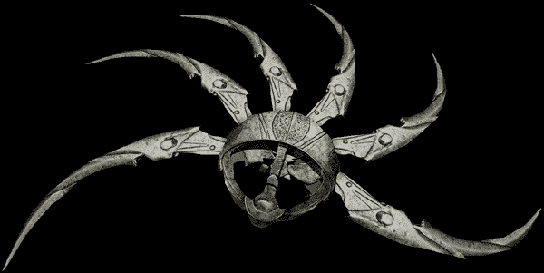
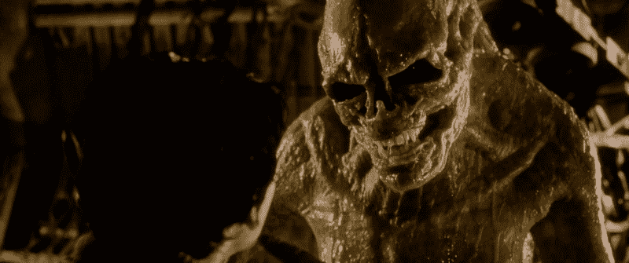

# Keras vs PyTorch:如何用迁移学习区分外星人 vs 捕食者

> 原文：<https://www.freecodecamp.org/news/keras-vs-pytorch-avp-transfer-learning-c8b852c31f02/>

让帕特奇高兴点儿，好吗？让帕特奇高兴点儿，让帕特奇高兴点儿，让帕特奇高兴点儿，让帕特奇高兴点儿，让帕特奇高兴点儿，让帕特奇高兴点儿，让帕特奇高兴点儿

# Keras vs PyTorch:如何用迁移学习区分外星人 vs 捕食者

这篇文章是由皮奥特·米格达、T2 和我共同撰写的。在上一篇文章中，他们给了你一个关于 Keras 和 PyTorch 的区别的[概述，旨在帮助你选择更适合你需求的框架。](https://deepsense.ai/keras-or-pytorch/)

现在，是战斗考验的时候了。

我们将让 Keras 和 PyTorch 相互竞争，展示他们在行动中的优势和劣势。我们提出了一个真正的问题，一个生死攸关的问题:区分外星人和食肉动物！

Image taken from our dataset. Both Predator and Alien are deeply interested in AI.

我们将执行图像分类，这是深度学习擅长的计算机视觉任务之一。由于从零开始训练在大多数情况下是不可行的(因为它非常需要数据)，我们将使用在 ImageNet 上预先训练的 ResNet-50 来执行迁移学习。我们将尽可能实际地展示概念上的差异和约定。

与此同时，我们将保持代码相当少，使其清晰，易于阅读和重用。查看[笔记本上的 GitHub](https://github.com/deepsense-ai/Keras-PyTorch-AvP-transfer-learning) 、 [Kaggle 内核](https://www.kaggle.com/pmigdal/alien-vs-predator-images/kernels)或 [Neptune 版本的花式图表](https://app.neptune.ml/deepsense-ai/Keras-vs-PyTorch)。

### 等等，什么是迁移学习？为什么是 ResNet-50？

> 在实践中，很少有人从零开始训练整个卷积网络(随机初始化)，因为具有足够大小的数据集相对较少。相反，通常在非常大的数据集(例如，包含 1000 个类别的 120 万幅图像的 ImageNet)上预训练一个 ConvNet，然后使用 ConvNet 作为感兴趣的任务的初始化或固定特征提取器。— *Andrej Karpathy，[迁移学习—用于视觉识别的 CS231n 卷积神经网络](http://cs231n.github.io/transfer-learning/)*

[迁移学习](http://cs231n.github.io/transfer-learning/)是一个过程，它对一个在给定任务上训练的网络进行微小的调整，以执行另一个类似的任务。

在我们的例子中，我们正在使用 ResNet-50 模型，该模型被训练来对来自 [ImageNet](http://image-net.org/index) 数据集的图像进行分类。这足以让[学到很多可能在其他视觉任务中有用的纹理和图案](https://distill.pub/2017/feature-visualization/)，甚至像《异形大战掠夺者》这样的外星案例。这样，我们将使用更少的计算能力获得更好的结果。

在我们的例子中，我们将用最简单的方法来做:

*   保持预训练的卷积层(所谓的特征提取器)，冻结其权重，以及
*   删除原来的密集层，并替换为全新的密集层，我们将用于培训。

那么，我们应该选择哪个网络作为特征提取器呢？

[ResNet-50](http://dgschwend.github.io/netscope/#/preset/resnet-50) 是 ImageNet 图像分类的流行模型(AlexNet、VGG、GoogLeNet、Inception、Xception 是其他流行模型)。它是一个基于[剩余连接](https://blog.waya.ai/deep-residual-learning-9610bb62c355)的 50 层深度神经网络架构，剩余连接是随着每一层添加修改的连接，而不是完全改变信号。

ResNet 是 2015 年 ImageNet 上最先进的。此后，[ImageNet](https://www.eff.org/ai/metrics)上得分更高的更新架构被发明出来。然而，它们不一定更擅长推广到其他数据集(参见[更好的 ImageNet 模型传输得更好吗？](https://arxiv.org/abs/1805.08974) arXiv 纸)。

好了，是时候深入研究代码了。

### 比赛开始吧！

我们将通过七个步骤来设置我们的外星人与捕食者挑战赛:

0.准备数据集
1。导入依赖关系
2。创建数据生成器
3。创建网络
4。训练模型
5。保存并加载模型
6。对样本测试图像进行预测

我们在 Jupyter 笔记本中补充了这篇博文的 Python 代码( [Keras-ResNet50.ipynb](https://github.com/deepsense-ai/Keras-PyTorch-AvP-transfer-learning/blob/master/Keras-ResNet50.ipynb) ， [PyTorch-ResNet50.ipynb](https://github.com/deepsense-ai/Keras-PyTorch-AvP-transfer-learning/blob/master/PyTorch-ResNet50.ipynb) )。这种环境比裸脚本更便于原型化，因为我们可以一个单元一个单元地执行它，并最终得到输出。

好吧，我们走！

### 0.准备数据集

我们通过谷歌搜索“外星人”和“捕食者”创建了一个数据集。我们保存了 JPG 的缩略图(大约 250×250 像素)并手动过滤了结果。以下是一些例子:

我们将数据分为两部分:

*   训练数据(每类 347 个样本)—用于训练网络。
*   验证数据(每类 100 个样本)-在训练过程中不使用，但在检查模型对以前未见过的数据的性能时需要。

Keras 要求以下列方式在文件夹中组织数据集:

如果您想了解将数据组织到目录中的过程，请查看 data_prep.ipynb 文件。你可以从 [Kaggle](https://www.kaggle.com/pmigdal/alien-vs-predator-images) 下载数据集。

### 1.导入依赖项

首先是技术性问题。我们假设你有 Python 3.5+，Keras 2.2.2(带有 TensorFlow 1.10.1 后端)和 PyTorch 0.4.1。查看回购中的 [requirements.txt](https://github.com/deepsense-ai/Keras-PyTorch-AvP-transfer-learning/blob/master/requirements.txt) 文件。

因此，首先，我们需要导入所需的模块。我们将在 Keras、PyTorch 和 common 中分离代码(两者都需要一个)。

我们可以通过分别输入`keras.__version__`和`torch.__version__`来检查框架的版本。

### 2.创建数据生成器

通常情况下，图像不能一次全部加载，因为这样做对内存来说太大了。同时，我们希望通过一次处理几个图像来受益于 GPU 的性能提升。因此，我们使用数据生成器在*批次*中加载图像(例如，一次 32 个图像)。每次通过整个数据集被称为一个*时期*。

我们还使用数据生成器进行预处理:我们调整图像的大小并使其正常化，以使它们符合 ResNet-50 的要求(224 x 224 px，带有缩放的颜色通道)。最后但并非最不重要的一点是，我们使用数据发生器动态随机干扰图像:

执行这样的更改被称为*数据扩充*。我们将用它来展示一个神经网络，哪种变换无关紧要。或者，换句话说，我们将通过基于原始数据集生成新图像，在潜在的无限数据集上进行训练。

几乎所有的视觉任务都在不同程度上受益于用于训练的数据扩充。有关数据扩充的更多信息，参见[应用于浮游生物照片](http://benanne.github.io/2015/03/17/plankton.html)或[如何在 Keras 中使用](https://machinelearningmastery.com/image-augmentation-deep-learning-keras/)。在我们的例子中，我们随机剪切、缩放和水平翻转我们的外星人和捕食者。

在这里，我们创建发电机:

*   从文件夹中加载数据，
*   标准化数据(训练和验证)，以及
*   扩充数据(仅限培训)。

在 Keras 中，您可以使用内置的增强功能和`preprocess_input`方法来规范化放入 ResNet-50 的图像，但是您无法控制它们的顺序。在 PyTorch 中，您必须手动归一化图像，但是您可以按照您喜欢的任何方式安排增强。

还有其他细微差别:例如，Keras 默认用边界像素填充增强图像的其余部分(如上图所示)，而 PyTorch 将其保留为黑色。每当一个框架比另一个框架更好地处理您的任务时，仔细看看它们是否执行相同的预处理；我们打赌他们不会。

### 3.创建网络

下一步是导入预先训练好的 ResNet-50 模型，这在两种情况下都是轻而易举的。我们将冻结所有 ResNet-50 的卷积层，只训练最后两个全连接(密集)层。由于我们的分类任务只有 2 个类(与 ImageNet 的 1000 个类相比)，我们需要调整最后一层。

在这里我们:

*   加载预先训练好的网络，砍掉它的头，冻结它的重量，
*   添加定制的密集层(我们为隐藏层选择 128 个神经元)，以及
*   设置优化器和损失函数。

我们毫不费力地从 Keras 和 PyTorch 加载 ResNet-50。他们还提供许多其他知名的预培训架构:见 [Keras 的模型动物园](https://keras.io/applications/)和 [PyTorch 的模型动物园](https://pytorch.org/docs/stable/torchvision/models.html)。那么，有什么区别呢？

在 Keras 中，我们可以只导入特征提取层，而不加载无关数据(`include_top=False`)。然后，我们使用基本模型的输入和输出，以函数的方式创建一个模型。然后，我们使用`model.compile(...)`将损失函数、优化器和其他指标融入其中。

在 PyTorch 中，模型是一个 Python 对象。在`models.resnet50`的情况下，密集层存储在`model.fc`属性中。我们会覆盖它们。损失函数和优化器是独立的对象。对于优化器，我们需要显式地传递一个我们希望它更新的参数列表。

在 PyTorch 中，我们应该使用`.to(device)`方法明确指定我们想要加载到 GPU 的内容。如果可能的话，每次我们打算在 GPU 上放置一个对象时，我们都必须编写它。嗯…

Frame from ‘AVP: Alien vs. Predator’: Predators’ wrist computer. We’re pretty sure Predator could use it to compute logsoftmax.

层冻结以类似的方式工作。然而在[中 Keras 的批量规范化层被打破](http://blog.datumbox.com/the-batch-normalization-layer-of-keras-is-broken/)(截至当前版本；thx przemysaw Pobrotyn 带来了这个问题)，你会看到一些层无论如何都会被修改，即使使用`trainable=False`。

Keras 和 PyTorch 以不同的方式处理日志丢失。

在 Keras 中，网络预测概率(有一个内置的 [softmax 函数](https://medium.com/@uniqtech/understand-the-softmax-function-in-minutes-f3a59641e86d))，其内置的成本函数假设它们与概率一起工作。

在 PyTorch 中，我们有更多的自由，但是首选的方式是返回 logits。这样做是出于数字原因，执行 softmax 然后 log-loss 意味着做不必要的`log(exp(x))`操作。所以，我们不使用 softmax，而是使用`LogSoftmax`(和`NLLLoss`)或者将它们组合成一个`nn.CrossEntropyLoss`损失函数。

### 4.训练模型

好了，ResNet 加载完毕，让我们准备好太空隆隆吧！

Frame from ‘AVP: Alien vs. Predator’: the Predators’ Mother Ship. Yes, we’ve heard that there are no rumbles in space, but nothing is impossible for Aliens and Predators.

现在，我们将进行最重要的一步——模特训练。我们需要传递数据，计算损失函数，并相应地修改网络权重。虽然我们已经在 Keras 和 PyTorch 之间的数据扩充方面有一些差异，但代码长度是相似的。对于训练来说……差别是巨大的。让我们看看它是如何工作的！

在这里我们:

*   训练模型，以及
*   测量训练集和验证集的损失函数(对数损失)和准确性。

在喀拉斯，`model.fit_generator`执行训练…就是这样！在 Keras 培训就是这么方便。而且你可以在笔记本里找到，Keras 还免费给了我们一个进度条和一个计时功能。但是如果你想做任何不标准的事情，那么痛苦就开始了…

PyTorch 在另一根柱子上。这里一切都很清楚。您需要更多的行来构建基本训练，但是您可以自由地更改和定制您想要的所有行。

Predator’s shuriken returning to its owner automatically. Would you prefer to implement its tracking ability in Keras or PyTorch?

让我们转换话题，剖析 PyTorch 培训代码。我们有嵌套循环，遍历:

*   时代，
*   培训和验证阶段，以及
*   批次。

epoch 循环什么也不做，只是重复里面的代码。完成培训和验证阶段有三个原因:

*   一些特殊的层，如[批量归一化](https://kratzert.github.io/2016/02/12/understanding-the-gradient-flow-through-the-batch-normalization-layer.html)(存在于 ResNet-50 中)和[辍学](https://deepsense.ai/wp-content/uploads/2018/10/srivastava14a.pdf)(不存在于 ResNet-50 中)，在训练和验证期间工作方式不同。我们分别通过`model.train()`和`model.eval()`设置它们的行为。
*   当然，我们使用不同的图像进行训练和验证。
*   最重要和最不令人惊讶的是:我们只在训练期间训练网络。魔法命令`optimizer.zero_grad()`、`loss.backward()`和`optimizer.step()`(按此顺序)完成这项工作。如果你知道什么是[反向传播](https://google-developers.appspot.com/machine-learning/crash-course/backprop-scroll/)，你就会欣赏它们的优雅。

然后，我们负责计算纪元损失并打印我们自己。

### 5.保存并加载模型

#### 节约

一旦我们的网络被训练，通常需要很高的计算和时间成本，最好以后再继续训练。概括地说，有两种类型的储蓄:

*   将整个模型架构和训练的权重(以及优化器状态)保存到一个文件中，以及
*   将训练好的权重保存到文件中(在代码中保留模型架构)。

你选择哪种方式取决于你自己。

在这里我们:

*   保存模型。

在这两个框架中，一行代码就足够了。在 Keras 中，您可以将所有内容保存到一个 [HDF5](https://www.h5py.org/) 文件中，或者将权重保存到 HDF5，将架构保存到一个可读的 JSON 文件中。顺便说一下:[然后你可以加载模型并在浏览器中运行它](https://medium.com/tensorflow/train-on-google-colab-and-run-on-the-browser-a-case-study-8a45f9b1474e)。

Frame from ‘Alien: Resurrection’: Alien is evolving, just like PyTorch.

目前，PyTorch 创建者[建议只保存权重](https://pytorch.org/docs/stable/notes/serialization.html)。他们不鼓励保存整个模型，因为 API 仍在发展。

#### 装货

加载模型就像保存一样简单。你只需要记住你选择的保存方法和文件路径。

在这里我们:

*   加载模型。

在 Keras 中，我们可以从 JSON 文件中加载一个模型，而不是用 Python 创建它(至少当我们不使用定制层时)。这种序列化使得转移模型变得很方便。

PyTorch 可以使用任何 Python 代码。所以我们必须用 Python 重新创建一个模型。

在这两个框架中，加载模型权重是相似的。

### 6.对样本测试图像进行预测

好了，终于到了做一些预测的时候了！为了公正地检查我们的解决方案的质量，我们将要求模型从没有用于训练的图像中预测怪物的类型。我们可以使用验证集或任何其他图像。

在这里我们:

*   加载并预处理测试图像，
*   预测图像类别，以及
*   显示图像和预测。

预测和训练一样，是分批进行的(这里我们用的是一批 3；虽然我们当然也可以使用一批 1)。

在 Keras 和 PyTorch 中，我们都需要加载和预处理数据。新手的错误是忘记预处理步骤(包括颜色缩放)。这很可能行得通，但会导致更糟糕的预测(因为它实际上看到的是相同的形状，但颜色和对比度不同)。

在 PyTorch 中，我们还需要两个步骤:

*   将对数转换为概率，以及
*   将数据传输到 CPU 并转换为 NumPy(幸运的是，当我们忘记这一步时，错误消息相当清楚)。

这是我们得到的结果:

有用！

而其他图像呢？如果你想不出其他任何东西(或任何人)，试着用你同事的照片。？

### 结论

正如你所看到的，Keras 和 PyTorch 在如何定义、修改、训练、评估和导出标准深度学习模型方面有很大不同。对于某些部分来说，这纯粹是关于不同的 API 约定，而对于其他部分来说，则涉及抽象层次之间的根本差异。

Keras 在更高的抽象层次上运行。它更加即插即用，通常也更加简洁，但却牺牲了灵活性。

PyTorch 提供了更加明确和详细的代码。在大多数情况下，这意味着可调试和灵活的代码，只有很小的开销。然而，PyTorch 中的培训要冗长得多。这很痛苦，但有时会提供很大的灵活性。

迁移学习是个大话题。尝试调整您的参数(如密集层、优化器、学习率、增强)或选择不同的网络架构。

有没有尝试过图像识别的迁移学习？从下面的列表中寻找一些灵感:

*   [吉娃娃对松饼，牧羊犬对拖把，鼩鼱对几维鸟](https://twistedsifter.com/2016/03/puppy-or-bagel-meme-gallery/)(已经作为[计算机视觉的有趣基准](https://medium.freecodecamp.org/chihuahua-or-muffin-my-search-for-the-best-computer-vision-api-cbda4d6b425d)
*   原始图像与 PS 图像
*   朝鲜蓟对西兰花对花椰菜
*   虫族对神族对兽人对精灵
*   迷因还是非迷因
*   这是一张鸟的图片吗？
*   可以拥抱吗？

选择 Keras 或 PyTorch，选择一个数据集，并在下面的评论部分让我们知道效果如何？

顺便说一句，在 11 月份，我们将举办[系列实践培训](https://deepsense.ai/machine-learning-and-deep-learning-training/)，您可以从中了解更多关于 Keras 和 PyTorch 的信息。Piotr Migda 和我将主持一些会议，请随意查看。