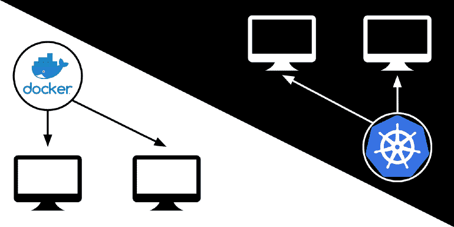
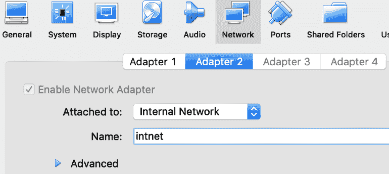

# Docker Swarm vs Kubernetes:如何在两台虚拟机上同时设置

> 原文：<https://www.freecodecamp.org/news/docker-swarm-vs-kubernetes-how-to-setup-both-in-two-virtual-machines-f8897fce7967/>

作者:张



我在两台虚拟机上安装了 Docker Swarm 和 Kubernetes。我发现 Docker Swarm 非常容易安装和配置，而 Kubernetes 稍微难以设置，但仍然简单易用。

## 介绍

我多年来一直想尝试容器:手动设置服务器很费时间，不可重复，并且很可能在我的本地测试环境和生产环境之间引入差异。容器为所有这些问题提供了一个解决方案，并使运行应用程序的更多实例变得更加容易。这可以使服务更具可扩展性。

要运行可伸缩的服务，您需要一个容器编排引擎，通过在多台计算机上运行容器并向应用程序的每个实例发送请求来分配负载。根据 [New Relic](https://blog.newrelic.com/engineering/container-orchestration-explained/) 的说法，两个流行的编排引擎是 [Docker Swarm](https://docs.docker.com/engine/swarm/) 和 [Kubernetes](https://kubernetes.io/) 。我决定通过为每个引擎部署相同的应用程序来尝试这两种方法。

## 创建容器

我决定使用 [Samba](https://en.wikipedia.org/wiki/Samba_(software)) 来测试应用程序。Samba 是一种流行的文件服务器，它允许 Linux 计算机与 Windows 计算机共享文件。它在端口 445 上使用 TCP 进行通信。

这是我第一次使用 Docker，所以我修改了一个现成的 Samba 容器到[来包含我想要提供的文件](https://github.com/zhuowei/ComparisonDockerSwarmKubernetes/blob/master/sambaonly/Dockerfile)。

按照 Docker 的教程，我从命令行手动启动了容器，以确保它能够工作:

```
docker build -t sambaonly-v1 .
docker run --init -p 445:445 -i sambaonly-v1
```

事实上，我能够用`[smbclient](https://www.samba.org/samba/docs/current/man-html/smbclient.1.html)`连接到容器中的 Samba 服务器:

```
zhuowei@dora:~$ smbclient \\\\localhost\\workdir -U %
WARNING: The "syslog" option is deprecated
Try "help" to get a list of possible commands.
smb: \> ls
.                               D        0  Fri Oct  5 12:14:43 2018
..                              D        0  Sun Oct  7 22:09:49 2018
hello.txt                       N       13  Fri Oct  5 11:17:34 2018
102685624 blocks of size 1024\. 72252576 blocks available
smb: \>
```

现在我知道了容器的工作原理，我可以在容器编排引擎中使用它。

## 准备虚拟机

我在 VirtualBox 中创建了两个运行 Ubuntu 18.04 的虚拟机。

我为每台虚拟机添加了一个额外的网卡，用于内部联网，以便它们可以相互通信:



然后我[添加了一个 DHCP 服务器](https://www.virtualbox.org/manual/ch08.html#vboxmanage-dhcpserver)来为每个虚拟机分配 IP 地址:

```
VBoxManage dhcpserver add --netname intnet --ip 10.133.7.99 --netmask 255.255.255.0 --lowerip 10.133.7.100 --upperip 10.133.7.200 --enable
```

现在，虚拟机可以相互通信了。这给了我的主虚拟机 IP 地址 10.133.7.100。

## 码头工人群

Docker Swarm 是一个集成到 Docker 本身的容器编排引擎。当我发现它时，我持怀疑态度:为什么用它而不是更有名的 Kubernetes？答案是:Docker Swarm 关注的是简单性而不是配置。与 Kubernetes 的 Android 相比，它感觉像是容器编排引擎的 iOS。

### 建立 Docker 群

Docker Swarm 非常容易安装:我只需要安装 Docker 和 docker-compose。然后，按照官方教程中的[，我运行了启动 manager 节点所需的唯一命令，传入了当前虚拟机的 IP 地址:](https://docs.docker.com/engine/swarm/swarm-tutorial/create-swarm/)

```
zhuowei@dora:~$ docker swarm init --advertise-addr 10.133.7.100 
Swarm initialized: current node (abcdefghijklmnopqrstuvwxy) is now a manager.
To add a worker to this swarm, run the following command:
docker swarm join --token SWMTKN-1-abcdefghijklmnopqrstuvwxyzabcdefghijklmnopqrstuvwx-abcdefghijklmnopqrstuvwxy 10.133.7.100:2377
To add a manager to this swarm, run 'docker swarm join-token manager' and follow the instructions.
```

就是这样:Docker 引擎现在以群体模式运行。

接下来，我部署了一个私有的 Docker 注册表，以便其他节点可以获取图像，同样遵循设置指令:

```
docker service create --name registry --publish published=5000,target=5000 registry:2
```

## 部署应用程序

Docker Swarm 使用 [Docker Compose](https://docs.docker.com/compose/overview/) 格式来指定要运行的容器和它们导出的端口。

遵循 [Docker 编写](https://docs.docker.com/compose/gettingstarted/#step-3-define-services-in-a-compose-file)教程，我创建了这个 Docker 编写清单:

```
version: '3.7'
services:
  samba:
    image: 127.0.0.1:5000/samba
    build: sambaonly
    init: true
    stdin_open: true
    ports:
      - "445:445"
```

这告诉 Docker Compose 从“sambaonly”目录构建 Dockerfile，将构建的容器上传/拉至我新设置的私有注册表，并从容器导出端口 445。

为了部署这个清单，[我遵循了 Docker Swarm 的教程](https://docs.docker.com/engine/swarm/stack-deploy/#set-up-a-docker-registry)。我首先使用 Docker Compose 构建容器并上传到私有注册中心:

```
docker-compose build

docker-compose push
```

构建容器后，可以使用`docker stack deploy`命令部署应用程序，指定服务名:

```
$ docker stack deploy --compose-file docker-compose.yml samba-swarm
Ignoring unsupported options: build
Creating network samba-swarm_default
Creating service samba-swarm_samba
zhuowei@dora:~/Documents/docker$ docker stack services samba-swarm
ID           NAME                  MODE       REPLICAS IMAGE PORTS
yg8x8yfytq5d samba-swarm_samba     replicated 1/1
```

现在，该应用程序运行在 Samba Swarm 下。我测试了它在`smbclient`上仍然有效:

```
zhuowei@dora:~$ smbclient \\\\localhost\\workdir -U %
WARNING: The "syslog" option is deprecated
Try "help" to get a list of possible commands.
smb: \> ls
.                               D        0  Fri Oct  5 12:14:43 2018
..                              D        0  Sun Oct  7 22:09:49 2018
hello.txt                       N       13  Fri Oct  5 11:17:34 2018

102685624 blocks of size 1024\. 72252576 blocks available
smb: \>
```

#### 添加另一个节点

Docker Swarm 的简单性再次在这里闪耀。为了设置第二个节点，我首先安装 Docker，然后运行 Docker 在我设置 swarm 时给我的命令:

```
ralph:~# docker swarm join --token SWMTKN-1-abcdefghijklmnopqrstuvwxyzabcdefghijklmnopqrstuvwx-abcdefghijklmnopqrstuvwxy 10.133.7.100:2377

This node joined a swarm as a worker.
```

为了在两个节点上运行我的应用程序，我在 manager 节点上运行了 Docker Swarm 的`scale`命令:

```
zhuowei@dora:~/Documents/docker$ docker service scale samba-swarm_samba=2
samba-swarm_samba scaled to 2 overall progress: 2 out of 2 tasks
1/2: running [==================================================>]
2/2: running [==================================================>] verify: Service converged
```

在新的 worker 节点上，出现了新的容器:

```
ralph:~# docker container ls
CONTAINER ID IMAGE COMMAND CREATED STATUS PORTS NAMES
7539549283bd 127.0.0.1:5000/samba:latest "/usr/sbin/smbd -FS …" 20 seconds ago Up 18 seconds 445/tcp samba-swarm_samba.1.abcdefghijklmnopqrstuvwxy
```

#### 测试负载平衡

Docker Swarm 包括一个内置的负载平衡器，称为网状路由器:对任何节点的 IP 地址的请求都会自动分布在整个集群中。

为了测试这一点，我使用`nc`与管理节点的 IP 地址建立了 1000 个连接:

```
print("#!/bin/bash")
for i in range(1000):
    print("nc -v 10.133.7.100 445 &")
print("wait")
```

Samba 为每个连接生成一个新的进程，所以如果负载平衡工作正常，我希望在集群中的每个节点上有大约 500 个 Samba 进程。这确实是发生的情况。

在运行脚本建立 1000 个连接之后，我检查了管理器上的 Samba 进程的数量(10.133.7.100):

```
zhuowei@dora:~$ ps -ef|grep smbd|wc
506 5567 42504
```

在工作节点上(10.133.7.50):

```
ralph:~# ps -ef|grep smbd|wc
506 3545 28862
```

因此，向管理节点发出的请求有一半被神奇地重定向到第一个工作节点，这表明 Swarm 集群工作正常。

我发现 Docker Swarm 非常容易安装，并且在轻负载下运行良好。

## 库伯内特斯

Kubernetes 正在成为容器编排的行业标准。它明显比 Docker Swarm 更灵活，但这也使得它更难设置。我发现 **并不太难，虽然** 。

对于这个实验，我决定使用 Kubeadm、WeaveNet 和 MetalLB 建立自己的集群，而不是使用预先构建的 Kubernetes 开发环境，比如`[minikube](https://kubernetes.io/docs/setup/minikube/)`。

### 设置 Kubernetes

Kubernetes 有一个难以设置的名声:你可能从 [Kubernetes 的艰难教程](https://github.com/kelseyhightower/kubernetes-the-hard-way)中听说过复杂的多步骤过程。

这种说法不再准确:Kubernetes 的开发人员已经将几乎每一步都自动化到了一个非常易用的名为`kubeadm`的设置脚本中。

不幸的是，由于 Kubernetes 非常灵活，仍然有一些步骤是关于使用 `[kubeadm](https://kubernetes.io/docs/setup/independent/create-cluster-kubeadm/)`的[教程没有涵盖的，所以我必须自己找出使用哪个网络和负载平衡器。](https://kubernetes.io/docs/setup/independent/create-cluster-kubeadm/)

以下是我最终运行的内容。

首先，我必须在每个节点上禁用交换:

```
root@dora:~# swapoff -a
root@dora:~# systemctl restart kubelet.service
```

接下来，我使用以下命令设置主节点(10.133.7.100 ):

```
sudo kubeadm init --pod-network-cidr=10.134.0.0/16 --apiserver-advertise-address=10.133.7.100 --apiserver-cert-extra-sans=10.0.2.15
```

`--pod-network-cidr`选项为网络上的所有节点分配一个内部网络地址，用于 Kubernetes 内部通信。

添加`--apiserver-advertise-address`和`--apiserver-cert-extra-sans`选项是因为我的 VirtualBox 设置中的一个怪癖:虚拟机上的主虚拟网卡(IP 为 10.0.2.15)只能访问互联网。我必须澄清，其他节点必须使用 10.133.7.100 IP 地址来访问主节点。

运行这个命令后，Kubeadm 打印了一些说明:

```
Your Kubernetes master has initialized successfully!
To start using your cluster, you need to run the following as a regular user:

mkdir -p $HOME/.kube
sudo cp -i /etc/kubernetes/admin.conf $HOME/.kube/config
sudo chown $(id -u):$(id -g) $HOME/.kube/config

You should now deploy a pod network to the cluster.
Run "kubectl apply -f [podnetwork].yaml" with one of the options listed at:
https://kubernetes.io/docs/concepts/cluster-administration/addons/
You can now join any number of machines by running the following on each node as root:

kubeadm join 10.133.7.100:6443 --token abcdefghijklmnopqrstuvw --discovery-token-ca-cert-hash sha256:abcdefghijklmnopqrstuvwxyzabcdefghijklmnopqrstuvwxyzabcdefghijkl
```

我第一次没有看到这些说明，所以实际上我没有完成安装。然后我花了整整一个星期想知道为什么我的容器都不工作！

Kubernetes 的开发者一定会说:

[https://giphy.com/embed/3o6Ztq45dSCKelyyis](https://giphy.com/embed/3o6Ztq45dSCKelyyis)

在我最终读完说明书后，我还得做三件事:

*   首先，我必须运行`kubeadm`给出的命令来设置一个配置文件。
*   默认情况下，Kubernetes 不会在主节点上调度容器，只在工作节点上调度。因为我现在只有一个节点，[教程](https://kubernetes.io/docs/setup/independent/create-cluster-kubeadm/#master-isolation)向我展示了这个命令，允许在唯一的节点上运行容器:

```
kubectl taint nodes --all node-role.kubernetes.io/master-
```

*   最后，我必须为我的集群选择一个网络。

### 安装网络

与 Docker Swarm 不同，它必须使用自己的网状路由层进行联网和负载平衡，Kubernetes 为联网和负载平衡提供了多种选择。

网络组件允许容器在内部相互通信。我做了一些调查，这篇对比文章建议使用法兰绒或编织网，因为它们很容易安装。因此，我决定试试 WeaveNet。我按照[的 kubeadm 教程](https://kubernetes.io/docs/setup/independent/create-cluster-kubeadm/#pod-network)的说明来应用 WeaveNet 的配置:

```
kubectl apply -f "https://cloud.weave.works/k8s/net?k8s-version=$(kubectl version | base64 | tr -d '\n')"
```

接下来，为了允许容器与外界对话，我需要一个负载平衡器。根据我的研究，我的印象是大多数 Kubernetes 负载平衡器实现只关注 HTTP 服务，而不是原始的 TCP。谢天谢地，我找到了 MetalLB，一个最近(一年前)的项目，它填补了这个空白。

为了安装 MetalLB，我遵循了它的[入门教程](https://metallb.universe.tf/tutorial/layer2/)，并首先部署了 MetalLB:

```
kubectl apply -f https://raw.githubusercontent.com/google/metallb/v0.7.3/manifests/metallb.yaml
```

接下来，我将 IP 范围 10 . 133 . 7 . 200–10 . 133 . 7 . 230 分配给 MetalLB，方法是制作并应用[此配置文件](https://github.com/zhuowei/ComparisonDockerSwarmKubernetes/blob/master/metallb-config.yaml):

```
kubectl apply -f metallb-config.yaml
```

### 部署应用程序

由于 Kubernetes 的灵活性，它的服务配置文件比 Docker Swarm 的更详细。除了指定要运行的容器，比如 Docker Swarm，我还必须指定每个端口应该如何处理。

在[阅读了 Kubernetes 的教程](https://kubernetes.io/docs/tasks/run-application/run-stateless-application-deployment/)之后，我想出了这个 Kubernetes 配置，由一个服务和一个部署组成。

```
# https://kubernetes.io/docs/tasks/run-application/run-single-instance-stateful-application/
kind: Service
apiVersion: v1
metadata:
  name: samba
  labels:
    app: samba
spec:
  ports:
    - port: 445
      protocol: TCP
      targetPort: 445
  selector:
    app: samba
  type: LoadBalancer

---
```

这个[服务](https://kubernetes.io/docs/concepts/services-networking/#defining-a-service)告诉 Kubernetes 将 TCP 端口 445 从我们的 Samba 容器导出到负载均衡器。

```
apiVersion: apps/v1
kind: Deployment
metadata:
  name: samba
  labels:
    app: samba
spec:
  selector:
    matchLabels:
      app: samba
  replicas: 1
  template:
    metadata:
      labels:
        app: samba
    spec:
      containers:
        - image: 127.0.0.1:5000/samba:latest
          name: samba
          ports:
            - containerPort: 445
          stdin: true
```

这个部署对象告诉 Kubernetes 运行我的容器，并导出一个端口供服务处理。

注意`replicas: 1`——这是我想要运行的容器实例的数量。

我可以使用`kubectl apply`将这个服务部署到 Kubernetes:

```
zhuowei@dora:~/Documents/docker$ kubectl apply -f kubernetes-samba.yaml
service/samba configured
deployment.apps/samba configured
```

在重启我的虚拟机几次后，部署终于开始工作了:

```
zhuowei@dora:~/Documents/docker$ kubectl get pods
NAME                   READY STATUS  RESTARTS AGE
samba-57945b8895-dfzgl 1/1   Running 0        52m
zhuowei@dora:~/Documents/docker$ kubectl get service samba
NAME  TYPE         CLUSTER-IP     EXTERNAL-IP  PORT(S)       AGE
samba LoadBalancer 10.108.157.165 10.133.7.200 445:30246/TCP 91m
```

我的服务现在可在 MetalLB 分配的外部 IP 上使用:

```
zhuowei@dora:~$ smbclient \\\\10.133.7.200\\workdir -U %
WARNING: The "syslog" option is deprecated
Try "help" to get a list of possible commands.
smb: \> ls
.                               D        0  Fri Oct  5 12:14:43 2018
..                              D        0  Sun Oct  7 22:09:49 2018
hello.txt                       N       13  Fri Oct  5 11:17:34 2018

102685624 blocks of size 1024\. 72252576 blocks available
smb: \>
```

### 添加另一个节点

在 Kubernetes 集群中添加另一个节点要容易得多:我只需在新机器上运行`kubeadm`给出的命令:

```
zhuowei@davy:~$ sudo kubeadm join 10.133.7.100:6443 --token abcdefghijklmnopqrstuvw --discovery-token-ca-cert-hash sha256:abcdefghijklmnopqrstuvwxyzabcdefghijklmnopqrstuvwxyzabcdefghijkl

(snip...)

This node has joined the cluster:* Certificate signing request was sent to apiserver and a response was received.
* The Kubelet was informed of the new secure connection details.

Run 'kubectl get nodes' on the master to see this node join the cluster.
```

### 我的设置的古怪之处

由于我的 VirtualBox 设置，我必须进行两项更改:

首先，由于我的虚拟机有两个网卡，我必须手动告诉 Kubernetes 我的机器的 IP 地址。根据[这一期](https://github.com/kubernetes/kubeadm/issues/203)，我不得不编辑

```
/etc/systemd/system/kubelet.service.d/10-kubeadm.conf
```

并将其中一行改为

```
Environment="KUBELET_CONFIG_ARGS=--config=/var/lib/kubelet/config.yaml --node-ip=10.133.7.101"
```

重新启动 Kubernetes 之前:

```
root@davy:~# systemctl daemon-reload
root@davy:~# systemctl restart kubelet.service
```

另一个改进是针对 Docker 注册表的:由于新节点不能访问我在主节点上的私有注册表，我决定做一个可怕的尝试，使用`ssh`将注册表从我的主节点共享到新机器:

```
zhuowei@davy:~$ ssh dora.local -L 5000:localhost:5000
```

这将端口 5000 从主节点`dora`(它运行我的 Docker 注册表)转发到本地主机，Kubernetes 可以在这台机器上找到它。

在实际生产中，可能会在单独的机器上托管 Docker 注册表，因此所有节点都可以访问它。

### 扩展应用程序

在第二台机器上，我修改了我的原始部署，添加了应用程序的另一个实例:

```
replicas: 2
```

在重启了几次主应用程序和工作应用程序之后，我的应用程序的新实例最终退出了`CreatingContainer`状态并开始运行:

```
zhuowei@dora:~/Documents/docker$ kubectl get pods
NAME                   READY STATUS  RESTARTS AGE
samba-57945b8895-dfzgl 1/1   Running 0        62m
samba-57945b8895-qhrtl 1/1   Running 0        12m
```

### 测试负载平衡

我使用相同的过程打开 1000 个到运行在 Kubernetes 上的 Samba 的连接。结果很有趣。

主人:

```
zhuowei@dora$ ps -ef|grep smbd|wc
492 5411 41315
```

工人:

```
zhuowei@davy:~$ ps -ef|grep smbd|wc
518 5697 43499
```

Kubernetes/MetalLB 也平衡了两台机器的负载，但是主机器获得的连接比工作机器稍少。我想知道为什么。

无论如何，这表明我在走了一堆弯路之后，终于设法设置了 Kubernetes。当我看到集装箱在工作时，我觉得自己就像是这个家伙。

## 比较和结论

**两者共有的特性**:两者都可以管理容器，并在两个不同的虚拟机上智能地对同一 TCP 应用程序的请求进行负载平衡。两者都有很好的初始设置文档。

Docker Swarm 的优势:设置简单，无需配置，与 Docker 紧密集成。

Kubernetes 的优势:灵活的组件，许多可用的资源和附加组件。

Kubernetes vs Docker Swarm 是简单性和灵活性之间的权衡。

我发现设置 Docker Swarm 更容易，但我不能，例如，用另一个组件替换负载平衡器——没有办法配置它:我必须[一起禁用它](https://docs.docker.com/engine/swarm/ingress/#using-the-routing-mesh)。

在 Kubernetes 上，由于数量惊人的选择，我花了一段时间才找到正确的设置，但作为交换，我可以根据需要更换我的集群的部分，并且我可以很容易地安装附加组件，如[花哨的仪表板](https://kubernetes.io/docs/tasks/access-application-cluster/web-ui-dashboard/)。

如果你只是想尝试 Kubernetes 而不需要所有这些设置，我建议使用`[minikube](https://kubernetes.io/docs/setup/minikube/)`，它提供了一个预构建的 Kubernetes 集群虚拟机，不需要设置。

最后，令我印象深刻的是，这两个引擎都支持原始的 TCP 服务:其他基础设施即服务提供商，如 Heroku 或 T2 Glitch 只支持 HTTP(s)网站托管。TCP 服务的可用性意味着可以使用相同的工具部署自己的数据库服务器、缓存服务器，甚至《我的世界》服务器来部署 web 应用程序，这使得容器编排管理成为一项非常有用的技能。

总之，如果我要构建一个集群，我会使用 Docker Swarm。如果我付钱给某人 **else** 为我建立一个集群，我会要求 Kubernetes。

## 我学到了什么

*   如何使用 Docker 容器
*   如何设置双节点 Docker 集群
*   如何设置一个双节点 Kubernetes 集群，哪些选择适用于基于 TCP 的应用程序
*   如何将应用部署到 Docker Swarm 和 Kubernetes
*   如何通过重启电脑足够多次来修复任何东西，比如我还在用 Windows 98
*   Kubernetes 和 Docker Swarm 并不像它们听起来那么可怕

## 图像制作者名单

*   Docker 标志:经许可使用。
*   [Kubernetes 标志:经许可使用。](https://github.com/kubernetes/kubernetes/blob/master/logo/usage_guidelines.md)
*   来自 GitHub Octicons 的[桌面图标。](https://github.com/webdog/octicons-png/blob/master/black/device-desktop.png)