# 如何在试运行和生产阶段向 React 原生应用添加应用图标和闪屏

> 原文：<https://www.freecodecamp.org/news/how-to-add-app-icons-and-splash-screens-to-a-react-native-app-in-staging-and-production-d1dab615e7c6/>

作者 Khoa Pham

# 如何在试运行和生产阶段向 React 原生应用添加应用图标和闪屏


React Native 旨在“一次学习，随处编写”，通常用于构建 iOS 和 Android 的跨平台应用程序。对于我们构建的每个应用程序，有时我们需要重用相同的代码，构建并调整它以使其适用于不同的环境。例如，我们可能需要多个皮肤、主题、免费和付费版本，或者更常见的不同的登台和生产环境。

而我们无法避免的任务就是给我们的应用添加应用图标和闪屏。

事实上，要添加一个 staging 和 production 环境，并添加应用程序图标，需要我们使用 Xcode 和 Android Studio，我们使用的方式与使用原生 iOS 或 Android 项目相同。

让我们调用我们的应用程序`MyApp`并用`react-native init MyApp`引导它。当然，将会有大量的[库](https://github.com/thekevinbrown/react-native-schemes-manager)来帮助我们管理不同的环境。

在这篇文章中，我们将像对待原生应用那样做，这样我们就知道了基本步骤。

### 构建配置、目标、构建类型、产品风格和构建变体

我们需要记住一些术语。在 iOS 中，调试和发布被称为[构建配置](https://developer.apple.com/library/archive/featuredarticles/XcodeConcepts/Concept-Build_Settings.html)，测试和生产被称为[目标](https://developer.apple.com/library/archive/featuredarticles/XcodeConcepts/Concept-Targets.html)。

> 生成配置指定了一组用于以特定方式生成目标产品的生成设置。例如，对于产品的调试和发布版本，通常有单独的版本配置。

> 目标指定要构建的产品，并包含从项目或工作空间中的一组文件构建产品的指令。目标定义单一产品；它将输入组织到构建产品所需的构建系统中——源文件和处理这些源文件的指令。项目可以包含一个或多个目标，每个目标生产一种产品

在 Android 中，调试和发布被称为构建类型，阶段化和生产被称为产品风格。它们一起形成了[构建变体](https://developer.android.com/studio/build/build-variants)。

> 例如，一个“演示”*产品风格*可以指定不同的特性和设备需求，比如定制源代码、资源和最低 API 级别，而“调试”*构建类型*应用不同的构建和打包设置，比如调试选项和签名密钥。生成的构建变体是应用程序的“demoDebug”版本，它包括“演示”产品风格、“调试”构建类型和`main/`源集中包含的配置和资源的组合。

### iOS 中的试运行和生产目标

使用 Xcode 打开`ios`内的`MyApp.xcodeproj`。下面是引导后我们得到的结果:

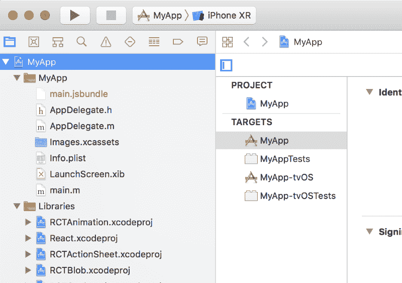

React Native 创建 iOS 和 tvOS 应用，以及两个测试目标。在 Xcode 中，一个项目可以包含许多目标，每个目标都意味着一个具有自己的构建设置(Info.plist 和 app 图标)的独特产品。

#### 重复目标

如果不需要 tvOS app，可以删除`MyApp-tvOS`和`MyApp-tvOSTests`。让我们使用`MyApp`目标作为我们的生产环境，`right click -> Duplic` ate 来制作另一个目标。让我们称之为`it MyApp Stag` ing。

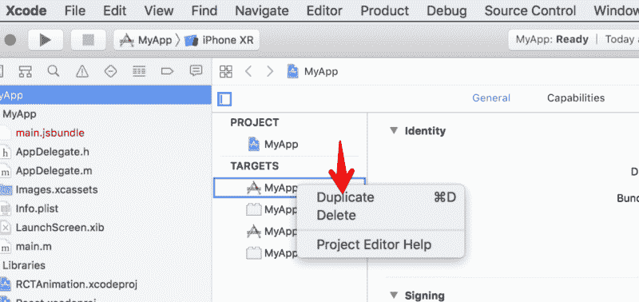

每个目标必须有唯一的包 id。将`MyApp`的捆 id 更改为`com.onmyway133.MyApp`，将`MyApp Staging`更改为`com.onmyway133.MyApp.Staging`。

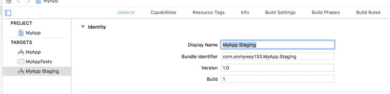

#### 信息列表

当我们复制`MyApp target`时，Xcode 也会将`Info.plist`复制到暂存目标的`MyApp copy-Info.plist`中。将其更改为更有意义的名称`Info-Staging.plist`，并将其拖到 Xcode 中的`MyApp`群组中，以便保持有序。拖动后，`MyApp Staging` 目标找不到 plist，点击`Choose Info.plist File`指向`Info-Staging.plist`。


#### 计划

当我们复制目标时，Xcode 也复制这个方案，所以我们得到`MyApp copy`:

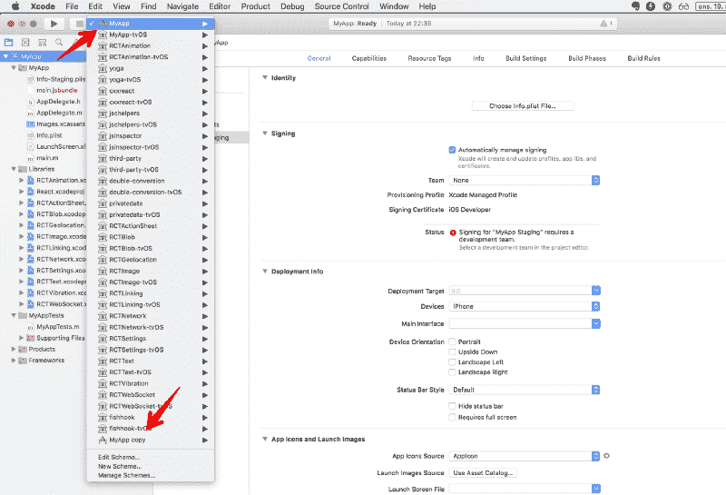

点击方案下拉菜单中的`Manage Schemes`，打开方案管理器:

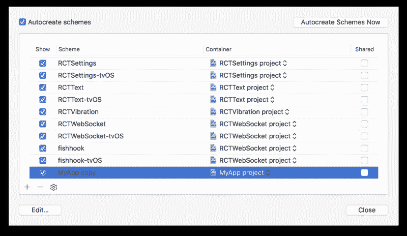

我通常会删除生成的`MyApp copy`方案，然后为`MyApp Staging`目标再次创建一个新的方案。您需要确保该方案被标记为 Shared，以便在 git 中进行跟踪。

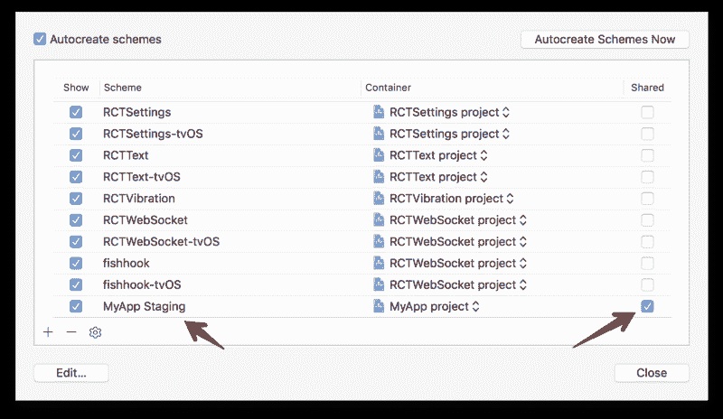

出于某种原因，试运行方案没有像生产方案那样设置所有的东西。你可能会遇到像`‘React/RCTBundleURLProvider.h’ file not found`或`[RN: ‘React/RCTBridgeModule.h’ file not found](https://github.com/onmyway133/notes/issues/380)`这样的问题。那是因为`React`目标还没有挂钩。

要解决它，我们必须禁用`Parallelise Build`并添加`React`目标并将其移动到`MyApp Staging`上方。

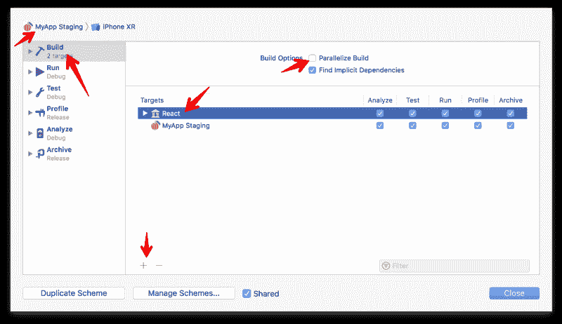

#### Android 中的分级和生产产品风格

在 Android Studio 中打开`android`文件夹。默认情况下，只有调试和发布版本类型:

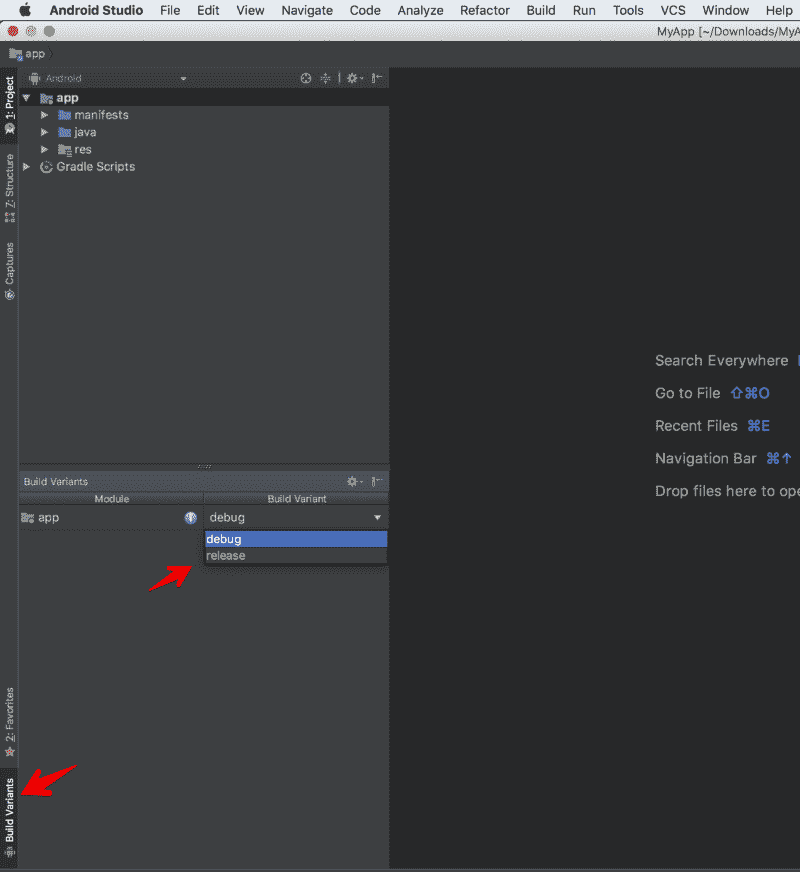

它们在`app`模块`build.gradle`中配置:

```
buildTypes {    release {        minifyEnabled enableProguardInReleaseBuilds        proguardFiles getDefaultProguardFile("proguard-android.txt"), "proguard-rules.pro"    }}
```

首先，我们把应用 id 改成`com.onmyway133.MyApp`来匹配 iOS。这不是必须的，但我认为保持有条理是有好处的。然后为试运行和生产创建两种产品风格。对于暂存，让我们将`.Staging`添加到应用程序 id 中。

在 Android Studio 3 中，“所有的味道现在必须属于一个命名的味道维度”——通常我们只需要默认的维度。下面是我们的`app`模块在`build.gradle`中的样子:

```
android {    compileSdkVersion rootProject.ext.compileSdkVersion    buildToolsVersion rootProject.ext.buildToolsVersion    flavorDimensions "default"
```

```
defaultConfig {        applicationId "com.onmyway133.MyApp"        minSdkVersion rootProject.ext.minSdkVersion        targetSdkVersion rootProject.ext.targetSdkVersion        versionCode 1        versionName "1.0"        ndk {            abiFilters "armeabi-v7a", "x86"        }    }    splits {        abi {            reset()            enable enableSeparateBuildPerCPUArchitecture            universalApk false  // If true, also generate a universal APK            include "armeabi-v7a", "x86"        }    }    buildTypes {        release {            minifyEnabled enableProguardInReleaseBuilds            proguardFiles getDefaultProguardFile("proguard-android.txt"), "proguard-rules.pro"        }    }
```

```
productFlavors {        staging {            applicationIdSuffix ".Staging"        }
```

```
 production {
```

```
 }    }}
```

点击`Sync Now`让 gradle 做同步工作。之后，我们可以看到我们有四个构建变体:

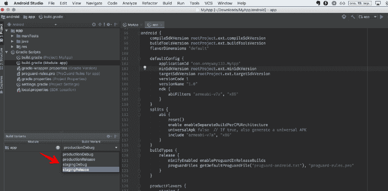

#### 如何运行试运行和生产

要运行 Android 应用程序，我们可以指定一个类似于`react-native run-android — variant=productionDebug`的变体，但我更喜欢去 Android Studio，选择变体，然后运行。

运行 iOS app，我们可以像`react-native run-ios — simulator=’iPhone X’ — scheme=”MyApp Staging”`一样指定方案。从`react-native 0.57.0`开始，这不起作用。但这没关系，因为我通常会进入 Xcode，选择方案，然后运行。

#### 为 iOS 添加应用程序图标

根据[人机界面指南](https://developer.apple.com/design/human-interface-guidelines/ios/icons-and-images/app-icon/)，我们需要针对不同 iOS 版本、设备分辨率、情况(通知、设置、Spring Board)的不同大小的 app 图标。我制作了一个叫做[图标生成器](https://github.com/onmyway133/IconGenerator)的工具，之前在[开发者最佳开源工具](https://dev.to/sarthology/best-open-source-tools-for-developers--300f)中提到过。将您想要的图标(我更喜欢 1024x1024 像素的高分辨率应用程序图标)拖到图标生成器 MacOS 应用程序中。

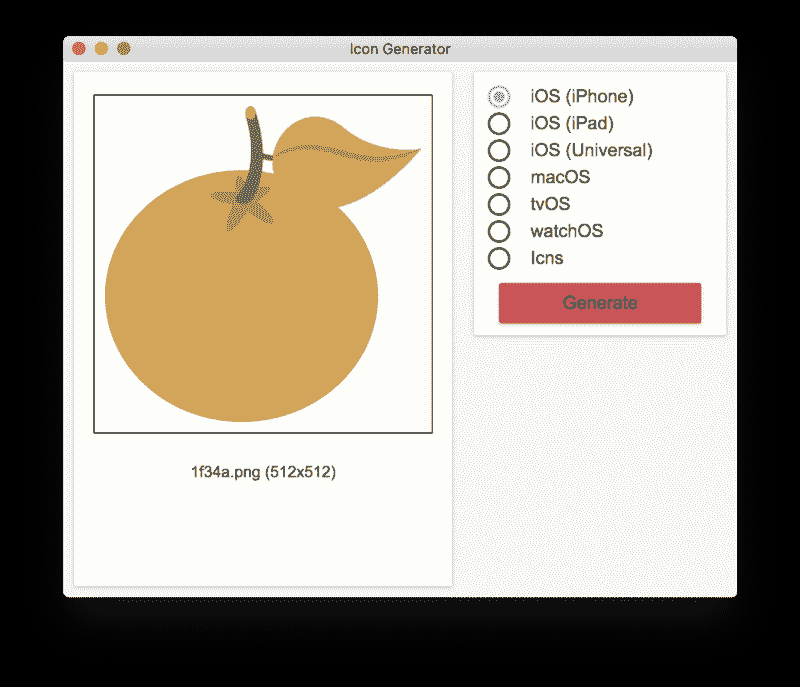

点击`Generate`，我们得到`AppIcon.appiconset`。其中包含所需大小的应用程序图标，可在资产目录中使用。将它拖到 Xcode 中的资产目录。那是为了生产。

对于试运行，添加一个“试运行”标语是一个好的实践，这样测试人员就知道哪个是试运行，哪个是生产。我们可以很容易地在草图中做到这一点。

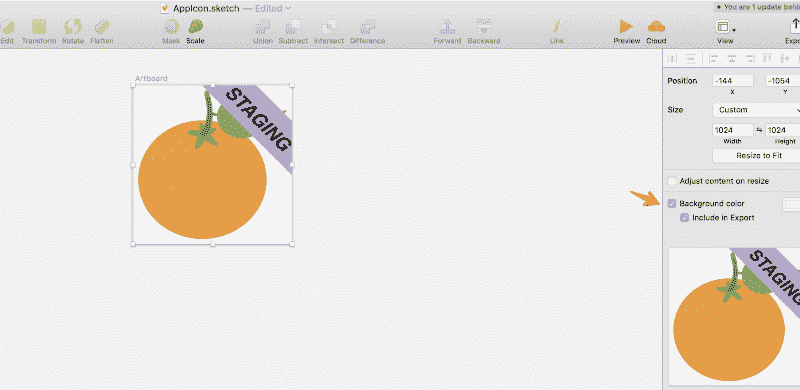

记得设置一个背景，这样我们就不会得到透明的背景。对于一个背景透明的 app 图标，iOS 将背景显示为黑色，看起来很恐怖。

导出图像后，将 staging 图标拖动到 IconGenerator，就像我们之前做的一样。但是这一次，将生成的`appiconset`重命名为`AppIcon-Staging.appiconset`。然后将它拖到 Xcode 中的资产目录。

对于使用暂存应用图标的暂存目标，打开`MyApp Staging target`并选择`AppIcon-Staging`作为`App Icon Source`。

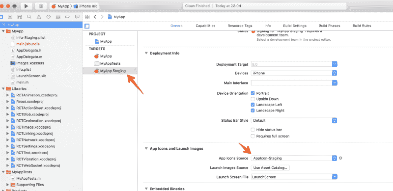

#### 为 Android 添加应用图标

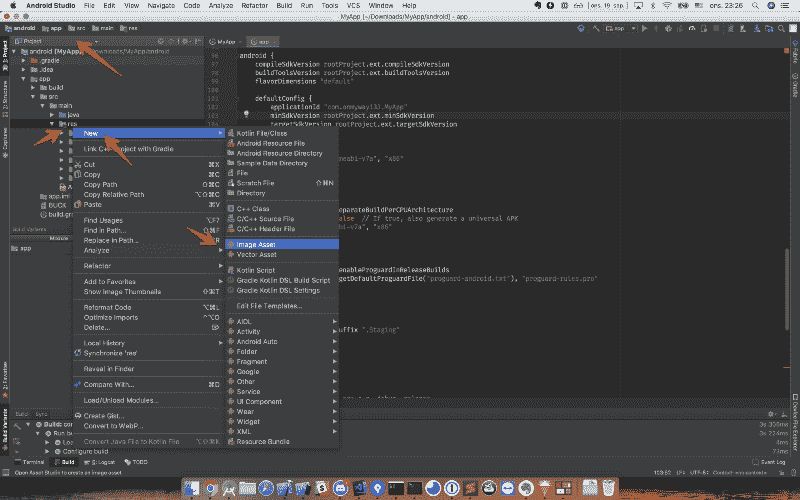

我喜欢切换到项目视图，因为它更容易改变应用程序图标。点击`res -> New -> Image` Asset 打开 Asset Studio。我们可以使用与 iOS 中相同的应用图标:

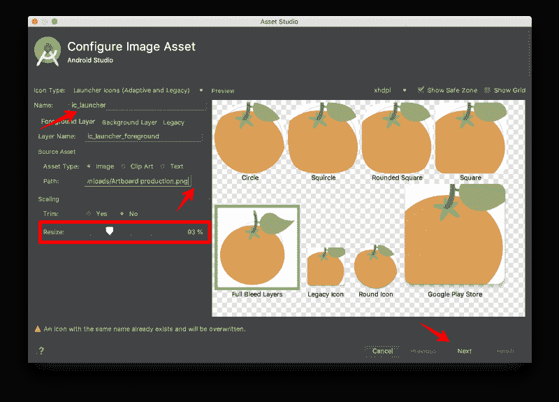

Android 8.0 (API level 26)引入了[自适应图标](https://developer.android.com/guide/practices/ui_guidelines/icon_design_adaptive)，所以我们需要调整调整大小滑块，以确保我们的应用程序图标看起来尽可能漂亮。

> Android 8.0(API 26 级)引入了自适应启动器图标，可以在不同的设备型号上显示各种形状。例如，自适应启动器图标可以在一个 OEM 设备上显示圆形，而在另一个设备上显示小圆圈。每个设备 OEM 提供一个遮罩，然后系统使用该遮罩以相同的形状呈现所有自适应图标。自适应启动器图标也用于快捷方式、设置应用程序、共享对话框和概览屏幕。— [安卓开发者](https://developer.android.com/guide/practices/ui_guidelines/icon_design_adaptive)

我们首先是为了生产，这意味着`main` Res 目录。这一步将替换 Android Studio 在引导 React 原生项目时生成的现有占位符应用程序图标。


现在我们有了生产应用程序图标，让我们制作分期应用程序图标。Android 通过惯例管理代码和资产。点击`src -> New -> Dir`工厂并创建`ate a s`标记文件夹。在 staging 里面，创建一个文件夹 c `all` ed res .我们计划的任何标记都将替换在`es i` n main 上的——这是 c `alled sourc` e sets。

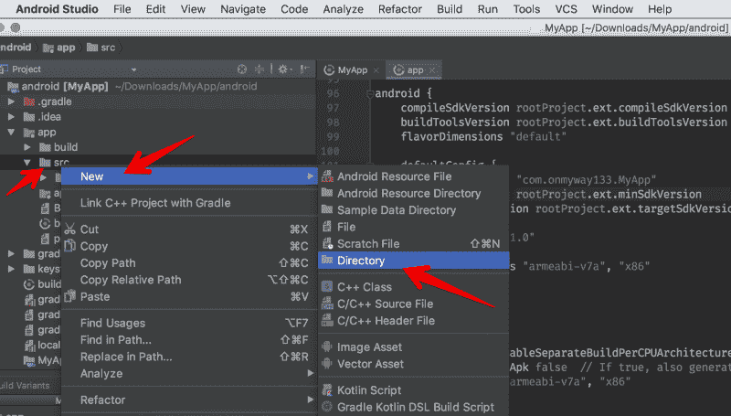

你可以在这里阅读更多:[用源集构建](https://developer.android.com/studio/build/build-variants)。

> 您可以使用源集目录来包含您希望仅与某些配置一起打包的代码和资源。例如，如果您正在构建“demoDebug”构建变体，它是“demo”产品风格和“Debug”构建类型的交叉产品，Gradle 会查看这些目录，并给予它们以下优先级:

> `src/demoDebug/` *(构建变体源集)*

> `src/debug/` *(构建类型源集)*

> `src/demo/` *(产品风味源设置)*

> `src/main/` *(主源集)*

右键单击`staging/res -> New -> Image`资产，制作应用程序图标，用于暂存。我们也像在 iOS 中一样使用相同的应用程序图标，但这次我们将标记为 Res 目录。通过这种方式，Android Studio 知道如何生成 diff `erent ic_la` uncher，并把它们 `into s`标记。

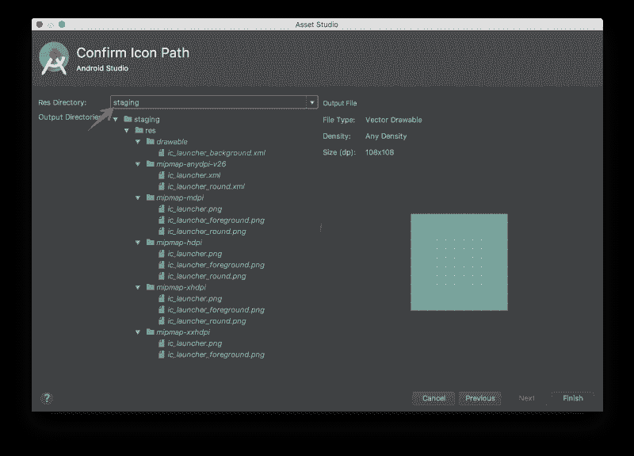

#### 为 iOS 添加启动屏幕

闪屏在 iOS 中被称为[启动屏](http://Launch Screen)，很重要。

> 当您的应用程序启动时，会立即出现一个启动屏幕。启动屏幕很快被你的应用程序的第一个屏幕所取代，给人的印象是你的应用程序速度快，响应快

在过去，我们需要为每个设备和方向使用不同大小的静态启动图像。

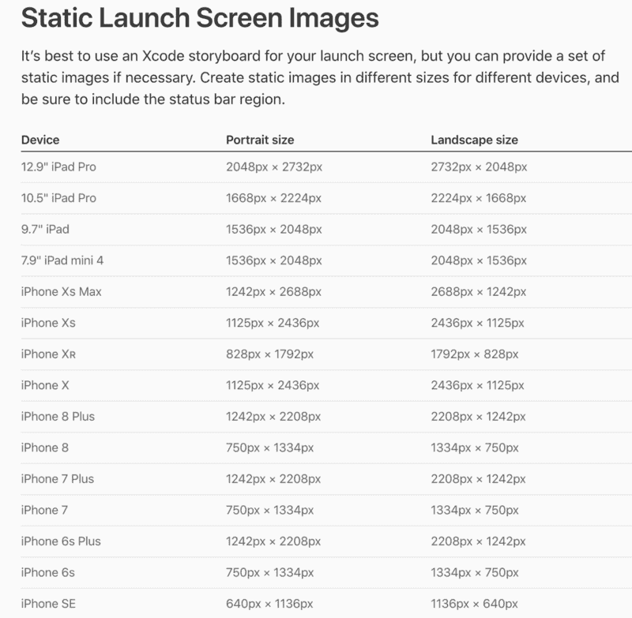

#### 启动屏幕故事板

目前推荐的方法是使用`Launch Screen storyboard`。React Native 的 iOS 项目附带了`LaunchScreen.xib`，但`xib`已经成为过去。让我们删除它并创建一个名为`Launch Screen.storyboard`的文件。

右键单击`MyApp`文件夹- >新建并选择启动屏幕，将其添加到两个目标，因为通常我们会为试运行和生产显示相同的启动屏幕。

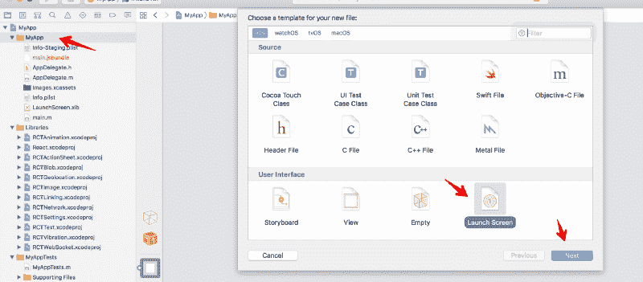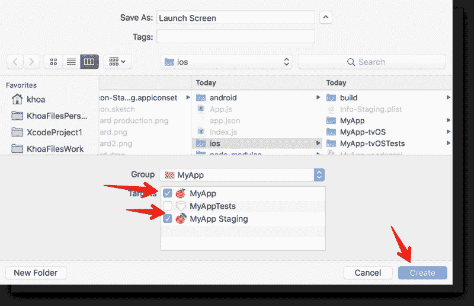

#### 图像集

打开资产目录，右键选择`New Image Set`。我们可以给它起任何名字。这将在`Launch Screen.storyboard`中使用。

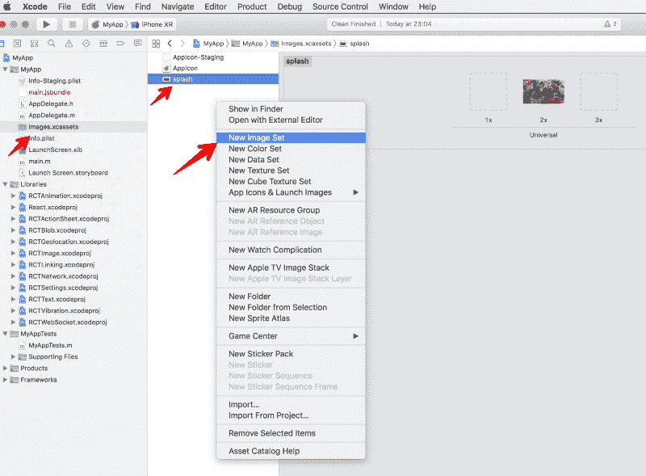

打开 Launch Screen.storyboard 并添加一个`UIImageView`。如果你使用的是 Xcode 10，点击右上角的库按钮，选择`Show Objects Library`。

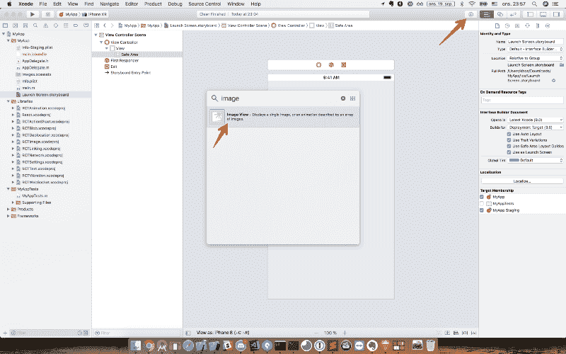

为图像视图设置图像，并确保`Content Mode`被设置为`Aspect Filled`，因为这确保了图像总是覆盖整个屏幕(尽管它可能被裁剪)。然后使用约束将 ImageView 连接到`View`，而不是`Safe Area`。您可以通过从图像视图(splash)到`View`的`Control+drag`来完成此操作。

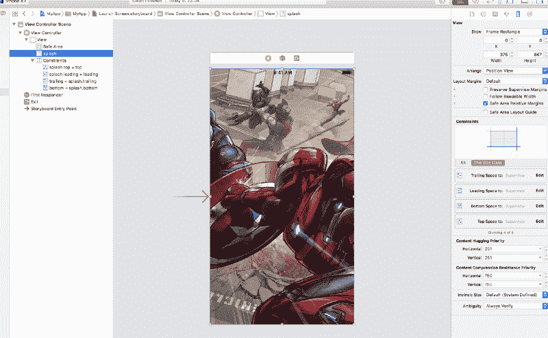

#### 没有边界的约束

点击每个约束并取消选择`Relative to Margin`。这使得我们的 ImageView 固定在视图的边缘，没有任何边距。

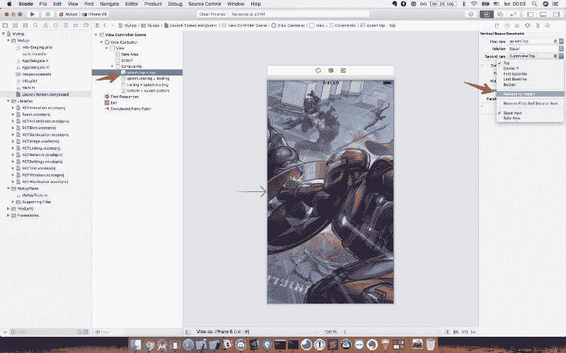

现在转到两个目标，选择`Launch Screen.storyboard`作为`Launch Screen File`:

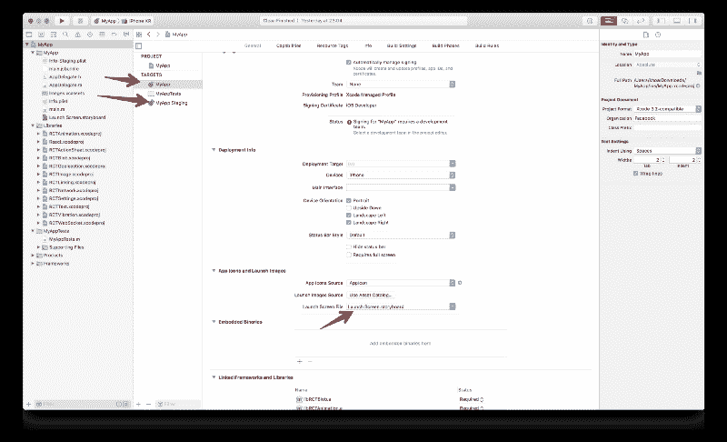

在 iOS 上，启动屏幕经常被缓存，所以你可能看不到这些变化。避免这种情况的一种方法是删除应用程序，然后再次运行它。

#### 为 Android 添加一个启动器主题

有几个 [方法](https://android.jlelse.eu/right-way-to-create-splash-screen-on-android-e7f1709ba154)为 Android 添加闪屏，从使用启动器主题，闪屏活动，和定时器。对我来说，一个合理的 Android 闪屏应该是一个极简的图像。

由于有许多不同比例和分辨率的 Android 设备，如果你想显示全屏启动图像，它可能不会为每个设备正确缩放。这只是关于 UX。

对于闪屏，让我们使用带有`splash_background.xml`的启动器主题。

#### 了解设备度量

没有适合所有 Android 设备的单一闪屏图像。更合理的方法是为纵向和横向的所有常见分辨率创建多个 splash 图像。或者我们可以设计一个最小的飞溅图像。您可以在这里找到更多信息:[设备指标](https://material.io/tools/devices/)。

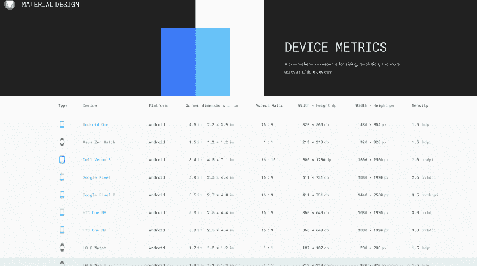

以下是如何在 4 个简单的步骤中添加闪屏:

#### 添加启动图像

我们通常需要一个公共的闪屏用于筹备和生产。将图像拖入`main/res/drawble`。Android Studio 似乎在识别闪屏的一些 jpg 图像方面有问题，所以最好选择 png 图像。

#### 添加 splash_background.xml

`Right click on drawable -> New -> Drawable resourc` e 文件。你想怎么命名都行——IC`hoose splash_backgrou`nd . XML。选择根 eleme `nt as laye` r-list:

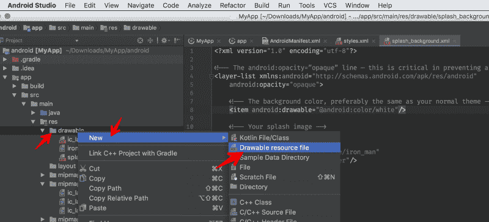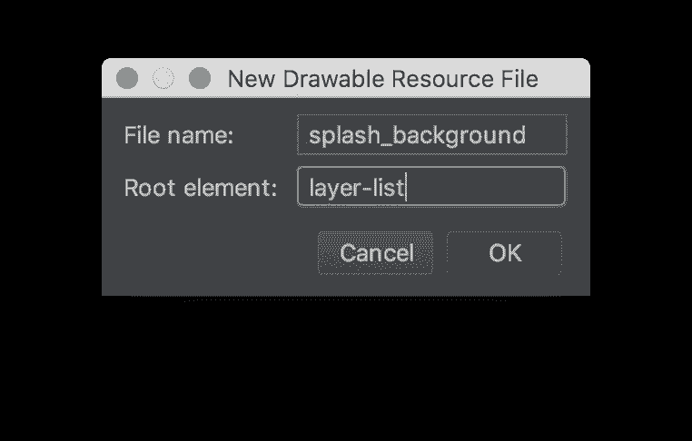

一个[层列表](http://Layer List)意味着“一个管理一系列其他可绘制对象的可绘制对象”。它们是按数组顺序绘制的，所以索引最大的元素被绘制在最上面”。下面是`splash_background.xml`的样子:

```
<?xml version="1.0" encoding="utf-8"?><!-- The android:opacity=”opaque” line — this is critical in preventing a flash of black as your theme transitions. --><layer-list xmlns:android="http://schemas.android.com/apk/res/android"    android:opacity="opaque">    <!-- The background color, preferably the same as your normal theme -->    <item android:drawable="@android:color/white"/>    <!-- Your splash image -->    <item>        <bitmap            android:src="@drawable/iron_man"            android:gravity="center"/>    </item></layer-list>
```

注意，我们指向我们之前用`android:src=”@drawable/iron_man”`添加的 splash 图像。

#### 声明样式

打开`styles.xml`并添加`SplashTheme`:

```
<style name="SplashTheme" parent="Theme.AppCompat.NoActionBar">    <item name="android:windowBackground">@drawable/splash_background</item></style>
```

#### `Use SplashTheme`

转到`Manifest.xml`并更改启动器活动的主题，该主题有`category android:name="android.intent.category.LAUNCHER"`。把它改成`android:theme="@style/SplashTheme"`。对于 React Native，启动器活动通常是`MainActivity`。`Manifest.xml looks`是这样的:

```
<manifest xmlns:android="http://schemas.android.com/apk/res/android"    package="com.myapp">    <uses-permission android:name="android.permission.INTERNET" />    <uses-permission android:name="android.permission.SYSTEM_ALERT_WINDOW"/>    <application      android:name=".MainApplication"      android:label="@string/app_name"      android:icon="@mipmap/ic_launcher"      android:allowBackup="false"      android:theme="@style/AppTheme">      <activity        android:name=".MainActivity"        android:label="@string/app_name"        android:configChanges="keyboard|keyboardHidden|orientation|screenSize"        android:theme="@style/SplashTheme"        android:windowSoftInputMode="adjustResize">        <intent-filter>            <action android:name="android.intent.action.MAIN" />            <category android:name="android.intent.category.LAUNCHER" />        </intent-filter>      </activity>      <activity android:name="com.facebook.react.devsupport.DevSettingsActivity" />    </application></manifest>
```

现在运行应用程序，当应用程序启动时，您应该会看到闪屏显示。

### 管理环境配置

试运行和生产的区别仅仅在于应用程序名称、应用程序 id 和应用程序图标。我们可能会使用不同的 API 密钥和后端 URL 来准备和生产。

目前最流行的处理这些场景的库是 [react-native-config](https://github.com/luggit/react-native-config) ，据说它“给你的移动应用带来了 12 种爱的因素”。它需要很多步骤才能开始，我希望有一个不那么冗长的解决方案。

#### 从这里去哪里

在这篇文章中，我们接触 Xcode 和 Android Studio 多于 Visual Studio 代码，但这是不可避免的。我希望这篇文章对你有用。这里有更多的链接来阅读更多关于这个主题的内容:

*   [添加应用图标并启动屏幕以反应原生应用(iOS & Android)](https://medium.com/@scottianstewart/react-native-add-app-icons-and-launch-screens-onto-ios-and-android-apps-3bfbc20b7d4c)
*   [如何给 React 原生应用添加闪屏(iOS 和 Android)](https://medium.com/handlebar-labs/how-to-add-a-splash-screen-to-a-react-native-app-ios-and-android-30a3cec835ae)
*   [在 React Native 中管理配置](https://medium.com/differential/managing-configuration-in-react-native-cd2dfb5e6f7b)
*   [为 React 原生应用(和浪子 CircleCI 部署)pt 添加多个目标管道。1](https://medium.com/@jacks205/adding-multiple-target-pipelines-for-react-native-apps-and-fastlane-circleci-deployment-pt-1-ae9590ae52f2)
*   [(完整的)Android 闪屏指南](https://android.jlelse.eu/the-complete-android-splash-screen-guide-c7db82bce565)

如果你喜欢这个帖子，可以考虑访问[我的其他文章](https://github.com/onmyway133/blog/issues/165)和[应用](https://onmyway133.github.io/)？