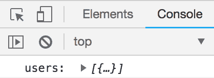
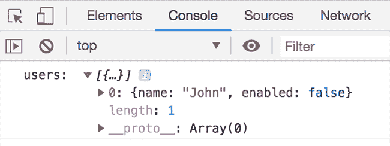
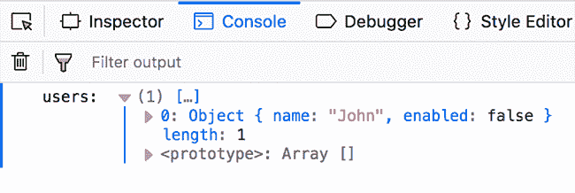
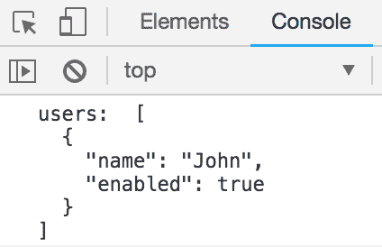
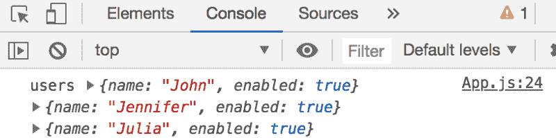
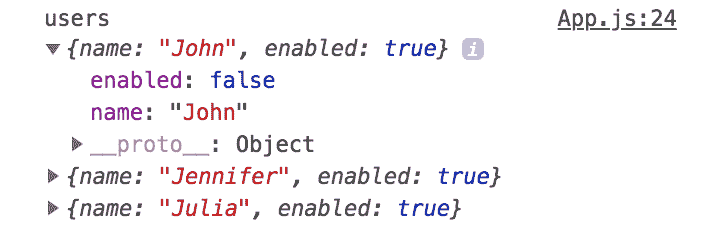
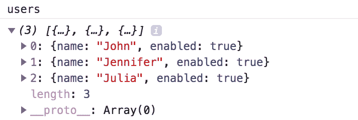

# 当你改变物体时，控制台会记录什么

> 原文：<https://www.freecodecamp.org/news/mutating-objects-what-will-be-logged-in-the-console-ffb24e241e07/>

鲍里斯·塞弗

# 当你改变物体时，控制台会记录什么

许多开发人员在开发时不使用调试器。相反，他们依赖于他们的老朋友。

值得注意的是，控制台显示对象的值，该值是在控制台中的**第一次扩展**时评估的。

首先，让我澄清一下我所说的扩大是什么意思。当我们`console.log`一个对象(也包括数组)时，对象的值被折叠。例如:

`console.log( "users: ", [{name: "John"}]);`

浏览器的控制台将如下所示:

然后，当您单击三角形时，对象会展开。在那个精确的时间，对象的值被计算和显示。

让我们更深入地了解这一点，并查看一个示例:

在第 1 行，我们正在初始化一个新的`users`变量，它是一个对象数组。

在第 6 行，我们将`users`变量的值写入控制台。

接下来，我们遍历`users`，检查用户是否有效，并根据返回结果禁用用户。为了便于讨论，让我们假设`validateUser()`返回`false`，并且执行第 10 行的代码。

即使`map`正在创建一个新的数组，改变`user`对象也会改变`users`数组中的`user`对象。它改变是因为它有相同的参考。(为了更好地解释正在发生的事情，请查看[这篇文章](https://codeburst.io/explaining-value-vs-reference-in-javascript-647a975e12a0))。

问题是:在第 6 行调用的控制台上会显示什么？

当我们在 Chrome 和 Firefox 中打开这个例子时，对象是折叠的。然后在扩展时，我们看到值:

Enabled 设置为`false`，即使输出时该值为`true`。这背后的原因是，当我们单击以展开对象时，第一次计算对象的值(延迟读取)。

> 注意:Chrome 会显示一个信息图标，上面写着:“下面的值刚刚被评估过。”

现在让我们来看看 Safari:

Safari ( version 11.0.3 )

Hm，enabled 设置为 true。所以我们可以看到浏览器之间有一些不一致的地方。Safari 将尝试自动扩展对象。如果对象/数组太大，它将会崩溃，其行为方式与 Chrome 和 Firefox 相同。

解决这个问题的一个方法是使用`JSON.stringify(),`例如

这将向控制台生成以下输出:

不幸的是，使用这种方法，您无法展开/折叠对象。数值不会突变。

我是函数式编程范式和不可变变量的忠实粉丝。要修改对象，您需要创建一个克隆，然后对其进行修改。在这种情况下，你就不会遇到这种“问题”。所以我们可以这样写:

在 map 函数中，我们现在克隆我们修改并返回的用户对象。

如果您坚持使用对象突变， [Zoran Jambor](https://www.freecodecamp.org/news/mutating-objects-what-will-be-logged-in-the-console-ffb24e241e07/undefined) 添加了另一个聪明的解决方案:
`console.log("users", ...users);`
因此用户数组被析构，一个对象列表显示在控制台中:

但是在这里我们也要小心。如果对象的值发生了变化，控制台输出将在扩展时发生变化:

如果您想绝对确定被记录的对象具有与在 console.log 期间相同的值，您将需要对它进行深层克隆。例如，我们可以使用下面的助手函数，而不是直接写入控制台:

在第 3 行，我们实际上是在创建对象的深层克隆，它给出了以下输出:

现在，对象的值在扩展时不会改变。

如果使用调试器，在第 6 行添加一个断点将会暂停执行。您将看到当前对象的值。如果大多数时候您更喜欢控制台，请注意对象/数组是在第一次扩展时计算的。

查看[这篇关于如何使用浏览器调试器的文章](https://medium.com/datadriveninvestor/stopping-using-console-log-and-start-using-your-browsers-debugger-62bc893d93ff)。

感谢您的阅读。请与任何可能发现它有用的人分享，并留下反馈。(这是我在 Medium 上的第一个故事，我想继续写下去，越写越好)。