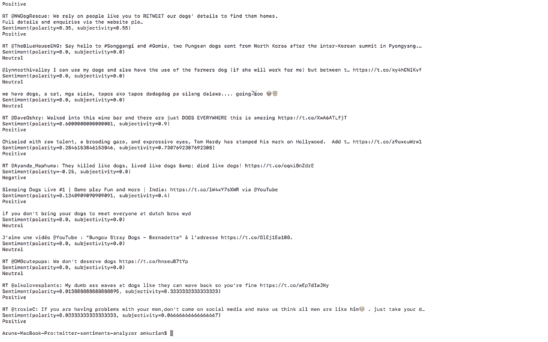

# 如何使用 TextBlob 在 Python 中构建 Twitter 情感分析器

> 原文：<https://www.freecodecamp.org/news/how-to-build-a-twitter-sentiments-analyzer-in-python-using-textblob-948e1e8aae14/>

阿伦·马修·库里安

# 如何使用 TextBlob 在 Python 中构建 Twitter 情感分析器

这篇博客基于 Siraj Raval 的视频 [Twitter 情绪分析——学习 Python 数据科学#2](https://www.youtube.com/watch?v=T5pRlIbr6gg&list=PL2-dafEMk2A6QKz1mrk1uIGfHkC1zZ6UU) 。在这个挑战中，我们将构建一个情感分析器，检查关于某个主题的推文是负面的还是正面的。为此，我们将使用 Python 库 textblob。


image from google

情感分析，也称为意见挖掘或情感人工智能，是确定一篇文章是积极的、消极的还是中性的过程。这项技术的一个常见用例是发现人们对某个特定话题的感受。情感分析被广泛应用于评论和社交媒体的各种应用中。

情感分析可以用许多不同的方式来执行。许多品牌和营销人员使用基于关键字的工具对数据进行分类(如社交、新闻、评论、博客等)。)为正/负/中性。

自动情感标记通常通过单词列表来实现。例如，提到“仇恨”会被贴上负面标签。

有两种方法可以进行情感分析。

1.基于词典的方法
2。基于机器学习的方法。

在这个问题中，我们将使用基于词典的方法。

基于词典的方法定义了一个正面和负面单词的列表，带有一个化合价——(例如‘好’:+2，‘好’:+1，‘糟糕’:-1.5 等等)。该算法在文本中查找所有已知单词。然后，它通过求和或求平均值来组合它们各自的结果。一些扩展可以检查一些语法规则，如否定或情感修饰符(如单词“but”，它对文本中的情感值进行不同的加权，以强调文本的结尾)。

现在让我们来构建分析器。

#### Twitter API

在我们开始编码之前，我们需要注册 Twitter API[https://apps.twitter.com/](https://apps.twitter.com/)。这里我们需要注册一个应用程序来生成与我们的 API 相关联的各种密钥。Twitter API 可用于执行许多操作，如创建和搜索。

现在创建应用程序后，我们可以开始编码。

我们需要安装两个软件包:

> pip 安装套件

这个包将用于处理 Twitter API。

> pip 安装文本 blob

这个包将用于情感分析。

**情操 _ 分析器. py**

```
import tweepyfrom textblob import TextBlob
```

我们需要声明变量来存储与 Twitter API 相关的各种键。

```
consumer_key = ‘[consumer_key]’
```

```
consumer_key_secret = ‘[consumer_key_secret]’
```

```
access_token = ‘[access_token]’
```

```
access_token_secret = ‘[access_token_secret]’
```

下一步是使用带有这些令牌的 **tweepy** 创建与 Twitter API 的连接。

#### **十二年**

Tweepy 支持 OAuth 认证。认证由 **tweepy 处理。OAuthHandler** 类。

必须通过传递消费者令牌和秘密来创建一个**oauthandler**实例。

在这个 auth 实例上，我们将通过传递 access_token 和 access_token_secret 来调用函数 set_access_token。

最后，我们通过将这个 auth 实例传递给 tweepy 的 API 函数来创建我们的 tweepy API 实例。

```
auth = tweepy.OAuthHandler(consumer_key, consumer_key_secret)
```

```
auth.set_access_token(access_token, access_token_secret)
```

```
api = tweepy.API(auth)
```

我们现在可以使用 API 的搜索方法在 Twitter 上搜索任何主题。

```
public_tweets = api.search(‘Dogs’)
```

现在，我们将获得所有与话题“狗”相关的推文。我们可以使用库 textblob 执行情感分析。

#### 文本 Blob

*TextBlob* 是一个用于处理文本数据的 Python (2 和 3)库。它提供了一个简单的 API，用于处理常见的自然语言处理(NLP)任务，如词性标注、名词短语提取、情感分析、分类、翻译等。

可以通过以下方式创建 textblob(示例，不是原始代码的一部分):

```
example = TextBlob("Python is a high-level, general-purpose programming language.")
```

和**标记化**可以通过以下方法进行:

**单词**:返回文本的单词

用法:

```
example.words
```

**句子:**返回文本的句子

用法:

```
example.sentences
```

#### **词性标注**

词性标签可以通过**标签**属性来访问。

```
wiki.tags[('Python', 'NNP'), ('is', 'VBZ'), ('a', 'DT'), ('high-level', 'JJ'), ('general-purpose', 'JJ'), ('programming', 'NN'), ('language', 'NN')]
```

#### **情感分析**

情感属性返回情感(极性，主观性)形式的命名元组。极性分数是[-1.0，1.0]范围内的浮点数。主观性是在[0.0，1.0]范围内的浮动，其中 0.0 非常客观，1.0 非常主观。

现在回到代码。

我们可以迭代 **publice_tweets** 数组，根据极性检查每条 tweet 的文本的情绪。

```
for tweet in public_tweets:    print(tweet.text)    analysis = TextBlob(tweet.text)    print(analysis.sentiment)    if analysis.sentiment[0]>0:       print 'Positive'    elif analysis.sentiment[0]<0:       print 'Negative'    else:       print 'Neutral'
```

现在，我们使用以下代码运行代码:

> python 情操 _analyzer.py

我们得到了输出:



我们可以看到，推文的情绪显示出来了。

这是一个如何对来自 Twitter 等社交媒体的数据进行情感分析的例子。希望你觉得有用！

在[https://github.com/amkurian/twitter_sentiment_challenge](https://github.com/amkurian/twitter_sentiment_challenge)找到代码