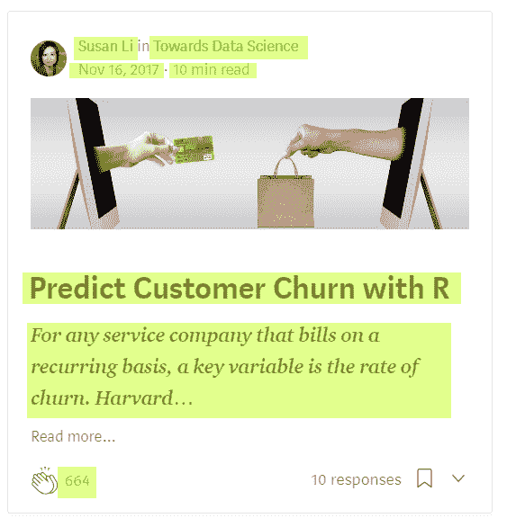
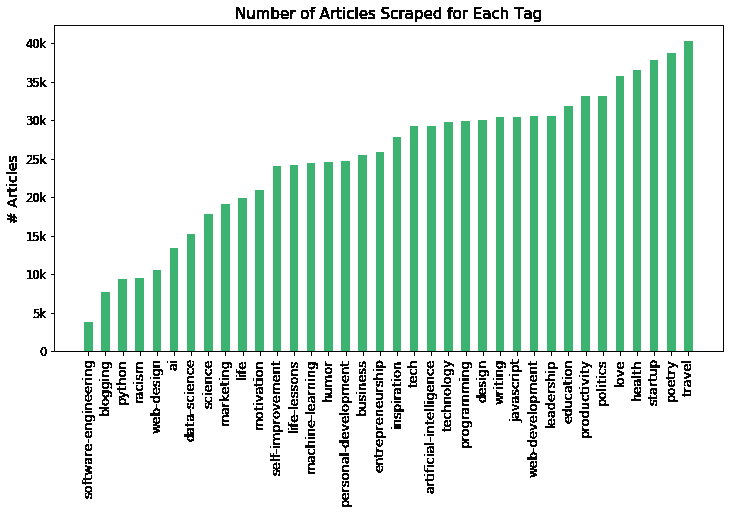
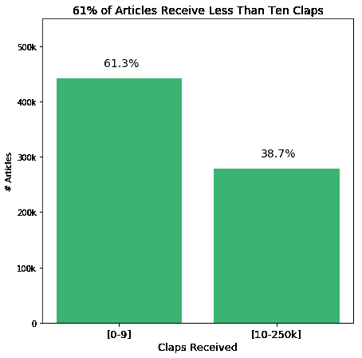
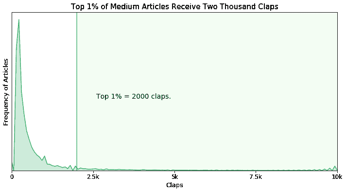
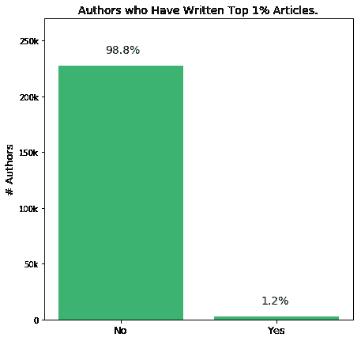
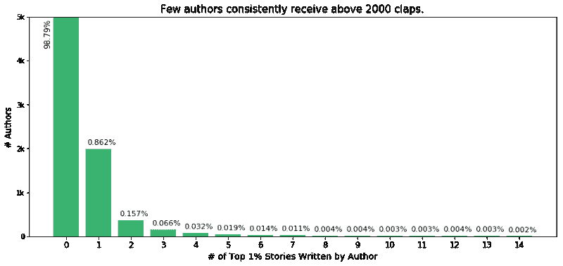
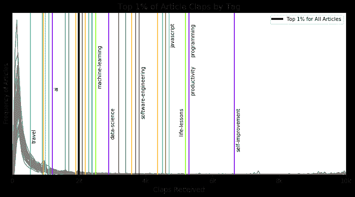
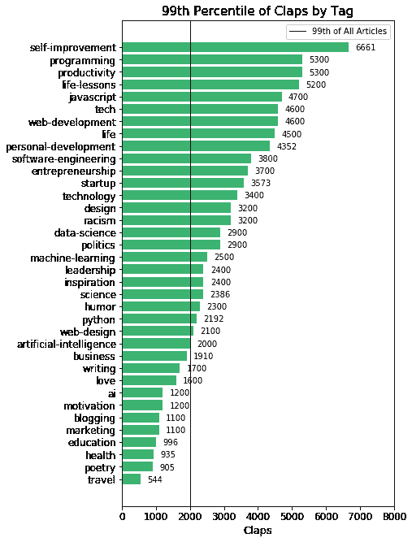

# 我是如何分析一百万篇媒体文章来了解伟大的故事得到多少掌声的

> 原文：<https://www.freecodecamp.org/news/how-i-analyzed-a-million-medium-articles-to-learn-how-many-claps-great-stories-get-d688cf92759f/>

作者:哈里森·詹斯马

# 我是如何分析一百万篇媒体文章来了解伟大的故事得到多少掌声的

This image is from Ridley Scott’s [Gladiator](https://www.amazon.com/Gladiator-Russell-Crowe/dp/B0094K1IPI). Because writing on Medium makes you feel like Maximus.

*这篇文章是写给媒体的作者的。如果你曾经对你的故事得到的回应感到沮丧，这篇文章可以帮助你。*

我叫哈里森·简斯马，我写数据。在过去的几周里，我收集并分析了一百万个媒体故事的掌声。所以我可以回答作为一个媒体作家最困扰我的问题。即，

> 与媒体上的类似作者相比，我的故事如何？

虽然我是一个作家，但我不是一个特别有创造力的人。为了应对，我不得不通过竞争来激励我的写作。根据我过去故事的表现，或者我的新闻提要中故事的表现，为自己制定目标。

不幸的是，这种比较正在慢慢扼杀我的写作能力。

问题是我在为我的写作设定目标，却不知道这些目标是否合理。

Which of these is a reasonable goal?

我主页上的故事从 40 到 30K 不等。我在 Medium 上写的前三个故事，从 80 拍手到 9K 拍手不等。所以我的目标是获得三万次掌声吗？一万次鼓掌？有多少故事真的达到了读者参与的程度？

只要掌声在不同的故事中有很大的不同，作家就永远不能用这个标准来为他们的写作设定目标。

因此，我的目标是更好地理解媒体的掌声。我从成千上万的媒体报道中收集数据，话题从诗歌、科技到政治。有了这些数据，我找到了我想要的东西。

我找到了一种方法，让作者可以将他们的作品与媒体上其他类似的故事进行比较。

### **刮一百万个中等故事。**

第一步是收集信息。具体来说，我必须得到许多媒体文章的掌声。

于是在中[档案馆](https://medium.com/tag/data-science/archive)逛了几天。然后我用 Python 创建了一个 web-scraper(可以在 [GitHub](https://github.com/harrisonjansma/Analyzing_Medium) 上找到)。网络抓取器从数以千计的故事卡片中提取数据。

Example of data scraped from a story-card.

**一旦数据收集完成，** **我就有了 993000 篇中型文章的数据。**他们涵盖了 36 个最受欢迎的媒体标签，都是在去年发布的(2017 年 8 月-2018 年 8 月)。

### 分析(几乎)一百万个媒体故事

在从数据中删除重复的故事和评论后，我剩下了来自 23 万作者和 3 万出版物的 72 万个独特的故事。一篇文章获得的点击量从零到 215，000 次不等。

为了更好地理解 Medium 的 clap 指标，我需要回答两个问题。

1.  一般的故事能获得多少掌声？
2.  一个高于平均水平的故事能获得多少掌声？

先说第一个问题。

### 一般的故事能获得多少掌声？

在媒体上，大多数作家从他们的读者那里得到的是平庸的投入。这可能是因为媒体是作家的自由平台。或者可能是因为不是每个作家的目标都是获得观众的大量掌声。

不管什么原因，大多数文章几乎没有得到掌声。在我分析的 72 万篇文章中，61.3%的文章获得了不到 10 次掌声。

如果你是一名作家，你不应该因此而气馁。

无论是一天中的时间，还是媒体推荐引擎的奥秘，你的故事得到的参与度都不是由你决定的。

然而，媒体上最成功的作者并不是偶然得到他们现在的位置的。他们长期(持续地)发布高质量的内容，并逐渐建立了一批追随者。

你也可以这样做。

### 一个高于平均水平的故事能获得多少掌声？

现在你知道了大多数故事获得了多少掌声，我们将看看光谱的另一端:获得比平均水平更多掌声的故事。

不幸的是，一篇文章没有明确的高于平均水平的鼓掌次数。我们需要把这个问题稍微重新措辞一下。相反，我们问:

前 1%的故事获得了多少掌声？

在分析的 720，000 个故事中，前 1%最受欢迎的故事获得了超过两千次掌声。

由于数据收集的方式，这个截止值正好落在 2000.0 拍，而不是像 2112 这样的数字。一旦你通过了一千次鼓掌，Medium 会将你的鼓掌缩写为-received(例如 2.2K)。所以严格的截止值在 2K 和 2.1K 之间。但是 2000 听起来更酷… Sooo…

因此，2000 次鼓掌是一个故事进入媒体故事前 1%的界限。从现在开始，当你写一个故事时，你可以以此作为你吸引读者的目标。你也可以以此为基准来衡量你过去文章的表现。

两千次鼓掌也是衡量你作为一个作者的表现的一个很好的标准。

为前 1%的人写一个故事可不是一件容易的事。在数据中的 23 万作者中，只有 1.2%写了一篇超过 2000 次鼓掌的文章。

更少的作者能够持续发布超过 2000 次鼓掌的文章。下图显示了我所说的内容。

但是请注意，这 1%的截止值包括了为完全不同的类型所写的文章。

我们真的可以把一个诗歌故事的表现和一个自强故事的表现相提并论吗？每一部电影都有非常不同的观众，他们的规模、品味和个性都各不相同。

幸运的是，Medium 已经用标签分隔了它的内容。我们需要做的就是找到媒体上每个标签的前 1%。

#### 每个标签的前 1%获得多少掌声？

这里是我们的数据中 36 个标签中的每一个标签的文章收到的第 99 个百分点的掌声。

Medium 的一些最受关注的标签(自我提升、生产力、人生经验)是最重要的 1%。而具有最多故事(旅行)的标签具有最低的截止值。

我还没能想出这种传播的原因，所以我想在评论中更多地讨论这个问题。

这是 36 个故事标签中每一个的第 99 个百分点。

所以我们有它！你可以用上面的数字来比较你的故事和类似作者在 Medium 上的表现。

例如，由于这篇文章有一个数据科学的标签，我可能会把获得 2900 次鼓掌作为我的目标。如果我能达到这样的读者参与度，这篇文章将会成为媒体上数据科学相关文章的前 1%。

### 结论

大多数 Medium 的故事获得的掌声不到十次，Medium 的前 1%的故事获得的掌声超过两千次。您可以使用这些指标作为基准来衡量您的文章的性能，或者作为撰写未来文章的目标。

我还列出了 36 个流行故事标签中前 1%的截止值，这样你就可以将你的作品与 Medium 上类似作者的作品进行比较。

#### 想要更多高质量的数据科学文章就关注我吧。？

我学到的一些关于媒体的东西与本文没有直接关系。于是我写了一篇综合分析我发现的一切**。**如果你想知道谁是最受欢迎的作者，最大的出版物，等等，看这里。