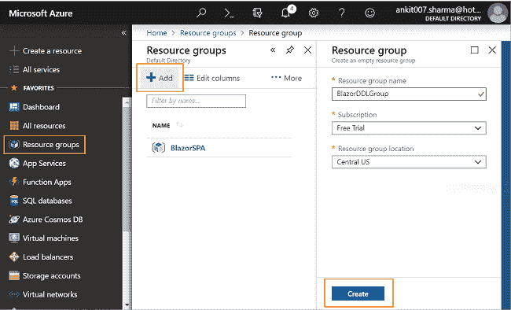
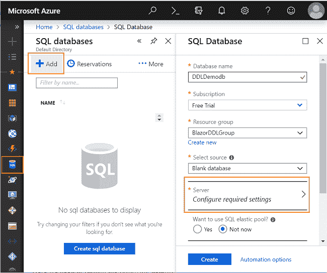
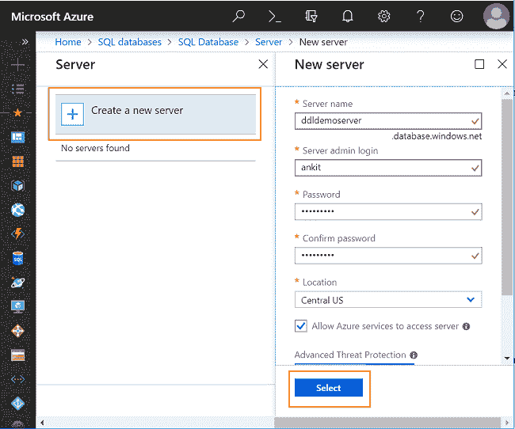
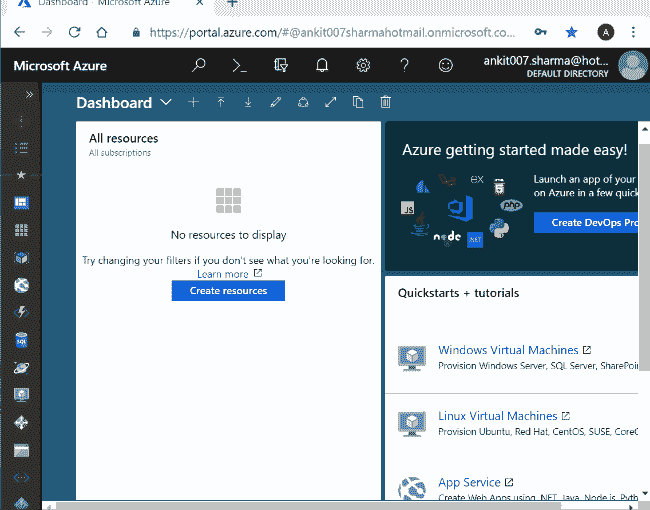
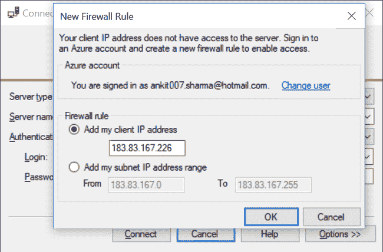
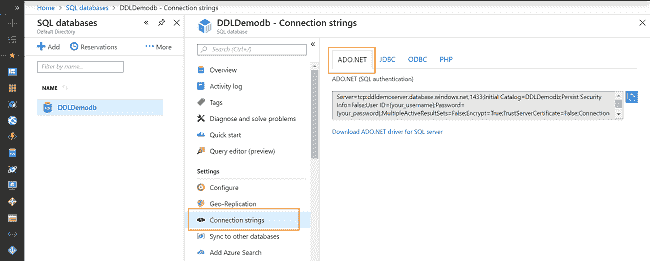
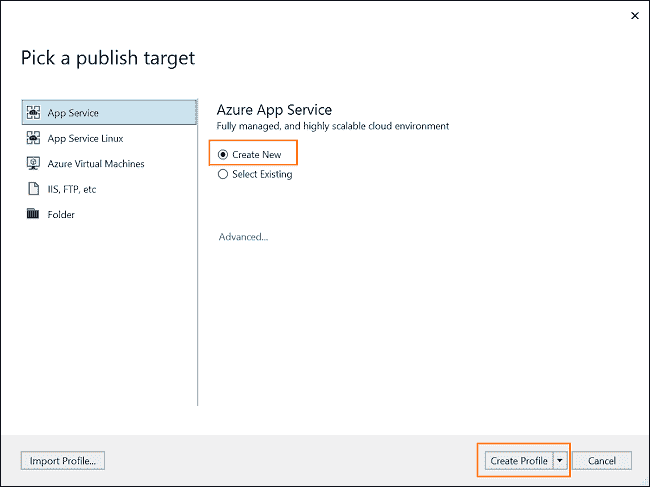
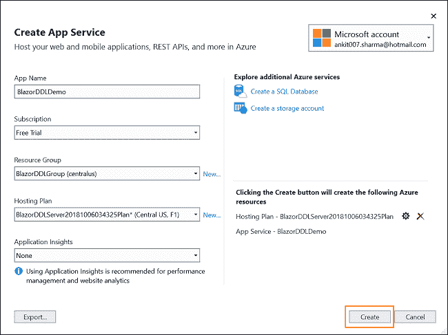
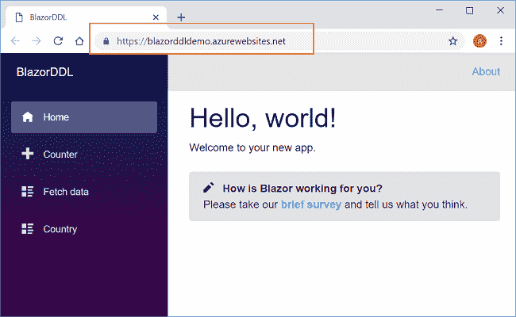

# 如何在 Azure 上部署 Blazor 应用程序

> 原文：<https://www.freecodecamp.org/news/how-to-deploy-a-blazor-application-on-azure-cf6f3b1f03a0/>

### 介绍

在本文中，我们将学习如何在 Azure 上部署 ASP.NET 核心托管的 Blazor 应用程序。我们将使用 Visual Studio 2017 发布应用程序。我们将在 Azure 上创建一个 SQL 数据库服务器来处理 DB 操作。

### 先决条件

*   安装。NET Core 2.1 以上 SDK 从[这里](https://www.microsoft.com/net/learn/dotnet/hello-world-tutorial#windowscmd)
*   从[这里](https://visualstudio.microsoft.com/downloads/)安装 Visual Studio 2017 v15.7 或以上版本
*   从[这里](https://marketplace.visualstudio.com/items?itemName=aspnet.blazor)安装 ASP.NET 核心 Blazor 语言服务扩展
*   Azure 订阅帐户。您可以在这里创建一个免费的 Azure 帐户

请参考我以前的文章[使用 EF Core](https://ankitsharmablogs.com/cascading-dropdownlist-in-blazor-using-ef-core/) 创建我们将在本教程中部署的应用程序。

### 在 Azure 门户上创建资源组

我们将在 Azure 门户上创建一个资源组来包含我们在 Azure 上的所有资源。

登录 Azure 门户，点击左侧菜单上的`Resource groups`，然后点击添加。它将打开一个“资源组”窗口，如下图所示:

在此窗口中，我们需要填写以下详细信息:

*   **资源组名称**:给你的资源组一个唯一的名称。这里我们将使用名称`BlazorDDLGroup`。
*   **订阅**:从下拉列表中选择您的订阅类型。在这里，我们选择“免费试用”订阅。
*   **资源组位置**:从下拉列表中选择资源组的位置。

### 在 Azure 上创建 SQL DB 和 DB 服务器

我们将在 Azure 门户上创建 SQL 数据库和数据库服务器来处理我们的 DB 操作。

点击 Azure 门户左侧菜单上的`SQL databases`，然后点击添加。它将打开一个“SQL 数据库”窗口，如下图所示:

在这里，您需要填写以下详细信息:

*   **数据库名称**:输入数据库的名称。这里我们将使用`DDLDemodb`作为我们的数据库名称。
*   **订阅**:从下拉列表中选择您的订阅类型。在这里，我们选择“免费试用”订阅。
*   **资源组**:选择我们在上一步中创建的资源组名称。
*   **选择源**:这个下拉列表包含了 Azure 提供的预定义数据的数据库列表。由于我们正在创建自定义数据库，因此从该下拉列表中选择`Blank database`。
*   **定价层**:为您的数据库选择一个定价层。

在创建数据库之前，我们需要为 SQL 数据库创建一个数据库服务器。点击“服务器配置所需设置”,然后点击`Create a new server`。它将打开一个“新服务器”窗口，如下图所示:

这里我们需要提供以下细节:

*   **服务器名称**:为您的数据库服务器提供一个名称。这里我们将使用`ddldemoserver`。DB 服务器将通过在用户提供的服务器名称后添加`.database.windows.net`来创建。因此，在这种情况下，服务器名将是`ddldbserver.database.windows.net`。
*   **服务器管理员登录**:输入数据库服务器的管理员登录名。
*   **密码**:输入与 DB 服务器的管理员登录对应的登录密码。
*   **位置**:从下拉列表中选择服务器的位置。

选中“允许 Azure 服务访问服务器”复选框，然后单击`Select`创建您的数据库服务器。

**注意:**“admin”一词仅限于数据库服务器的管理员用户名。使用除“admin”之外的任何其他用户名。

创建数据库服务器后，您将被重定向回“SQL 数据库”窗口。你需要点击“创建”按钮来创建你的数据库。

下面用一张 gif 解释了整个过程。

### 创建数据库表

数据库`DDLDemodb`不包含我们在应用程序中使用的表。我们将使用 SQL Server Management Studio (SSMS)连接到 Azure 数据库来创建我们的 DB 对象。

在你的机器上打开 SSMS，把服务器名设为`ddldbserver.database.windows.net`。提供您在上一节中配置的管理员用户 id 和密码。然后点击“连接”。

您将看到一个弹出窗口，用于配置防火墙规则以访问 Azure DB。使用您的 Azure 帐户凭据登录，并在`Firewall rule`下添加您的机器的 IP 地址。点击“确定”连接到 Azure 数据库服务器。请参考下图:

一旦连接成功，您就可以在服务器上看到`DDLDemodb`数据库。参考我之前的文章[使用 EF 核心](https://ankitsharmablogs.com/cascading-dropdownlist-in-blazor-using-ef-core/)在 Blazor 中级联 DropDownList。运行 SQL 命令，在我们的应用程序中使用的 Country 和 Cities 表中创建并插入示例数据。

### 设置数据库连接字符串

创建数据库对象后，我们需要用 Azure 数据库的连接字符串替换应用程序中本地数据库的连接字符串。

打开 Azure 门户，点击左侧菜单中的`SQL databases`。它将打开一个窗口，显示您在 Azure 门户上创建的所有数据库的列表。点击`DDLDemodb`数据库，并从菜单中选择`Connection strings`。选择`ADO.NET`选项卡并复制连接字符串。请参考下图:

您需要在这个连接字符串中输入您之前配置的数据库服务器的管理员用户 id 和密码。

使用 Visual Studio 打开`BlazorDDL`应用程序，导航到`BlazorDDL.Shared/Models/myTestDBContext.cs`并用这个新的连接字符串替换本地连接字符串。

从 Visual Studio 启动您的应用程序，以验证新的连接字符串是否配置正确，以及您是否能够访问 Azure 数据库。

如果应用程序不工作，并且您无法连接到数据库，那么请检查您的连接字符串是否正确。一旦应用程序在你的本地机器上如预期的那样工作，然后移动到下一部分，在 Azure 上发布它。

### 将 Blazor 应用程序发布到 Azure

要在 Azure 上发布 Blazor 应用，右键单击解决方案的服务器项目，然后单击发布。在这种情况下，它将`BlazorDDL.Server >> P`publish。

它将打开`Pick a publish target`窗口。从左侧菜单中选择`App Service`。选择`Create New`单选按钮并点击“创建个人资料”按钮。请参考下图:

如果您尚未登录，下一个窗口将要求您登录您的 Azure 帐户。一旦登录成功，将会打开一个`Create App Service`窗口。请参考下图:

根据您的 Azure 帐户的配置，此窗口的字段中有默认值。但是，您可以根据需要更改这些值。

您可以按如下所述填写详细信息:

*   **应用名称**:为你的应用提供一个应用名称。应用名称视可用性而定。如果您提供的应用名称已被使用，则您需要提供一个新的应用名称。网站的公共 URL 将是应用程序名称后跟`.azurewebsites.net`。这里我们使用的名称是`BlazorDDLDemo`，因此我们网站的 URL 将是`BlazorDDLDemo.azurewebsites.net`。
*   **订阅**:从下拉列表中选择您的订阅类型。
*   **资源组**:选择您的资源组名称，本例中为`BlazorDDLGroup`。
*   **托管计划**:您可以使用现有计划，也可以点击“新建…”链接选择新计划。
*   **应用洞察**:您可以从下拉列表中选择一个值。它将为您的网站提供分析。

点击“创建”按钮开始在 Azure 上部署应用程序。根据您的互联网连接速度，可能需要几分钟才能完成。

部署成功后，点击“发布”按钮将应用发布到 Azure。应用程序成功发布后，网站将在您计算机的默认浏览器中自动启动。您也可以使用 URL `BlazorDDLDemo.azurewebsites.net`访问网站。

您可以在浏览器中看到该应用程序，如下图所示:

### 结论

在本文中，我们学习了如何在 Azure 上部署和发布 Blazor 应用程序。我们在 Azure 上创建了 SQL 数据库和 DB 服务器，并在我们的应用程序中使用它们来处理 DB 操作。

获取我的书 [Blazor 快速入门指南](https://www.amazon.com/Blazor-Quick-Start-Guide-applications/dp/178934414X/ref=sr_1_1?ie=UTF8&qid=1542438251&sr=8-1&keywords=Blazor-Quick-Start-Guide)以了解更多关于 Blazor 的信息。

你也可以在这里阅读我的其他文章[。](https://ankitsharmablogs.com/)

### 请参见

*   [在 IIS 上部署 Blazor 应用程序](https://ankitsharmablogs.com/deploying-a-blazor-application-on-iis/)
*   [Blazor —使用 MongoDB 的 CRUD】](https://ankitsharmablogs.com/crud-using-blazor-with-mongodb/)
*   [Blazor 中的 JavaScript 互操作](https://ankitsharmablogs.com/javascript-interop-in-blazor/)
*   [了解服务器端 Blazor](https://ankitsharmablogs.com/understanding-server-side-blazor/)
*   [使用服务器端 Blazor 的单页面应用](https://ankitsharmablogs.com/single-page-application-using-server-side-blazor/)
*   [ASP.NET 核心—使用 Blazor 的 CRUD 和实体框架核心](https://ankitsharmablogs.com/asp-net-core-crud-using-blazor-and-entity-framework-core/)

最初发表于[https://ankitsharmablogs.com/](https://ankitsharmablogs.com/)