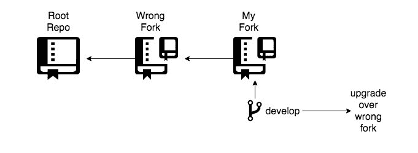
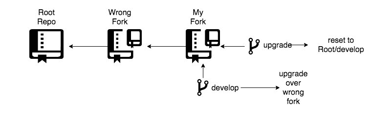
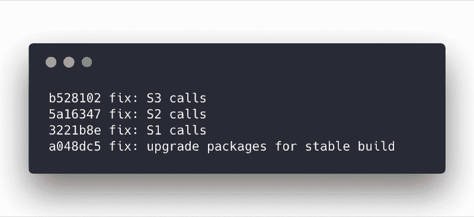
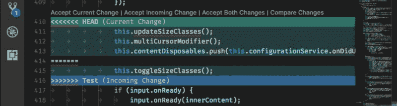

# Git 最佳实践如何节省我的返工时间

> 原文：<https://www.freecodecamp.org/news/how-git-best-practices-saved-me-hours-of-rework-cf227bad9a50/>

通过血管帕特尔

# Git 最佳实践如何节省我的返工时间

最近，我正在为一个 NodeJS 应用程序升级证书。这是两年前的一次功能增强。向该应用提出的任何**实时**问题都需要立即关注，尽管该应用仅在内部使用。

应用程序是旧的。Core-NodeJS-Infra 模块已经两年多没有更新了。下游服务已被否决。我们调用下游服务的方式改变了。紧张的截止日期是蛋糕上的樱桃。我知道这将是一次过山车之旅。

我花了三天时间运行这个应用程序。

基础模块更新了吗？检查。

下游服务运行良好？检查。

UI 流工作正常吗？检查。

一年多前，我们的一名团队成员接触了该应用程序进行升级。他指出，我分叉的地方的回购本身就是分叉的回购。其他一些团队参与了这个回购，然后我们的团队从那时起参与了原始回购——但是我的团队成员不知道从什么时候开始。所以有点乱！

我们有一个“所有权”工具，显示正确的回购，它“骗”了我。所以情况是这样的:

Forkception

是的，这是一种误解！WTF 和 FML 是我最先想到的两个想法。我**应该**做实时回购，但是**没有做**，我做了一个不新鲜的叉子。我真笨！

第一个想法——我三天的工作都浪费了，我需要重新开始。

第二个想法？我来问问老朋友 Git？。他已经帮助我很长时间了。

我——“嘿，饭桶？我深陷困境，需要你的帮助来解决这个问题。”

**Git**——“嘿！好，所以我们必须先从 live 中的内容开始。创建一个名为**升级**的新分支，并将该分支指向活动代码。你可以用一个 [git 硬复位](https://git-scm.com/docs/git-reset#git-reset---hard)来实现。”

“好的，我会的。”

此时，情况看起来是这样的。

Using Git features

“我们需要知道开发和升级之间发生了什么变化。你能列出你的**升级**和**开发**的不同文件吗？逐个检查这些文件，并找出有什么样的变化。”

我——“酷。我看到三种变化。有一个服务 S1，我需要以不同的方式调用它。有一个服务 S2，我需要使用不同的端点来调用它。我需要使用不同的参数调用一个服务 S3。我还看到**升级**分支里的 **package.json** 文件里有一些已经升级的包。所以只需要换几个包。”

Git——“你把变化分开了，这太棒了。现在给我看看你的**开发**分支的 Git 日志。希望你已经遵循了一些基本的 Git 实践，例如在每次提交中总是有可构建的代码。提交消息应该描述您所做的更改。

Git log on develop branch

**我**——“是的，我在**开发**分支总共有四个提交。一个承诺是使项目可构建。三个服务呼叫各有一个。”

Git——“完美！看起来你已经恰当地遵循了最佳实践。让我们首先通过更新 package.json 来稳定项目构建。签出到**升级**分支并复制 package.json — package-copy.json。现在，使用 Git [将](https://jasonrudolph.com/blog/2009/02/25/git-tip-how-to-merge-specific-files-from-another-branch/)，upgrade/package.json 替换为 develop/package.json，并运行 package.json 和 package-copy.json 之间的比较。由于实际代码已经更改了一些包，并且有不同的版本，您需要通过查看比较来升级。”

**Making the project buildable**

“让我试试看。好的，正在建设和运行。”

Git——“太棒了！现在，我们来处理服务电话。我看到在 develop 分支中，每个服务调用变更都有一个提交。到了[摘樱桃的时候了](https://git-scm.com/docs/git-cherry-pick)。从最简单的服务呼叫到最复杂的服务呼叫进行挑选。挑选、合并和解决冲突。确保在每次挑选之后和每次提交之前**检查项目是否处于可构建状态**

**我——“S1 搞定了。S2 完成了。S3 完成了。谢谢，饭桶"**

**“不客气。但是是你自己帮助了自己，通过遵循 Git 提交实践，而不是把 Git 仅仅当作代码存储。”**

### **我在这里做了什么？？**

#### **提交相关更改**

**暂停一会儿，想一想这个更改是否应该在这个提交中进行。说“变更:服务-s1 端点”并包含服务-s2 变更的提交只会造成混乱。**

#### **不要承诺半途而废的工作**

**我们经常听到“尽早承诺，经常承诺”这句话。在上面的例子中，您可以对同一服务的不同端点进行一次提交。这叫 [**香肠制作**](https://sethrobertson.github.io/GitBestPractices/#sausage) 。**

**然而，我个人使用 **git rebase 交互模式**来挤压我的小提交。这有助于我有一个可以被认证的逻辑变更，也有助于一个可信的提交者审查你的代码。这对于大型项目来说更为可取。**

#### **在提交之前测试您的代码**

**我们应该把 Git 看作一个状态机，任何机器在任何状态下都应该处于可构建状态。**

#### **编写良好的提交消息**

**这是最关键的部分。我总是停下来想一想，在三个月后，我是否能够通过查看提交消息来理解这种提交中的变化。**

### **结论**

**我很快就解决了这个问题。我能走出那个 WTF 和 FML 时刻，仅仅是因为我遵循了一些好的实践。它们的存在是有原因的，就像食物中的盐一样——只有当它们没有被使用时，你才会意识到它们的价值。**

**错误迟早会发生，不知不觉。但是要确保你有意识地遵循一些关于 Git 的实践。**

**我是 [Git 语义提交消息](https://gist.github.com/mutewinter/9648651#file-commit_format_examples-txt)的粉丝，这有助于浏览 Git 历史。因为，老实说，你不能期望每个人对每个提交消息都使用相同的词。然而，**消息型**是可以预期的。**

**这有助于确保在每次提交之后，您的项目都可以被构建——这非常有用。**

**VSCode 对 Git 的支持有问题。看到冲突并解决它们变得非常容易，有时只需点击一下鼠标。看下面的例子？**

****

### **参考**

*   **[Git 最佳实践](https://sethrobertson.github.io/GitBestPractices/)**
*   **[vs code 中超级棒的版本控制集成](https://code.visualstudio.com/Docs/editor/versioncontrol)**
*   **[Git 语义提交消息](https://seesparkbox.com/foundry/semantic_commit_messages)**
*   **Git 小费？:H [如何从另一个分支“合并”特定文件](https://jasonrudolph.com/blog/2009/02/25/git-tip-how-to-merge-specific-files-from-another-branch/)**
*   **Git 小费？:G [it — git-cherry-pick 文档](https://git-scm.com/docs/git-cherry-pick)**
*   **Git 小费？:G [it — git-reset 文档](https://git-scm.com/docs/git-reset#git-reset---hard)**

**特别感谢我的朋友 [**苏拉布·拉贾尼**](https://www.linkedin.com/in/saurabh-rajani-72268590/?originalSubdomain=in) 和 [**阿尼什·达加尔卡尔**](https://www.linkedin.com/in/anishdhargalkar/) 帮助我进行内容提炼。**