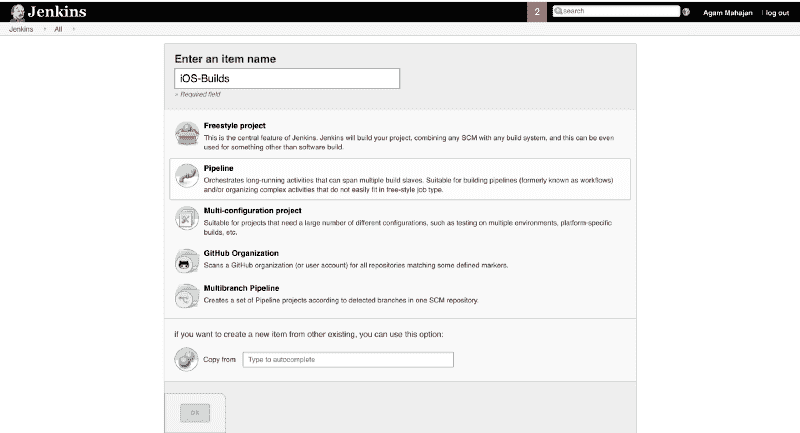
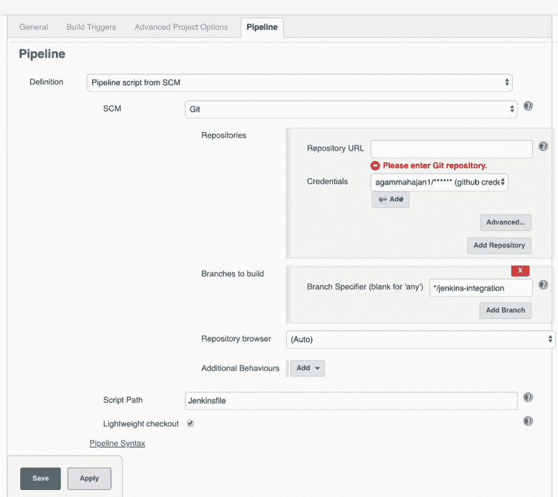
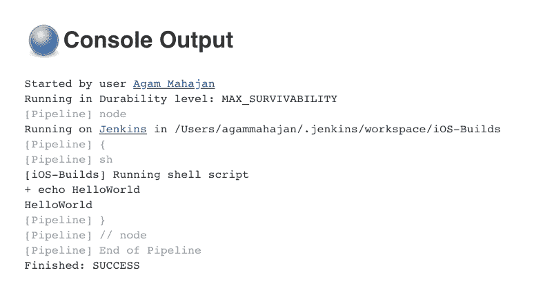
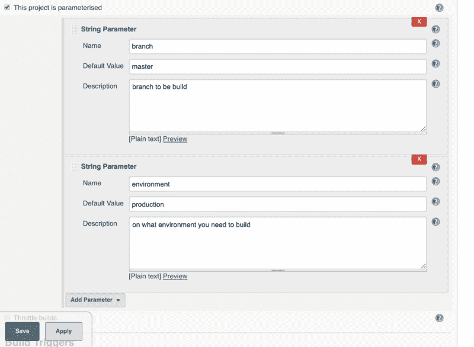
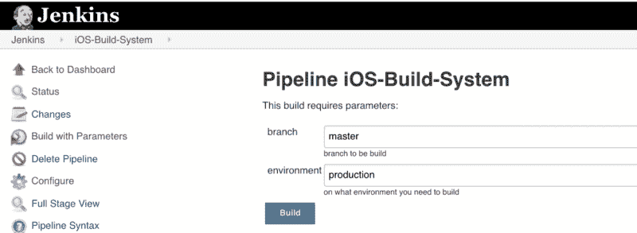

# 如何用詹金斯和浪子制作一个 iOS 按需构建系统

> 原文：<https://www.freecodecamp.org/news/how-to-make-an-ios-on-demand-build-system-with-jenkins-and-fastlane-8eb1e02c73d1/>

作者:阿甘·马哈詹

# 如何用詹金斯和浪子制作一个 iOS 按需构建系统

这篇文章是关于通过 Jenkins BOT 远程创建 iOS 构建，不需要开发人员。

开始之前，我想说这是我的第一篇文章。因此，如果有什么可以改进的地方，请随时发表评论:)

#### 为什么这是个好主意？

当开发人员开发一个特性时，他们会在将其推向生产之前对其进行 QA 测试。因此，构建必须与 QA 团队共享一些测试配置。

xcode(IDE)需要大量的时间来编译和生成这个版本。这意味着任何需要构建的人都必须安装 IDE，克隆存储库，创建签名身份和证书，然后自己创建构建。或者依靠开发人员为他们创建一个。

在构建创建过程中，IDE 不可用。这严重影响了开发人员的生产力。在我的公司中，一个。ipa 大约 20 分钟。平均来说，一个开发人员每天会进行 2-3 次构建。这意味着一周浪费了 5 个小时的工作时间。

How much more time will it take to build?

但是，如果有一个自动系统可以自己生成构建，会怎么样呢？这将使开发人员免除这一责任。这也将使任何人都有可能轻松获得一个建筑。

詹金斯是我们问题的解决方案之一。

让测试人员和开发人员能够轻松地使用构建，可以确保人们能够更快地测试功能，并且更容易地交付到产品中。这提高了开发团队的生产力。它还提高了推向生产的产品的质量。

### 让我们现在就开始吧。

#### **先决条件**

您将需要:

*   macOS 机(最好在 Mac 产品上运行)
*   10 GB 的驱动器空间(用于 Jenkins)
*   安装 Java 8(JRE 或者 Java 开发工具包(JDK)都可以)
    [http://www . Oracle . com/tech network/Java/javase/downloads/JDK 8-downloads-2133151 . html](http://www.oracle.com/technetwork/java/javase/downloads/jdk8-downloads-2133151.html)

**要安装的附加插件**

*   公司自产自用
*   wget
*   RVM 插件
    [安装指南](http://usabilityetc.com/articles/ruby-on-mac-os-x-with-rvm/)
    【https://rvm.io/rvm/security】T4

创建一个包含文件的分支，文件名为`Jenkinsfile`，样本代码为:
`*node {*`
`*sh ‘echo HelloWorld’*`
`*}*`
，命名为 **jenkins-integration** 。稍后将回到这一点。

*   从 App Store 在您的机器上安装 Xcode
*   在你的机器上安装浪子。Jenkins 将在内部使用 fastlane 命令来生成构建。

现在让我们一步一步来。

### **第一步。在你的机器上安装 Jenkins**

您可以在 MacBook 或 mac-mini 上安装。Mac-mini 是首选，因为它可以保持活力。

下载詹金斯-& g[t；https://jenkins。](https://jenkins.io/) io/

在命令行中运行**Java-jar Jenkins . war-http port = 8080**。如果您在终端中遇到错误，请尝试不同的端口(例如 9090)，因为有时有些端口不可用。

浏览到 [http://localhost:8080](http://localhost:8080) 并按照说明完成安装。

然后添加管理员凭证，不要忘记它们(就像我:P 一样)。稍后，您可以前往**詹金斯>管理詹金斯>管理器**用户，并根据需要进行更改。

### 第二步。创建您的第一个管道

创建一个新作业并选择**管道项目**。

要检查您的项目，在**管道下，**定义中的**，**从 SCM 中选择**管道脚本，并在 SCM 中选择 **Git****

然后添加您的回购网址，并添加凭据，如果它是一个私人回购。在分支构建中，添加*/ **jenkins-integration、**我们前面创建的分支。

确保脚本路径是我们在新分支中创建的 **Jenkinsfile** 。所有的脚本都将写在这个 Jenkinsfile 中。

点击 Save，Jenkins 将自动扫描你的带有上述分支的 repo，并运行 Jenkinsfile 脚本。

现在我们准备配置我们的 Jenkinsfile 来创建构建

### 第三步。向作业添加参数

以下情况需要用户输入

*   树枝
*   环境(测试或生产)

为此，我们需要配置我们的项目，为一个作业获取输入参数。

转到**配置**部分，检查**该项目已参数化*。***
然后选择添加参数并相应添加相同的。

当你点击保存时，你会在左边看到一个新的部分-& g**t；用参数**构建。这将是进行构建的用户界面。

这些参数将用于我们的詹金斯脚本。

### 第三步。配置 Jenkins 脚本

将在我们的 Jenkinsfile 中创建多个步骤，每个步骤都有一个责任，它将在构建时创建一个漂亮的 UI。

转到 Jenkinsfile，用以下内容替换该脚本:

首先，通过我们之前添加的参数检查分支。添加您的回购和 GitHub 令牌。

现在 GitHub 令牌不应该对其他人可见。为此，请转到**Manage Jenkins**-&g**t；配置系统**项目 **- >全局属性**将 **d 添加 github** 令牌作为环境变量。

然后调用脚本来更改环境。

接下来，调用 fastlane 来清理(移除派生数据、清理、删除。dsym 文件等)。

如果需要代码签名，那么使用 **ad-hoc** 进行下一步。您可以根据需要使用**开发**或**应用商店**。

接下来，使用 fastlane 中的 **gym** 命令创建构建。

### 第四步。运行作业

现在我们的剧本准备好了。转到 Jenkins 并打开**带参数构建。**

它将开始运行脚本，并将创建一个包含 Jenkinsfile 中提到的多个步骤的漂亮 UI。

当作业完成时，转到项目 **Users/agammahajan/。Jenkins/workspace/iOS _ Build _ Systems**
你会看到。ipa 已创建。瞧啊。

现在，您可以与其他人共享这个构建。如果你愿意，你可以使用 Slack 插件将构建上传到 Slack。

#### 包扎

总结一下，我们可以看到建立一个自动化的机器人是多么容易，它使任何人只需两步就能触发构建:**给分支- >测试环境- >** 完成。

这帮助我和我的开发伙伴提高了生产率和出货速度。它也帮助了 QA 团队，使他们不必每次需要测试时都依赖开发人员。我希望这对你和你的公司也有好处。

从这里开始，**种可能性**是无穷无尽的。

1.  您可以创建计划作业来生成每夜构建。
2.  将构建版本直接上传到 App Store。
3.  缓存构建，这样就不会再次生成具有相同配置的构建。
4.  在内部分发 IPA 用于 OTA(空中)安装。
5.  创建一个 CI-CD 管道，在每次提交时运行自动化测试，并为生产做好准备。