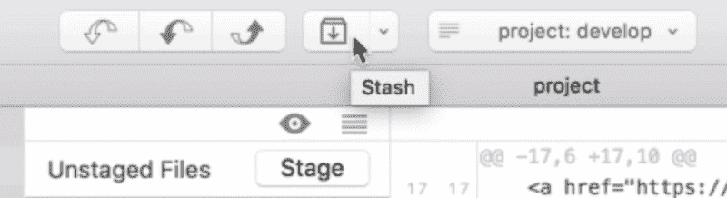
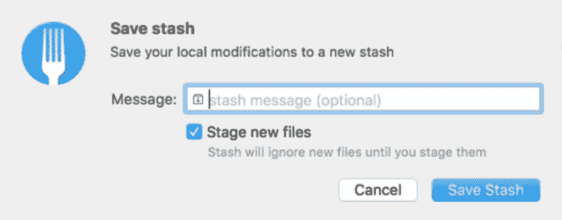
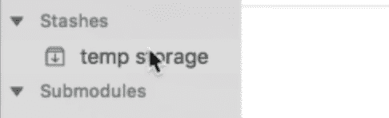
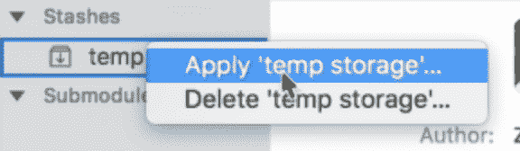
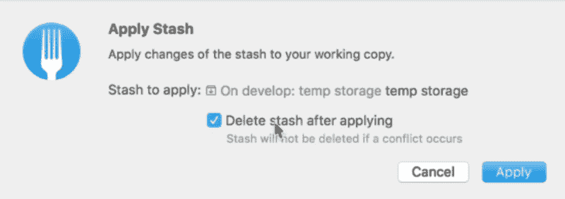

# 如何使用 Git stash 作为临时存储

> 原文：<https://www.freecodecamp.org/news/how-to-use-git-stash-as-temporary-storage-84a0a1e37a43/>

假设您正在开发分支上编码。您会收到一个通知，说生产分支中有一个错误。

您想要检查 bug，但是您不想丢失您在开发分支上创建的工作。你也不想提交你写的东西，因为它还没有完成。

你是做什么的？你不能提交也不能切换分支。如果您切换分支，未提交的内容将会流到您切换到的分支。

您要做的是在切换到另一个分支时，将更改临时保存在某个地方。Git stash 是临时存储。

### 用餐叉藏东西

要使用 stash，您需要从一些未提交的代码开始。在本课中，我们将使用下面这段代码作为未提交的更改:

```
<!-- Some uncommitted code in index.html -->
```

```
<main>  <p> A new paragraph</p></main>
```

要保存这段代码，你可以点击保存按钮。



一旦你点击了 stash 按钮，Fork 就会要求你留言。这条信息表明了隐藏的是什么。

因为 stashes 是临时的，你可以使用任何你想要的名字。我们称之为“临时存储”。



一旦你创建了一个新的贮藏，你会在侧边栏的贮藏部分找到它。



注意:您将无法看到这个存储中的变化，但这不是问题，因为您不必看到。你要做的是切换你的分支，完成你需要做的，然后切换回来。

在这种情况下，我们将检查到`master`分支。当你这样做的时候，注意你在`master`和`develop`分支中看不到我们上面写的未提交代码。

### 应用隐藏的更改

您可以返回到您所在的分支，然后右键单击您的存储并选择 Apply stash。



当你这样做的时候，Fork 会问你是否要删除隐藏的东西。我通常会删除存储，因为我不想一次保存多个存储。



一旦你应用了存储，你将能够看到你所做的改变。

```
<!-- You'll see your uncommitted code again! -->
```

```
<main>  <p> A new paragraph</p></main>
```

### 包扎

栈是临时的存储空间，你可以在那里存储你的代码。当你存储了你的代码，你可以转移到其他分支去做别的事情。

当你完成后，你可以把你的代码放回原处。

有了 Git Stash，你就不用担心丢失任何未提交的更改了！

感谢阅读。这篇文章对你有什么帮助吗？如果你有，[我希望你能考虑分享它](http://twitter.com/share?text=How%20to%20use%20Git%20stashes%20as%20a%20temporary%20storage%20by%20@zellwk%20?%20&url=https://zellwk.com/blog/git-stash/&hashtags=)。你可能会帮助别人。谢谢大家！

本文最初发布于 zellwk.com 的 *[。](https://zellwk.com/blog/git-stash)*
如果你想要更多的文章来帮助你成为一个更好的前端开发者，请注册我的[简讯](https://zellwk.com/)。