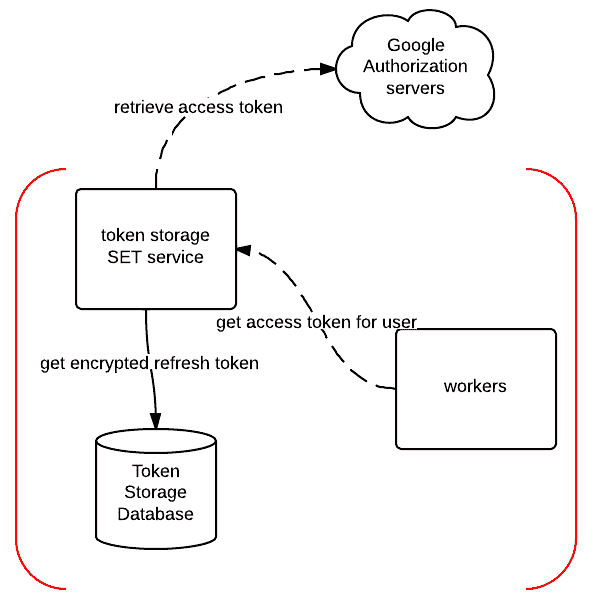
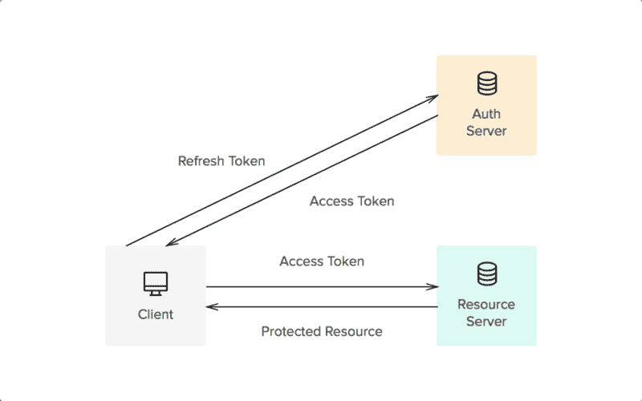
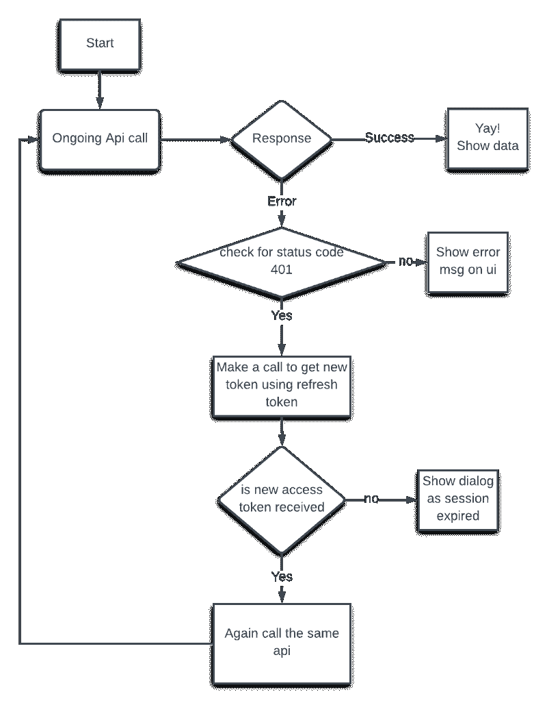

# 如何使用 Redux observables 和刷新令牌 API 获得新的访问令牌

> 原文：<https://www.freecodecamp.org/news/how-to-get-a-new-access-token-using-redux-observables-and-the-refresh-token-api-d38d875a8add/>

作者:萨钦·库马尔

# 如何使用 Redux observables 和刷新令牌 API 获得新的访问令牌

Photo by [SpaceX](https://unsplash.com/photos/MEW1f-yu2KI?utm_source=unsplash&utm_medium=referral&utm_content=creditCopyText) on [Unsplash](https://unsplash.com/collections/827807/technic?utm_source=unsplash&utm_medium=referral&utm_content=creditCopyText)

这篇文章是关于我如何处理一个 API 响应的 401 状态代码。我将向您展示如何在一个 [React](https://reactjs.org/) 项目中使用带有[**Redux Observable**](https://redux-observable.js.org/)**的刷新令牌来获得一个新的访问令牌。**

**但是，在我们开始之前，我们应该了解一些先决概念，这将有助于更好地理解解决方案。这是一个常见问题的通用架构解决方案，所以不需要了解 [**Redux**](https://redux.js.org/) 就可以进一步阅读。让我们开始吧！**

### ****访问令牌****

> **访问令牌是应用程序可以用来访问 API 的凭证。当访问令牌到期时，它在错误响应中抛出 **401** 状态码。
> 下面的流程图显示了访问令牌是如何与服务器协同工作的。——[auth0.com](https://auth0.com/docs/tokens/access-token)**

**

API receive access token from auth server.** 

**当用户成功登录并检索访问令牌，并在成功进行身份验证时刷新令牌时，身份验证服务就是这样工作的。**

### ****刷新令牌****

> **刷新令牌是一种特殊的令牌，可用于随时获取更新的访问令牌，从而允许访问受保护的资源。您可以请求新的访问令牌，直到刷新令牌被列入黑名单。应用程序必须安全地存储刷新令牌，因为它们本质上允许用户永远保持身份验证。—[auth0.com](https://auth0.com/docs/tokens/access-token)**

**我们需要使用刷新令牌获取新的访问令牌，然后使用新的访问令牌再次访问同一个 API。我们希望在用户不知道他们的会话已经过期或者 API 抛出错误的情况下做到这一点。**

**让我们了解一下刷新令牌是如何与服务器一起工作的。当 API 抛出 401 状态代码时，我们检索一个新的访问令牌。**

**

This is how a refresh token receives a new token using the access token** 

**刷新令牌 API 调用使用第一次认证时保存的刷新令牌从认证服务器接收新的访问令牌。**

**通过这个简单的流程图，我们可以更好地理解整个过程。**

****

### ****可观测量****

**你可以把一个可观察对象想象成一个数组，它的元素随着时间的推移异步到达。 **Observables 帮助你管理异步数据**，比如来自后端服务的数据。**

**在 RxJS 中，当处理可观察的流时，这可能变得非常复杂。不要担心——我们将用简单的代码块来简化这一点。**

**让我们从 redux-observable 中的一个简单 API 调用开始。这是一个简单的获取 API 函数的样子:**

### **解决办法**

**现在我们有了基本的概念。让我们看看如何处理 API 响应中的 401 (invalid_token 或 session expired)状态代码。我们还将看到如何使用 Redux Observable 中的刷新令牌来获得新的访问令牌。**

**我们必须对上述函数进行两处修改:**

1.  **将我们的 API 调用包装在 Observables.defer()中。我们希望在收到新的有效访问令牌时，能够再次调用该函数。**
2.  **当我们在 catch 错误中得到 401 状态时。我们需要进行 API 调用来获取新的访问令牌。我们使用存储在第一次成功认证中的刷新令牌。**

**让我们来看看这两个函数之间的区别:**

1.  **catch 函数总是给出父流的来源。我们可以使用它来再次启动由于无效访问令牌而失败的流。**
2.  **现在启动一个新的事件流来侦听刷新令牌成功事件。当刷新令牌 API 失败时，我们停止(为此使用 takeUntil)。**
3.  **现在确保使用 **take** 操作符总是获得流的第一个事件。如果您有多个流，您的输出流可能会受到影响。**
4.  **如果已经接收到新的访问令牌，则使用 mergeMap 来合并先前流的源。我们将它再次合并到父流中，它将使用新的访问令牌调用 get data 函数。**
5.  **现在你可能想知道合并是如何工作的。因此，merge 独立地调用并启动自己的流，使用刷新令牌获取新的访问令牌(查看下一个函数)。当出现刷新令牌成功时，将进入**步骤 2** 以此类推。**

**我们可以使用这种方法来处理不同状态代码的特殊情况，比如 500、403。**

**如果刷新令牌 API 给出 401，确保检查无限循环条件。您可以在每次刷新令牌调用时维护一个计数器。如果数量超过，则停止流。然后对其进行任何错误处理，例如显示一条出错消息，并注销用户。**

### **结论**

**我们在 React 中使用带有 Redux-observables 的刷新令牌 API 实现了一个无效令牌处理程序。这种方法也可以用来处理其他特殊的 API 情况。**

***我希望你喜欢这篇文章，如果你喜欢，请在 [Twitter](https://twitter.com/_i_am_sachin) 和 [Github](https://github.com/sachinKumarGautam) 上关注我，获取更多 JavaScript 技巧和文章。？***

### **一些有用的资源**

1.  **[https://redux-observable.js.org/](https://redux-observable.js.org/)**
2.  **[https://rxjs-dev.firebaseapp.com/api](https://rxjs-dev.firebaseapp.com/api)**
3.  **[https://rxjs-dev.firebaseapp.com/api/index/function/defer](https://rxjs-dev.firebaseapp.com/api/index/function/defer)**
4.  **[https://rxjs-dev.firebaseapp.com/api/index/function/merge](https://rxjs-dev.firebaseapp.com/api/index/function/merge)**