# UX 最佳实践:如何设计可扫描的应用程序截图

> 原文：<https://www.freecodecamp.org/news/ux-best-practices-how-to-design-scannable-app-screenshots-89e370bf433e/>

作者 Girish Rawat

# 如何设计可扫描的应用程序截图

#### 重新设计 HeyDoctor 的应用商店截图

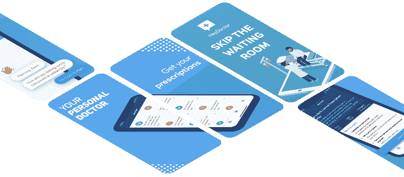

让我们玩一个游戏。在你的手机上选一个你真正喜欢的应用。你是这个应用程序的创造者，并希望从投资者那里筹集资金。你有一分钟时间向风投推销你的应用。金钱唾手可得，但前提是你能在 60 秒内说服他们。你是怎么做到的？你能描述一下这个应用程序是做什么的吗？你能告诉我这款应用与竞争对手相比有何独特之处吗？你展示了用户体验有多好吗？

App Store 上的用户平均需要 7 秒钟来决定是否要下载你的应用。一项关于涉及 25，000 名访问者和 10，000 次安装的下载决定的调查研究将截图列为第二大安装理由，排名第一。

> 我们发现人们在商店列表上花费的平均时间是 7 秒。事实是，绝大多数人离开页面甚至更快。参与用户逗留的时间稍长一些，但他们都遵循相同的流程:检查图标，查看前两个截图，并扫描应用程序描述的第一行**——彼得·福多尔，[为什么 7 秒钟可以决定你的移动应用程序的成败](https://asostack.com/why-7-seconds-could-make-or-break-your-mobile-app-f41000fb2a17)**

**截图是你的应用的用户故事的一面镜子，反映了它的用户体验。我研究了排名前 100 的应用程序以及它们的截图，这些数据是由 Incipia 的优秀人员收集的。我将在这里引用多项研究的关键发现。**

### **聚焦 app:hey doctor**

****

**HeyDoctor 是一款允许用户在线获取医疗处方的应用程序，无需拜访初级保健医生。HeyDoctor 可以为从节育、毛发生长到尿路感染治疗、实验室报告等各种药物开出处方并重新开出处方。您也可以获得初级保健治疗，如痤疮治疗、UTI、唇疱疹治疗等。HeyDoctor 的移动应用在 App Store 中广受好评，有 122 条评论将其评为 4.7 星。**

**我们将重新设计 HeyDoctor 的截图，并学习可扫描的截图。**

#### **放弃**

**请注意，我不在 HeyDoctor 工作，本案例研究中表达的观点仅代表我个人。与 HeyDoctor 的设计师、产品经理和所有负责设计关键决策的人不同，我无法获得对其用户群的分析，也可能看不到全貌。设计决策可以基于业务目标、资源优先级或技术约束。因此，任何主动提供的案例研究都不是详尽的，我当然不是建议 HeyDoctor 放弃他们当前的截图，采用我的重新设计。**

**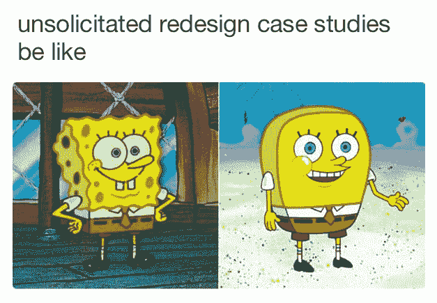

“Make your app flat” — some guy. Meme credits:[**@**parasmael](https://twitter.com/parasmael)** 

#### **当前的设计**

**我们将开发 HeyDoctor 的 iOS 应用程序。以下是现有截图的样子:**

**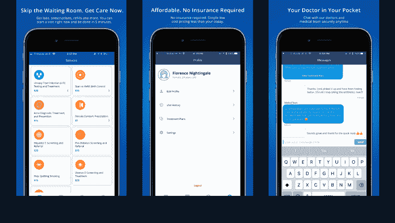**

**它遵循标准的标题和副标题设置，很好地解释了应用程序的用户故事。我们对重新设计品牌或用户界面不感兴趣，所以我们会努力在重新设计中保持它们的一致性。**

#### **用户故事**

**在我们深入研究并开始进行视觉改变之前，我们需要了解用户安装 HeyDoctor 的目的是什么，以及他们发现这个应用程序时正在搜索什么。**

1.  **获得处方和药品。用户希望找到一种简单的方法，无需看医生就能在线获得处方和药品。**
2.  ****生病得到治疗。**用户正在网上搜索如何获得疾病治疗。**
3.  **与初级保健医生交谈。用户希望与医生交谈，但由于时间、资金或通勤限制，他们可能无法在此时拜访医生。**
4.  **做所有这些事情，不要涉及任何保险文书工作。用户不想涉及他们的医疗保险，因为要么他们没有医疗保险，要么他们的共付额太高。**

### **截图还是缩略图？**

**自第一代 iPhone 推出 3.5 英寸屏幕以来，屏幕尺寸增长了 72%。2018 年在美国销售的智能手机的平均屏幕尺寸为 5.5 英寸。屏幕比以往任何时候都大，产品设计师不断发展以利用这些额外的可用空间。有人可能会认为更大的屏幕会吸引设计师在截图上放置更多的文字说明。但我们观察到的情况恰恰相反。**

> **我们一直观察到，只有不到 4%的用户在寻找一个放大了纵向截图的应用程序，只有 2%的用户放大了横向截图。对于游戏玩家来说，这个比例甚至更低，只有 0.5%。这可能是因为游戏通常足够清晰，即使从缩略图上也是如此——彼得·福多尔**

**只有不到 4%的人会点击你的截图。**

**设计师们已经开始注意这一指标，许多应用程序将它们的截图视为缩略图，而不是可以挖掘的东西。2016 年的用户可以点击屏幕截图来阅读其中的文本。但随着新的应用商店布局和更大的屏幕，用户不再点击你的截图。**

**我们来看看 2016 年到 2018 年的一些截图改版。注意几乎每一个都有更少的单词和更大的字体。**

**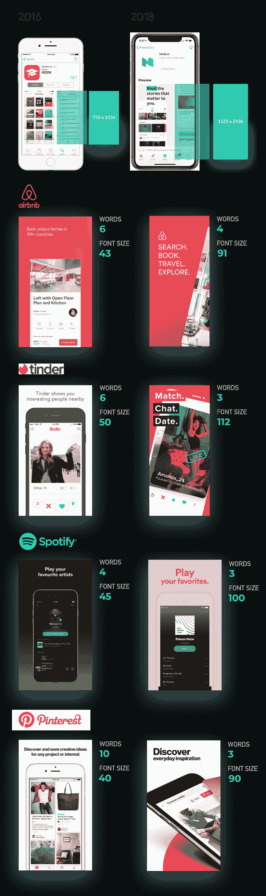**

### **神奇的数字 2**

**前 100 个应用中有 78 个有 5 个截图，13 个有 4 个截图，6 个有 3 个截图，3 个只有 2 个。作为一名开发者，你可能会认为要五张截图，因为内容越多越好，对吗？不对。**

**只有 9%的用户会浏览前两张截图。风景截图表现差 5%。这使得在前两个截图中吸引用户变得非常重要。告诉你的用户你的应用程序在第一个屏幕上做了什么，并在相应的截图中详述。**

> **我们的研究结果表明，如果你使用肖像图片，你必须在前两个(iOS10，Google Play)或三个(iOS11)屏幕截图中解释你的应用程序的核心优势。如果你真的想用风景图片，你只有一张——彼得·福多尔**

**让我们检查一些流行应用程序的前两个截图。**

**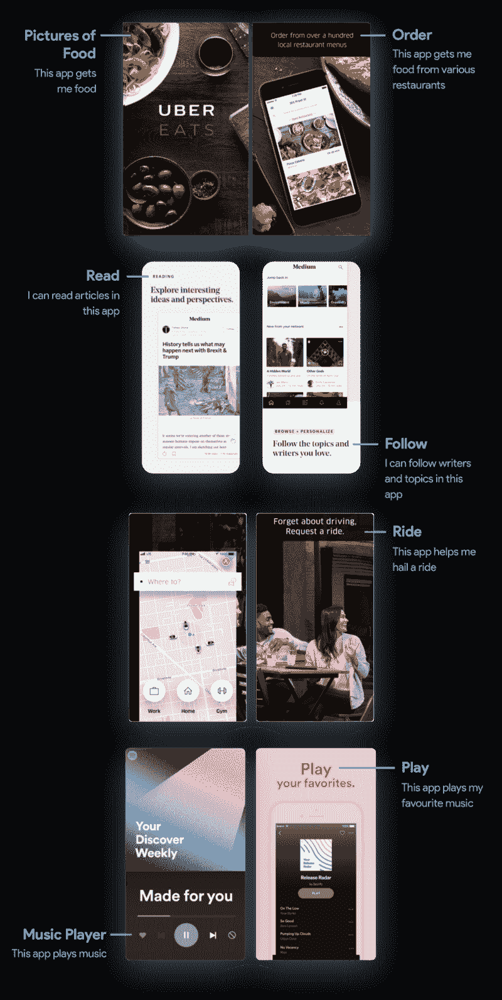**

### **突出显示的 UI 元素**

**用户浏览你的截图是为了衡量你的应用程序的功能。文字说明有助于他们理解屏幕背后的背景。设计师通过突出显示文本标题试图解释的 UI 元素，让用户更容易理解。**

**让我们看一些例子。**

**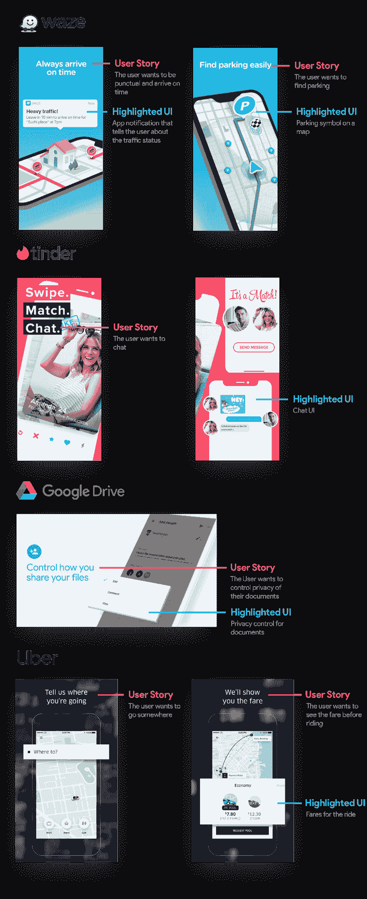**

### **学习**

1.  ****在前两张截图中解释你的应用最重要的用户故事。**只有 9%访问你的应用列表的用户会跳过前两张截图。**
2.  ****增加字体大小，减少文字。**随着屏幕越来越大，用户开始习惯于浏览屏幕截图，而不是点击阅读。只有不到 4%的用户会点击你的截图来阅读。**
3.  **突出显示代表文本标题的用户界面元素。它使浏览截图变得更容易，并提高你的截图的浏览能力。**

**现在我们知道了一点如何让截图更具可读性，让我们开始将我们的关键发现应用到 HeyDoctor 的截图中。**

### **第一步:将 iPhone 升级到新版本**

**HeyDoctor 的截图是在用老一代的 iPhones。虽然我不是交易破坏者，但我喜欢我的 iPhones，就像喜欢我的应用程序一样。更新了和 fleek 上的[(抱歉)。](https://www.merriam-webster.com/words-at-play/fleek-meaning-and-history)**

**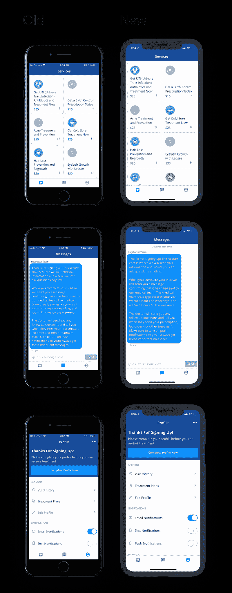**

### **第二步:减少文本，使其更具可读性**

**我们将尝试通过以简洁的格式陈述用户故事，使标题更具可读性。我们也将取消副标题和描述，以适应更大的标题。**

****

**第三张截图显示了该应用程序的设置页面，其标题是关于该应用程序如何不需要保险政策。让我们用一个更相关的屏幕来替换它。我准备把它换成你在 app 里尝试开处方时看到的第一个屏幕，间接暗示你不需要保险就能上手。**

**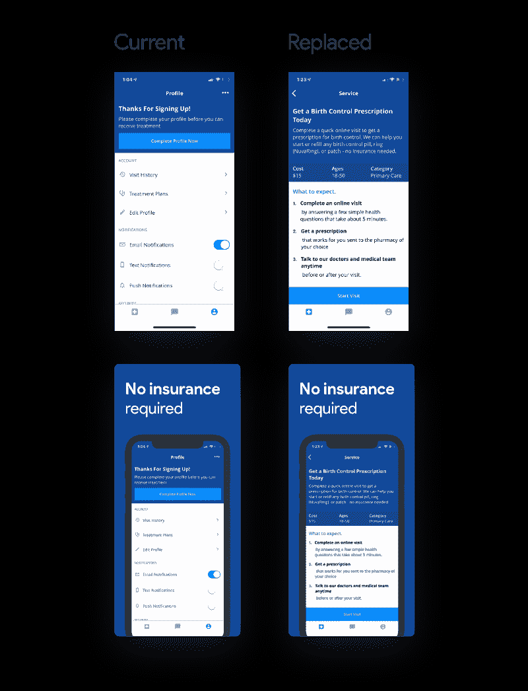**

### **步骤 3:突出显示相关的 UI 元素**

**正如我们在上面学到的，突出显示引用标题的相关 UI 元素会使它们更简单易懂。这也有助于用户更容易地浏览屏幕截图。**

#### **聊天 UI**

**让我们看看 Tinder 是如何突出他们的聊天 UI 的:**

**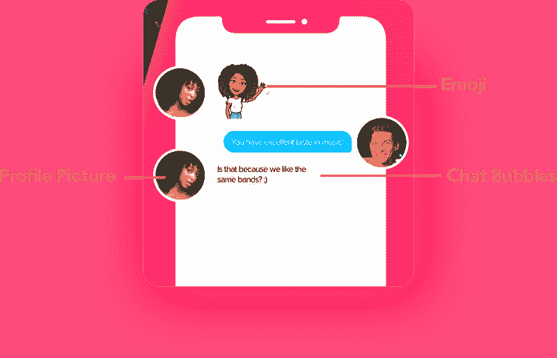**

**它巧妙地使用个人资料图片和带有颜色等品牌元素的聊天气泡来模仿其真实的聊天 UI。**

**让我们尝试做一些类似的事情:**

**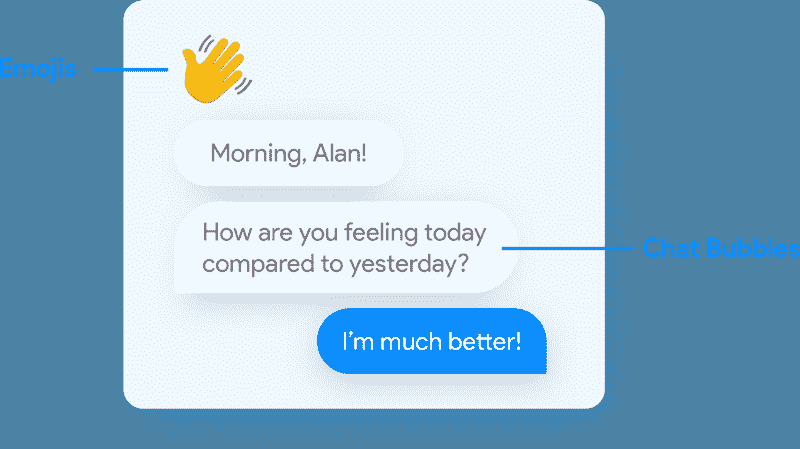**

**让我们将该资产插入屏幕截图:**

**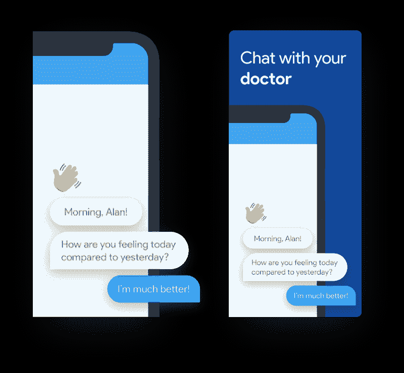**

**我试图将 HeyDoctor 的品牌融入聊天气泡中。我觉得没有必要包括个人资料图片，因为你在应用程序中交谈的医生没有个人资料图片。**

#### **卡片和阴影**

**让我们看看优步是如何突出他们的 UI 元素的。**

**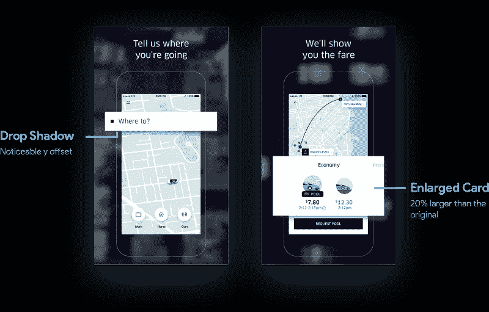**

**我喜欢这种用卡片和阴影突出 UI 元素的极简方式。我们将使用这种风格来强调截图中的一些元素。**

**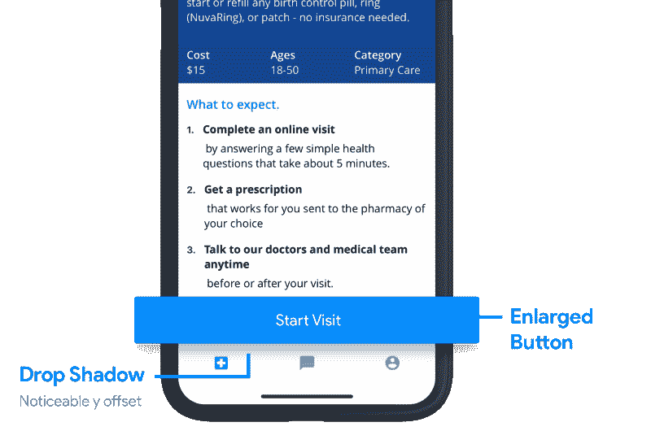**

**我决定将标题移到手机下方，这样用户在阅读标题之前就可以看到高亮显示的 UI 元素。**

**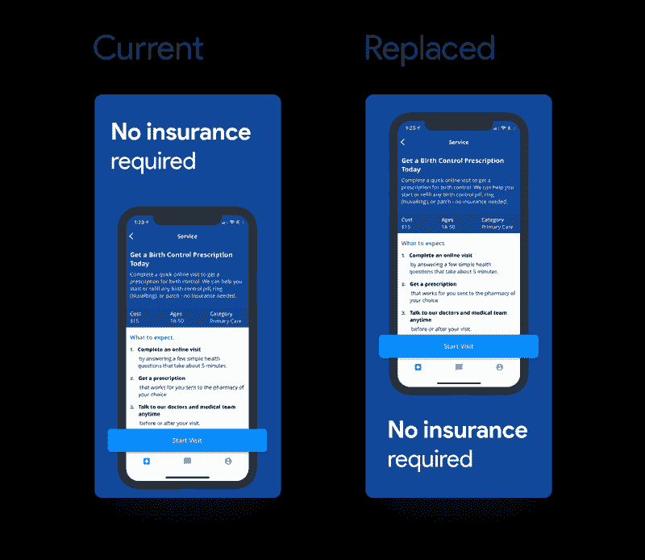**

### **第四步:整容**

**我们对截图做了多处修改，以优化可扫描性。现在让我们让它看起来更好。好的视觉设计对用户来说是一个不可思议的诱惑，在重新设计截屏时不应该被忽视。**

#### **添加透视屏幕**

**等距屏幕看起来现代和抛光。你几乎可以在任何地方看到等距手机，从苹果完美渲染的产品广告到运球上高度抛光的实体模型(疯狂地认为运球最初是作为一个分享低级 WIP 设计原型的网站而开始的！)**

**我从屏幕上给我们做了一些透视。**

**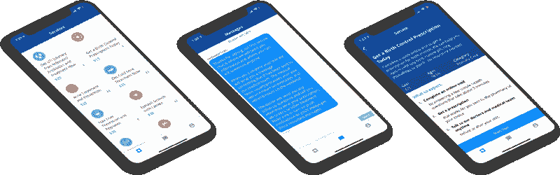**

**我将选择第一个视角模型，并将其分为两个截图，因为我们目前只有 3 个截图，我们可以在应用程序商店中添加多达 5 个。**

**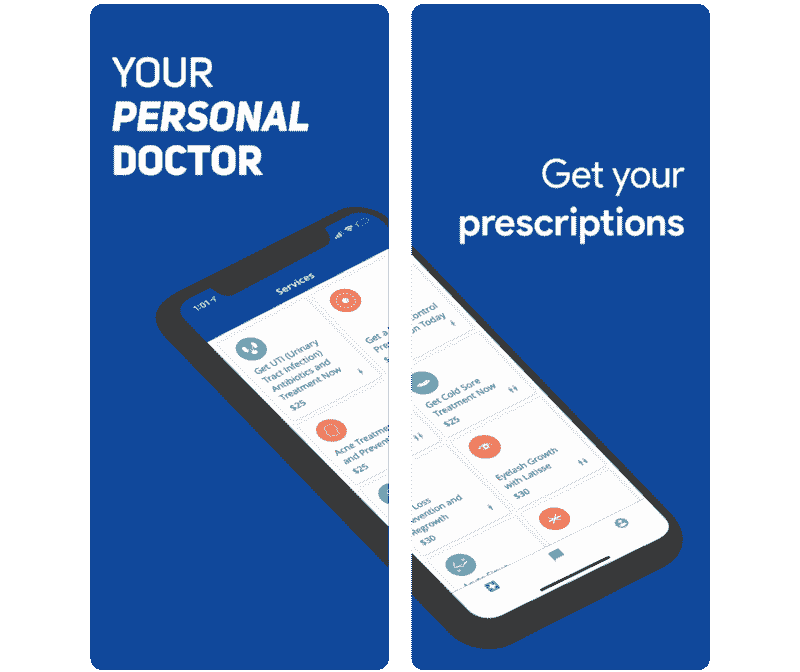**

**我在第一页加了一个标题——“你的私人医生”。易于阅读，总结了应用程序的功能，并且简明扼要。**

#### **更改背景渐变**

**背景和前景的对比对我来说有点太强烈了。让我们把它换成淡一点的蓝色。**

**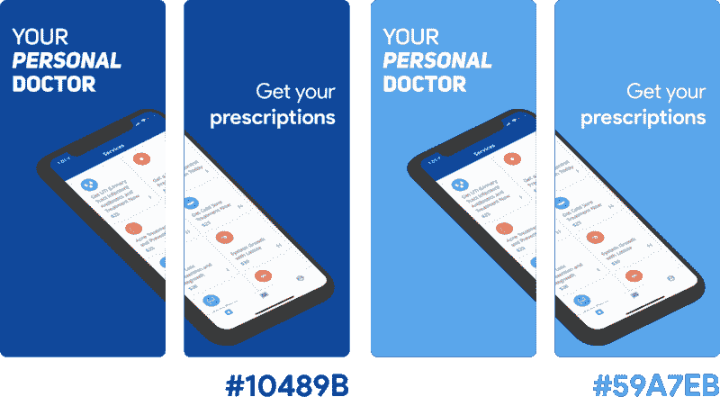**

**我们将使用我们选择的新颜色制作渐变。**

**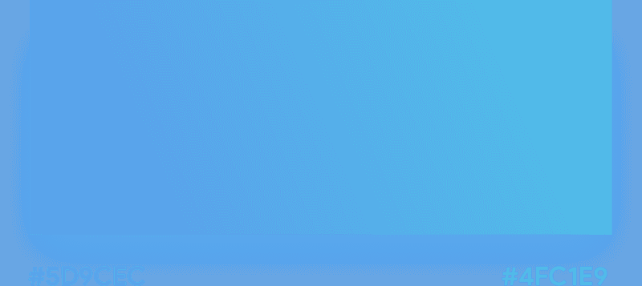**

**让我们看看这在我们的截图中看起来如何。**

**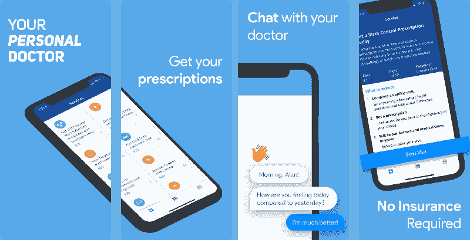

Perfect!** 

**我将在文本下方添加一些脊，使其成为文本和手机之间的区别。**

**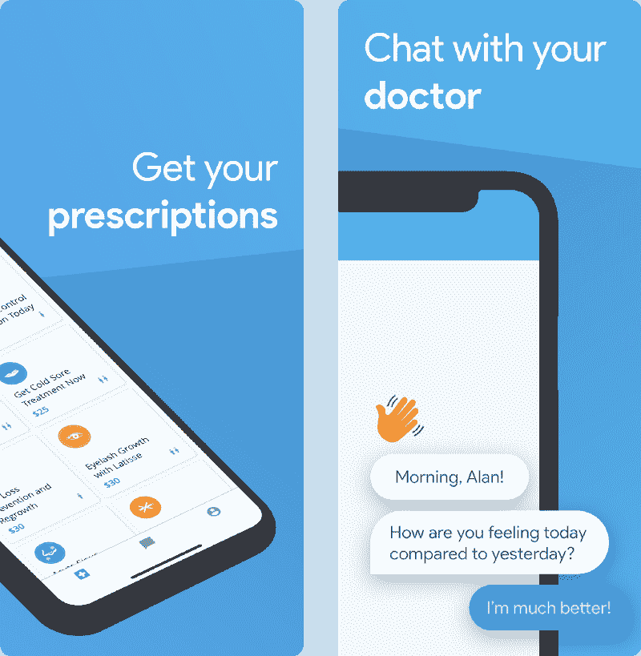**

**我能够从[网](https://www.freepik.com/)上抓取一个很酷的等距向量。我们用它来做最后一张截图吧。**

****

### **最终设计**

#### **以前**

**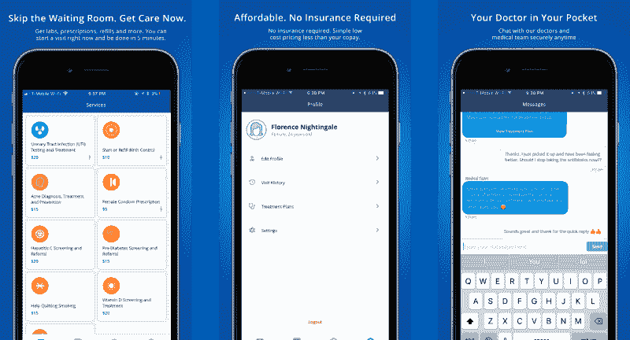**

#### **在...之后**

**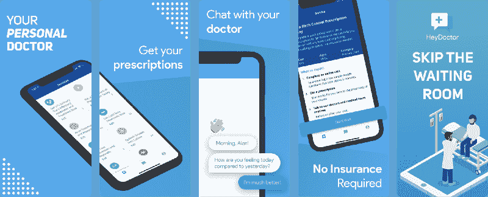**

### **结论**

**总之，我们做了超过四个小的迭代调整。但最后的结果是截图，很容易浏览，感觉很现代。此外，这些调整都不需要天生的艺术技巧。研究 App Store 中的一些应用程序有助于我们了解应该寻找哪些问题。**

****感谢阅读！对我来说，这是一个有趣的周末项目，我喜欢在这里写它。希望这篇文章能让你对应用商店中的截图有所了解。欢迎在下面的评论区提出反馈或问题。****